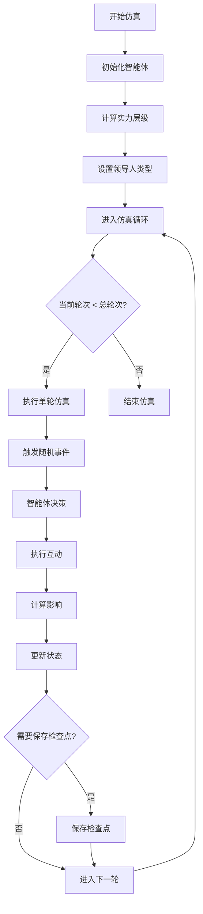

# 🌍 道义现实主义社会模拟仿真系统

> **基于道义现实主义理论的国际关系Agent-Based Modeling（ABM）研究平台**

[](https://www.python.org/)
[](https://reactjs.org/)
[](https://www.typescriptlang.org/)
[](https://fastapi.tiangolo.com/)
[](LICENSE)

---

## 📖 目录

- [项目简介](#项目简介)
- [实验设计与原理](#实验设计与原理)
  - [理论基础](#理论基础)
  - [核心模型](#核心模型)
  - [实验设计](#实验设计)
- [运行逻辑](#运行逻辑)
  - [系统架构](#系统架构)
  - [仿真流程](#仿真流程)
  - [数据流](#数据流)
- [行为体互动流](#行为体互动流)
  - [智能体决策流程](#智能体决策流程)
  - [互动类型与规则](#互动类型与规则)
  - [影响计算](#影响计算)
- [用户交互流](#用户交互流)
  - [仿真配置](#仿真配置)
  - [实时监控](#实时监控)
  - [结果分析](#结果分析)
- [环境配置](#环境配置)
- [使用指南（面向无代码能力的研究者）](#使用指南面向无代码能力的研究者)
  - [系统启动](#系统启动)
  - [页面功能详解](#页面功能详解)
  - [典型研究场景](#典型研究场景)
- [技术实现详解](#技术实现详解)
  - [后端架构](#后端架构)
  - [前端架构](#前端架构)
  - [数据模型](#数据模型)
  - [算法与计算](#算法与计算)
- [开发与部署](#开发与部署)
- [项目结构](#项目结构)
  - [核心模块说明](#核心模块说明)
- [贡献指南](#贡献指南)
- [许可证](#许可证)

---

## 🎯 项目简介

道义现实主义社会模拟仿真系统是一个专为国际关系研究设计的**Agent-Based Modeling（ABM）平台**。该系统基于**道义现实主义理论**，通过模拟国家领导人（智能体）在国际体系中的决策行为，研究国际秩序的演化规律。

### 核心特色

| 特色 | 描述 |
|------|------|
| 🧠 **理论驱动** | 基于道义现实主义国际关系理论，严谨的学术基础 |
| 🌐 **科学建模** | 采用克莱因方程计算国力，正态分布方法划分实力层级 |
| 🎭 **领导类型** | 王道型、霸权型、强权型、昏庸型四种领导人行为模式 |
| 📊 **可视化丰富** | 实力趋势图、互动热力图、关系网络图等多维度可视化 |
| 🔄 **仿真可控** | 支持暂停、继续、检查点恢复，灵活的实验控制 |
| 📈 **对比分析** | 支持多仿真对比，参数扫描，实验结果对比分析 |

---

## 🧪 实验设计与原理

### 理论基础

#### 道义现实主义理论

道义现实主义是一种国际关系理论，认为：

- **道义是真实存在的**：国际体系中存在道德规范和制度约束
- **领导人类型至关重要**：不同的领导人类型决定国家行为模式
- **行为一致性是关键**：言行一致程度影响国家的国际信誉和影响力
- **体系利益优先**：维护国际体系稳定应成为大国核心关切

#### 克莱因方程（国力计算）

系统采用**克莱因方程**作为国力计算的核心模型：

```
P = (C + E + M) × (S + W)
```

| 要素 | 符号 | 名称 | 得分范围 | 说明 |
|------|------|------|----------|------|
| 物质要素 | C | 基本实体 | 0-100 | 人口、领土等基本国力要素 |
| 物质要素 | E | 经济实力 | 0-200 | GDP、产业结构、贸易能力等 |
| 物质要素 | M | 军事实力 | 0-200 | 军事预算、装备水平、战略投送能力等 |
| 精神要素 | S | 战略目标 | 0.5-1 | 国家战略目标的明确程度和合理性 |
| 精神要素 | W | 国家意志 | 0.5-1 | 国家实现目标的决心和凝聚力 |

#### 实力层级划分（正态分布方法）

系统采用**正态分布方法**动态划分国家实力层级：

```
z = (P - μ) / σ
```

其中：
- `P`：国家综合国力得分
- `μ`：样本均值
- `σ`：标准差

**层级划分标准**：

| 层级 | z分数范围 | 理论比例 | 典型特征 |
|------|-----------|----------|----------|
| 🌟 超级大国 | z > 2.0 | ≈ 2.28% | 全球影响力，体系塑造能力 |
| 🔵 大国 | 1.5 < z ≤ 2.0 | ≈ 4.41% | 区域影响力，重要国际角色 |
| 🟢 中等强国 | 0.5 < z ≤ 1.5 | ≈ 24.17% | 有限国际影响力 |
| ⚪ 小国 | z ≤ 0.5 | ≈ 69.15% | 依附性强，受大国影响大 |

### 核心模型

#### 四种领导人类型

| 类型 | 行为特征 | 核心偏好 | 禁止行为 | 行为边界 |
|------|----------|----------|----------|----------|
| 🏛️ **王道型** | 坚持道义，言行一致，追求体系公共利益 | 系统稳定 > 国家长远利益 | 率先使用武力、单边制裁 | 非暴力优先、平等协商、提供公共产品 |
| 🦅 **霸权型** | 选择性运用道义，双重标准，以本国利益为核心 | 国家核心利益 > 同盟体系利益 | 严防超限手段 | 选择性使用暴力、对盟友执行双重标准 |
| ⚔️ **强权型** | 无视道义，零和博弈，利益最大化 | 国家短期核心利益 | 无特殊限制 | 暴力强制优先、无视国际承诺 |
| 😵 **昏庸型** | 无固定策略，决策高度个人化，反复无常 | 个人利益 > 派系利益 | 无 | 决策个人化、言行不一致、频繁毁约 |

#### 国际秩序类型

系统支持识别和分类以下国际秩序类型：

| 秩序类型 | 特征描述 |
|----------|----------|
| **单极霸权** | 一个超级大国主导国际体系 |
| **两极对抗** | 两个超级大国阵营对峙 |
| **多极均衡** | 多个大国力量相对平衡 |
| **无秩序型** | 体系崩溃，缺乏规范约束 |

### 实验设计

#### 标准实验流程

```
┌─────────────────────────────────────────────────────────┐
│                     实验设计流程                             │
└─────────────────────────────────────────────────────────┘
    │
    ├─ 1. 实验目标设定
    │   └─ 明确研究问题（如：王道型领导人是否促进体系稳定？）
    │
    ├─ 2. 实验场景构建
    │   ├─ 配置国家智能体（数量、实力分布、领导人类型）
    │   └─ 设置初始国际关系网络
    │
    ├─ 3. 参数配置
    │   ├─ 仿真轮次（如：100轮，每轮代表6个月）
    │   ├─ 事件概率（随机事件发生概率）
    │   └─ 检查点间隔（保存状态的频率）
    │
    ├─ 4. 对比实验设计
    │   ├─ 控制组：采用基准配置
    │   ├─ 实验组：调整关键参数（如领导人类型）
    │   └─ 重复实验：多次运行消除随机性
    │
    └─ 5. 评估指标设定
        ├─ 体系稳定性指数
        ├─ 冲突频率
        ├─ 合作密度
        └─ 实力分布变化
```

#### 典型实验设计示例

**实验1：领导人类型对国际秩序的影响**

| 变量 | 控制组 | 实验组1 | 实验组2 | 实验组3 |
|------|--------|----------|----------|----------|
| 领导人类型 | 王道型 | 霸权型 | 强权型 | 昏庸型 |
| 国家数量 | 8 | 8 | 8 | 8 |
| 实力分布 | 相同 | 相同 | 相同 | 相同 |
| 仿真轮次 | 100 | 100 | 100 | 100 |

---

## ⚙️ 运行逻辑

### 系统架构

本项目采用**DDD（领域驱动设计）架构**，将系统划分为清晰的层次结构：

```
┌─────────────────────────────────────────────────────────────┐
│                        用户界面层（前端）                         │
│  React + TypeScript + Redux Toolkit + Tailwind CSS                │
│  ┌──────────┬──────────┬──────────┬──────────┬──────────┐      │
│  │ 仪表板  │ 智能体  │ 仿真控制 │ 事件管理 │ 对比分析 │      │
│  └──────────┴──────────┴──────────┴──────────┴──────────┘      │
└─────────────────────────────────────────────────────────────┘
                              ↕↕ (REST API + WebSocket)
┌─────────────────────────────────────────────────────────────┐
│                        应用逻辑层（后端）                         │
│  FastAPI + Python 3.9+                                         │
│  ┌────────────────┬────────────────┬────────────────────────┐    │
│  │ 仿真管理器    │  智能体服务      │  互动规则引擎      │    │
│  │ (工作流编排)   │ (行为决策)       │ (验证与影响计算)   │    │
│  └────────────────┴────────────────┴────────────────────────┘    │
└─────────────────────────────────────────────────────────────┘
                              ↕
┌─────────────────────────────────────────────────────────────┐
│                        核心模型层                               │
│  ┌──────────┬──────────┬──────────┬──────────┬──────────┐      │
│  │智能体模型 │互动规则  │事件系统  │实力计算  │秩序判定  │      │
│  └──────────┴──────────┴──────────┴──────────┴──────────┘      │
└─────────────────────────────────────────────────────────────┘
                              ↕
┌─────────────────────────────────────────────────────────────┐
│                        数据层                                   │
│  SQLite + 内存存储 + 检查点文件                               │
└─────────────────────────────────────────────────────────────┘
```

#### DDD分层说明

- **Domain（领域层）**：包含核心业务逻辑，与具体技术实现无关
- **Application（应用层）**：协调领域对象完成用例
- **Infrastructure（基础设施层）**：提供技术能力（LLM、存储、日志等）
- **Interfaces（接口层）**：外部系统交互接口（API、WebSocket）
- **Backend（后端服务）**：FastAPI应用，路由和业务编排
- **Frontend（前端应用）**：React用户界面

### 仿真流程

#### 主仿真循环



#### 单轮仿真详细流程

```
┌─────────────────────────────────────────────────────────┐
│                   第 N 轮仿真执行                            │
└─────────────────────────────────────────────────────────┘
    │
    ├─ 🎲 触发周期性事件事件
    │   └─ 检查是否有预设的周期性事件需要触发
    │
    ├─ 🎲 触发随机事件
    │   └─ 根据概率随机生成并触发外部事件
    │
    ├─ 🤖 智能体决策阶段
    │   │
    │   ├─ 每个智能体评估当前局势
    │   │   ├─ 分析权力平衡
    │   │   ├─ 评估威胁水平
    │   │   ├─ 识别机会
    │   │   └─ 考虑领导人行为边界
    │   │
    │   ├─ 每个智能体选择行动
    │   │   ├─ 查看可用互动类型
    │   │   ├─ 过滤禁止行为
    │   │   └─ 基于偏好和策略选择最优行动
    │   │
    │   └─ 生成决策记录
    │
    ├─ ⚔️ 执行互动阶段
    │   │
    │   ├─ 验证互动合法性
    │   │   ├─ 检查互动约束
    │   │   ├─ 验证关系条件
    │   │   └─ 验证实力条件
    │   │
    │   ├─ 执行互动并计算影响
    │   │   ├─ 计算关系变化
    │   │   ├─ 计算实力消耗
    │   │   ├─ 计算全局影响
    │   │   └─ 计算第三方效应
    │   │
    │   └─ 更新互动历史
    │
    ├─ 📊 状态更新阶段
    │   │
    │   ├─ 更新所有智能体状态
    │   ├─ 重新计算实力分布
    │   ├─ 判定国际秩序类型
    │   └─ 更新更新统计指标
    │
    └─ 💾 数据持久化
        ├─ 保存轮次结果
        ├─ 定期保存检查点
        └─ 实时推送前端更新
```

### 数据流

#### 前端数据流（Redux架构）

```
┌──────────────┐     dispatch     ┌──────────────┐
│  UI 组件    │ ─────────────►  │  Redux Store │
└──────────────┘                 └──────────────┘
      ▲                               │
      │         useSelector           │
      └───────────────────────────────┘

Store 状态结构：
{
  simulation: {
    currentSimulation: Simulation,
    status: SimulationStatus,
    isLoading: boolean
  },
  agents: {
    agents: Agent[],
    selectedAgent: Agent | null
  },
  events: {
    events: Event[],
    activeEvents: Event[]
  },
  ui: {
    theme: 'light' | 'dark',
    activePanel: PanelType,
    notifications: Notification[]
  }
}
```

#### 后端数据流（API架构）

```
HTTP请求 ──► FastAPI路由 ──► 业务逻辑层 ──► 数据层
   │                                    │
   │                                    ├─ 智能体服务
   │                                    ├─ 互动规则引擎
   │                                    ├─ 仿真管理器
   │                                    └─ 事件系统
   │
   ◄── JSON响应 ─◄── 数据序列化 ─◄───────┘

WebSocket实时推送：
Backend ──► WebSocket ──► Frontend
   (仿真状态更新)
   (互动事件通知)
   (进度推送)
```

---

## 🤝 行为体互动流

### 智能体决策流程

#### 决策生成机制

```
┌─────────────────────────────────────────────────────────┐
│                   智能体决策引擎                            │
└─────────────────────────────────────────────────────────┘
    │
    ├─ 1️⃣ 局势评估
    │   │
    │   ├─ 📊 权力平衡分析
    │   │   └─ 计算各国实力占比
    │   │
    │   ├─ ⚠️ 威胁评估
    │   │   ├─ 识别敌对关系
    │   │   ├─ 评估军事威胁
    │   │   └─ 综合威胁等级 (0-1)
    │   │
    │   ├─ 💡 机会识别
    │   │   ├─ 识别合作机会
    │   │   ├─ 识别扩张机会
    │   │   └─ 综合机会等级 (0-1)
    │   │
    │   └─ 🌐 联盟态势
    │       ├─ 盟友数量
    │       ├─ 敌手数量
    │       └─ 联盟结构
    │
    ├─ 2️⃣ 策略选择（基于领导人类型）
    │   │
    │   ├─ 🏛️ 王道型决策树
    │   │   ├─ 威胁高 → 防御稳定策略
    │   │   ├─ 机会高 → 建设性领导策略
    │   │   └─ 正常 → 维持现状策略
    │   │
    │   ├─ 🦅 霸权型决策树
    │   │   ├─ 威胁高 → 遏制策略
    │   │   ├─ 机会高 → 扩张策略
    │   │   └─ 正常 → 联盟管理策略
    │   │
    │   ├─ ⚔️ 强权型决策树
    │   │   ├─ 威胁高 → 激进应对策略
    │   │   ├─ 机会高 → 实力投射策略
    │   │   └─ 正常 → 机会扩张策略
    │   │
    │   └─ 😵 昏庸型决策树
    │       └─ 随机选择策略
    │
    ├─ 3️⃣ 行动选择
    │   │
    │   ├─ 获取可用互动类型
    │   ├─ 过滤禁止行为（基于领导人类型）
    │   ├─ 评估行动收益
    │   ├─ 检查资源约束
    │   └─ 选择最优行动
    │
    ├─ 4️⃣ 一致性检查
    │   ├─ 检查与近期决策的冲突
    │   ├─ 检查行为边界
    │   └─ 确保决策结果可行
    │
    └─ 5️⃣ 生成决策
        ├─ 行动类型
        ├─ 目标智能体
        ├─ 行动参数（强度、范围等）
        └─ 决策理由
```

#### 决策优先级评估

系统根据局势自动评估决策优先级：

| 优先级 | 条件条件 | 响应时间 |
|--------|----------|----------|
| 🚨 **紧急** | 威胁等级 ≥ 0.9 | 立即处理 |
| 🔥 **高** | 威胁等级 ≥ 0.7 或 机会等级 ≥ 0.8 | 优先处理 |
| ⚠️ **中** | 时间敏感度高或机会 ≥ ≥ 0.5 | 正常处理 |
| ℹ️ **低** | 中等威胁或机会 | 按序处理 |
| 📋 **常规** | 无紧急威胁或机会 | 批量处理 |

### 互动类型与规则

#### 15种互动类型

| 类别 | 互动类型 | 说明 | 消耗资源 |
|------|----------|------|----------|
| 🤝 **合作类** | 建立联盟 | 军事或政治联盟 | 中 |
| | 签署条约 | 国际条约或协定 | 低 |
| | 提供援助 | 经济或技术援助 | 高 |
| | 外交支持 | 外交声援行动 | 低 |
| | 外交访问 | 首脑会晤 | 中 |
| 📢 **沟通类** | 发送信息 | 外交照会 | 低 |
| | 公开声明 | 声明或演讲 | 低 |
| ⚔️ **对抗类** | 宣战 | 发动军事行动 | 极高 |
| | 实施制裁 | 经济制裁 | 中 |
| | 外交抗议 | 抗议声明 | 低 |
| | 经济施压 | 施加经济压力 | 中 |
| 🛡️ **军事类** | 军事演习 | 部署或演习 | 中 |
| 🌐 **文化类** | 文化影响 | 文化交流 | 低 |
| 📜 **规范类** | 提出规范 | 提出国际规范 | 低 |

#### 互动约束验证

系统在执行互动前进行多重约束检查：

```
互动验证流程：

1️⃣ 基本有效性检查
   ├─ 互动类型是否有效
   ├─ 源智能体是否存在
   └─ 目标智能体是否存在

2️⃣ 关系约束检查
   ├─ 宣战需要敌对关系（relation_level < -0.5）
   ├─ 建立联盟需要友好关系（relation_level > 0.5）
   └─ 提供援助需要一定关系基础

3️⃣ 实力约束检查
   ├─ 宣战需要足够实力（power ≥ 100）
   ├─ 提供援助需要经济基础（power ≥ 50）
   └─ 军事行动需要军事能力

4️⃣ 频率约束检查
   └─ 同类型互动在10轮内不超过5次

5️⃣ 互斥约束检查
   ├─ 不能同时对同一目标提供援助和制裁
   ├─ 不能同时签署条约和宣战
   └─ 维护联盟同时制裁盟友

6️⃣ 行为边界检查
   └─ 检查是否符合领导人类型的行为边界
```

#### 领导人类型行为限制

| 领导人类型 | 禁止行为 | 行为边界 |
|------------|----------|----------|
| 王道型 | 宣战、单边制裁、单方面毁约 | 非暴力优先、平等协商 |
| 霸权型 | - | 选择性运用暴力、双重标准 |
| 强权型 | - | 暴力强制优先、无视规则 |
| 昏庸型 | - | 无固定边界、随机行为 |

### 影响计算

#### 关系影响计算

互动会改变国家间关系，影响程度根据互动类型和强度：

```
关系变化计算公式：

Δrelation = base_impact × intensity × leader_factor

其中：
- base_impact: 基础影响系数
- intensity: 行动强度 (0-1)
- leader_factor: 领导人类型影响因子
```

| 互动类型 | 基础影响系数 | 说明 |
|----------|--------------|------|
| 建立联盟 | +0.3 | 显著改善关系 |
| 签署条约 | +0.2 | 改善关系 |
| 提供援助 | +0.25 | 改善关系 |
| 外交支持 | +0.15 | 轻微改善 |
| 宣战 | -1.0 | 关系恶化至敌对 |
| 实施制裁 | -0.5 | 关系显著恶化 |
| 外交抗议 | -0.2 | 关系轻微恶化 |

#### 实力影响计算

互动会消耗或增加国家实力：

```
实力变化计算：

Δpower = base_cost × intensity

部分互动的成本消耗：
- 提供援助: Δpower = -aid_amount × 0.1
- 实施制裁: Δpower = -5.0
- 宣战: Δpower = -20.0
- 首脑会晤: Δpower = -1.0
```

#### 第三方效应计算

部分互动会产生第三方效应：

```
第三方效应分析：

1️⃣ 建立联盟的第三方效应
   ├─ 盟友的盟友感到安全（relation +0.05）
   ├─ 盟友的对手感到威胁（relation -0.1）
   └─ 无关国家保持中立

2️⃣ 宣战的第三方效应
   ├─ 受攻击国的盟友感到威胁（relation -0.2）
   ├─ 攻击国的盟友感到压力
   └─ 中立国家重新评估安全环境

3️⃣ 制裁的第三方效应
   ├─ 制裁国的盟友面临压力
   ├─ 制裁对象的盟友考虑支持
   └─ 其他国家观望局势
```

---

## 👥 用户交互流

### 仿真配置

#### 智能体配置流程

```
┌─────────────────────────────────────────────────────────┐
│                   智能体配置流程                            │
└─────────────────────────────────────────────────────────┘
    │
    ├─ 1️⃣ 创建智能体
    │   ├─ 设置国家名称
    │   ├─ 设置所属区域
    │   └─ 配置初始实力指标
    │
    ├─ 2️⃣ 配置克莱因方程参数
    │   ├─ 基本实体 (C): 0-100
    │   ├─ 经济实力 (E): 0-200
    │   ├─ 军事实力 (M): 0-200
    │   ├─ 战略目标 (S): 0.5-1
    │   └─ 国家意志 (W): 0.5-1
    │
    ├─ 3️⃣ 系统自动计算
    │   ├─ 综合国力 = (C+E+M) × (S+W)
    │   └─ 实力层级（基于所有智能体的正态分布）
    │
    ├─ 4️⃣ 配置领导人类型
    │   ├─ 超级大国/大国：必须配置领导人类型
    │   │   ├─ 王道型
    │   │   ├─ 霸权型
    │   │   ├─ 强权型
    │     │   └─ 昏庸型
    │   └─ 中等强国/小国：不需要配置领导人类型
    │
    └─ 5️⃣ 配置战略利益
        └─ 设置该国的核心战略利益列表
```

#### 事件配置流程

```
┌─────────────────────────────────────────────────────────┐
│                   事件配置流程                              │
└─────────────────────────────────────────────────────────┘
    │
    ├─ 1️⃣ 创建事件
    │   ├─ 事件名称
    │   └─ 事件描述
    │
    ├─ 2️⃣ 选择事件类型
    │   ├─ 周期性事件：在指定轮次触发
    │   │   └─ 设置触发轮次
    │   └─ 随机事件：每轮按概率触发
    │       └─ 设置触发概率 (0-1)
    │
    ├─ 3️⃣ 配置影响参数
    │   ├─ 影响级别 (0-1)
    │   ├─ 参与者选择
    │   └─ 影响类型（经济、军事、政治等）
    │
    └─ 4️⃣ 预览与测试
        ├─ 预览事件影响范围
        └─ 手动触发测试
```

### 实时监控

#### 仿真控制流程

```
┌─────────────────────────────────────────────────────────┐
│                   仿真控制流程                              │
└─────────────────────────────────────────────────────────┘
    │
    ├─ 🚀 启动仿真
    │   ├─ 检查配置完整性
    │   ├─ 初始化仿真环境
    │   └─ 启动仿真循环
    │
    ├─ ⏸️ 暂停仿真
    │   ├─ 保存当前状态
    │   ├─ 暂停仿真循环
    │   └─ 保留所有数据
    │
    ├─ ▶️ 继续仿真
    │   ├─ 恢复仿真状态
    │   └─ 继续仿真循环
    │
    ├─ ⏹️ 停止仿真
    │   ├─ 终止仿真循环
    │   ├─ 保存最终结果
    │   └─ 释放资源
    │
    └─ 🔄 重置仿真
        ├─ 清除所有状态
        ├─ 重置轮次计数
        └─ 恢复初始配置
```

#### 实时监控面板

```
┌─────────────────────────────────────────────────────────┐
│                   实时监控面板                              │
└─────────────────────────────────────────────────────────┘
    │
    ├─ 📊 状态卡片
    │   ├─ 当前轮次 / 总轮次
    │   ├─ 活跃事件数量
    │   ├─ 智能体数量
    │   └─ 运行状态
    │
    ├─ 🌍 国际秩序判定
    │   ├─ 秩序类型（单极/两极/多极）
    │   └─ 实力模式（渐进/波动/其他）
    │
    ├─ 📈 图表可视化
    │   ├─ 实力趋势图：各国实力随轮次变化
    │   ├─ 互动热力图：国家间互动频率
    │   ├─ 决策时间线：决策事件时间序列
    │   └─ 关系网络图：国家关系网络拓扑
    │
    └─ 🔔 自动刷新
        └─ 每2秒自动更新数据（可配置）
```

### 结果分析

#### 对比分析流程

```
┌─────────────────────────────────────────────────────────┐
│                   对比分析流程                              │
└─────────────────────────────────────────────────────────┘
    │
    ├─ 1️⃣ 选择仿真结果
    │   ├─ 浏览可用的仿真结果
    │   ├─ 勾选需要对比的仿真（最多5个）
    │   └─ 选择对比指标
    │
    ├─ 2️⃣ 执行对比分析
    │   ├─ 计算指标差异
    │   ├─ 生成对比图表
    │   └─ 计算统计摘要
    │
    ├─ 3️⃣ 查看对比结果
    │   ├─ 指标对比表格
    │   ├─ 差异分析图表
    │   ├─ 时间序列对比
    │   └─ 统计摘要（均值、方差等）
    │
    └─ 4️⃣ 导出分析报告
        ├─ JSON格式
        ├─ CSV格式
        └─ PDF报告（开发中）
```

---

## 🔑 环境配置

### .env 配置文件

系统依赖 SiliconFlow 的 LLM API 进行智能体决策，**必须先配置 API 密钥**！

#### 配置步骤

```bash
# 1. 复制环境变量模板
cp .env.example .env

# 2. 编辑 .env 文件，填入您的 API 密钥
```

#### 必需配置项

| 配置项 | 说明 | 示例值 |
|--------|------|--------|
| `MORAL_REALISM_LLM_API_KEY` | SiliconFlow API 密钥（**必需**） | `sk-xxxxxxxxxxxxx` |
| `MORAL_REALISM_LLM_PROVIDER` | LLM 提供商 | `siliconflow` |
| `MORAL_REALISM_LLM_MODEL` | LLM 模型名称 | `deepseek-ai/DeepSeek-V3.2` |
| `MORAL_REALISM_LLM_BASE_URL` | API 基础地址 | `https://api.siliconflow.cn/v1` |

#### 获取 API 密钥

1. 访问 [SiliconFlow 官网](https://siliconflow.cn/)
2. 注册/登录账号
3. 进入 API 密钥管理页面
4. 创建新的 API 密钥
5. 复制密钥并粘贴到 `.env` 文件中

#### 其他可选配置

```bash
# LLM 参数配置
MORAL_REALISM_LLM_TEMPERATURE=0.7    # 温度参数 (0-2)，越高越随机
MORAL_REALISM_LLM_MAX_TOKENS=4096     # 最大 token 数

# 仿真配置
MORAL_REALISM_TOTAL_ROUNDS=100            # 仿真总轮次
MORAL_REALISM_ROUND_DURATION_MONTHS=6     # 每轮持续月数
MORAL_REALISM_RANDOM_EVENT_PROBABILITY=0.1 # 随机事件概率

# API 服务配置
API_HOST=0.0.0.0
API_PORT=8000
```

#### 切换模型供应商和模型

系统支持多种 LLM 提供商，您可以在 `.env` 中切换：

**支持的模型供应商**：

| 提供商 | 提供商值 | 推荐模型 |
|--------|----------|----------|
| 硅基流动 | `siliconflow` | `deepseek-ai/DeepSeek-V3.2` |
| OpenAI | `openai` | `gpt-4o` / `gpt-4o-mini` |
| 通义千问 | `zhipuai` | `glm-4` / `glm-3-turbo` |
| 本地模型 | `local` | 自定义本地模型路径 |

**配置示例**：

```bash
# 使用硅基流动 DeepSeek 模型（推荐）
MORAL_REALISM_LLM_PROVIDER=siliconflow
MORAL_REALISM_LLM_MODEL=deepseek-ai/DeepSeek-V3.2
MORAL_REALISM_LLM_BASE_URL=https://api.siliconflow.cn/v1

# 使用 OpenAI 模型
MORAL_REALISM_LLM_PROVIDER=openai
MORAL_REALISM_LLM_MODEL=gpt-4o
MORAL_REALISM_LLM_BASE_URL=https://api.openai.com/v1

# 使用智谱 AI 模型
MORAL_REALISM_LLM_PROVIDER=zhipuai
MORAL_REALISM_LLM_MODEL=glm-4
MORAL_REALISM_LLM_BASE_URL=https://open.bigmodel.cn/api/paas/v4/
```

---

## 📚 使用指南（面向无代码能力的研究者）

本指南专为没有编程背景的国际关系研究者设计，帮助您快速上手使用本系统。

### 前提条件

✅ **必需软件**：
- [Python 3.9+](https://www.python.org/downloads/) - 已配置虚拟环境
- [Node.js 18+](https://nodejs.org/) - 已配置依赖
- 现代浏览器（Chrome、Firefox、Edge）

✅ **必需配置**：
- 🔑 **配置 `.env` 文件中的 SiliconFlow API 密钥**（参见上方"环境配置"章节）

### 系统启动

#### 🚀 一键启动（推荐）

项目已提供便捷启动脚本 `run.py`，可同时启动前后端服务：

```bash
# 运行启动脚本（虚拟环境已配置）
python run.py
```

**启动脚本功能**：
- ✅ 自动检查 `.env` 配置
- ✅ 自动检查并安装缺失依赖
- ✅ 并发启动后端和前端服务
- ✅ 实时显示服务日志

**访问系统**：
- 前端地址：`http://localhost:5173`
`- 后端API：`http://localhost:8000`
- API文档：`http://localhost:8000/docs`

**停止服务**：
- 按 `Ctrl + C` 停止所有服务

#### 📋 分别启动（高级用户）

如需分别启动前后端：

```bash
# 仅启动后端
python -m uvicorn backend.main:app --reload --host 0.0.0.0 --port 8000

# 仅启动前端（新开终端）
cd frontend
npm run dev
```

### 页面功能详解

#### 1️⃣ 仪表板（Dashboard）

**📍 访问路径**：首页默认显示

**🎯 核心功能**：实时监控仿真运行状态

**📊 组件说明**：

| 组件 | 功能说明 | 研究价值 |
|------|----------|----------|
| 📈 状态卡片组 | 显示当前轮次、活跃事件、智能体数量、运行状态 | 快速了解仿真进度 |
| 🌍 国际秩序判定 | 显示当前秩序类型（单极/两极/多极）和实力模式 | 识别体系演化阶段 |
| 📈 仿真进度条 | 可视化显示仿真完成百分比 | 评估实验进度 |
| 📈 指标概览图 | 多维度指标雷达图 | 综合评估系统状态 |
| 📈 实力趋势图 | 各国实力随时间变化曲线 | 分析实力动态 |
| 🔥 互动热力图 | 国家间互动频率热力图 | 识别互动密集区 |
| 📅 决策时间线 | 决策事件时间序列 | 追踪关键决策 |
| 🌐 关系网络图 | 国家关系网络拓扑可视化 | 理解关系结构 |
| 🔄 刷新按钮 | 手动刷新数据 | 强制更新显示 |

**💡 使用技巧**：
- 实时监控：仿真运行时自动每2秒刷新
- 手动刷新：点击右上角刷新按钮手动更新
- 深入分析：点击图表可查看详细数据

---

#### 2️⃣ 智能体管理（Agents）

**📍 访问路径**：点击侧边栏"智能体"

**🎯 核心功能**：配置和管理国家智能体

**📊 组件说明**：

| 组件 | 功能说明 | 如何使用 |
|------|----------|----------|
| ➕ 添加智能体按钮 | 创建新的国家智能体 | 点击按钮打开配置表单 |
| 🔍 搜索框 | 按名称或地区搜索智能体 | 输入关键词实时过滤 |
| 🏷️ 筛选器 | 按实力层级筛选智能体 | 选择目标层级过滤 |
| 📈 实力层级分布图 | 显示各层级国家数量和分布 | 直观了解实力结构 |
| 📋 智能体列表表格 | 显示所有智能体详细信息 | 查看和管理智能体 |
| ✏️ 编辑按钮 | 修改智能体配置 | 点击编辑打开配置表单 |
| 🗑️ 删除按钮 | 删除智能体 | 点击删除并确认 |

**📝 智能体配置表单说明**：

```
┌─────────────────────────────────────────────────────┐
│                    智能体配置表单                         │
└─────────────────────────────────────────────────────┘

1️⃣ 基本信息
   ├─ 名称：国家名称（如：美国、中国）
   └─ 地区：所属区域（如：北美、东亚）

2️⃣ 实力指标（克莱因方程参数）

   物质要素：
   ├─ 基本实体 (C)：0-100分
   │   └─ 人口、领土等基本国力
   ├─ 经济实力 (E)：0-200分
   │   └─ GDP、产业结构、贸易能力
   └─ 军事实力 (M)：0-200分
       └─ 军事预算、装备水平

   精神要素：
   ├─ 战略目标 (S)：0.5-1分
   │   └─ 战略目标的明确程度
   └─ 国家意志 (W)：0.5-1分
       └─ 国家实现目标的决心

   📊 实时计算：
   └─ 综合国力 = (C+E+M) × (S+W)

3️⃣ 领导人类型（仅超级大国和大国需要配置）
   ├─ 🏛️ 王道型：坚持道义，言行一致
   ├─ 🦅 霸权型：选择性运用道义，双重标准
   ├─ ⚔️ 强权型：无视道义，零和博弈
   └─ 😵 昏庸型：无固定策略，反复无常

4️⃣ 战略利益
   └─ 每行输入一个核心战略利益
```

**💡 使用技巧**：
- 克莱因方程参数设置：参考现实数据
- 领导人类型选择：根据研究假设
- 批量配置：可以先配置几个，再逐步调整

---

#### 3️⃣ 仿真管理（Simulation）

**📍 访问路径**：点击侧边栏"仿真"

**🎯 核心功能**：创建、控制和管理仿真实验

**📊 组件说明**：

| 组件 | 功能说明 | 如何使用 |
|------|----------|----------|
| 📋 仿真列表 | 显示所有可用的仿真 | 查看历史仿真 |
| 🏷️ 筛选器 | 按状态筛选仿真 | 选择运行中/已完成等 |
| ➕ 新建仿真按钮 | 创建新的仿真实验 | 填写配置表单 |
| 🚀 启动按钮 | 开始运行仿真 | 点击启动仿真循环 |
| ⏸️ 暂停按钮 | 暂停正在运行的仿真 | 暂停保存状态 |
| ▶️ 继续按钮 | 继续暂停的仿真 | 恢复仿真运行 |
| ⏹️ 停止按钮 | 停止仿真 | 终止并保存结果 |
| 🔄 重置按钮 | 重置仿真状态 | 清除数据重新开始 |
| 📊 进度条 | 显示仿真完成进度 | 可视化进度 |

**📝 新建仿真配置表单说明**：

```
┌─────────────────────────────────────────────────────┐
│                    新建仿真配置                           │
└─────────────────────────────────────────────────────┘

1️⃣ 基本信息
   ├─ 仿真名称：实验名称（如：实验1-基准场景）
   └─ 描述：实验目的和设计说明

2️⃣ 仿真配置
   ├─ 总轮次：仿真的总轮次数（如：100）
   ├─ 轮次时长（月）：每轮代表的月数（如：6个月）
   └─ 随机事件概率：每轮触发随机事件的概率（如：0.1）

3️⃣ 前置条件检查
   ├─ ✅ 智能体已配置：确保有国家智能体
   └─ ✅ 事件已配置：确保有预设事件（可选）

4️⃣ 操作按钮
   ├─ 配置智能体：跳转到智能体配置页面
   └─ 创建仿真：提交配置创建仿真
```

**💡 使用技巧**：
- 仿真前检查：确保智能体配置完整
- 轮次设置：根据研究需要调整
- 随机事件：设置适当的概率增加随机性

---

#### 4️⃣ 事件管理（Events）

**📍 访问路径**：点击侧边栏"事件"

**🎯 核心功能**：配置和管理仿真中的各类事件

**📊 组件说明**：

| 组件 | 功能说明 | 如何使用 |
|------|----------|----------|
| 📊 事件统计卡片 | 显示总事件数、周期性事件数、随机事件数 | 快速了解事件配置 |
| ➕ 创建事件按钮 | 创建新事件 | 打开事件配置表单 |
| 📋 事件列表 | 显示所有已配置的事件 | 查看和管理事件 |
| ▶️ 触发按钮 | 手动触发事件 | 立即触发指定事件 |
| ✏️ 编辑按钮 | 修改事件配置 | 打开事件配置表单 |
| 🗑️ 删除按钮 | 删除事件 | 删除并确认 |

**📝 事件配置表单说明**：

```
┌─────────────────────────────────────────────────────┐
│                    事件配置表单                            │
└─────────────────────────────────────────────────────┘

1️⃣ 基本信息
   ├─ 事件名称：事件名称（如：全球经济危机）
   └─ 事件描述：详细描述事件内容

2️⃣ 事件类型
   ├─ 周期性事件：在指定轮次自动触发
   │   └─ 设置触发轮次
   └─ 随机事件：每轮按概率随机触发
       └─ 设置触发概率 (0-1)

3️⃣ 影响参数
   ├─ 影响级别 (0-1)：事件对系统的影响程度
   ├─ 参与者：受事件影响的国家列表
    └─ 影响类型：经济、军事、政治等

4️⃣ 操作按钮
   ├─ 取消：关闭表单
   └─ 提交：创建/更新事件
```

**💡 使用技巧**：
- 周期性事件：用于固定的历史事件
- 随机事件：增加不确定性和真实性
- 影响级别：根据事件重要性设置

---

#### 5️⃣ 对比分析（Comparison）

**📍 访问路径**：点击侧边栏"对比分析"

**🎯 核心功能**：对比多个仿真结果，分析差异

**📊 组件说明**：

| 组件 | 功能说明 | 如何使用 |
|------|----------|----------|
| 📋 可用仿真列表 | 显示所有可对比的仿真 | 选择需要对比的仿真 |
| ☑️ 选择复选框 | 勾选仿真（最多5个） | 点击卡片选择 |
| 🎯 对比指标选择 | 选择对比的指标维度 | 多选对比指标 |
| ▶️ 开始对比按钮 | 执行对比分析 | 生成对比结果 |
| 📊 指标对比表格 | 对比各仿真的指标数值 | 查看数值差异 |
| 📊 差异分析图表 | 可视化差异（开发中） | 理解差异模式 |
| 📊 统计摘要 | 显示均值、方差等统计量 | 数据统计描述 |
| 📥 导出报告按钮 | 导出对比结果 | 保存分析结果 |

**💡 使用技巧**：
- 对比设计：选择不同配置的仿真进行对比
- 指标选择：根据研究问题选择相关指标
- 导出报告：保存分析结果用于论文撰写

---

#### 6️⃣ 系统设置（Settings）

**📍 访问路径**：点击侧边栏"设置"

**🎯 核心功能**：配置系统参数和偏好

**📊 配置项说明**：

| 配置项 | 功能说明 | 默认值 |
|--------|----------|--------|
| API基础URL | 后端API地址 | http://localhost:8000 |
| API超时时间 | 请求超时毫秒数 | 30000 |
| WebSocket URL | 实时通信地址 | ws://localhost:8000/ws |
| 默认总轮数 | 新仿真的默认轮次 | 100 |
| 默认轮次时长 | 新仿真的默认轮次时长 | 6 |
| 默认随机事件概率 | 新仿真的默认随机事件概率 | 0.1 |
| 主题模式 | 浅色/深色/自动 | 浅色 |
| 强调色 | 主题强调色 | #3B82F6 |
| 语言 | 界面语言 | 简体中文 |
| 自动刷新 | 是否自动刷新数据 | 启用 |
| 自动保存 | 是否自动保存进度 | 启用 |

**💡 使用技巧**：
- 首次使用：确认API地址正确
- 主题设置：根据偏好选择主题
- 自动刷新：可根据网络状况调整

---

### 典型研究场景

#### 场景1：领导人类型对国际稳定性的影响

**研究问题**：王道型领导人是否比其他类型更能促进国际体系稳定？

**实验设计**：

| 步骤 | 操作说明 |
|------|----------|
| 1 | 配置8个国家的智能体，实力分布相似 |
| 2 | 创建4个仿真实验，分别设置不同的领导人类型（王道、霸权、强权、昏庸） |
| 3 | 设置仿真轮次为100，每轮代表6个月 |
| 4 | 设置随机事件概率为0.1 |
| 5 | 启动4个仿真 |
| 6 | 使用对比分析功能比较结果 |

**观察指标**：
- 体系稳定性指数
- 冲突频率
- 合作密度
- 实力分布变化

**预期发现**：王道型领导人配置的仿真应展现出更高的体系稳定性和合作密度。

---

#### 场景2：外部冲击下国际秩序的韧性

**研究问题**：不同国际秩序类型在面对外部冲击时的韧性差异？

**实验设计**：

| 步骤 | 操作说明 |
|------|----------|
| 1 | 配置三个不同实力分布的智能体组合 |
| 2 | 创建周期性事件：在第50轮触发重大外部冲击（如全球经济危机） |
| 3 | 设置影响级别为0.8（高影响） |
| 4 | 运行仿真 |
| 5 | 观察冲击前后秩序变化 |

**观察指标**：
- 冲击前秩序类型
- 冲击后秩序类型
- 恢复时间
- 体系崩塌概率

---

#### 场景3：联盟形成机制研究

**研究问题**：什么样的国家更容易形成联盟？

**实验设计**：

| 步骤 | 操作说明 |
|------|----------|
| 1 | 配置多个实力相近的国家智能体 |
| 2 | 设置领导人类型为霸权型 |
| 3 | 运行仿真 |
| 4 | 在互动热力图中观察联盟形成模式 |
| 5 | 在关系网络图中分析联盟结构 |

**观察指标**：
- 联盟形成时间
- 联盟规模分布
- 联盟类型（双边/多边）
- 联盟稳定性

---

## 🔧 技术实现详解

### 后端架构

#### 技术栈

| 组件 | 技术选型 | 版本 | 用途 |
|------|----------|------|------|
| Web框架 | FastAPI | 0.100+ | 高性能API服务 |
| 数据库 | SQLite | 3.x | 轻量级数据存储 |
| 数据验证 | Pydantic | | 数据模型验证 |
| 异步处理 | asyncio | | 并发处理 |
| 数值计算 | NumPy | | 矩阵计算、统计分析 |

#### 目录结构

```
backend/
├── api/                    # API路由
│   ├── __init__.py
│   ├── simulation.py        # 仿真管理API
│   ├── agents.py           # 智能体API
│   ├── events.py           # 事件API
│   └── data.py             # 数据API
├── services/               # 业务逻辑
│   ├── simulation_manager.py # 仿真管理器
│   ├── agent_service.py     # 智能体服务
│   └── interaction_service.py # 互动服务
├── models/                 # 数据模型
│   └── schemas.py         # Pydantic模型
├── core/                   # 核心组件
│   ├── environment.py       # 仿真环境
│   ├── llm_engine.py       # LLM引擎
│   ├── prompt_engine.py     # 提示工程
│   ├── event_generator.py   # 事件生成器
│   └── event_impact.py     # 事件影响计算
├── entities/               # 实体模型
│   ├── base_agent.py       # 智能体基类
│   ├── state_agent.py       # 国家智能体
│   ├── small_state_agent.py # 小国智能体
│   ├── interaction_rules.py # 互动规则
│   └── power_system.py     # 实力系统
├── workflows/              # 工作流
│   ├── single_round.py     # 单轮工作流
│   └── multi_round.py      # 多轮工作流
├── observation/            # 观察与分析
│   ├── metrics.py          # 指标计算
│   ├── analytics.py        # 分析工具
│   └── experiments.py      # 实验管理
├── config/                 # 配置
│   ├── leader_types.py     # 领导人类型配置
│   ├── order_types.py      # 秩序类型配置
│   └── settings.py        # 系统设置
└── main.py                # 应用入口
```

#### 核心模块实现

**智能体基类（BaseAgent）**

```python
class BaseAgent(ABC):
    """智能体基类 - 所有智能体的父类"""

    def __init__(self, agent_id, name, region, power_metrics):
        """初始化智能体"""

    def set_leader_type(self, leader_type):
        """设置领导人类型"""

    def complete_initialization(self):
        """完成初始化"""

    def get_available_functions(self):
        """获取可用互动类型"""

    def get_prohibited_functions(self):
        """获取禁止的互动类型（基于领导人类型）"""

    def evaluate_decision_priority(self, situation):
        """评估决策优先级"""

    def check_decision_consistency(self, new_decision, recent_decisions):
        """检查决策一致性"""
```

**实力系统（PowerSystem）**

```python
class PowerMetrics:
    """克莱因方程指标"""
    critical_mass: float      # C: 基本实体
    economic_capability: float  # E: 经济实力
    military_capability: float  # M: 军事实力
    strategic_purpose: float    # S: 战略目标
    national_will: float      # W: 国家意志

    def calculate_comprehensive_power(self):
        """P = (C + E + M) × (S + W)"""
        material = self.critical_mass + self.economic_capability + self.military_capability
        spiritual = self.strategic_purpose + self.national_will
        return material * spiritual

class PowerTierClassifier:
    """实力层级分类器（正态分布方法）"""

    @staticmethod
    def classify_all(power_metrics_list):
        """批量分类所有智能体"""
        # 1. 计算所有P得分
        # 2. 计算均值μ和标准差σ
        # 3. 标准化为z分数
        # 4. 根据z分数分类
```

**互动规则引擎（InteractionRules）**

```python
class InteractionRules:
    """互动规则引擎"""

    def validate_interaction(self, interaction, context):
        """验证互动合法性"""
        # - 检查互动类型
        # - 检查关系约束
        # - 检查实力约束
        # - 检查频率约束
        # - 检查互斥约束

    def create_interaction(self, interaction_type, source, target, params, round):
        """创建互动"""

    def check_interaction_constraints(self, interaction, context):
        """检查互动约束"""

class InteractionImpactCalculator:
    """互动影响计算器"""

    def calculate_relation_impact(self, interaction):
        """计算关系影响"""

    def calculate_power_impact(self, interaction):
        """计算实力影响"""

    def calculate_global_impact(self, interaction):
        """计算全局影响"""

    def calculate_third_party_effects(self, interaction, context):
        """计算第三方效应"""
```

---

### 前端架构

#### 技术栈

| 组件 | 技术选型 | 版本 | 用途 |
|------|----------|------|------|
| 框架 | React | 18+ | 用户界面框架 |
| 语言 | TypeScript | 5+ | 类型安全 |
| 状态管理 | Redux Toolkit | | 集中化状态管理 |
| 构建工具 | Vite | | 快速构建工具 |
| UI库 | 自定义组件 | Tailwind CSS | 样式框架 |
| 图表库 | 开发中 | | 数据可视化 |

#### 目录结构

```
frontend/
├── src/
│   ├── components/          # 组件库
│   │   ├── charts/        # 图表组件
│   │   │   ├── MetricsDashboard.tsx
│   │   │   ├── PowerTrendChart.tsx
│   │   │   ├── InteractionHeatmap.tsx
│   │   │   ├── DecisionTimeline.tsx
│   │   │   └── RelationNetworkGraph.tsx
│   │   ├── ui/           # UI组件
│   │   │   ├── cards/     # 卡片组件
│   │   │   ├── buttons/   # 按钮组件
│   │   │   ├── form/      # 表单组件
│   │   │   ├── data/      # 数据展示组件
│   │   │   ├── feedback/  # 反馈组件
│   │   │   ├── modal/     # 模态框组件
│   │   │   └── icons/     # 图标组件
│   │   └── ErrorBoundary.tsx
│   ├── pages/              # 页面组件
│   │   ├── Dashboard.tsx           # 仪表板
│   │   ├── SimulationPage.tsx       # 仿真管理
│   │   ├── AgentsPage.tsx           # 智能体管理
│   │   ├── EventManager.tsx         # 事件管理
│   │   ├── ComparisonAnalysis.tsx   # 对比分析
│   │   ├── ExportPage.tsx           # 导出页面
│   │   └── SystemSettings.tsx       # 系统设置
│   ├── store/              # Redux Store
│   │   ├── index.ts
│   │   └── slices/
│   │       ├── simulationSlice.ts
│   │       ├── agentsSlice.ts
│   │       ├── eventsSlice.ts
│   │       └── uiSlice.ts
│   ├── services/           # API服务
│   │   ├── api.ts
│   │   ├── simulation.ts
│   │   └── events.ts
│   ├── i18n/              # 国际化
│   ├── utils/              # 工具函数
│   ├── App.tsx             # 应用根组件
│   └── main.tsx            # 应用入口
├── index.html              # HTML模板
├── vite.config.ts          # Vite配置
├── tsconfig.json          # TypeScript配置
└── package.json           # 依赖管理
```

#### 状态管理架构

```typescript
// Redux Store 结构
interface RootState {
  simulation: {
    currentSimulation: Simulation | null;
    status: SimulationStatus;
    isLoading: boolean;
    error: string | null;
  };
  agents: {
    agents: Agent[];
    selectedAgent: Agent | null;
    isLoading: boolean;
  };
  events: {
    events: Event[];
    activeEvents: Event[];
    isLoading: boolean;
  };
  ui: {
    theme: 'light' | 'dark';
    activePanel: PanelType;
    notifications: Notification[];
    sidebarCollapsed: boolean;
  };
}
```

---

### 数据模型

#### 后端数据模型（Pydantic）

```python
# 仿真配置
class SimulationConfig(BaseModel):
    total_rounds: int = 100
    round_duration_months: int = 6
    random_event_prob: float = 0.1

# 仿真状态
class SimulationState(BaseModel):
    current_round: int = 0
    active_events: int = 0
    power_pattern: str = "未判定"
    order_type: str = "未判定"
    is_running: bool = False
    is_paused: bool = False

# 智能体模型
class AgentModel(BaseModel):
    agent_id: str
    name: str
    region: str
    power_metrics: PowerMetrics
    power_tier: PowerTier
    leader_type: Optional[LeaderType]
    core_preferences: Dict[str, float]
    behavior_boundaries: List[str]

# 事件模型
class EventModel(BaseModel):
    event_id: str
    name: str
    description: str
    event_type: str  # 'periodic' | 'random'
    impact_level: float
    trigger_round: Optional[int]
    probability: float
    participants: List[str]
```

#### 前端数据模型（TypeScript）

```typescript
// 仿真状态
interface SimulationStatus {
  current_round: number;
  total_rounds: number;
  active_events: number;
  power_pattern: string;
  order_type: string;
  is_running: boolean;
  is_paused: boolean;
}

// 智能体
interface Agent {
  id: string;
  name: string;
  region: string;
  power_metrics: PowerMetrics;
  power_tier: PowerTier;
  leader_type?: LeaderType;
  current_support: number;
  strategic_interests: string[];
}

// 事件
interface Event {
  event_id: string;
  name: string;
  description: string;
  event_type: 'periodic' | 'random';
  impact_level: number;
  trigger_round?: number;
  probability: number;
  participants: string[];
}
```

---

### 算法与计算

#### 1. 克莱因方程计算

```python
def calculate_comprehensive_power(power_metrics):
    """
    计算综合国力

    P = (C + E + M) × (S + W)

    Args:
        power_metrics: 包含C, E, M, S, W的指标对象

    Returns:
        综合国力得分
    """
    # 物质要素
    material_power = (
        power_metrics.critical_mass +
        power_metrics.economic_capability +
        power_metrics.military_capability
    )

    # 精神要素
    spiritual_power = (
        power_metrics.strategic_purpose +
        power_metrics.national_will
    )

    # 综合国力
    comprehensive_power = material_power * spiritual_power

    return comprehensive_power
```

#### 2. 正态分布实力分类

```python
import numpy as np

def classify_power_tiers(power_metrics_list):
    """
    基于正态分布方法分类实力层级

    步骤：
    1. 计算所有P得分
    2. 计算均值μ和标准差σ
    3. 标准化为z分数
    4. 根据z分数分类

    Returns:
        实力层级列表
    """
    # 步骤1: 计算P得分
    power_scores = [
        pm.calculate_comprehensive_power()
        for pm in power_metrics_list
    ]

    # 步骤2: 计算统计量
    mu = np.mean(power_scores)
    sigma = np.std(power_scores)

    # 避免除以零
    if sigma < 1e-10:
        sigma = 1.0

    # 步骤3-4: 分类
    tiers = []
    for score in power_scores:
        z = (score - mu) / sigma

        if z > 2.0:
            tier = PowerTier.SUPERPOWER
        elif z > 1.5:
            tier = PowerTier.GREAT_POWER
        elif z > 0.5:
            tier = PowerTier.MEDIUM_POWER
        else:
            tier = PowerTier.SMALL_POWER

        tiers.append(tier)

    return tiers
```

#### 3. 互动影响计算

```python
def calculate_relation_impact(interaction_type, intensity, leader_factor=1.0):
    """
    计算关系影响

    Args:
        interaction_type: 互动类型
        intensity: 行动强度 (0-1)
        leader_factor: 领导人类型影响因子

    Returns:
        关系变化值
    """
    # 基础影响系数映射
    base_impacts = {
        'form_alliance': 0.3,
        'sign_treaty': 0.2,
        'provide_aid': 0.25,
        'diplomatic_support': 0.15,
        'declare_war': -1.0,
        'impose_sanctions': -0.5,
        'diplomatic_protest': -0.2,
        # ... 其他互动类型
    }

    base_impact = base_impacts.get(interaction_type, 0)
    delta_relation = base_impact * intensity * leader_factor

    return delta_relation
```

---

## 🛠️ 开发与部署

### 环境要求

- Python 3.9+
- Node.js 18+
- npm 或 yarn

### 快速启动

1. **安装后端依赖**
```bash
pip install -r requirements.txt
```

2. **安装前端依赖**
```bash
cd frontend
npm install
```

3. **配置环境变量**
```bash
cp .env.example .env
# 编辑 .env 文件，设置 API_KEY
```

4. **启动开发服务器**
```bash
# 方式一：使用启动脚本（推荐）
python run.py

# 方式二：分别启动
python -m uvicorn backend.main:app --reload --host 0.0.0.0 --port 8000
cd frontend && npm run dev
```

### 访问地址

- 后端API：http://localhost:8000
- API文档：http://localhost:8000/api/docs
- 前端界面：http://localhost:5173

### 运行测试

```bash
# 运行所有测试
pytest

# 运行单元测试
pytest tests/test_unit/

# 运行集成测试
pytest tests/test_integration/

# 运行性能测试
pytest tests/test_performance/

# 运行安全测试
pytest tests/test_security/
```

### Docker部署

```bash
# 构建镜像
docker-compose build

# 启动服务
docker-compose up -d
```

### 使用工具脚本

| 脚本 | 说明 |
|------|------|
| `scripts/deploy.sh` | 自动部署脚本（Linux/Mac）|
| `scripts/deploy.ps1` | 自动部署脚本（Windows）|
| `scripts/backup.sh` | 数据备份脚本 |
| `scripts/migrate.sh` | 数据迁移脚本 |

---

## 📁 项目结构

```
ABM-v0.4.0/
├── domain/              # 领域层 - 核心业务逻辑
│   ├── agents/          # 智能体实现
│   ├── environment/      # 环境引擎
│   ├── events/          # 事件系统
│   ├── interactions/      # 互动规则
│   └── power/           # 实力计算
│
├── application/         # 应用层 - 用例编排
│   ├── analysis/        # 分析模块
│   ├── decision/        # 决策引擎
│   └── workflows/       # 工作流
│
├── infrastructure/      # 基础设施层 - 技术服务
│   ├── llm/            # LLM调用引擎
│   ├── logging/         # 日志系统
│   ├── performance/      # 性能监控
│   ├── prompts/         # 提示词管理
│   ├── security/        # 安全模块
│   ├── storage/         # 存储引擎
│   └── validation/      # 验证模块
│
├── interfaces/                   # 接面层 - 外部交互
│   ├── api/            # API路由定义
│   └── errors/         # 错误处理
│
├── backend/             # 后端服务
│   ├── api/            # FastAPI路由
│   ├── services/        # 业务服务
│   ├── models/          # 数据模型
│   └── middleware/      # 中间件
│
├── frontend/            # 前端应用
│   └── src/            # React源码
│
├── monitoring/          # 监控模块
├── deploy/              # 部署配置
│   ├── k8s/            # Kubernetes资源配置
│   └── terraform/       # Terraform基础设施配置
├── scripts/             # 工具脚本
├── tests/               # 测试代码
├── data/                # 数据存储
├── logs/                # 日志文件
├── config/              # 配置文件
├── run.py               # 开发启动脚本
└── README.md            # 本文档
```

---

## 🔧 核心模块说明

### domain 领域层

核心业务逻辑层，包含智能体、环境、事件、互动等核心概念。

#### agents/ 智能体实现

| 文件 | 说明 | 主要功能 |
|------|------|----------|
| `base_agent.py` | 智能体基类 | 定义智能体核心属性和行为接口 |
| `great_power.py` | 大国智能体 | 实现大国特定行为模式 |
| `small_power.py` | 小国智能体 | 实现小国特定行为模式 |
| `small_state_agent.py` | 小国代理智能体 | 小国的轻量级实现 |
| `state_agent.py` | 国家智能体 | 标准国家智能体实现 |

**base_agent.py 关键组件：**

- `DecisionCache`：决策缓存（LRU淘汰，TTL过期）
  - `__init__(max_size, ttl_seconds)`：初始化缓存
  - `get(key)`：获取缓存值
  - `set(key, value)`：设置缓存值
  - `clear()`：清空缓存
  - `get_stats()`：获取缓存统计信息

- `AgentLearning`：智能体学习机制
  - `record_outcome(decision, outcome)`：记录决策结果
  - `update_preferences(decision, success)`：更新偏好
  - `get_success_rate(decision_type)`：获取成功率

- `BaseAgent`：智能体基类，支持两步初始化流程
  - `create(state)`：第一阶段创建（设置基础属性）
  - `initialize(config)`：第二阶段初始化（设置复杂依赖）
  - `make_decision(context)`：生成决策
  - `update_state(new_state)`：更新状态

#### environment/ 环境引擎

| 文件 | 说明 | 主要功能 |
|------|------|----------|
| `environment_engine.py` | 环境仿真引擎 | 管理环境状态、事件调度、周期性事件 |

**environment_engine.py 关键组件：**

- `EventPriority`：事件优先级枚举（CRITICAL, HIGH, MEDIUM, LOW）
- `Event`：事件数据类
  - `event_id`：事件唯一标识
  - `event_type`：事件类型
  - `priority`：优先级
  - `timestamp`：发生时间
  - `duration`：持续时间

- `InternationalNorm`：国际规范
  - `norm_id`：规范ID
  - `name`：规范名称
  - `compliance_level`：合规程度
  - `stability`：稳定性

- `EnvironmentState`：环境状态
  - `global_time`：全局时间
  - `active_events`：活跃事件列表
  - `norms`：国际规范列表
  - `season`：当前季节

- `EventScheduler`：事件调度器（优先队列管理）
  - `schedule(event)`：调度事件
  - `get_next_event()`：获取下一个事件
  - `peek()`：查看下一个事件但不移除

- `EnvironmentEngine`：环境引擎
  - `update_round()`：更新轮次
  - `trigger_periodic_events(agent_ids)`：触发周期性事件
  - `trigger_random_events(agent_ids, probability)`：触发随机事件
  - `get_full_state()`：获取完整状态

#### events/ 事件系统

| 文件 | 说明 | 主要功能 |
|------|------|----------|
| `event_generator.py` | 随机事件生成器 | 生成自然灾害、经济危机等随机事件 |
| `event_impact.py` | 事件影响传播模型 | 计算和传播事件影响 |

**event_generator.py 支持8种事件类型：**

1. NATURAL_DISASTER - 自然灾害
2. ECONOMIC_CRISIS - 经济危机
3. TECHNICAL_BREAKTHROUGH - 技术突破
4. DIPLOMATIC_EVENT - 外交事件
5. REGIONAL_CONFLICT - 区域冲突
6. TERRITORIAL_DISPUTE - 领土争端
7. ALLY_BETRAYAL - 盟友背叛
8. PUBLIC_HEALTH_CRISIS - 公共卫生危机

**关键类：**

- `EventType`：事件类型枚举
- `Season`：季节枚举（SPRING, SUMMER, AUTUMN, WINTER）
- `EventTypeConfig`：事件类型配置
  - `base_probability`：基础概率
  - `season_modifier`：季节修正
  - `cooldown_rounds`：冷却轮次

- `EventGenerator`：事件生成器
  - `generate_event(round)`：生成随机事件
  - `adjust_probability(agent_power_tier, round)`：根据实力调整概率
  - `check_cooldown(event_type)`：检查冷却期

**event_impact.py 关键类：**

- `PropagationModel`：传播模型枚举
  - DISTANCE_BASED：基于距离
  - RELATIONSHIP_BASED：基于关系
  - HYBRID：混合模型

- `AgentInfluence`：智能体影响
  - `agent_id`：智能体ID
  - `influence_score`：影响分数
  - `affected_attributes`：受影响属性

- `ImpactMetrics`：影响指标
  - `total_affected`：受影响总数
  - `max_impact`：最大影响
  - `avg_impact`：平均影响

- `EventImpactModel`：事件影响模型
  - `calculate_impact(event, agents, model)`：计算影响
  - `propagate_impact(source, targets, distance)`：传播影响
  - `generate_heatmap()`：生成热力图数据

#### interactions/ 互动规则

| 文件 | 说明 | 主要功能 |
|------|------|----------|
| `interaction_rules.py` | 互动规则实现 | 定义互动类型、验证规则、影响计算 |

**支持14种互动类型：**
- form_alliance（建立联盟）、sign_treaty（签署条约）
- provide_aid（提供援助）、diplomatic_support（外交支持）
- declare_war（宣战）、impose_sanctions（制裁）
- diplomatic_protest（外交抗议）、send_message（发送消息）
- hold_summit（首脑会晤）、public_statement（公开声明）
- economic_pressure（经济施压）、cultural_influence（文化影响）
- military_posture（军事部署）

**关键类：**

- `InteractionType`：互动类型枚举
- `Interaction`：互动数据类
- `ValidationResult`：验证结果
- `Constraint`：约束条件
- `RelationChange`：关系变化
- `PowerChange`：实力变化
- `GlobalChange`：全局变化
- `InteractionPattern`：互动模式
- `PredictedInteraction`：预测互动

- `InteractionRules`：互动规则
  - `validate_interaction(interaction)`：验证互动
  - `check_constraints(agent, interaction)`：检查约束
  - `get_allowed_interactions(agent)`：获取允许的互动

- `InteractionImpactCalculator`：影响计算器
  - `calculate_power_change(interaction)`：计算实力变化
  - `calculate_relation_change(interaction)`：计算关系变化
  - `apply_global_changes(changes)`：应用全局变化

- `InteractionTracker`：互动追踪器
  - `track_interaction(interaction)`：追踪互动
  - `detect_pattern(agent_id)`：检测模式
  - `predict_next_interaction(agent_id)`：预测下次互动

#### power/ 实力计算

| 文件 | 说明 | 主要功能 |
|------|------|----------|
| `power_metrics.py` | 实力计算系统 | 克莱因方程计算，正态分布划分层级 |

**克莱因方程：P = (C + E + M) × (S + W)**
- C（Critical Mass）：基本实体（0-100分）
- E（Economic Capability）：经济实力（0-200分）
- M（Military Capability）：军事实力（0-200分）
- S（Strategic Purpose）：战略目标（0.5-1分）
- W（National Will）：国家意志（0.5-1分）

**实力层级划分（基于正态分布）：**
| 层级 | z分数范围 | 理论比例 |
|------|-----------|----------|
| 超级大国 | z > 2.0 | ≈ 2.28% |
| 大国 | 1.5 < z ≤ 2.0 | ≈ 4.41% |
| 中等强国 | 0.5 < z ≤ 1.5 | ≈ 24.17% |
| 小国 | z ≤ 0.5 | ≈ 69.15% |

**关键类：**

- `PowerTier`：实力层级枚举
  - SUPERPOWER：超级大国
  - GREAT_POWER：大国
  - MEDIUM_POWER：中等强国
  - SMALL_POWER：小国

- `PowerMetrics`：实力指标
  - `critical_mass`：基本实体
  - `economic_capability`：经济实力
  - `military_capability`：军事实力
  - `strategic_purpose`：战略目标
  - `national_will`：国家意志
  - `calculate_comprehensive_power()`：计算综合国力

- `PowerTierClassifier`：实力层级分类器
  - `__init__(mean=50, std=25)`：初始化（均值和标准差）
  - `classify(power_score)`：分类实力层级
  - `get_z_score(power_score)`：计算z分数
  - `get_tier_probabilities()`：获取各层级概率

---

### application 应用层

用例编排层，协调领域对象完成业务用例。

#### analysis/ 分析模块

| 文件 | 说明 | 主要功能 |
|------|------|----------|
| `analytics.py` | 分析引擎 | 数据分析和统计 |
| `experiments.py` | 实验管理 | 实验配置和对比 |
| `metrics.py` | 指标计算 | 仿真指标计算 |

**analytics.py 关键类：**

- `CausalFactor`：因果因素
- `CausalChain`：因果链
- `InfluenceScore`：影响分数
- `ImpactAnalysis`：影响分析
- `HeatmapData`：热力图数据

- `CausalTracer`：因果追踪器
  - `trace因果关系(decision, outcome)`：追踪因果关系
  - `identify_key_factors(round_results)`：识别关键因素
  - `build_causal_chains(simulation_id)`：构建因果链
  - `visualize_causal_graph()`：可视化因果图

- `InfluenceAnalyzer`：影响分析器
  - `calculate_agent_influence(agent_id)`：计算智能体影响
  - `calculate_global_influence_map()`：计算全局影响图
  - `identify_influential_agents(threshold)`：识别有影响智能体
  - `compare_influence_across_rounds()`：比较跨轮次影响

- `ComparisonAnalyzer`：对比分析器
  - `compare_simulations(sim1_id, sim2_id)`：对比仿真
  - `generate_comparison_report()`：生成对比报告
  - `visualize_differences()`：可视化差异
  - `perform_ab_test(config_a, config_b)`：执行A/B测试

- `ScenarioComparison`：场景对比
  - `baseline_scenario`：基准场景
  - `comparison_scenarios`：对比场景
  - `metrics`：对比指标

- `ComparisonReport`：对比报告
  - `summary`：摘要
  - `key_differences`：关键差异
  - `recommendations`：建议

**experiments.py 关键类：**

- `ExperimentType`：实验类型枚举
  - PARAMETER_SWEEP：参数扫描
  - SENSITIVITY_ANALYSIS：敏感性分析
  - COMPARATIVE：对比实验
  - BENCHMARKING：基准测试

- `ExperimentStatus`：实验状态枚（PENDING, RUNNING, COMPLETED, FAILED）

- `ExperimentDefinition`：实验定义
- `Experiment`：实验实例
- `BatchResult`：批次结果
- `AnalysisReport`：分析报告
- `ExperimentFramework`：实验框架
- `ExperimentManager`：实验管理器
- `ExperimentAnalyzer`：实验分析器
- `ABTestingFramework`：A/B测试框架

**metrics.py 关键类：**

- `MetricCategory`：指标分类枚（INDEPENDENT, INTERMEDIATE, ENVIRONMENT, DEPENDENT）
- `Metric`：指标定义
- `MetricsResult`：指标结果
- `CalculationContext`：计算上下文
- `MetricCalculator`：指标计算器（基类）
- `IndependentMetricsCalculator`：独立指标计算器
- `IntermediateMetricsCalculator`：中间指标计算器
- `EnvironmentMetricsCalculator`：环境指标计算器
- `DependentMetricsCalculator`：依赖指标计算器
- `MetricsPipeline`：指标计算管道
- `MetricsCache`：指标缓存
- `TrendDirection`：趋势方向枚（INCREASING, DECREASING, STABLE）
- `TrendResult`：趋势结果
- `Anomaly`：异常
- `TrendAnalyzer`：趋势分析器

#### decision/ 决策引擎

| 文件 | 说明 | 主要功能 |
|------|------|----------|
| `decision_engine.py` | 决策引擎 | 协调智能体决策，处理决策冲突 |

**说明：** 该文件当前为占位文件，将在后续开发中由智能体D完善实现。

#### workflows/ 工作流

| 文件 | 说明 | 主要功能 |
|------|------|----------|
| `single_round.py` | 单轮仿真工作流 | 执行单轮仿真的完整流程 |
| `multi_round.py` | 多轮仿真工作流 | 执行多轮仿真的完整流程 |

**single_round.py 关键类：**

- `SingleRoundWorkflow`：单轮仿真工作流
  - `__init__(environment, decision_engine, metrics_calculator, storage, logger)`：初始化
  - `execute(agents, simulation_id, round)`：执行单轮仿真
  - 执行步骤：
    1. 环境更新与事件触发
    2. 智能体决策生成（并行）
    3. 互动执行（待完善）
    4. 影响计算（待完善）
    5. 指标计算（待完善）
    6. 结果存储（待完善）

**multi_round.py 关键类：**

- `WorkflowState`：工作流状态枚（INITIALIZED, RUNNING, PAUSED, COMPLETED, FAILED, CANCELLED）
- `WorkflowEvent`：工作流事件枚（START, PAUSE, RESUME, CANCEL, COMPLETE, FAIL）
- `WorkflowTransitionError`：工作流转换错误
- `WorkflowStateMachine`：工作流状态机
- `Checkpoint`：检查点
- `WorkflowRecovery`：工作流恢复
- `ProgressInfo`：进度信息
- `ParallelWorkflowExecutor`：并行工作流执行器
- `WorkflowCallbacks`：工作流回调
- `MultiRoundWorkflow`：多轮工作流

---

### infrastructure 基础设施层

提供技术能力，与领域逻辑解耦。

#### llm/ LLM调用引擎

| 文件 | 说明 | 主要功能 |
|------|------|----------|
| `llm_engine.py` | LLM决策引擎。 调用SiliconFlow API生成决策 |

**LLMEngine 关键特性：**
- 支持多API-key轮替调用（规避速率限制）
- 支持tool_calls格式
- 自动过滤禁止使用的函数

#### logging/ 日志系统

| 文件 | 说明 | 主要功能 |
|------|------|----------|
| `logger.py` | 增强日志器 | 提供结构化日志功能 |

**logger.py 关键类：**

- `LogType`：日志类型枚（DECISION, ACTION, SPEECH, JUDGMENT, METRIC, EVENT, ERROR, DEBUG）
- `LogEntry`：日志条目 - 支持理由保密性的日志系统
- `EnhancedLogger`：增强日志记录器
  - `log_decision(simulation_id, round, agent_id, decision_type, decision_content, reasoning, metadata)`：记录决策日志（包含完整理由）
  - `log_action(simulation_id, round, agent_id, action_type, action_content, reasoning, metadata)`：记录行动日志
  - `log_speech(simulation_id, round, agent_id, speech_content, reasoning, metadata)`：记录发言日志
  - `log_judgment(simulation_id, round, agent_id, judgment_type, judgment_content, reasoning, metadata)`：记录判断日志
  - `log_metric(simulation_id, round, metric_name, metric_value, metadata)`：记录指标日志
  - `log_event(simulation_id, round, event_type, event_data, metadata)`：记录事件日志
  - `log_error(simulation_id, round, error_message, error_details, metadata)`：记录错误日志
  - `log_debug(simulation_id, round, debug_message, metadata)`：记录调试日志
  - `get_logs(simulation_id, log_type=None, round=None, agent_id=None)`：获取日志
  - `export_logs(simulation_id, format='json')`：导出日志

#### performance/ 性能监控

| 文件 | 说明 | 主要功能 |
|------|------|----------|
| `performance.py` | 性能监控器 | 记录性能指标，生成报告 |

**performance.py 关键：**
- `LRUAsyncCache`：异步LRU缓存
- `MultiLevelCache`：多级缓存（L1内存，L2磁盘）
- `cached_llm_call`：LLM调用缓存装饰器
- `async_lru_cache`：异步LRU缓存装饰器
- `AsyncLockPool`：异步锁池
- `PerformanceMonitor`：性能监控器
- `ObjectPool`：对象池（减少对象创建开销）
- `parallel_execute`：并行执行函数
- `retry_async`：异步重试装饰器
- `batch_process`：批处理函数
- `paginate`：分页函数

#### prompts/ 提示词管理

| 文件 | 说明 | 主要功能 |
|------|------|----------|
| `prompt_engine.py` | 提示词引擎 | 管理和生成决策提示词 |

**prompt_engine.py 关键类：**

- `PromptTemplate`：提示词模板
- `PromptBuilder`：提示词构建器
- `PromptTemplateEngine`：提示词模板引擎
- `ScenarioPromptEngine`：场景提示词引擎（根据智能体类型适配）
- `ABTestingFramework`：A/B测试框架（提示词对比）

**支持15种内置模板类型：**
1. DECISION_PROMPT、2. ALLIANCE_FORMATION、3. DIPLOMATIC_NEGOTIATION
4. CONFLICT_RESOLUTION、5. RESOURCE_ALLOCATION、6. STRATEGIC_PLANNING
7. SITUATION_ASSESSMENT、8. THREAT_ANALYSIS、9. COOPERATION_OPPORTUNITY
10. HISTORICAL_ANALYSIS、11. COUNTERSTRATEGY、12. CRISIS_RESPONSE
13. NORM_EVALUATION、14. POWER_ASSESSMENT、15. LONG_TERM_FORECAST

#### security/ 安全模块

| 文件 | 说明 | 主要功能 |
|------|------|----------|
| `security.py` | 安全工具 | 加密、验证等安全功能 |

**security.py 关键：**
- `sanitize_input(input_str, max_length)`：输入清理
- `escape_html(input_str)`：HTML转义（防止XSS）
- `validate_sql(query)`：验证SQL查询（防止SQL注入）
- `generate_csrf_token()`：生成CSRF令牌

#### storage/ 存储引擎

| 文件 | 说明 | 主要功能 |
|------|------|----------|
| `storage_engine.py` | 存储引擎 | 数据持久化和检索 |

**storage_engine.py 关键类：**

- `StorageEngine`：存储引擎（基于SQLite）
  - 初始化方法：`__init__(db_path)`、`initialize_tables()`、`create_indexes()`
  - 智能体状态操作：`save_agent_state()`、`get_agent_state()`、`get_all_agent_states()`
  - 决策操作：`save_decision()`、`get_decisions()`、`batch_save_decisions()`
  - 互动操作：`save_interaction()`、`get_interactions()`、`get_interactions_by_agent()`
  - 发言操作：`save_speech()`、`get_speeches()`
  - 指标操作：`save_metrics()`、`get_metrics()`、`get_metric_trend()`
  - 仿真操作：`save_simulation_start()`、`save_simulation_end()`、`get_simulation_info()`、`list_simulations()`
  - 通用操作：`query()`、`batch_execute()`、`clear_simulation_data()`

**数据表结构：**
1. agent_states：智能体状态表
2. decisions：决策表
3. interactions：互动表
4. speeches：发言表
5. metrics：指标表
6. simulations：仿真表

#### validation/ 验证模块

| 文件 | 说明 | 主要功能 |
|------|------|----------|
| `validator.py` | 验证器 | 数据验证和规则检查 |

**validator.py 关键类：**

- `ValidationResult`：验证结果
- `RuleValidator`：规则验证器
  - `validate_decision(agent, decision)`：验证决策是否符合规则
  - `_validate_function_permission(agent, function_name)`：验证功能权限
  - `_validate_power_change(agent, change)`：验证实力变化
  - `_validate_strategic_match(agent, decision)`：验证战略匹配度
  - `_calculate_match_score(agent_preferences, decision)`：计算匹配分数

**禁止行为集合（根据领导类型）：**

| 领导类型 | 禁止行为 |
|----------|----------|
| 王道型 (WANGDAO) | 率先使用武力、单边制裁 |
| 霸权型 (BAQUAN) | 单方面毁约 |
| 强权型 (QIANGQUAN) | 无明确禁止 |
| 昏庸型 (HUNYONG) | 无明确禁止 |

---

### interfaces 接口层

外部系统交互接口。

#### api/ API路由定义

| 文件 | 说明 | 路由前缀 |
|------|------|----------|
| `agents.py` | 智能体管理API | `/api/agents` |
| `data.py` | 数据查询API | `/api/data` |
| `events.py` | 事件管理API | `/api/events` |
| `export.py` | 结果导出API | `/api/export` |
| `health.py` | 健康检查API | `/health` |
| `simulation.py` | 仿真管理API | `/api/simulation` |
| `ws.py` | WebSocket接口 | `/ws` |

**simulation.py 主要端点：**
- `POST /api/simulation/start`：启动仿真
- `POST /api/simulation/pause`：暂停仿真
- `POST /api/simulation/resume`：继续仿真
- `POST /api/simulation/stop`：停止仿真
- `POST /api/simulation/reset`：重置仿真
- `GET /api/simulation/state`：获取仿真状态
- `GET /api/simulation/list`：获取可用仿真列表

**ws.py WebSocket端点：**
- `WebSocket /ws/simulation/{simulation_id}`：实时仿真通信
  - 支持消息类型：ping, pong, subscribe, unsubscribe
  - 推送事件类型：decision, action, metrics, round_complete, simulation_complete, error, agent_state_update

#### errors/ 错误处理

| 文件 | 说明 |
|------|------|
| `errors.py` | 自定义错误类和错误处理器 |

**errors.py 错误类：**
- `CustomError`：自定义错误基类
- `LLMError`：LLM相关错误（code: LLM_ERROR, status: 503）
- `ValidationError`：验证错误（code: VALIDATION_ERROR, status: 400）
- `SimulationError`：仿真相关错误（code: SIMULATION_ERROR, status: 400）
- `StorageError`：存储相关错误（code: STORAGE_ERROR, status: 500）
- `NotFoundError`：资源未找到错误（code: NOT_FOUND, status: 404）
- `AuthenticationError`：认证错误（code: AUTHENTICATION_ERROR, status: 401）
- `AuthorizationError`：授权错误（code: AUTHORIZATION_ERROR, status: 403）
- `ConfigurationError`：配置错误（code: CONFIGURATION_ERROR, status: 500）
- `TimeoutError`：超时错误（code: TIMEOUT_ERROR, status: 408）
- `RateLimitError`：速率限制错误（code: RATE_LIMIT_ERROR, status: 429）

---

### backend 后端服务

FastAPI应用，提供HTTP API和WebSocket服务。

| 文件/目录 | 说明 | 主要功能 |
|------|------|----------|
| `main.py` | 主应用入口 | FastAPI应用初始化和配置 |
| `api/` | API路由实现 | 具体的API端点实现 |
| `services/` | 业务服务 | ExportService、SimulationLifecycle等 |
| `models/` | 数据模型 | Pydantic数据模型 |
| `middleware/` | 中间件 | 认证、速率限制等 |

**main.py 关键配置：**
- CORS中间件：允许跨域请求（从环境变量CORS_ORIGINS读取）
- GZip中间件：响应压缩（minimum_size=1000）
- 速率限制中间件：100请求/60秒
- 全局异常处理器：CustomError和Exception
- 数据库连接池：QueuePool（20连接，10溢出，30秒超时，3600秒回收）
- API版本：1.7.0
- 文档路由：/api/docs, /api/redoc

**services/ 模块详细说明：**

| 文件 | 说明 | 主要功能 |
|------|------|----------|
| `simulation_manager.py` | 仿真管理服务 | 管理仿真生命周期（创建、启动、暂停、继续、停止、删除）|
| `export_service.py` | 导出服务 | 将仿真结果导出为各种格式（CSV、JSON、Excel、PDF报告）|

**SimulationLifecycle（仿真生命周期管理）：**
- `create_simulation(config)`：创建仿真实例
- `start_simulation(simulation_id)`：启动仿真
- `pause_simulation(simulation_id)`：暂停仿真
- `resume_simulation(simulation_id)`：继续仿真
- `stop_simulation(simulation_id)`：停止仿真
- `delete_simulation(simulation_id)`：删除仿真

**SimulationQuery（仿真状态查询）：**
- `get_simulation_status(simulation_id)`：获取仿真状态
- `get_simulation_config(simulation_id)`：获取仿真配置
- `get_simulation_progress(simulation_id)`：获取仿真进度
- `list_simulations(filters)`：列出仿真

**ExportService（数据导出服务）：**
- `export_simulation_data(simulation_id, format, filters)`：导出仿真数据
  - 支持格式：JSON, CSV, EXCEL, PDF_REPORT
  - 支持过滤：agents, events, decisions, metrics
- `validate_filename(filename)`：验证文件名安全性（防止路径遍历攻击）

**models/ 模块详细说明：**

| 文件 | 说明 | 主要功能 |
|------|------|----------|
| `agents.py` | 智能体数据模型 | 仿真配置中的智能体模型定义 |
| `common.py` | 通用数据模型 | 共享的数据模型 |
| `export.py` | 导出数据模型 | 导出请求/响应模型 |
| `simulation.py` | 仿真数据模型 | 仿真配置和状态模型 |

**middleware/ 模块详细说明：**

| 文件 | 说明 | 主要功能 |
|------|------|----------|
| `ratelimit.py` | 速率限制中间件 | 实现API请求频率限制 |
| `auth.py` | 认证中间件 | 用户认证和授权 |

**RateLimiter（速率限制器）：**
- `__init__(max_requests, window_seconds)`：初始化（默认100请求/60秒）
- `is_allowed(client_id)`：检查是否允许请求
- `clear_all()`：清空所有请求记录
- `start_cleanup_task()`：启动后台清理任务
- `stop_cleanup_task()`：停止后台清理任务

**Auth（认证中间件）：**
- `verify_api_key(api_key)`：验证API密钥（从环境变量VALID_API_KEYS读取）

---

### frontend 前端应用

React + TypeScript + Vite 构建的用户界面。

```
frontend/
├── src/
│   ├── components/       # React组件
│   │   ├── ui/         # UI基础组件
│   │   │   ├── buttons/    # 按钮组件
│   │   │   ├── cards/      # 卡片组件
│   │   │   ├── form/       # 表单组件
│   │   │   ├── data/       # 数据展示组件
│   │   │   ├── feedback/   # 反馈组件
│   │   │   ├── icons/      # 图标组件
│   │   │   ├── modal/      # 模态框组件
│   │   │   └── notifications/ # 通知组件
│   │   ├── charts/       # 图表组件
│   │   │   ├── MetricsDashboard.tsx     # 指标仪表板
│   │   │   ├── InteractionHeatmap.tsx   # 互动热力图
│   │   │   ├── DecisionTimeline.tsx     # 决策时间线
│   │   │   ├── RelationNetworkGraph.tsx  # 关系网络图
│   │   │   └── PowerTrendChart.tsx      # 实力趋势图
│   │   └── layout/      # 布局组件
│   │       └── Sidebar.tsx   # 侧边栏
│   ├── pages/            # 页面组件
│   │   ├── Dashboard.tsx            # 仪表板
│   │   ├── SimulationPage.tsx       # 仿真页面
│   │   ├── AgentsPage.tsx           # 智能体页面
│   │   ├── EventManager.tsx         # 事件管理
│   │   ├── ComparisonAnalysis.tsx   # 对比分析
│   │   ├── ExportPage.tsx           # 导出页面
│   │   └── SystemSettings.tsx       # 系统设置
│   ├── hooks/            # 自定义Hooks
│   ├── services/          # API调用
│   │   └── api.ts                # Axios API客户端
│   ├── store/            # 状态管理（Redux）
│   │   ├── index.ts              # Store配置
│   │   └── slices/              # Redux切片
│   ├── types/            # TypeScript类型
│   ├── utils/            # 工具函数
│   ├── i18n/            # 国际化
│   └── main.tsx          # 应用入口
├── package.json
├── vite.config.ts
└── tailwind.config.js
```

**src/services/api.ts（API服务基类）：**
- 创建Axios实例（baseURL: VITE_API_BASE_URL或http://localhost:8000/api）
- 请求拦截器：添加通用请求头
- 响应拦截器：统一错误处理
- 默认超时：30秒

**src/store/index.ts（Redux Store配置）：**
- configureStore创建store
- 包含的reducer：
  - simulation：仿真状态
  - agents：：智能体状态
  - events：事件状态
  - ui：UI状态
- 中间件配置：禁用WebSocket消息的序列化检查

---

### config 配置管理

配置文件目录，存储系统配置参数。

| 文件 | 说明 |
|------|------|
| `settings.py` | 全局配置类（使用Pydantic） |
| `development.yaml` | 开发环境配置 |
| `production.yaml` | 生产环境配置 |
| `test.yaml` | 测试环境配置 |
| `agent_templates.py` | 智能体模板配置 |
| `event_config.py` | 事件配置 |
| `leader_types.py` | 领导类型定义 |
| `order_types.py` | 秩序类型定义 |

**settings.py 关键配置类：**

- `SimulationConfig`（仿真配置）
  - `total_rounds`：仿真总轮次（默认100，范围1-1000）
  - `round_duration_months`：每轮次持续时间（默认6月，范围1-24）
  - `leader_term_rounds`：领导人任期轮次（默认4）
  - LLM配置：
    - `llm_provider`：LLM提供者（默认siliconflow）
    - `llm_model`：模型名称（默认deepseek-ai/DeepSeek-V3.2）
    - `llm_api_keys`：API密钥列表（支持多key并行）
    - `llm_base_url`：API基础URL
    - `llm_temperature`：温度参数（默认0.7，范围0-2）
    - `llm_max_tokens`：最大token数（默认4096，范围100-8000）
  - `random_event_probability`：随机事件触发概率（默认0.1）
  - `enable_user_events`：是否启用用户自定义事件
  - `database_path`：数据库文件路径
  - `auto_save_interval`：自动保存间隔（默认5轮次）

- `AgentConfig`（智能体配置）
  - `agent_id`：智能体唯一标识
  - `name`：智能体名称
  - `region`：所属区域
  - `leader_type`：领导类型（可选，仅大国需要）
  - `power_metrics`：克莱因方程五要素实力指标
    - critical_mass（基本实体）
    - economic_capability（经济实力）
    - military_capability（军事实力）
    - strategic_purpose（战略目标）
    - national_will（国家意志）

---

### 其他目录

| 目录 | 说明 |
|------|------|
| `monitoring/` | 监控模块（告警系统、监控指标）|
| `deploy/` | 部署配置（Kubernetes、Terraform）|
| `scripts/` | 工具脚本（部署、备份、迁移等）|
| `tests/` | 测试代码（单元测试、集成测试、性能测试、安全测试）|
| `data/` | 数据存储目录（数据库文件、检查点等）|
| `logs/` | 日志文件目录（simulation.log等）|

**monitoring/ 目录：**
- `alerts.py`：告警系统
- `metrics.py`：监控指标

**deploy/ 目录：**
- `k8s/`：Kubernetes 资源配置
  - `deployment.yaml`：部署配置
  - `service.yaml`：服务配置
  - `ingress.yaml`：Ingress 配置
  - `secrets.yaml`：密钥配置
- `terraform/`：Terraform 基础设施配置
  - `main.tf`：主配置文件
  - `variables.tf`：变量定义
  - `outputs.tf`：输出定义
  - `terraform.tfvars.example`：变量示例
- `README.md`：部署文档

详细部署说明请参见 `deploy/README.md`。

**tests/ 目录结构：**
- `test_unit/`：单元测试
  - `test_base_agent.py`
  - `test_environment.py`
  - `test_interaction_rules.py`
  - `test_llm_engine.py`
  - `test_multi_round.py`
  - `test_observation.py`
  - `test_prompt_engine.py`
- `test_integration/`：集成测试
  - `test_agents_api.py`
  - `test_events_api.py`
  - `test_simulation_api.py`
  - `test_websocket.py`
- `test_performance/`：性能测试
  - `test_concurrent_decisions.py`
  - `test_memory_usage.py`
  - `test_response_times.py`
- `test_security/`：：安全测试
  - `test_authentication.py`
  - `test_authorization.py`
  - `test_input_validation.py`

**run.py（开发启动脚本）：**
- 检查环境配置（.env文件）
- 检查并安装依赖（requirements.txt）
- 运行后端服务（uvicorn backend.main:app --reload）
- 运行前端服务（npm run dev）
- 支持并发启动后端和前端
- 支持Ctrl+C优雅停止所有服务

使用方法：
```bash
python run.py
```
这将同时启动：
- 后端：http://localhost:8000
- 前端：http://localhost:5173

---

## 🤝 贡献指南

我们欢迎社区贡献！如果您想参与本项目开发，请遵循以下步骤：

1. Fork 本仓库
2. 创建特性分支 (`git checkout -b feature/AmazingFeature`)
3. 提交更改 (`git commit -m 'Add some AmazingFeature'`)
4. 推送到分支 (`git push origin feature/AmazingFeature`)
5. 创建 Pull Request

**开发规范：**
- 遵循 PEP 8 代码风格
- 添加单元测试
- 更新相关文档
- 确保所有测试通过

---

## 📄 许可证

MIT License

---

## 📧 联系方式

- 开发者：yangyh-2025
- 邮箱：yangyuhang2667@163.com

---

**最后更新时间：2026-03-18**
**版本：v0.4.0**
