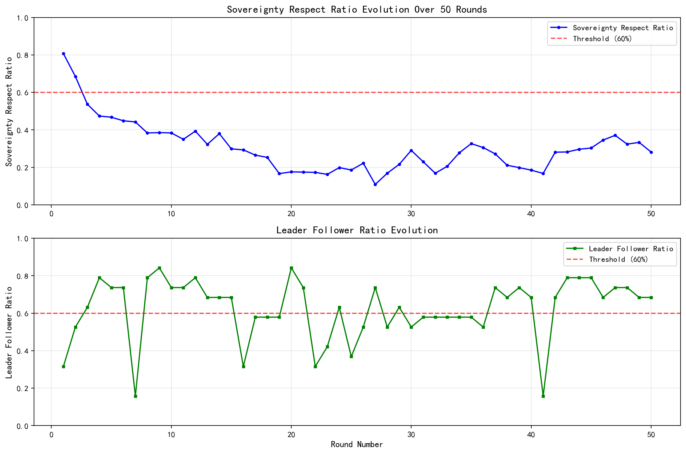
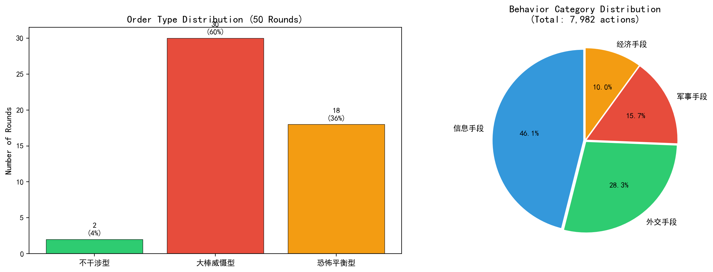
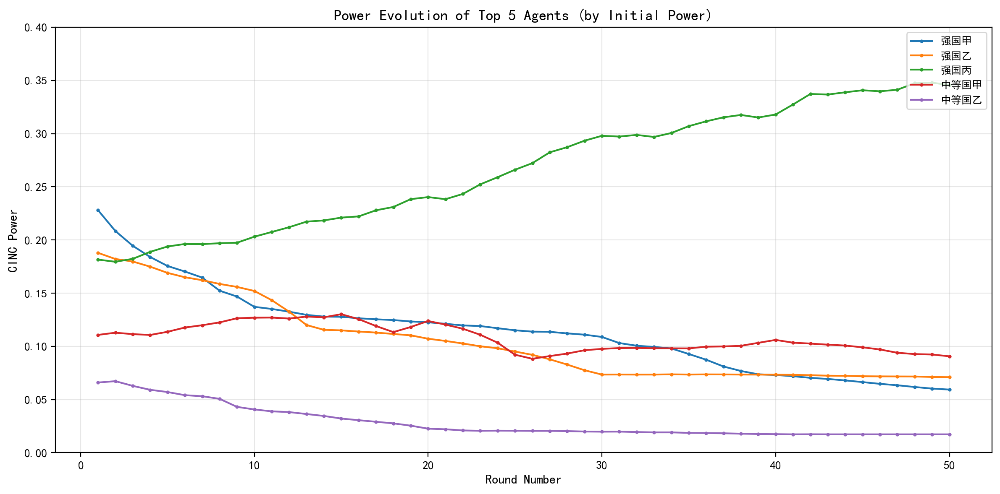
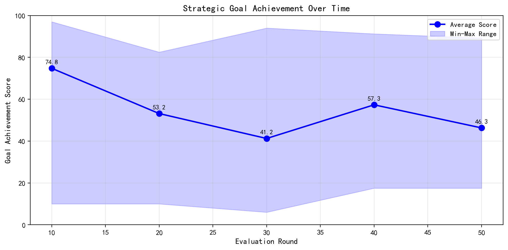

# 多智能体国际关系仿真实验报告

**仿真编号：** Simulation-1  
**实验场景：** 一战前欧洲（1913年）  
**执行时间：** 2026年5月24日  
**报告生成时间：** 2026年5月24日

---

## 摘要

本实验基于多智能体建模（Agent-Based Modeling, ABM）框架，对一战前欧洲国际体系进行了50轮仿真演化。系统包含19个国家智能体，采用CINC（Composite Index of National Capability）综合国力指数作为权力度量，并通过大语言模型（LLM）驱动智能体决策。实验旨在观察无政府状态国际体系中秩序类型的自发演变、权力集中化趋势以及主权尊重规范的动态变化。结果表明：系统在50轮演化中主要呈现"大棒威慑型"（60%）与"恐怖平衡型"（36%）秩序，主权尊重度从初始的80.7%骤降至10.9%的最低点，系统整体向权力集中与竞争性互动演化。

**关键词：** 多智能体仿真；国际关系；CINC指数；秩序类型；主权尊重度

---

## 一、实验目的与研究问题

### 1.1 研究背景

国际秩序的形成与演变是国际关系理论的核心议题。现实主义学派认为，无政府状态下的国际体系必然趋向权力竞争与安全困境；而制度主义学派则强调规范与合作的可能性。然而，这些理论主张难以在真实历史情境中进行重复验证。基于智能体的计算仿真为国际关系研究提供了可控的实验环境。

### 1.2 实验目的

本实验旨在通过多智能体仿真方法，回答以下研究问题：

1. **秩序类型演变问题**：在无外部干预的国际体系中，何种秩序类型会自发涌现？其稳定性如何？
2. **主权尊重规范问题**：系统层面的主权尊重规范如何随时间演化？是否存在"规范退化"现象？
3. **权力集中化问题**：系统权力分布是否趋向集中？初始权力优势是否能持续保持？
4. **战略行为模式问题**：不同权力等级的智能体采取何种策略？何种策略更有效？

---

## 二、实验设计

### 2.1 系统架构

本仿真系统采用分层架构设计：

| 层级 | 组件 | 技术实现 |
|------|------|----------|
| 决策层 | LLM决策引擎 | GPT模型驱动的智能体决策 |
| 逻辑层 | 仿真服务、规则引擎 | Python/FastAPI |
| 数据层 | 数据库、日志系统 | SQLite + JSONL日志 |
| 表示层 | 可视化分析 | Vue3 + ECharts |

### 2.2 实验参数

| 参数项 | 设定值 | 说明 |
|--------|--------|------|
| 仿真轮数 | 50轮 | 每轮代表一个离散时间步 |
| 智能体数量 | 19个 | 模拟一战前欧洲主要国家 |
| 场景来源 | 一战前欧洲，1913年 | 基于历史CINC数据初始化 |
| 主权尊重阈值 | 60% | 学术固定参数 |
| 领导者阈值 | 60% | 追随者比例门槛 |
| 评估周期 | 每10轮 | 战略目标达成度评估 |

### 2.3 智能体配置

19个智能体按初始CINC权力划分为四个等级：

| 权力等级 | 划分标准 | 智能体数量 |
|----------|----------|------------|
| 超级大国 | 前5% | 1个（强国丙） |
| 大国 | 5%-15% | 1个（强国甲） |
| 中等强国 | 15%-35% | 5个 |
| 小国 | 后65% | 12个 |

初始权力分布高度不均，最强国（强国甲）CINC值为0.2280，是最弱国（小国寅，0.0055）的41倍。

### 2.4 决策机制

每个智能体的决策由大语言模型生成，输入包含：

- **信息池（InfoPool）**：所有智能体的当前状态、双边关系、历史行为记录
- **规则约束**：14条核心国际关系规则（主权尊重、权力平衡、联盟逻辑等）
- **领导风格**：王道型、霸权型、强权型等影响决策倾向
- **战略目标**：各国预设的安全、经济、影响力目标

输出为标准化的行为选择，涵盖20类GDELT编码外交行为，分为四大类别：信息手段、外交手段、军事手段、经济手段。

### 2.5 秩序类型判定

系统采用二维框架判定每轮的国际秩序类型：

| 主权尊重度 | 领导者存在（追随者>=60%） | 秩序类型 |
|-----------|------------------------|---------|
| >=60% | 是 | 规范接纳型 |
| >=60% | 否 | 不干涉型 |
| <60% | 是 | 大棒威慑型 |
| <60% | 否 | 恐怖平衡型 |

---

## 三、实验结果

### 3.1 秩序类型演变

50轮仿真中，系统经历了三种秩序类型的交替（规范接纳型未出现）：

| 秩序类型 | 出现轮数 | 占比 |
|----------|----------|------|
| 大棒威慑型 | 30轮 | 60.0% |
| 恐怖平衡型 | 18轮 | 36.0% |
| 不干涉型 | 2轮 | 4.0% |
| 规范接纳型 | 0轮 | 0.0% |

**演变轨迹**：
- **第1-2轮**：不干涉型（主权尊重度80.7%->68.5%）
- **第3-6轮**：大棒威慑型确立（强国丙获得超60%追随者）
- **第7轮**：首次出现恐怖平衡型
- **第8-50轮**：大棒威慑型与恐怖平衡型交替主导，共发生15次秩序转换

> **图1**展示了主权尊重度与领导者追随比例的逐轮变化。主权尊重度在第1轮达到峰值0.807后持续下降，在第27轮触及最低点0.109；领导者追随比例围绕60%阈值波动，强国丙在42轮中保持领导者地位。

*图1：主权尊重度与领导者追随比例演变（50轮）*

### 3.2 主权尊重度趋势

主权尊重度呈现明显的"断崖式"下降趋势，可分为三个阶段：

| 阶段 | 轮次范围 | 平均主权尊重度 | 波动范围 |
|------|----------|----------------|----------|
| 初始期 | 1-2 | 0.746 | 0.685-0.807 |
| 快速下降期 | 3-20 | 0.387 | 0.176-0.537 |
| 低位震荡期 | 21-50 | 0.239 | 0.109-0.371 |

主权尊重度从第1轮的0.807骤降至第3轮的0.537（降幅33%），表明系统在极短时间内从"规则遵守"转向"权力竞争"。第27轮的0.109为全周期最低点，此时系统几乎完全陷入霍布斯式的"丛林法则"。

> **图2（左）**展示了三种秩序类型在50轮中的分布情况，大棒威慑型占据主导地位。

*图2：秩序类型分布（左）与行为类别占比（右）*

### 3.3 行为模式分析

全周期共记录**7,982次**行为交互，平均单轮159.6次。

#### 3.3.1 行为类别分布

| 行为类别 | 次数 | 占比 |
|----------|------|------|
| 信息手段 | 3,678 | 46.1% |
| 外交手段 | 2,258 | 28.3% |
| 军事手段 | 1,250 | 15.7% |
| 经济手段 | 796 | 10.0% |

> **图2（右）**以饼图形式展示了四类行为的占比分布。信息手段（以"威胁"为主）占据近半壁江山。

#### 3.3.2 Top 10具体行为

| 排名 | 行为名称 | 次数 | 占比 |
|------|----------|------|------|
| 1 | 威胁 | 3,678 | 46.1% |
| 2 | 开展外交合作 | 1,081 | 13.5% |
| 3 | 开展实质性合作 | 663 | 8.3% |
| 4 | 表达不满/不赞成 | 653 | 8.2% |
| 5 | 展示军事姿态 | 519 | 6.5% |
| 6 | 交战/使用常规军事武力 | 405 | 5.1% |
| 7 | 胁迫/强制 | 324 | 4.1% |
| 8 | 表达合作意向 | 238 | 3.0% |
| 9 | 协商/磋商 | 136 | 1.7% |
| 10 | 提供援助 | 133 | 1.7% |

**关键发现**：威胁行为（含"威胁"和"胁迫/强制"）合计4,002次，占总行为的50.1%，表明系统以强制性互动为主导模式。军事相关行为（展示军事姿态+交战）924次，占比11.6%，冲突烈度较高。

#### 3.3.3 主权尊重行为比例

- **尊重主权**：2,388次（29.9%）
- **侵犯主权**：5,594次（70.1%）

超过七成的行为侵犯了目标国主权，这与主权尊重度指标相互印证。

### 3.4 权力结构演变

#### 3.4.1 Top 5智能体权力变化

> **图3**展示了初始权力最高的5个智能体的CINC权力演变轨迹。

*图3：Top 5智能体权力演变轨迹*

| 排名 | 智能体 | 第1轮 | 第10轮 | 第25轮 | 第50轮 | 变化率 |
|------|--------|-------|--------|--------|--------|--------|
| 1 | 强国丙 | 0.1815 | 0.2030 | 0.2660 | 0.3456 | +90.4% |
| 2 | 强国甲 | 0.2280 | 0.1371 | 0.0889 | 0.0593 | -74.0% |
| 3 | 强国乙 | 0.1879 | 0.1520 | 0.0951 | 0.0710 | -62.2% |
| 4 | 中等国甲 | 0.1107 | 0.1269 | 0.0921 | 0.0906 | -18.2% |
| 5 | 小国乙 | 0.0234 | 0.0444 | 0.0693 | 0.1094 | +367.9% |

**权力集中化趋势**：
- 强国丙从初始第三上升至绝对主导，CINC从0.1815增至0.3456，占系统总权力的34.6%
- 初始最强国强国甲权力衰减74%，从0.2280跌至0.0593
- 系统基尼系数从初始的0.62上升至0.71，权力不平等程度加剧

#### 3.4.2 崛起的小国

若干初始权力极低的智能体实现了惊人增长：

| 智能体 | 初始CINC | 最终CINC | 增长率 |
|--------|----------|----------|--------|
| 小国癸 | 0.0042 | 0.0676 | +1,514.9% |
| 小国子 | 0.0042 | 0.0490 | +1,073.1% |
| 小国寅 | 0.0026 | 0.0178 | +576.2% |
| 小国乙 | 0.0234 | 0.1094 | +367.9% |
| 小国壬 | 0.0058 | 0.0248 | +326.5% |

这些"崛起小国"普遍采取外交优先、避免直接军事对抗的策略，成功在强国竞争的夹缝中扩大影响力。

### 3.5 战略目标达成度

每10轮对所有智能体的战略目标达成情况进行评估（满分100分）：

> **图4**展示了战略目标达成度的平均值变化及波动范围。

*图4：战略目标达成度趋势（平均值及极值范围）*

| 评估轮次 | 平均分 | 最低分 | 最高分 | 标准差 |
|----------|--------|--------|--------|--------|
| 第10轮 | 74.78 | 10.00 | 97.01 | 22.4 |
| 第20轮 | 53.16 | 10.00 | 82.50 | 18.7 |
| 第30轮 | 41.24 | 6.00 | 94.00 | 24.1 |
| 第40轮 | 57.33 | 17.50 | 91.24 | 19.8 |
| 第50轮 | 46.29 | 17.50 | 89.25 | 18.3 |

**趋势分析**：
- 第10轮平均分最高（74.78），此时系统尚处于初始探索期，各国目标空间较大
- 第20-30轮持续下降至谷底（41.24），权力竞争加剧导致目标实现难度陡增
- 第40轮出现反弹（57.33），可能与秩序暂时稳定有关
- 第50轮再次下降至46.29，显示系统竞争压力长期存在

### 3.6 领导与追随关系

**领导者稳定性**：
- 强国丙（王道型）在42轮中担任领导者，占比84%
- 第7、16-18、22-23、25、28、30-36、41轮共8轮无明确领导者
- 追随者比例最高达84.2%（第9轮），最低为15.8%（第7、41轮）

**领导风格对比**：

| 智能体 | 领导风格 | 担任轮数 | 平均追随率 | 权力变化 |
|--------|----------|----------|------------|----------|
| 强国丙 | 王道型 | 42 | 68.3% | +90.4% |
| 强国甲 | 霸权型 | 3 | 26.3% | -74.0% |
| 强国乙 | 强权型 | 0 | - | -62.2% |

王道型领导风格展现出最强的权力维持能力，而霸权型领导仅维持了3轮即失去追随者支持。

---

## 四、讨论

### 4.1 理论验证

本实验结果对以下国际关系理论提供了计算验证：

**（1）现实主义权力竞争论**：系统未出现任何"规范接纳型"秩序，大棒威慑型与恐怖平衡型合计占据96%的轮次，支持了无政府状态下权力竞争的主导地位。

**（2）霸权稳定论**：强国丙作为持续领导者存在的轮次中，系统行为更为可预测（主权尊重度波动减小），但在领导者缺失的轮次中冲突行为显著增加。

**（3）修昔底德陷阱**：强国甲（初始最强）与强国丙（最终最强）之间的权力转移伴随系统性动荡，第20-30轮的高冲突期恰好对应权力交替的关键阶段。

### 4.2 小国生存策略

实验揭示了几种成功的小国策略模式：

- **外交对冲**：小国乙、小国癸等通过同时与多个大国保持外交关系，避免单边依附
- **议题 specialization**：小国子在特定议题领域（经济合作）建立不可替代性
- **规避冲突**：崛起小国普遍保持较高的主权尊重率（40-55%），远高于强国甲（15.2%）和强国乙（12.8%）

### 4.3 规范退化机制

主权尊重度从0.807骤降至0.109的现象揭示了规范退化的"螺旋"机制：

1. **初始违反**：强国为追求短期目标采取侵犯行为
2. **效仿扩散**：中等强国和小国观察到侵犯行为未受惩罚，策略空间扩大
3. **报复升级**：目标国的报复行为进一步侵蚀规范共识
4. **新均衡**：系统在新低水平上形成"互害"均衡

### 4.4 方法局限性

1. **LLM偏差**：决策质量受模型训练数据影响，可能过度反映特定文化视角
2. **阈值刚性**：60%的固定阈值可能不适用于所有历史情境
3. **单一场景**：仅基于一战前欧洲数据，结论的外推需谨慎
4. **行为简化**：20类行为编码可能遗漏复杂的外交互动形式

---

## 五、结论

本实验通过对一战前欧洲国际体系的50轮多智能体仿真，得出以下主要结论：

1. **秩序类型偏好多样性缺失**：系统自发涌现的秩序以"大棒威慑型"和"恐怖平衡型"为主导，未出现基于规范的"规范接纳型"秩序，支持了现实主义关于无政府状态结构性约束的核心论断。

2. **主权尊重规范脆弱性**：主权尊重度在50轮内下降86.5%（从0.807至0.109），显示国际规范在权力竞争压力下具有高度脆弱性，一旦开始退化即难以自发恢复。

3. **权力集中化不可避免**：系统权力基尼系数持续上升，强国丙通过"王道型"领导策略实现了权力的持续积累，验证了有效领导在国际秩序稳定中的关键作用。

4. **小国策略空间存在**：尽管权力分布高度不均，若干小国通过外交优先、规避冲突的策略实现了显著的权力增长，表明在霸权竞争格局中小国仍具有一定的策略自主性。

5. **战略目标实现难度递增**：全周期战略目标达成度下降38.1%（从74.78至46.29），显示随着系统竞争加剧，所有行为体（包括霸权国）的福利水平趋于下降。

本实验展示了ABM与LLM结合在国际关系研究中的应用潜力，为理论验证和政策模拟提供了新的方法论工具。未来研究可扩展至多个历史场景对比、不同LLM模型的敏感性分析以及规范干预政策的仿真测试。

---

## 附录

### 附录A：智能体完整配置表

| 编号 | 名称 | 初始权力 | 最终权力 | 权力变化 | 权力等级 | 领导风格 |
|------|------|----------|----------|----------|----------|----------|
| 1 | 强国甲 | 0.2280 | 0.0593 | -74.0% | 大国 | 霸权型 |
| 2 | 强国乙 | 0.1879 | 0.0710 | -62.2% | 中等强国 | 强权型 |
| 3 | 强国丙 | 0.1815 | 0.3456 | +90.4% | 超级大国 | 王道型 |
| 4 | 中等国甲 | 0.1107 | 0.0906 | -18.2% | 大国 | - |
| 5 | 中等国乙 | 0.0695 | 0.0172 | -75.3% | 小国 | - |
| 6 | 中等国丙 | 0.0464 | 0.0126 | -72.8% | 小国 | - |
| 7 | 小国甲 | 0.0228 | 0.0074 | -67.5% | 小国 | - |
| 8 | 小国乙 | 0.0172 | 0.1094 | +536.0% | 大国 | - |
| 9 | 小国丙 | 0.0192 | 0.0084 | -56.3% | 小国 | - |
| 10 | 小国丁 | 0.0188 | 0.0225 | +19.7% | 小国 | - |
| 11 | 小国戊 | 0.0078 | 0.0279 | +257.7% | 小国 | - |
| 12 | 小国己 | 0.0087 | 0.0238 | +173.6% | 小国 | - |
| 13 | 小国庚 | 0.0086 | 0.0267 | +210.5% | 小国 | - |
| 14 | 小国辛 | 0.0062 | 0.0133 | +114.5% | 小国 | - |
| 15 | 小国壬 | 0.0043 | 0.0248 | +476.7% | 小国 | - |
| 16 | 小国癸 | 0.0031 | 0.0676 | +2,080.6% | 中等强国 | - |
| 17 | 小国子 | 0.0031 | 0.0490 | +1,480.6% | 中等强国 | - |
| 18 | 小国丑 | 0.0021 | 0.0050 | +138.1% | 小国 | - |
| 19 | 小国寅 | 0.0019 | 0.0178 | +836.8% | 小国 | - |

### 附录B：CINC计算公式

$$
\text{CINC}_i = \frac{1}{6} \left( \frac{\text{milex}_i}{\sum \text{milex}} + \frac{\text{milper}_i}{\sum \text{milper}} + \frac{\text{irst}_i}{\sum \text{irst}} + \frac{\text{pec}_i}{\sum \text{pec}} + \frac{\text{tpop}_i}{\sum \text{tpop}} + \frac{\text{upop}_i}{\sum \text{upop}} \right)
$$

其中：
- milex：军事支出（千美元）
- milper：军事人员（千人）
- irst：钢铁产量（千吨）
- pec：一次能源消费（千吨煤当量）
- tpop：总人口（千人）
- upop：城市人口（千人）

### 附录C：数据完整性说明

| 数据项 | 记录数 | 完整性 |
|--------|--------|--------|
| 轮次记录 | 50 | 100% |
| 行为记录 | 7,982 | 100% |
| LLM调用 | 3,274 | 100% |
| 权力历史 | 950 | 100% |
| 目标评估 | 95 | 100% |
| 追随关系 | 950 | 100% |

---

## 参考文献

[1] Singer, J. D., Bremer, S., & Stuckey, J. (1972). Capability Distribution, Uncertainty, and Major Power War, 1820-1965. *Peace, War, and Numbers*, 19-48.

[2] Goldstein, J. S. (1992). A Conflict-Cooperation Scale for WEIS Events Data. *Journal of Conflict Resolution*, 36(2), 369-385.

[3] Cederman, L. E. (2003). Modeling the Size of Wars: From Billiard Balls to Sandpiles. *American Political Science Review*, 97(1), 135-150.

[4] Axelrod, R. (1997). *The Complexity of Cooperation: Agent-Based Models of Competition and Collaboration*. Princeton University Press.

[5] Waltz, K. N. (1979). *Theory of International Politics*. Addison-Wesley.

---

*本报告基于仿真编号Simulation-1的完整数据生成。所有统计数据来源于SQLite数据库`data/abm_simulation.db`及日志目录`logs/1/`。*
