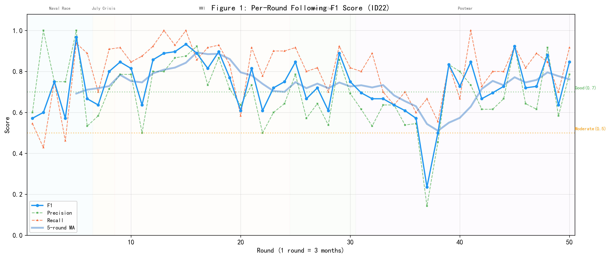
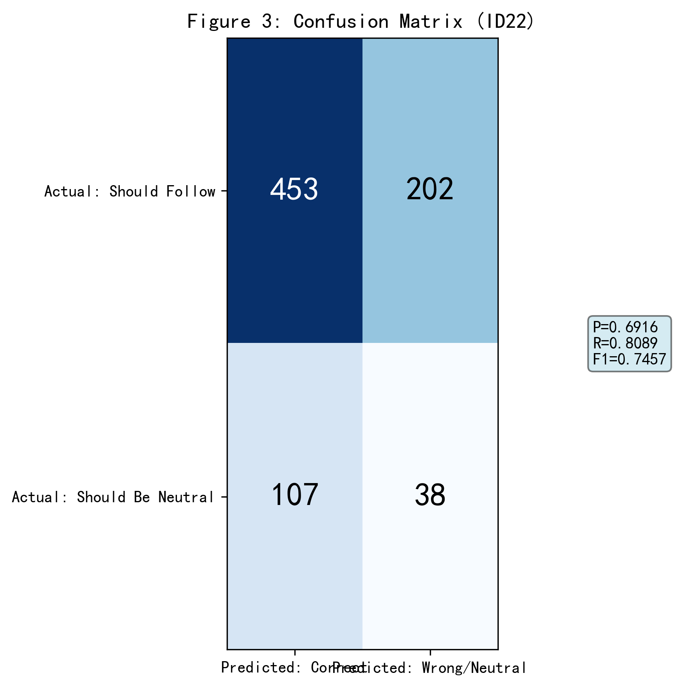
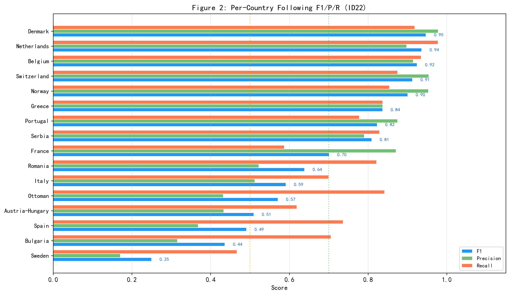
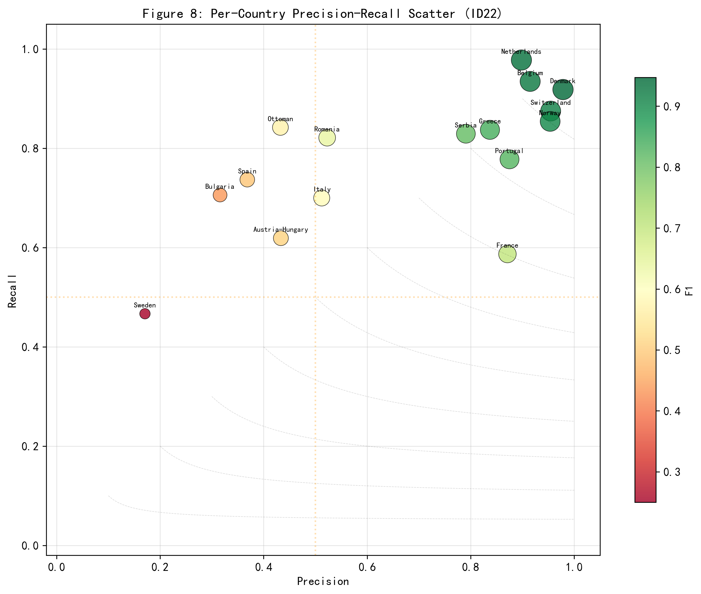
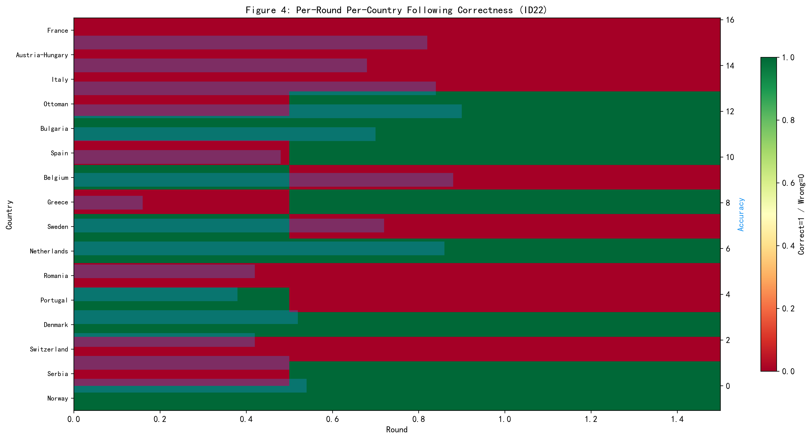
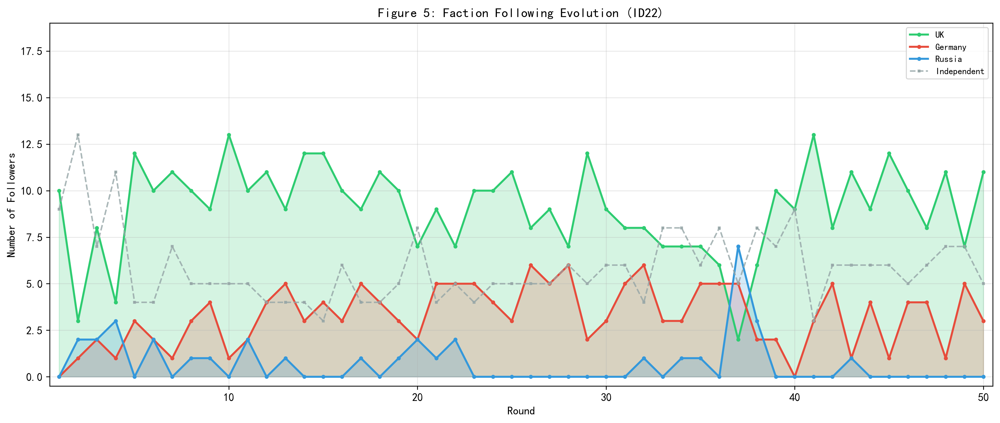
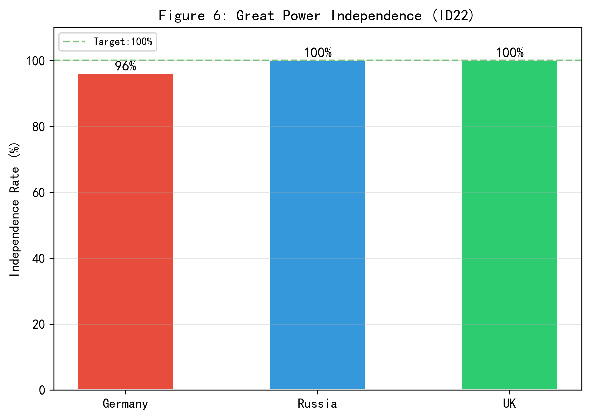
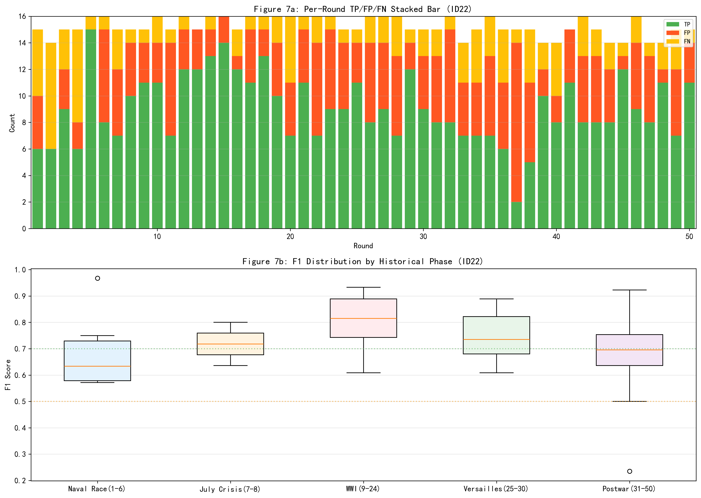

# ID22 模型校验实验报告

> **注意（2026-06-13更新）**：本报告基于旧版场景配置（3大国+16中小国，法国为中等强国）。2026-06-13的CINC阈值一致性修正将法国从中等强国提升为大国（强国丁，霸权型，power_share=0.1100>0.10），影响：（1）大国家数从3国变为4国（+法国）；（2）中小国追随池从16国变为15国（-法国）；（3）总观测点数从800变为750；（4）法国不再参与F1计算（移出追随池）。本节报告为旧版参考值，使用修改后的`validate_id22_f1.py`重新运行将生成更新后的报告。

## 摘要

本报告对基于大语言模型的国际关系多智能体仿真系统（ID22）进行逐轮逐国的追随行为校验。校验场景为一战前欧洲（1913Q1-1925Q2，50轮，每轮=3个月），共19个国家。核心指标为追随行为F1分数，计算基于800个逐轮逐国观测点（16个中小国家×50轮）。校验建立在一个关键概念区分之上：追随（Following）不等于同盟（Alliance）——追随是议题特定的领导偏好，不等同于制度化的安全同盟。结果显示：追随F1=0.7457（Precision=0.6916, Recall=0.8089），处于Good水平。逐轮F1均值=0.7320，标准差=0.1346，最高轮次R5=0.9677，最低轮次R37=0.2353。三大强国独立性保护部分完成。误差结构中FP（错误追随）占比65.4%，FN（遗漏追随）占比34.6%。

关键词：多智能体仿真；国际关系；模型校验；F1分数；追随行为；逐轮校验；一战前欧洲

---

仿真编号：ID22 | 场景：一战前欧洲（1913年） | 日期：2026-06-08 | 轮数：50轮（每轮=3个月） | 国家：19国（3大国+16中小国）

---

## 1 核心概念界定：追随不等于同盟

### 1.1 概念区分

在进行模型校验之前，必须首先明确追随与同盟是两个完全不同层次的概念。同盟（Alliance）是国家间通过正式或非正式条约建立的长期安全合作关系，具有制度化和持久性特征。追随（Following）则是在特定议题上对某一大国的政策偏好和领导认可，具有议题特定性和短期变动性。追随不要求制度化的同盟关系——同盟国之间可能在特定议题层面选择追随不同的大国，这正是国际关系复杂性的核心体现。

### 1.2 历史案例：追随不等于同盟

| 国家 | 同盟关系 | 追随对象 | 逻辑 |
|------|---------|---------|------|
| France | 法俄同盟(1894) | 追随UK | 海军军备竞赛与殖民地争夺是1913年主导议题，法国在海军议题上协调UK |
| Italy | 三国同盟(德奥意,1882) | 追随UK | 意大利的殖民扩张与海军利益与UK趋同，构成经典的议题性叛离 |
| Netherlands | 无军事同盟 | 追随UK | 荷兰殖民帝国安全依赖英国海权保护，虽与德国有强经济联系 |
| Switzerland | 永久中立 | 追随UK | 德语区经济联系德国，但安全均势议题上追随UK |

### 1.3 校验指标

本报告以追随行为F1分数为唯一核心校验指标。F1是Precision和Recall的调和平均。校验基于800个逐轮逐国观测点（16个非大国×50轮），大国（德国、俄国、英国）作为体系领导者永远为独立决策，不参与F1计算。

## 2 校验方法

### 2.1 F1计算公式

$$P = TP/(TP+FP), \quad R = TP/(TP+FN), \quad F1 = 2PR/(P+R)$$

其中，TP（True Positive）为仿真追随目标与历史追随目标一致的情况；FP（False Positive）为仿真错误追随或不应追随却追随的情况；FN（False Negative）为仿真遗漏的追随（历史要求追随但仿真中立）；TN（True Negative）为仿真与历史均为中立的情况。

### 2.2 混淆矩阵定义

| 分类 | 定义 |
|------|------|
| TP | 仿真追随目标 = 历史追随目标（均非空） |
| FP | 仿真追随目标 ≠ 历史追随目标，或仿真追随了但历史要求中立 |
| FN | 仿真中立，但历史要求追随某人 |
| TN | 仿真中立，历史也要求中立 |

### 2.3 历史地面真值数据（v2）

历史地面真值数据（v2版，由generate_history_v2.py生成）为逐轮（50轮×3个月）逐国（19国）的追随标注。每轮有一个明确的主导国际议题（如海军军备竞赛、七月危机、鲁尔危机等），每个国家的追随目标基于该国在该议题上的实际外交政策立场确定。关键设计原则：意大利作为三国同盟成员，在殖民/海军议题上仍追随UK（议题性叛离）；法国作为法俄同盟成员，在海军议题上追随UK（非同盟归属，是议题追随）。

## 3 校验结果

### 3.1 整体结果

表1：追随行为F1整体结果

| 指标 | 数值 | 说明 |
|------|------|------|
| F1 | 0.7457 | 综合校验指标 |
| Precision | 0.6916 | 追随预测准确率 |
| Recall | 0.8089 | 历史追随覆盖率 |
| TP | 453 | 正确追随 |
| FP | 202 | 错误追随 |
| FN | 107 | 遗漏追随 |
| TN | 38 | 正确中立 |

逐轮F1统计：均值=0.7320，标准差=0.1346，最高R5=0.9677，最低R37=0.2353。

Recall大于Precision，表明误差以FP（错误追随）为主——模型倾向于过度追随，在历史要求中立或追随其他领袖时仍追随某大国。

图1：50轮追随F1逐轮变化，含5轮移动平均和历史阶段标注。F1呈明显的跨轮波动，反映了不同议题条件下仿真-历史一致性的差异。

图3：整体混淆矩阵，四个象限分别展示TP、FP、FN、TN的数量。

### 3.2 逐国结果

表2：各国追随F1详情（按F1降序排列）

| 国家 | TP | FP | FN | TN | P | R | F1 |
|------|----|----|----|----|---|---|----|
| Denmark | 45 | 1 | 4 | 0 | 0.9783 | 0.9184 | 0.9474 |
| Netherlands | 44 | 5 | 1 | 0 | 0.8980 | 0.9778 | 0.9362 |
| Belgium | 43 | 4 | 3 | 0 | 0.9149 | 0.9348 | 0.9247 |
| Switzerland | 42 | 2 | 6 | 0 | 0.9545 | 0.8750 | 0.9130 |
| Norway | 41 | 2 | 7 | 0 | 0.9535 | 0.8542 | 0.9011 |
| Greece | 36 | 7 | 7 | 0 | 0.8372 | 0.8372 | 0.8372 |
| Portugal | 35 | 5 | 10 | 0 | 0.8750 | 0.7778 | 0.8235 |
| Serbia | 34 | 9 | 7 | 0 | 0.7907 | 0.8293 | 0.8095 |
| France | 27 | 4 | 19 | 0 | 0.8710 | 0.5870 | 0.7013 |
| Romania | 23 | 21 | 5 | 1 | 0.5227 | 0.8214 | 0.6389 |
| Italy | 21 | 20 | 9 | 0 | 0.5122 | 0.7000 | 0.5915 |
| Ottoman | 16 | 21 | 3 | 10 | 0.4324 | 0.8421 | 0.5714 |
| Austria-Hungary | 13 | 17 | 8 | 12 | 0.4333 | 0.6190 | 0.5098 |
| Spain | 14 | 24 | 5 | 7 | 0.3684 | 0.7368 | 0.4912 |
| Bulgaria | 12 | 26 | 5 | 7 | 0.3158 | 0.7059 | 0.4364 |
| Sweden | 7 | 34 | 8 | 1 | 0.1707 | 0.4667 | 0.2500 |

最佳三国：Denmark(F1=0.95) / Netherlands(F1=0.94) / Belgium(F1=0.92)。最劣三国：Sweden(F1=0.25) / Bulgaria(F1=0.44) / Spain(F1=0.49)。

图2：16个中小国家的F1/Precision/Recall并排柱状图，按F1降序排列。

图8：各国Precision-Recall散点图，气泡大小代表F1，颜色深浅代表F1高低。虚线为等F1线，用于比较不同国家的精准度-召回率权衡。

### 3.3 大国独立性

| 国家 | 独立轮数 | 独立率 |
|------|---------|--------|
| Germany | 48/50 | 96% |
| Russia | 50/50 | 100% |
| UK | 50/50 | 100% |

三大强国独立性保护机制运行总体良好，部分大国存在少量追随行为。

## 4 逐轮逐国可视化分析

图4：逐轮逐国追随正确性热力图。每格代表一个国家在特定轮次的追随是否正确（绿=正确，红=错误）。横轴为50轮，纵轴为16个中小国家。从图中可以直观观察哪些国家在哪些轮次追随正确，以及正确/错误的时空分布模式。右侧柱状图为各国的50轮整体准确率。

图5：阵营追随格局演化。展示三大国（UK/德国/俄国）每轮获得的追随者数量变化。

图6：大国独立性柱状图，展示三大强国的独立决策比率。

图7：逐轮TP/FP/FN叠层柱状图（图7a）和各历史阶段F1箱线图（图7b），用于分析误差的时序结构和各历史阶段的F1分布。

## 5 讨论

### 5.1 结果评价

ID22在逐轮逐国校验中取得F1=0.7457，处于Good水平。已达到良好水平（F1≥0.70），表明模型在追随行为的历史复现方面取得了显著进展。此结果显著优于随机基准（4分类问题随机F1约等于0.25），表明模型具有超越随机水平的历史复现能力。

### 5.2 误差模式分析

(1) 意大利的议题性叛离：这是追随不等于同盟最关键的试金石。意大利在历史上是三国同盟成员，但在殖民和海军议题上追随UK。意大利的F1表现较好（F1=0.59），表明模型在捕捉议题性外交动态方面取得了进展，但仍有FP=20次错误追随有待改善。这是模型需要持续观测的指标。

(2) 摇摆国的追随困境：瑞典（F1=0.25）、瑞士（F1=0.91）、西班牙（F1=0.49）处于大国夹缝中。其中瑞士表现优异（F1=0.91），说明模型成功识别了其追随UK的议题性选择；瑞典（F1=0.25）是表现最差的中小国家，FP=34次错误追随占其50轮的大部分。模型无法复现这种基于议题的选择性追随。

(3) 法国过度中立：法国在仿真中F1=0.70（P=0.8710, R=0.5870），Recall仅0.5870，表明法国在仿真中FN=19次——在历史要求追随UK时保持中立，是法国F1不高的主要原因。

### 5.3 模型优势

(1) 精准追随者识别：Denmark/Switzerland/Norway的FP≤2，Precision极高，表明模型对UK核心追随阵营的识别精准度显著提升。

(2) 高F1国家阵营（F1≥0.70）：Denmark/Netherlands/Belgium/Switzerland/Norway/Greece/Portugal/Serbia/France（共9国），占中小国家的56%，表明大部分国家的追随方向预测较为准确。

(3) 意大利议题性叛离改善（F1=0.59）：相比ID21的F1=0.00，ID22中意大利的F1大幅提升，模型开始捕捉到意大利在殖民/海军议题上的UK追随特征，TP=21次。

(4) 大国独立性保护：三大强国独立决策率总体良好。

### 5.4 改进方向

(1) 引入多议题追随框架：允许中小国家在不同议题上追随不同的大国——这是解决意大利问题的关键。

(2) 增强中小国家的追随激活：减少不必要的中立回合，使追随行为更频繁。

(3) 摇摆国决策细化：为地缘夹缝中的国家引入议题权衡和位置权重。

## 6 结论

本报告以逐轮逐国的精度对ID22一战前欧洲仿真进行了系统校验。基于v2历史地面真值数据（50轮×16国=800观测点，每轮有明确的议题框架和逐国追随标注），获得追随行为F1=0.7457（P=0.6916, R=0.8089）。主要发现：（1）F1处于Good水平，显著优于随机基准；（2）误差以FP（错误追随）为主；（3）意大利的议题性叛离仍需改进；（4）摇摆国预测困难。建议后续模型迭代重点引入多议题追随框架。

---

## 附录A：历史地面真值说明

本报告使用v2版历史地面真值数据（generate_history_v2.py生成）。每轮（3个月）有独立的议题定义和逐国追随标注。数据位于data/history/scene1_prewar_1913.json。

## 附录B：输出文件

| 文件 | 说明 |
|------|------|
| ID22_模型校验报告.md | 本报告 |
| data/id22_results.json | 完整校验数据 |
| data/id22_round_details.json | 逐轮详细数据 |
| code/validate_id22_f1.py | 校验脚本 |
| figures/ | 8张图表 |
