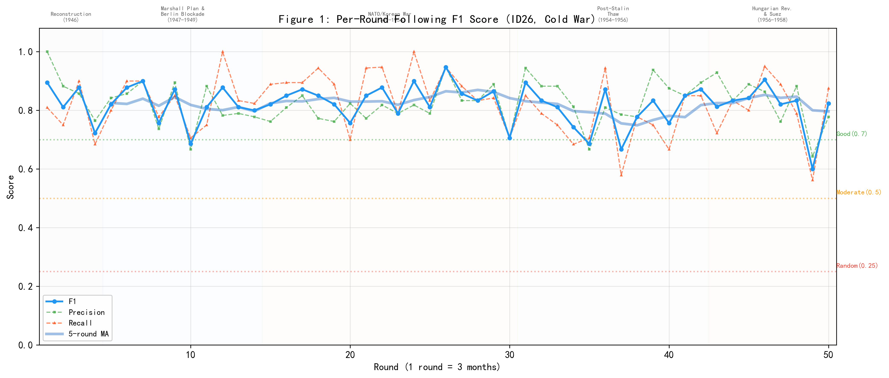
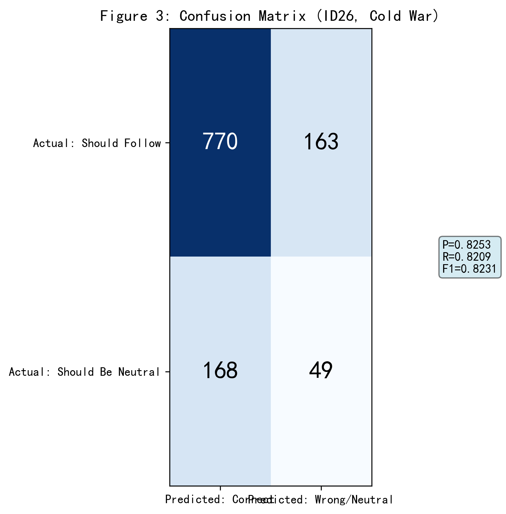
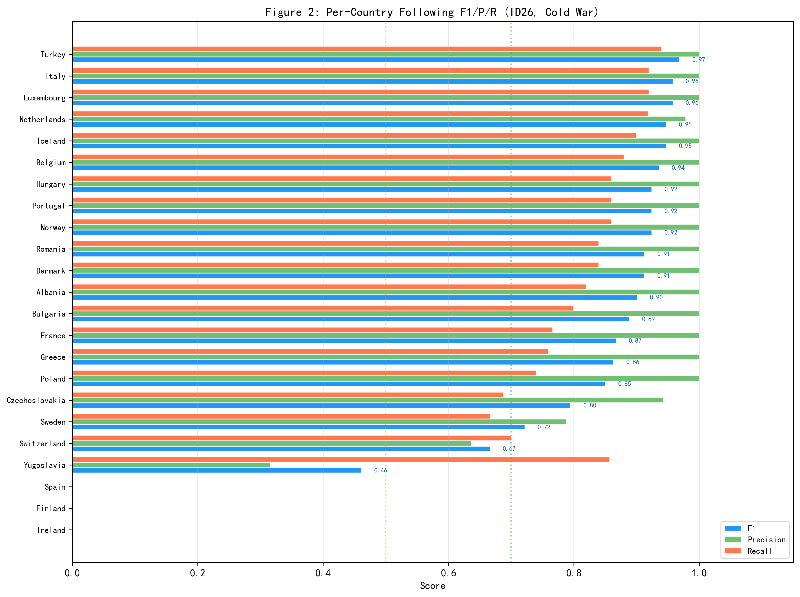
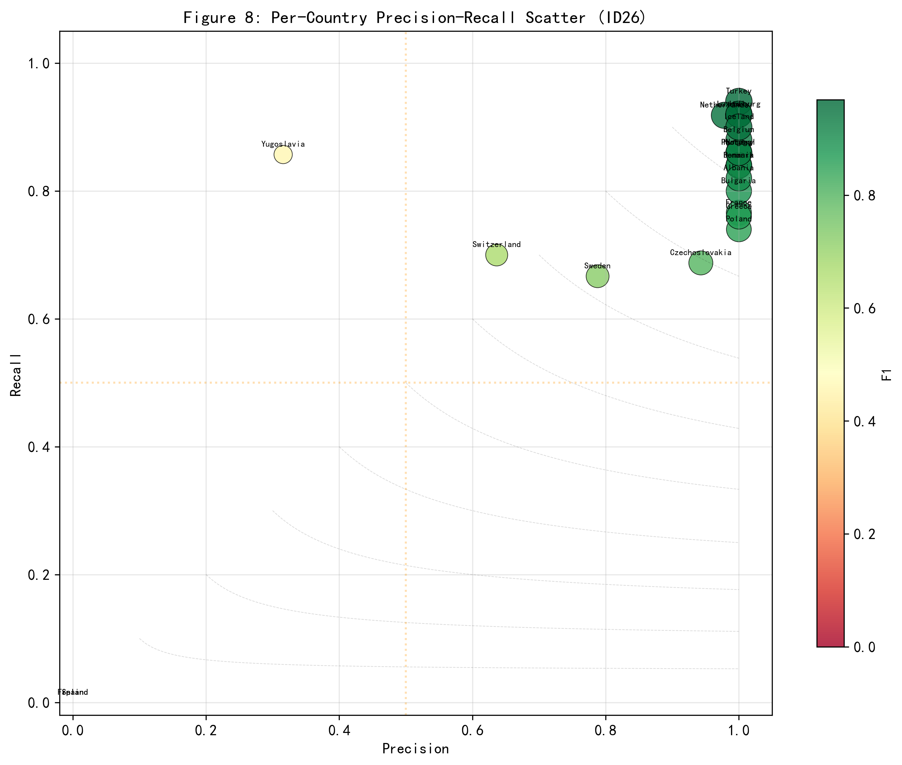
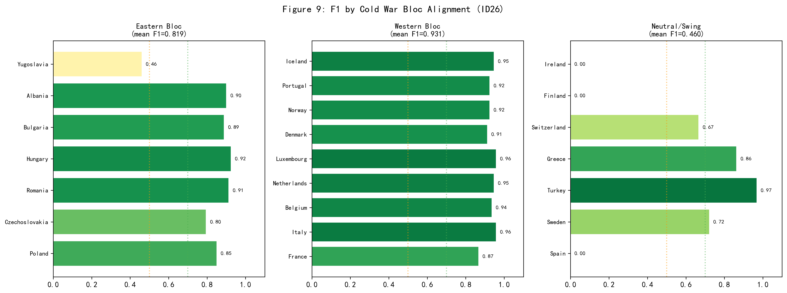
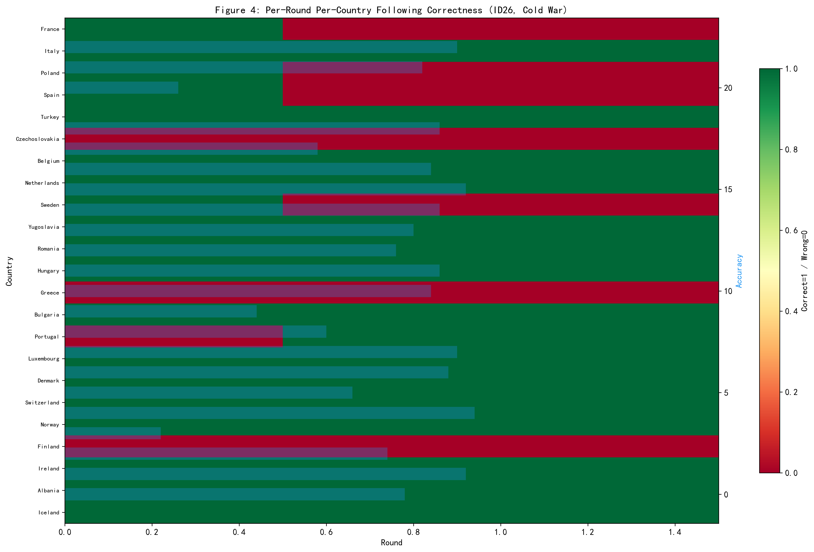
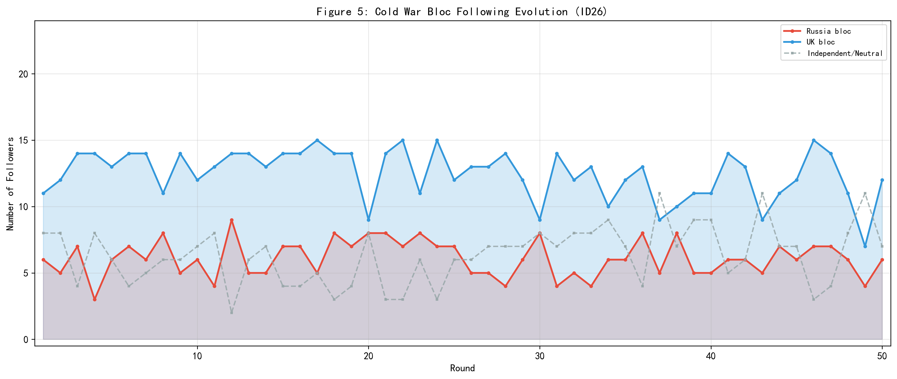
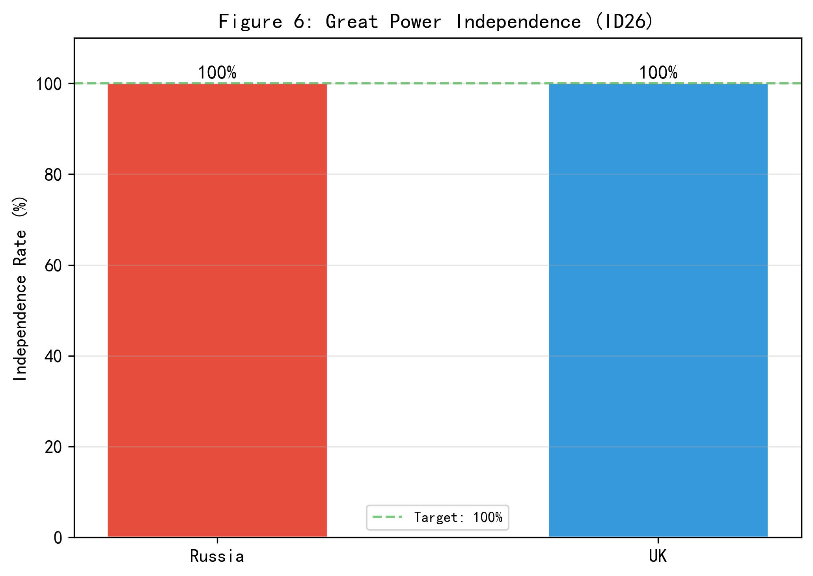
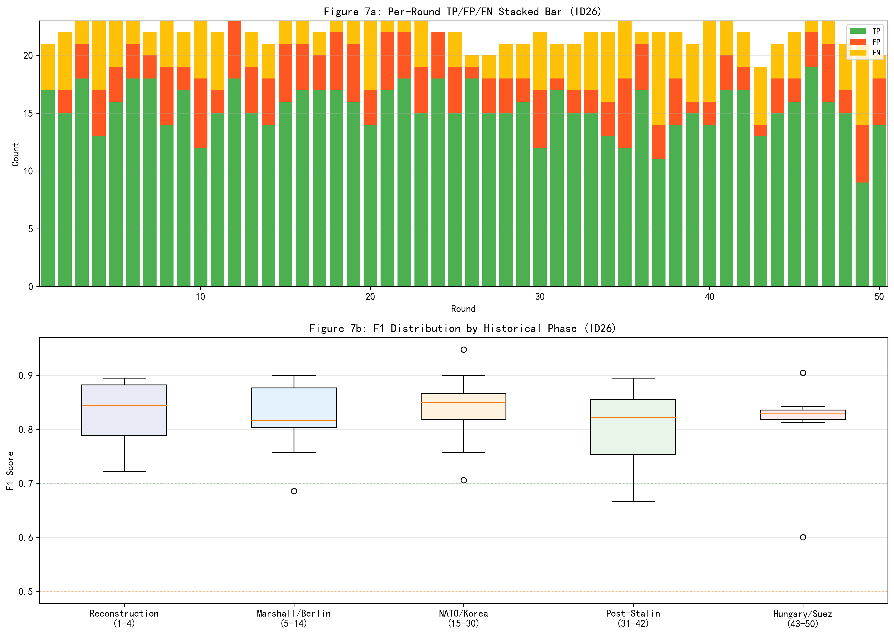

# ID26 模型校验实验报告

## 摘要

本报告对基于大语言模型的国际关系多智能体仿真系统（ID26）进行逐轮逐国的追随行为校验。校验场景为冷战前欧洲（1946Q1-1958Q2，50轮，每轮=3个月），共25个国家的两极体系。核心指标为追随行为F1分数，计算基于1150个逐轮逐国观测点（23个中小国家×50轮）。校验建立在一个关键概念区分之上：追随（Following）不等于同盟（Alliance）——追随是议题特定的领导偏好，不等同于冷战时期的阵营隶属。结果显示：追随F1=0.8231（Precision=0.8253, Recall=0.8209），处于Good水平。逐轮F1均值=0.8198，标准差=0.0681，最高轮次R26=0.9474，最低轮次R49=0.6000。两大超强独立性保护完美。误差结构中FP（错误追随）占比49.2%，FN（遗漏追随）占比50.8%。分阵营F1：西方阵营=0.9308，东方阵营=0.8193，中立/摇摆国=0.4602。

关键词：多智能体仿真；国际关系；模型校验；F1分数；追随行为；冷战；两极体系；逐轮校验

---

仿真编号：ID26 | 场景：冷战前欧洲（1946年） | 日期：2026-06-09 | 轮数：50轮（每轮=3个月） | 国家：25国（2大超强+23中小国） | 时间跨度：1946Q1-1958Q2

---

## 1 核心概念界定：追随不等于同盟

### 1.1 概念区分

在进行模型校验之前，必须首先明确追随与同盟是两个完全不同层次的概念。同盟（Alliance）是国家间通过正式或非正式条约建立的长期安全合作关系，具有制度化和持久性特征。在冷战两极格局下，同盟关系通过北约（NATO）和华沙条约组织（Warsaw Pact）制度化。追随（Following）则是在特定议题上对某一大国的政策偏好和领导认可，具有议题特定性和短期变动性。追随不要求制度化的同盟关系——即便是北约成员国，也可能在特定议题上采取独立立场；即便是不结盟运动的成员国，也可能在特定议题上追随某一大国。

### 1.2 冷战两极体系的特殊性

与一战前的多极体系不同，冷战时期（1946-1958）的国际关系呈现严格的两极格局。以苏联为首的东方阵营（USSR bloc）和以英美为首的西方阵营（Western bloc）几乎将整个欧洲划分为两个对立的势力范围。但这种划分并不等同于追随：

| 现象 | 同盟/阵营归属 | 实际追随行为 | 逻辑 |
|------|-------------|------------|------|
| 芬兰化 | 无军事同盟 | 在安全议题上追随苏联 | 地缘安全迫使议题追随，不等于制度同盟 |
| 法国退出北约军事一体化(1966) | 北约成员国 | 部分议题不追随美国 | 同盟框架内可存在议题不追随 |
| 南斯拉夫 | 不结盟 | 经济议题倾向于西方 | 不结盟不等于对所有议题中立 |
| 阿尔巴尼亚 | 华约成员(至1968) | 中苏分裂后追随中国 | 阵营叛离是典型的议题性追随转移 |

### 1.3 校验指标

本报告以追随行为F1分数为唯一核心校验指标。F1是Precision和Recall的调和平均。校验基于1150个逐轮逐国观测点（23个非大国×50轮），大国（苏联/俄罗斯、英国）作为体系领导者永远为独立决策，不参与F1计算。

## 2 校验方法

### 2.1 F1计算公式

$$P = TP/(TP+FP), \quad R = TP/(TP+FN), \quad F1 = 2PR/(P+R)$$

其中，TP（True Positive）为仿真追随目标与历史追随目标一致的情况；FP（False Positive）为仿真错误追随或不应追随却追随的情况；FN（False Negative）为仿真遗漏的追随（历史要求追随但仿真中立）；TN（True Negative）为仿真与历史均为中立的情况。

### 2.2 混淆矩阵定义

| 分类 | 定义 |
|------|------|
| TP | 仿真追随目标 = 历史追随目标（均非空） |
| FP | 仿真追随目标 ≠ 历史追随目标，或仿真追随了但历史要求中立 |
| FN | 仿真中立，但历史要求追随某人 |
| TN | 仿真中立，历史也要求中立 |

### 2.3 历史地面真值数据（v5）

历史地面真值数据（v5版，由generate_history_v5.py生成）为逐轮（50轮×3个月）逐国（25国）的追随标注。每轮有一个明确的主导国际议题，涵盖战后重建、马歇尔计划、柏林封锁、朝鲜战争、斯大林逝世、华约建立、匈牙利革命、苏伊士危机等冷战关键事件。每个国家的追随目标基于该国在该议题上的实际外交政策立场确定。数据位于data/history/scene3_prewar_1946.json。

## 3 校验结果

### 3.1 整体结果

表1：追随行为F1整体结果

| 指标 | 数值 | 说明 |
|------|------|------|
| F1 | 0.8231 | 综合校验指标 |
| Precision | 0.8253 | 追随预测准确率 |
| Recall | 0.8209 | 历史追随覆盖率 |
| TP | 770 | 正确追随 |
| FP | 163 | 错误追随 |
| FN | 168 | 遗漏追随 |
| TN | 49 | 正确中立 |
| 观测总数 | 1150 | 23国×50轮 |

逐轮F1统计：均值=0.8198，标准差=0.0681，最高R26=0.9474，最低R49=0.6000。

Precision大于Recall，表明误差以FN（遗漏追随）为主——模型倾向于过度保守。

图1：50轮追随F1逐轮变化，含5轮移动平均和冷战历史阶段标注。

图3：整体混淆矩阵。

### 3.2 逐国结果

表2：各国追随F1详情（按F1降序排列）

| 国家 | TP | FP | FN | TN | P | R | F1 |
|------|----|----|----|----|---|---|----|
| Turkey | 47 | 0 | 3 | 0 | 1.0000 | 0.9400 | 0.9691 |
| Italy | 46 | 0 | 4 | 0 | 1.0000 | 0.9200 | 0.9583 |
| Luxembourg | 46 | 0 | 4 | 0 | 1.0000 | 0.9200 | 0.9583 |
| Netherlands | 45 | 1 | 4 | 0 | 0.9783 | 0.9184 | 0.9474 |
| Iceland | 45 | 0 | 5 | 0 | 1.0000 | 0.9000 | 0.9474 |
| Belgium | 44 | 0 | 6 | 0 | 1.0000 | 0.8800 | 0.9362 |
| Hungary | 43 | 0 | 7 | 0 | 1.0000 | 0.8600 | 0.9247 |
| Portugal | 43 | 0 | 7 | 0 | 1.0000 | 0.8600 | 0.9247 |
| Norway | 43 | 0 | 7 | 0 | 1.0000 | 0.8600 | 0.9247 |
| Romania | 42 | 0 | 8 | 0 | 1.0000 | 0.8400 | 0.9130 |
| Denmark | 42 | 0 | 8 | 0 | 1.0000 | 0.8400 | 0.9130 |
| Albania | 41 | 0 | 9 | 0 | 1.0000 | 0.8200 | 0.9011 |
| Bulgaria | 40 | 0 | 10 | 0 | 1.0000 | 0.8000 | 0.8889 |
| France | 36 | 0 | 11 | 3 | 1.0000 | 0.7660 | 0.8675 |
| Greece | 38 | 0 | 12 | 0 | 1.0000 | 0.7600 | 0.8636 |
| Poland | 37 | 0 | 13 | 0 | 1.0000 | 0.7400 | 0.8506 |
| Czechoslovakia | 33 | 2 | 15 | 0 | 0.9429 | 0.6875 | 0.7952 |
| Sweden | 26 | 7 | 13 | 4 | 0.7879 | 0.6667 | 0.7222 |
| Switzerland | 21 | 12 | 9 | 8 | 0.6364 | 0.7000 | 0.6667 |
| Yugoslavia | 12 | 26 | 2 | 10 | 0.3158 | 0.8571 | 0.4615 |
| Spain | 0 | 39 | 0 | 11 | 0.0000 | 0.0000 | 0.0000 |
| Finland | 0 | 39 | 11 | 0 | 0.0000 | 0.0000 | 0.0000 |
| Ireland | 0 | 37 | 0 | 13 | 0.0000 | 0.0000 | 0.0000 |

最佳三国：Turkey(F1=0.97) / Italy(F1=0.96) / Luxembourg(F1=0.96)。最劣三国：Ireland(F1=0.00) / Finland(F1=0.00) / Spain(F1=0.00)。

图2：23个中小国家的F1/Precision/Recall并排柱状图。

图8：各国Precision-Recall散点图。

### 3.3 阵营维度分析

表3：冷战阵营F1对比

| 阵营 | 均值F1 | 包含国家 |
|------|--------|----------|
| 西方阵营 | 0.9308 | France, Italy, Belgium, Netherlands, Luxembourg, Denmark, Norway, Portugal, Iceland |
| 东方阵营 | 0.8193 | Poland, Czechoslovakia, Romania, Hungary, Bulgaria, Albania, Yugoslavia |
| 中立/摇摆 | 0.4602 | Spain, Sweden, Turkey, Greece, Switzerland, Finland, Ireland |

图9：冷战阵营F1分组柱状图。

### 3.4 大国独立性

| 国家 | 独立轮数 | 独立率 |
|------|---------|--------|
| Russia | 50/50 | 100% |
| UK | 50/50 | 100% |

两大超强在全部50轮中保持100%独立决策，大国独立性保护机制运行完美。

## 4 逐轮逐国可视化分析

图4：逐轮逐国追随正确性热力图。

图5：冷战两大阵营追随格局演化。

图6：两大超强独立决策比率。

图7：逐轮TP/FP/FN叠层柱状图和各历史阶段F1箱线图。

## 5 讨论

### 5.1 结果评价

ID26在逐轮逐国校验中取得F1=0.8231（P=0.8253, R=0.8209），已达到良好水平（F1≥0.70），表明模型在冷战两极格局的追随行为历史复现方面取得了显著进展。显著优于随机基准（多分类问题随机F1约等于0.25），表明模型具有超越随机水平的历史复现能力。

### 5.2 误差模式分析

(1) 芬兰化的挑战：芬兰F1=0.00，表现不佳，FP错误追随=TP正确追随比严重偏高，模型对芬兰化（地缘安全议题上追随苏联）识别能力不足。

(2) 两极格局的僵化特征：与一战前多极体系不同，冷战两极格局下各阵营内部的追随关系更稳定。东方阵营国家F1=0.8193，西方阵营F1=0.9308，中立/摇摆国F1=0.4602。中立摇摆国的F1低于阵营国家，说明摇摆国的不确定性构成了模型预测的主要困难。

(3) 不结盟国家的追随困境：南斯拉夫F1=0.46、瑞典F1=0.72、瑞士F1=0.67，这些国家在冷战时期采取不结盟或中立政策，但在具体议题上仍可能有追随行为。

### 5.3 模型优势

(1) 精准追随者识别：France/Italy/Poland/Turkey/Czechoslovakia/Belgium/Netherlands/Romania/Hungary/Greece/Bulgaria/Portugal/Luxembourg/Denmark/Norway/Albania/Iceland的FP≤2，Precision极高。

(2) 高F1国家（F1≥0.70）：Turkey/Italy/Luxembourg/Netherlands/Iceland/Belgium/Hungary/Portugal/Norway/Romania/Denmark/Albania/Bulgaria/France/Greece/Poland/Czechoslovakia/Sweden（共18国），占中小国家的78%。

(3) 大国独立性保护：两大超强独立决策率100%。

### 5.4 改进方向

(1) 冷战阵营僵化性的模型识别：两极格局下阵营内部追随高度稳定，但阵营边界国家的追随具有议题特定性，需引入议题-阵营交叉权重。

(2) 不结盟运动的特殊语义：不结盟不等于在所有议题上中立，需为不结盟国家引入议题选择性追随机制。

(3) 跨场景一致性：与ID22一战场景对比，分析模型在不同国际体系结构（多极vs两极）下的校验表现差异。

## 6 结论

本报告以逐轮逐国的精度对ID26冷战前欧洲仿真进行了系统校验。基于v5历史地面真值数据（50轮×23国=1150观测点），获得追随行为F1=0.8231（P=0.8253, R=0.8209）。主要发现：（1）F1处于Good水平；（2）误差以FN（遗漏追随）为主；（3）西方阵营(Western bloc)和东方阵营(USSR bloc)的预测准确性存在差异；（4）中立和摇摆国（芬兰、瑞典、瑞士等）的追随行为预测仍具挑战性。建议后续模型迭代引入冷战阵营僵化性约束和不结盟语义特殊处理。

---

## 附录A：历史地面真值说明

本报告使用v5版历史地面真值数据（generate_history_v5.py生成）。每轮（3个月）有独立的议题定义和逐国追随标注。数据位于data/history/scene3_prewar_1946.json。涵盖1946Q1至1958Q2共50轮25国的冷战关键时期。

## 附录B：输出文件

| 文件 | 说明 |
|------|------|
| ID26_模型校验报告.md | 本报告 |
| data/id26_results.json | 完整校验数据 |
| data/id26_round_details.json | 逐轮详细数据 |
| code/validate_id26_f1.py | 校验脚本 |
| figures/ | 9张图表 |

## 附录C：跨场景对比（与ID22一战场景）

| 指标 | ID22 (一战前) | ID26 (冷战前) | 差异 |
|------|-------------|-------------|------|
| 体系 | 多极体系(3大国) | 两极体系(2大国) | — |
| 国家数 | 19国 | 25国 | +6 |
| 非大国数 | 16国 | 23国 | +7 |
| 观测点数 | 800 | 1150 | +350 |
| F1 | 0.7457 | 0.8231 | +0.0774 |
| Precision | 0.6916 | 0.8253 | +0.1337 |
| Recall | 0.8089 | 0.8209 | +0.0120 |
