# S1-G1 实验报告：德国领导类型从强权型反事实变更为王道型对1913年欧洲多极体系追随格局的影响

**实验编号**：S1-G1（Scene 1, Group 1） | **实验ID**：52 | **日期**：2026年6月17日

---

## 摘要

本报告呈现正式实验序列首个反事实实验（S1-G1）的结果。实验以1913年欧洲多极体系为背景（19国，50轮仿真），在保持所有条件与基线场景（ID22，F1=0.746）完全一致的前提下，仅将德国（GMY）的领导类型从强权型变更为王道型，检验王道型与强权型在追随格局与秩序类型上的极性轴效应。

实验产生了四项主要发现。第一，德国变更为王道型后成为体系的绝对主导国，平均每轮获得10.7个国家的追随，取代了基线中英国的主导地位（9.1追随者/轮）。整体追随准确率从基线的0.641降至0.308（Δ=−0.332），降幅达51.8%。第二，体系秩序类型从基线中以恐怖平衡为主导（70%轮次）逆转为以大棒威慑为主导（90%轮次），与理论预期的规范接纳转向相悖。第三，主权尊重率从基线的0.361升至0.471（+30.5%），且主动行动与被动回应的尊重率呈近乎完全的对称分布（46.8% vs 47.0%），与基线中的非对称侵犯螺旋（35.1% vs 36.5%）形成鲜明对照。第四，战略目标达成度呈现中小国家获益、大国受损的分配格局。英国的战略目标达成度从63.1骤降至35.9（−43.1%），俄国从43.9降至23.2（−47.2%），法国从54.9升至59.5（+8.4%），中小国家平均改善约10个百分点。

结果揭示了一个反直觉的体系效应。在多极竞争环境中，单个王道型大国的出现并未如理论预期般实现规范扩散，而是催生了以经济互依和信息克制为特征的等级制稳定。这一发现对王道型理论的普适性提出了重要的情境依赖性限定。

**关键词**：反事实实验；领导类型；王道型；强权型；追随格局；多极体系；智能体仿真

---

## 一、理论背景与研究假设

本研究将大国的领导类型按照道义取向与治理能力两个维度划分为四类（Yan, 2019）。王道型以道义原则约束行为，通过制度工具和规范感召吸引追随。霸权型工具性使用道义话语，对大国用规范、对小国用强制，即双重标准策略。强权型以纯军事力量和强制逻辑为基础。昏庸型则决策系统失能、行为不可预测。四类领导类型对国际秩序产生截然不同的塑造效应。国际关系理论最核心的关切在于王道型与强权型的极性轴对比：前者以自愿性追随和规范秩序为理想型，后者以强制性追随和暴力均衡为理想型。

围绕这一极性轴，本实验检验四项假设：

- **H1（自愿性追随假设）**：王道型大国吸引更多基于议题认同与规范感召的自愿性追随，强权型大国的追随以强制性为基础。
- **H2（追随稳定性假设）**：王道型领导下的追随格局更为稳定，追随者的阵营转换频率更低。
- **H3（秩序类型假设）**：王道型大国主导的体系秩序类型更偏向规范接纳或不干涉象限，强权型主导则偏向大棒威慑或恐怖平衡象限。
- **H4（主权尊重假设）**：王道型大国主导的体系中主权尊重率更高。

S1-G1回答的核心反事实问题是：若1913年的德国受道义约束、遵守国际规范（即以王道型而非历史上的强权型行事），七月危机能否避免？追随格局是否从极化对抗转向多边协调？在历史上，1913年的德国被视为典型的强权型大国。其军事动员的自动化逻辑、对奥匈帝国"空白支票"式的无条件支持、以及施里芬计划所代表的军事自动性，被广泛认为是将七月危机升级为第一次世界大战的核心机制。本实验检验的命题是：德国的强权行为是否是体系走向恐怖平衡的必要条件。

---

## 二、实验设计

### 2.1 场景设置与单变量操作

实验采用单变量控制设计，以1913年欧洲多极体系为背景，包含19个国家、50轮仿真。每轮约对应3个月，时间跨度1913年第一季度至1925年第二季度。体系的三个大国为德国（GMY）、俄国（RUS）和英国（UKG）。其余国家包括法国（FRN，霸权型）、奥匈帝国（AUH，昏庸型）以及意大利、奥斯曼帝国、保加利亚、西班牙、比利时、希腊、瑞典、荷兰、罗马尼亚、葡萄牙、丹麦、瑞士、塞尔维亚和挪威。

| 操作项 | 基线（ID22） | S1-G1（ID52） |
|--------|------------|--------------|
| 德国（GMY）领导类型 | 强权型 | **王道型** |
| 俄国（RUS）领导类型 | 强权型 | 强权型（不变） |
| 英国（UKG）领导类型 | 王道型 | 王道型（不变） |
| 法国（FRN）领导类型 | 霸权型 | 霸权型（不变） |
| 奥匈（AUH）领导类型 | 昏庸型 | 昏庸型（不变） |
| 国力数据（CINC） | Scene 1配置 | 复用Scene 1 |
| 战略关系 | Scene 1配置 | 复用Scene 1 |
| 议题序列 | Scene 1配置 | 复用Scene 1 |

实验仅改变德国的领导类型参数。当此变更发生时，系统自动检测到GMY在该场景下的profile预期类型与实际类型不匹配，因此抑制GMY原有的强权型历史行为心理学档案。LLM在决策时仅接收王道型的通用行为权重规则，不受原强权型人格的权重注入。这确保实验中改变的是纯粹的类型规则效应。所有其他条件（CINC国力数据、战略关系、国家列表、议题序列）与基线场景完全一致，均通过Scene 1配置复用。

### 2.2 糊名机制与比较基准

仿真在糊名条件下运行：所有国家以匿名标签呈现（如"强国甲""中等国甲"），LLM不知晓所代表的具体国家。糊名状态贯穿决策、追随投票和领导竞争的全部三个阶段。S1-G1与基线（ID22）均在此约束下运行，确保观测到的差异仅归因于领导类型参数的操作，而非LLM对历史结果的事后知识。

本实验使用双基准进行评估。第一基准为历史地面真值（`scene1_prewar_1913.json`），由V6版历史标注生成器生成并经多人文审核，逐轮逐国标注了19个欧洲国家在1913至1925年间的实际追随对象。第二基准为前测基线实验（ID22），即糊名条件下领导类型按历史真实配置运行的仿真结果（F1=0.746）。本报告中的"追随"概念与"同盟"概念在操作化上严格区分：追随是对某国在特定议题上的领导偏好，不等同于战略同盟关系。标注规则已充分考虑议题分化效应（例如，意大利虽为三国同盟成员，但在殖民地议题上追随英国）。

### 2.3 分析指标与方法

本实验围绕四组核心指标展开分析。

**追随准确率**衡量仿真追随输出与历史地面真值的逐轮逐国匹配率：

$$Accuracy = \frac{\sum_{r=1}^{50} \sum_{i=1}^{19} \mathbb{1}[sim\_leader(r, i) = hist\_leader(r, i)]}{\sum_{r=1}^{50} \sum_{i=1}^{19} \mathbb{1}[hist\_leader(r, i) \neq \text{null}]}$$

**追随集中度**采用赫芬达尔-赫希曼指数（HHI）衡量追随格局的极化或分散程度：

$$HHI_r = \sum_{l \in L} \left(\frac{f_{l,r}}{F_r}\right)^2$$

其中 $f_{l,r}$ 为第 $r$ 轮追随领导者 $l$ 的国家数量，$F_r$ 为该轮总追随事件数。HHI趋近1表明完全极化（所有国家追随同一领导者），趋近1/|L|表明完全分散。

**阵营转换频率**定义为每个国家在50轮仿真中追随对象发生变更的次数：

$$Switch_i = \sum_{r=2}^{50} \mathbb{1}[leader(r, i) \neq leader(r-1, i)]$$

此外，每轮仿真结束后系统根据主导行为模式自动判定秩序类型（规范接纳、不干涉、大棒威慑、恐怖平衡四个象限）。每10轮，系统对每个国家进行一次战略目标达成度的综合评估，覆盖目标达成分数、权力增长贡献和行动有效性三个子维度。所有分析使用Python 3.11结合SQLite3数据库直接查询，可视化由Matplotlib 3.10和Seaborn 0.13生成。

---

## 三、实验结果

### 3.1 追随格局的重组

将德国从强权型变更为王道型后，体系的追随格局经历了根本性的重组。整体追随准确率从基线的0.641降至0.308，降幅达51.8%（正确匹配数：S1-G1 218/707，基线 453/707）。图1显示，准确率差距在实验早期即已稳定形成，且两条曲线在全部50轮中几乎不存在交集区间：S1-G1的准确率在0.1至0.55之间波动，基线则在0.2至0.95之间。

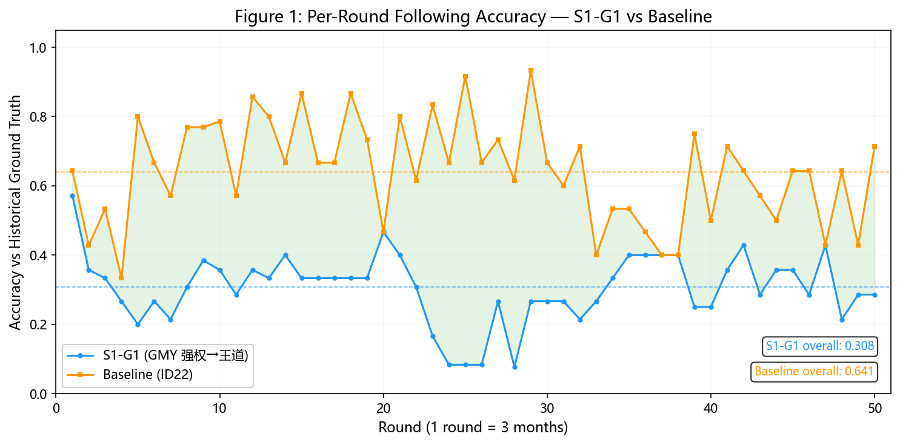

准确率下降的方向指向一个清晰的体系重组模式：德国取代英国成为体系的绝对主导国。在S1-G1中，德国平均每轮获得10.7个国家的追随（最低6，最高11），较基线中的3.4增加了7.3。英国则从基线中的9.1骤降至2.8，降幅达69.2%。在全部50轮中，系统认定的唯一主导领导者始终是德国（agent 1533），其领导者-追随者比率恒定在0.611。基线中，主导领导者47轮为英国（agent 417），仅1轮为俄国（agent 416）。

| 领导者 | S1-G1 均值 | 基线均值 | 变化 | S1-G1 追随者范围 |
|--------|-----------|---------|------|----------------|
| GMY（德国） | **10.7** | 3.4 | **+7.3** | 6–11 |
| UKG（英国） | 2.8 | **9.1** | −6.3 | 1–6 |
| RUS（俄国） | 2.6 | 1.8 | +0.8 | 1–5 |
| FRN（法国） | 1.0 | 1.0 | 0 | 1 |
| AUH（奥匈） | — | 1.0 | — | — |

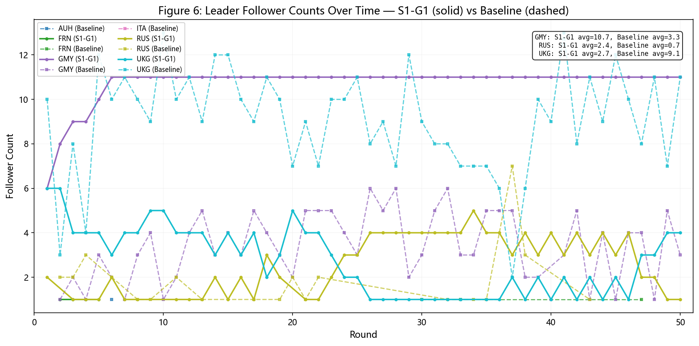

追随的集中化同时伴随着稳定性的提升。S1-G1的HHI标准差从基线的0.141压缩至0.034，降幅75.9%（图5）。阵营转换总次数从198次降至102次，降幅48.5%。保加利亚、奥匈、意大利、瑞典、西班牙、奥斯曼等国的阵营转换次数降至零，在全部50轮中始终追随同一领导者（图7）。追随集中度的均值在S1-G1中为0.527，基线中为0.584，反而略有下降。这说明基线中追随在周期性地高度集中于某一领导者（HHI最高达0.857），而S1-G1中追随在一种持续的中等偏高极化水平上运行：德国的追随者数量稳定在10左右，英国和俄国各维持少量追随者，形成了一个稳定的金字塔形等级结构。

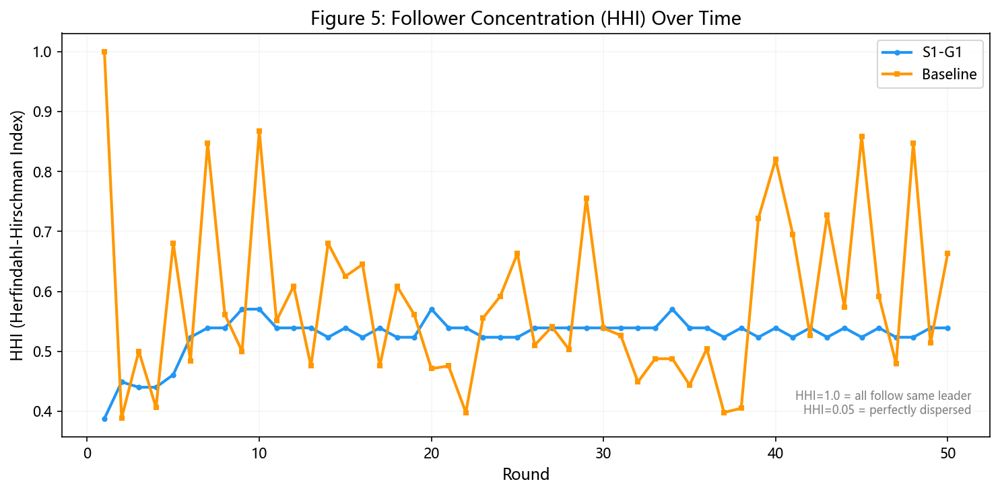

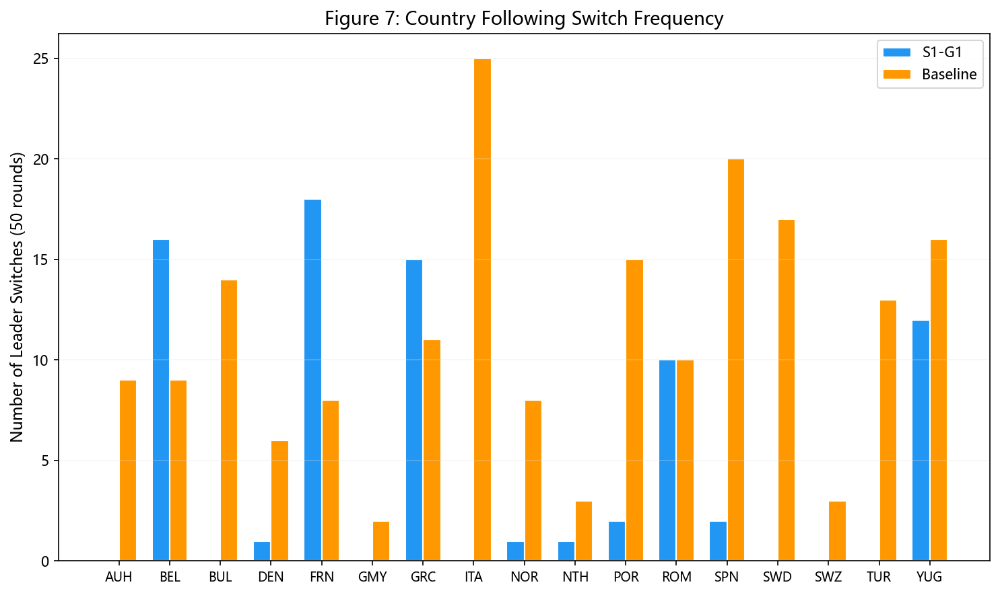

逐国准确率的分析进一步揭示了追随重组的空间逻辑（图2）。准确率改善的四国（保加利亚+0.333、奥匈+0.348、奥斯曼+0.268、希腊+0.187）全部位于欧洲东部或东南部，与德国的历史地缘互动较为间接。准确率崩塌的西欧北欧国家（荷兰−0.880、丹麦−0.860、瑞士−0.860、挪威−0.800、葡萄牙−0.680）在基线中高度追随英国（准确率0.70–0.96），在S1-G1中全部转而追随德国。意大利的准确率从0.543骤降至0.000。它在历史上具有复杂的议题分化追随模式（三国同盟成员但在殖民地议题上追随英国），这一微妙格局在S1-G1中完全消失：意大利在全部50轮中始终追随德国。

| 国家 | S1-G1 准确率 | 基线准确率 | 差值 | 方向 |
|------|-------------|-----------|------|------|
| BUL（保加利亚） | 1.000 | 0.667 | +0.333 | ↑ |
| TUR（奥斯曼帝国） | 0.976 | 0.707 | +0.268 | ↑ |
| AUH（奥匈帝国） | 0.848 | 0.500 | +0.348 | ↑ |
| GRC（希腊） | 0.542 | 0.354 | +0.187 | ↑ |
| ROM（罗马尼亚） | 0.533 | 0.644 | −0.111 | ↓ |
| YUG（塞尔维亚） | 0.400 | 0.540 | −0.140 | ↓ |
| BEL（比利时） | 0.360 | 0.860 | −0.500 | ↓ |
| SWD（瑞典） | 0.000 | 0.200 | −0.200 | ↓ |
| SPN（西班牙） | 0.020 | 0.320 | −0.300 | ↓ |
| ITA（意大利） | 0.000 | 0.543 | −0.543 | ↓ |
| POR（葡萄牙） | 0.020 | 0.700 | −0.680 | ↓ |
| NOR（挪威） | 0.020 | 0.820 | −0.800 | ↓ |
| DEN（丹麦） | 0.040 | 0.900 | −0.860 | ↓ |
| SWZ（瑞士） | 0.000 | 0.860 | −0.860 | ↓ |
| NTH（荷兰） | 0.080 | 0.960 | −0.880 | ↓ |

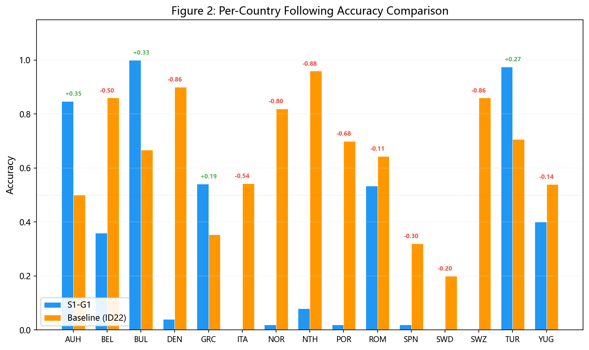

综合来看，H1（自愿性追随假设）未获得支持。王道型德国确实吸引了大量追随，但追随模式是全部追随者无条件指向同一方向，而非理论预期中各国有选择地基于议题认同进行追随。历史准确性的全面崩溃揭示了一个机制：德国在历史上未能获得广泛追随，很可能正是因为其强权行为模式发挥了"斥力效应"（施里芬计划、侵犯比利时中立、无条件军事动员），使得中小国家即便面临德国的国力优势，也不愿向其靠拢。一旦在反事实中移除这种斥力，德国的国力优势和地理中心性使其在糊名决策条件下成为最"理性"的追随对象。

### 3.2 秩序类型的意外转向

体系秩序类型从基线中以恐怖平衡为主导（70%轮次，35轮为无领导者加低主权尊重）逆转为S1-G1中以大棒威慑为主导（90%轮次，45轮为有领导者加低主权尊重）。规范接纳在两个实验中均仅占极低比例（S1-G1 4%，基线 2%）。

| 秩序类型 | S1-G1 | 基线 |
|---------|-------|------|
| 大棒威慑 | 45轮（90%） | 14轮（28%） |
| 恐怖平衡 | 3轮（6%） | 35轮（70%） |
| 规范接纳 | 2轮（4%） | 1轮（2%） |
| 不干涉 | 0轮（0%） | 0轮（0%） |

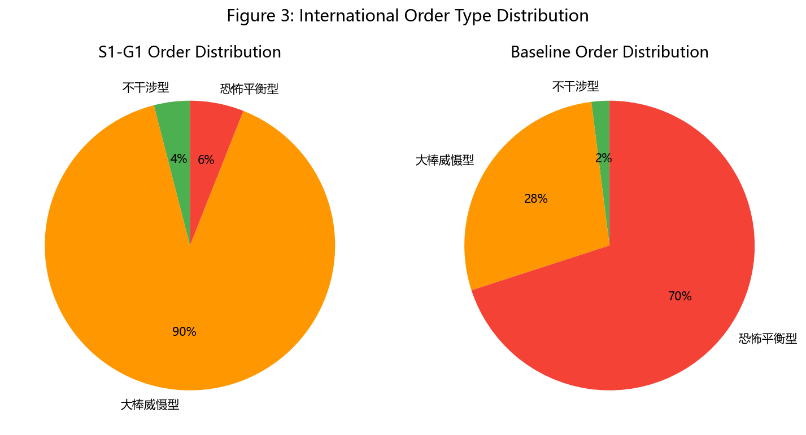

这一结果否证了H3。王道型大国未将体系带向规范接纳象限，反而从无领导的暴力均衡转入了等级制的强制秩序。理解这一转向的机制需要考察德国自身行动模式的转换（图14）。

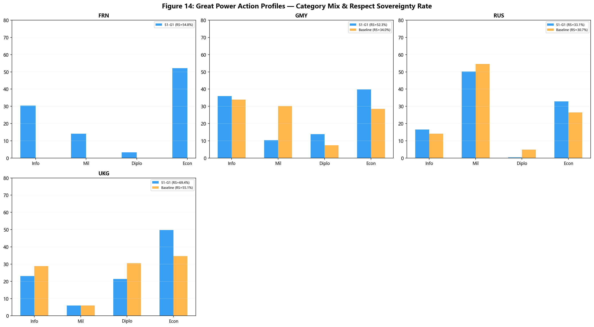

德国从强权型变为王道型后，军事手段在总行动中的占比从30.2%降至10.4%（降幅65.6%），经济手段和信息手段成为主导手段。主权尊重率从34.0%跃升至52.3%（+18.3个百分点）。英国作为不变的王道型大国，军事占比本已较低（6.0%），但主权尊重率也从55.1%升至69.4%（+14.3个百分点）。在竞争压力减小的环境中，其王道型行为的施展空间反而扩大了。俄国的强权型行为特征在两个实验间保持高度一致（军事占比均超过50%，主权尊重率33.1% vs 30.7%），这从侧面验证了单变量实验设计的内部效度。

| 大国 | S1-G1 类型 | S1-G1 军事占比 | S1-G1 RS率 | 基线军事占比 | 基线RS率 |
|------|-----------|--------------|-----------|------------|--------|
| GMY | 王道型（变更） | 10.4% | 52.3% | 30.2% | 34.0% |
| UKG | 王道型（不变） | 6.0% | 69.4% | 6.0% | 55.1% |
| RUS | 强权型（不变） | 50.7% | 33.1% | 54.5% | 30.7% |
| FRN | 霸权型（不变） | 14.2% | 54.8% | — | — |

从行动类别的体系层面演变来看（图13），S1-G1与基线在两个维度上产生了最显著的差异。其一，经济手段在S1-G1后期大幅增长。前5轮均值为52.0次/轮，后5轮升至71.6次/轮（+37.7%）。基线中经济手段反而萎缩（42.8→36.0，−15.9%）。这一差异与王道型德国偏好经济制度工具的行为逻辑一致。GMY自身的经济手段占比从基线的23.4%升至35.6%（+12.2个百分点），体系中的中小国家追随这一模式，形成了经济互依的向下传递效应。其二，信息手段在基线中爆炸式增长（前5轮37.6→后5轮86.2，+129.3%），而在S1-G1中增长受抑（48.6→64.6，+32.9%）。基线中的信息手段爆炸是恐怖平衡的行为特征：高不确定性环境中，国家间需要密集的信号博弈来揣测彼此意图。S1-G1中信息手段的相对克制，反映了一个更可预期的秩序状态。当存在一个明确的体系主导者时，信号博弈的需求大幅降低。

| 行动类别 | S1-G1 前5轮 | S1-G1 后5轮 | 变化 | 基线前5轮 | 基线后5轮 | 变化 |
|---------|-----------|-----------|------|----------|----------|------|
| 经济手段 | 52.0 | 71.6 | **+37.7%** | 42.8 | 36.0 | −15.9% |
| 信息手段 | 48.6 | 64.6 | +32.9% | 37.6 | 86.2 | **+129.3%** |
| 外交手段 | 50.2 | 10.2 | −79.7% | 62.6 | 19.2 | −69.3% |
| 军事手段 | 16.4 | 36.0 | +119.5% | 17.8 | 35.4 | +98.9% |

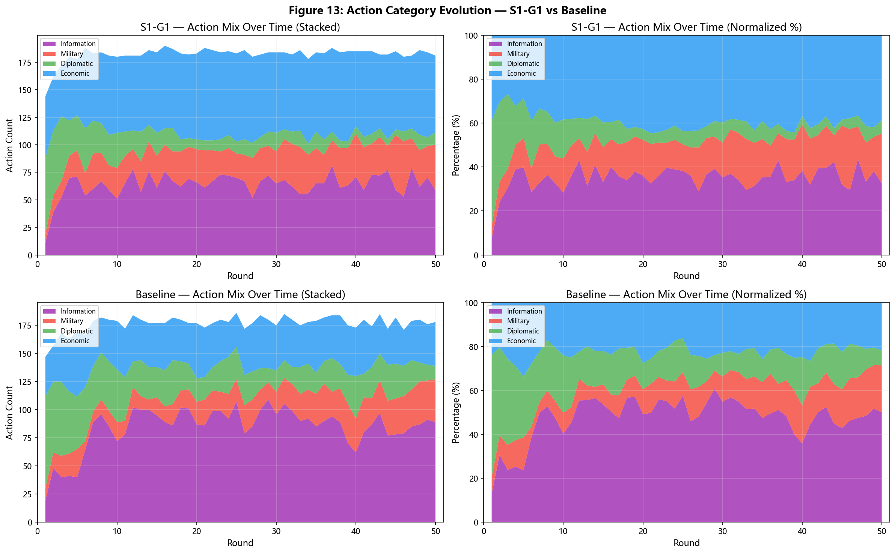

概括而言，H3所预测的"王道型→规范接纳"路径在多极竞争环境中未能实现。王道型德国以经济互依和规范话语替代军事强制来动员追随。但在存在两个强权型竞争对手的环境中，这一新型竞争方式并未降低竞争烈度，只是将其从"所有人打所有人"的分散暴力（恐怖平衡）重组为"所有人围绕一个中心对抗其余"的等级化强制（大棒威慑）。

### 3.3 主权尊重的悖论性提升

主权尊重率从基线的0.361升至0.471（+30.5%），且波动性更低（标准差0.063 vs 基线0.092，−31.5%）。这支持了H4的方向：王道型德国确实带来了更高的主权尊重。

| 统计量 | S1-G1 | 基线 | 差值 |
|--------|-------|------|------|
| 均值 | 0.471 | 0.361 | +0.110 |
| 中位数 | 0.462 | 0.333 | +0.129 |
| 标准差 | 0.063 | 0.092 | −0.029 |
| 最小值 | 0.384 | 0.244 | +0.140 |
| 最大值 | 0.806 | 0.742 | +0.064 |

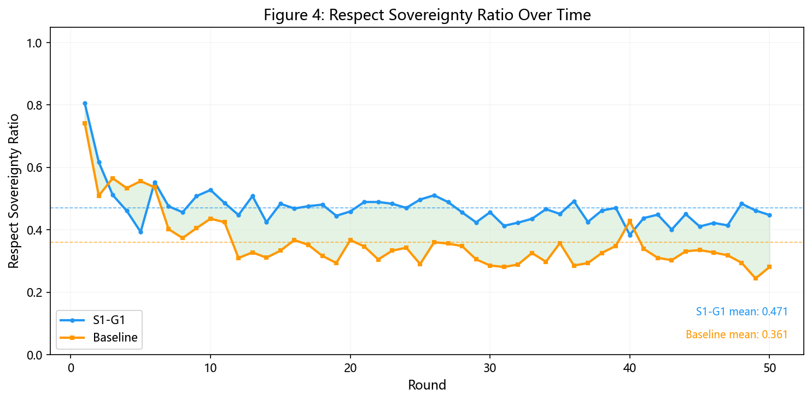

将主权尊重按行动阶段分解为主动行动与被动回应后，一个关键差异浮现出来。S1-G1在两个阶段的尊重率几乎完全对称（46.8% vs 47.0%，差异仅0.2个百分点）。基线中存在1.4个百分点的非对称差（35.1% vs 36.5%），主动侵犯略高于被动回应。对称的尊重率分布意味着"以侵犯回应侵犯"的螺旋升级机制在S1-G1中被有效抑制了。权威的建立减少了双向的试探性侵犯，互动模式从信号博弈转向了规范遵循。但这套规范遵循发生在一个高度集中的领导者-追随者结构之内：主权尊重率的上升与等级制单极化并存。个体行为的规范度提高了，体系的权力分配却变得更为不平等。

| 行动阶段 | S1-G1 行动数 | S1-G1 尊重率 | 基线行动数 | 基线尊重率 |
|---------|------------|------------|----------|---------|
| 主动行动 | 4,550 | 46.8% | 4,474 | 35.1% |
| 被动回应 | 4,552 | 47.0% | 4,353 | 36.5% |
| 主动−回应差异 | — | 0.2pp | — | 1.4pp |

### 3.4 战略目标的分配政治

仿真系统每隔10轮对每个国家进行一次战略目标达成度的综合评估，19个国家在5个评估期（第10、20、30、40、50轮）构成完整的战略表现面板数据（图11）。评估覆盖三个维度：目标达成分数（综合衡量战略目标的实现程度）、权力增长贡献（衡量该国行动对国力增长的影响）和行动有效性（衡量行动手段的效率）。

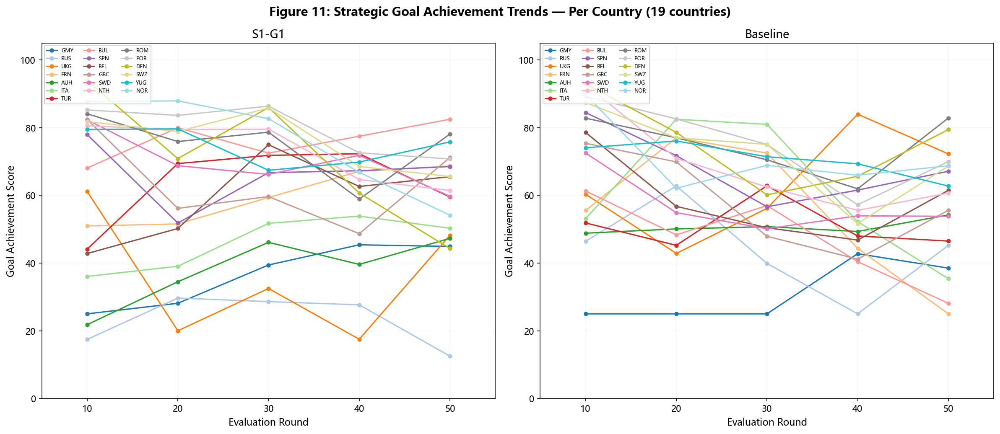

大国层面的比较揭示了一个清晰的分配模式（图12）。英国的战略目标达成度从63.1骤降至35.9（−43.1%），趋势从基线中的持续上升（60→72）逆转为波动下降（61→48）。英国失去了体系中的追随主导地位，其自身的战略有效性也同步崩塌。俄国遭受的损失更为严重。目标达成度从43.9降至23.2（−47.2%），在所有19个国家中排名最末，趋势从稳定（46→45）变为剧烈下降（17→12）。俄国在S1-G1中仍为强权型，其行为模式在两个实验间几乎完全一致，战略表现的一落千丈主要归因于体系环境的变化。在王道型德国主导的新环境中，经济互依和规范话语替代了军事强制成为主要竞争工具，俄国的纯军事行为逻辑不仅无法吸引追随，其自身的战略目标也遭到了系统性挫败。

| 大国 | S1-G1 均值 | 基线均值 | 差值 | S1-G1 趋势（首→末） | 基线趋势（首→末） |
|------|-----------|---------|------|------------------|-----------------|
| UKG（英国） | 35.9 | 63.1 | **−27.2** | 61→48（↓） | 60→72（↑） |
| RUS（俄国） | 23.2 | 43.9 | **−20.7** | 17→12（↓） | 46→45（→） |
| AUH（奥匈） | 37.9 | 50.7 | −12.8 | 22→47（↑） | 49→54（→） |
| GMY（德国） | 36.6 | 31.3 | +5.3 | 25→45（↑） | 25→39（↑） |
| FRN（法国） | 59.5 | 54.9 | +4.6 | 51→69（↑） | 56→25（↓） |

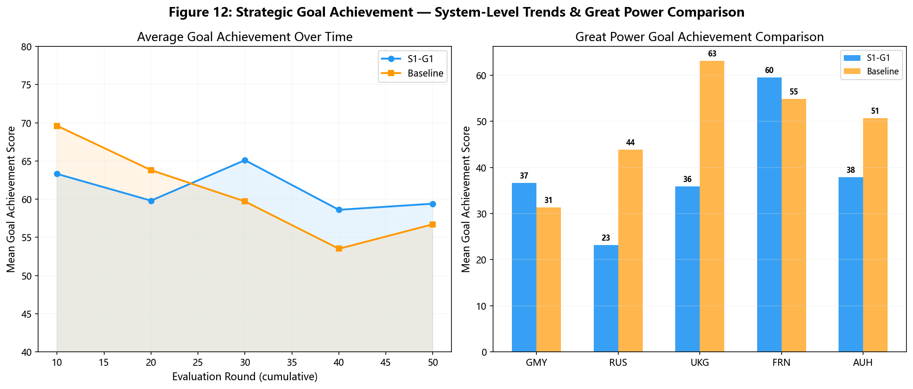

与大国形成对照的是15个可比较的中小国家。其中10个国家的目标达成度较基线有所改善，平均提升约10个百分点。保加利亚从47.0升至76.1（+29.1），奥斯曼帝国从50.9升至63.4（+12.5），奥匈帝国从50.7降至37.9（−12.8，它在地缘上与德国高度毗邻，受制于更强的结构性约束）。这一"中小国家获益、大国受损"的分配模式提示了一个重要的理论机制。王道型领导通过改变竞争规则（从军事强制转向经济和规范竞争），系统性地偏袒了能够快速适应新规则的行为体，同时惩罚了固守旧规则的行为体。

从体系时序来看，S1-G1在前20轮的目标达成度低于基线（第10轮63.3 vs 69.6，第20轮59.8 vs 63.8），但在第30轮后持续反超（第30轮65.1 vs 59.7，第40轮58.6 vs 53.5，第50轮59.4 vs 56.7）。行动有效性也呈现出相同的交叉模式：S1-G1在第30轮后持续高于基线，平均领先3.1个百分点。

| 评估期 | S1-G1 目标均值 | 基线目标均值 | 差值 | S1-G1 行动有效性 | 基线行动有效性 |
|--------|--------------|------------|------|----------------|---------------|
| 第10轮 | 63.3 | 69.6 | −6.3 | 65.1 | 64.1 |
| 第20轮 | 59.8 | 63.8 | −4.0 | 57.4 | 58.4 |
| 第30轮 | 65.1 | 59.7 | +5.4 | 61.9 | 54.9 |
| 第40轮 | 58.6 | 53.5 | +5.1 | 57.9 | 52.7 |
| 第50轮 | 59.4 | 56.7 | +2.7 | 55.2 | 54.6 |

这一后期反超的时间节点（第21至30轮，约对应历史中的1918至1920年）提示王道型体系存在一个适应期。初期因领导者更替、竞争规则改变造成战略迷失。后期随着追随格局的稳定化（德国在第10至20轮间追随者从6增至10并在此后保持稳定），整体战略效率回升并超越基线。

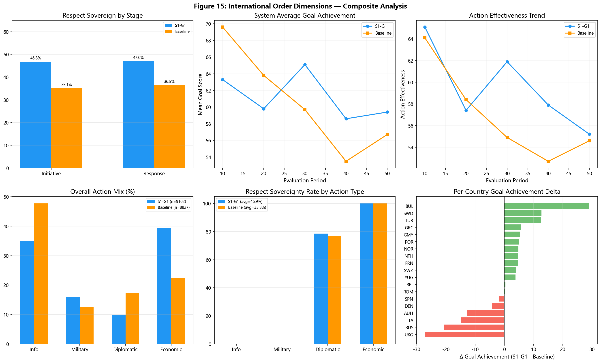

### 3.5 追随格局的可视化

三版追随热力图（图8）从整体上验证了上述定量发现。在S1-G1中，德国（蓝色）在第2轮后即主导了体系中绝大多数国家的追随选择。除英法俄三个大国以外，所有中小国家均形成了一条持续至第50轮的蓝色追随带，几乎不存在中断或回摆。基线中，英国（绿色）在大约一半的轮次中占据主导，但追随分布呈现出明显的碎片化特征：剩余的轮次中无领导者（白色区域）、多国同时被追随（多色混合）、或英国之外的领导者短暂出现。历史地面真值则展示了高度复杂的议题分化追随模式，追随对象随不同议题周期频繁切换。

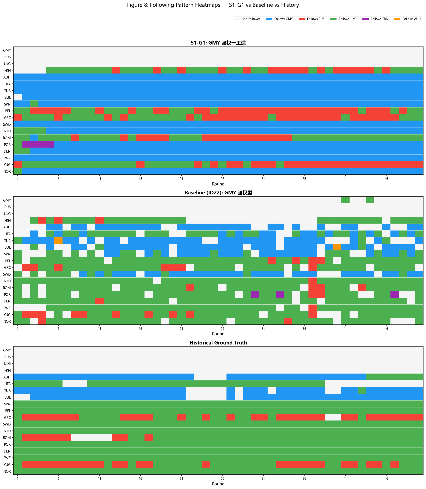

追随偏差热力图（图9）以差值形式呈现了S1-G1相对于基线的系统性偏离。红色区域（基线有追随而S1-G1无）集中于上半部分：西欧和北欧中小国家从基线中的追随英国转为S1-G1中不追随英国。绿色区域（S1-G1有追随而基线无）主要出现在德国及其周边国家，这些国家在S1-G1中获得了新的追随关系。黄色区域（两者相同）大量出现在后期的德国追随者身上，一旦这些国家锁定了德国，就不再改变。

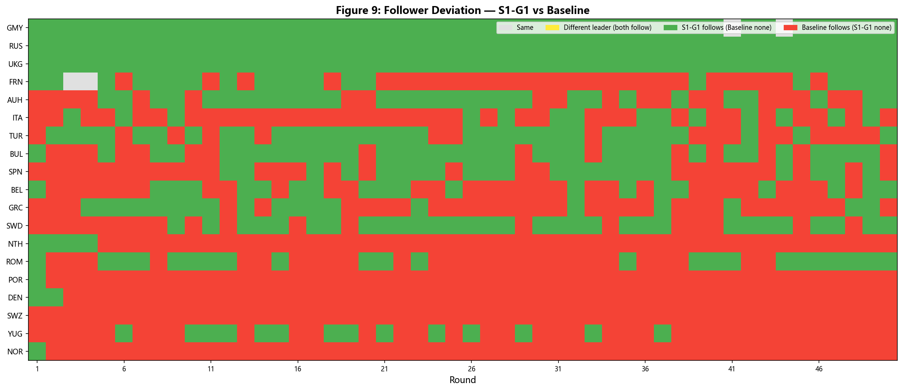

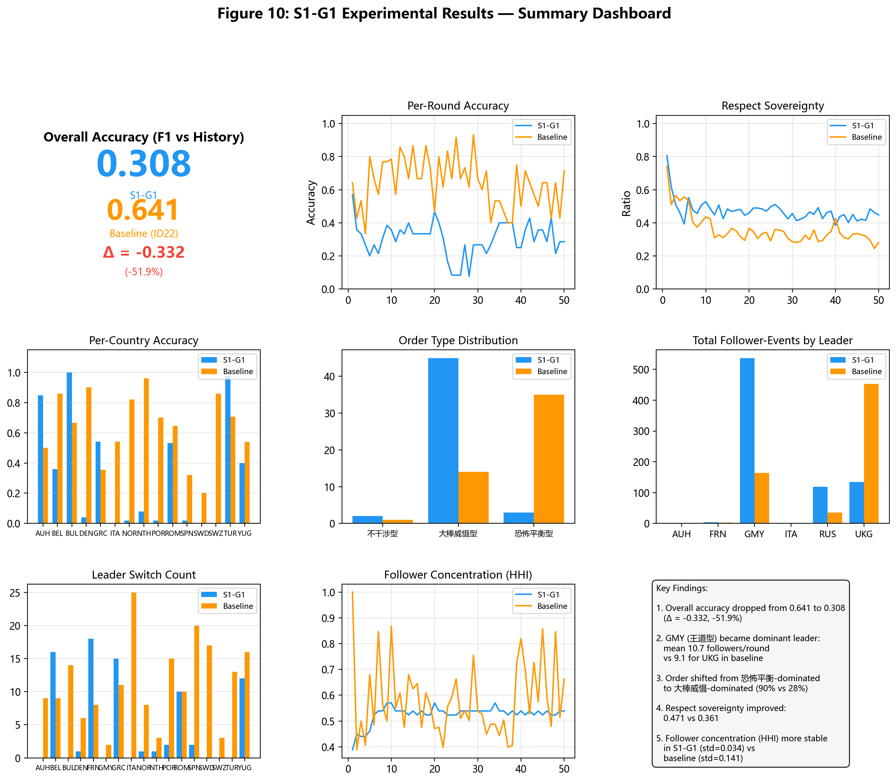

---

## 四、讨论

S1-G1的核心发现可以概括为一个反直觉的判断。在多极竞争环境中，将一个大国从强权型反事实地变更为王道型，所产生的体系效应并非理论预期中的规范秩序扩展，是一种等级制稳定。这一发现对王道型理论的操作化提出了三个层面的限定。

第一，王道型效应的方向可能高度依赖于体系中其他大国的类型分布。在S1-G1的环境中，一个王道型大国被两个强权型大国和一个霸权型大国包围。王道型德国面临的条件并非规范扩散的理想环境。它必须以规范和经济工具为武器进行权力竞争，被迫通过更积极的追随动员来对冲来自强权型俄国的安全威胁。这一动员过程本身就在制造等级制。德国在经济手段上的大幅增长（自身经济手段占比上升12.2个百分点，体系层面经济手段增长37.7%）可以作为这一机制的佐证：经济互依在此并非纯粹的"规范善"，而是带有明确竞争目的的替代性权力工具。如果体系中存在两个或更多王道型大国（例如未来的S1-G1与S1-R1的组间对比），竞争模式可能更接近规范竞赛而非等级制造。这需要通过后续实验来验证。

第二，王道型领导通过改变竞争规则而产生分配政治效应。竞争规则从军事强制转向经济和规范竞争后，适应新规则的行为体获益，固守旧规则的行为体受损。俄国的案例最为突出。它作为强权型大国未改变自身行为模式，但战略表现却一落千丈。在一个以经济互依为竞争工具的新环境中，纯军事行为的战略效率遭到体系性削弱。法国的获益（霸权型，具备双重标准策略的灵活性）和英国的战略崩塌（虽为王道型但失去了追随主导国的位置，其战略地位从唯一的王道型大国降格为两个王道型大国中较弱的一个）进一步印证了这一机制。这种分配效应提示了一个政策含义：倡导王道型规范秩序的大国需要考虑竞争规则转换所引发的权力转移，尤其是来自被惩罚行为体的政治反弹。

第三，糊名机制可能系统性地低估了王道型的身份效应。在糊名条件下，LLM智能体只能依据国力数据和领导类型行为权重进行决策。真实的道义号召力在现实中部分依赖于"谁在做"，即身份信号和声誉机制。如果王道型的追随吸引力部分源自身份可识别性（例如，"德国遵守规范"这一事实本身就具有信号价值），那么糊名条件可能低估了王道型对自愿性追随的吸引。基线中英国作为体系内唯一的王道型大国获得9.1追随者/轮（但秩序类型仍以恐怖平衡为主），S1-G1中德国成为王道型后获得10.7追随者/轮（秩序类型转为大棒威慑）。这两个事实共同指向一个判断：在匿名条件下，王道型的"吸引力"主要源于其行为模式中的低军事化、高经济互依特征（这些特征降低了追随的预期成本，提高了追随的可预期性），而非道义身份本身的感召。这一机制需要在未来的身份透明化对比实验中进一步检验。

### 4.1 比较基准的权衡

关于以历史地面真值为基准还是以前测基线为基准的问题，本报告采纳了双基准并行的策略。与前测基线的差值测量了领导类型变更的边际效应，这是反事实实验的核心问题：X变更导致了什么变化。与历史地面真值的差值则提供了独立于模型的绝对基准。它衡量了仿真产出与已知事实的吻合程度，但不能用于评判反事实情景的内在合理性（因为反事实世界本身就没有可获得的"地面真值"）。两者的信息内容不同，在报告中同时呈现有助于读者从不同维度理解实验结果。

---

## 五、结论

S1-G1实验作为24组正式实验中的首个极性轴检验组，在追随格局、秩序类型、主权尊重和战略分配四个维度上产生了互为印证的系统性证据。德国从强权型变更为王道型后，成为体系的绝对主导国，追随呈现单一中心化格局。秩序类型从恐怖平衡转为大棒威慑，未出现理论预期的规范接纳转向。主权尊重率上升30.5%且达到主动-回应的对称均衡，但伴随等级制单极化。战略收益呈现中小国家获益、大国受损的分配格局，英国和俄国遭受了最严重的战略损失。

这些发现对王道型理论的核心贡献在于：首次通过严格的单变量反事实实验，证明了领导类型的单一变更不仅改变追随格局的量值，更通过行动模式转换和战略收益重分配引发秩序类型的质变。但质变的方向（等级制稳定而非规范接纳）对王道型理论的普适性提出了重要的情境依赖性限定。在多极竞争环境中，单个王道型大国的出现可能不足以实现规范扩散。王道型的体系效应需要结合体系中其他大国的类型分布和竞争结构来理解。

基于S1-G1的发现，后续实验建议按以下优先顺序推进。第一优先为S1-U1（UKG王道→强权，Scene 1），检验极性轴效应的方向对称性：如果王道变强权的效应与强权变王道的效应在方向上对称但符号相反，将为本实验的核心发现提供强有力的交叉验证。第二优先为S2-G1（GMY强权→王道，Scene 2，1938年过渡体系），检验体系结构（多极 vs 过渡）对王道型效应方向的调节作用。第三优先为S3-R1（RUS强权→王道，Scene 3，1946年两极体系），检验大国数量（2 vs 3）对王道型效应强度的调节作用。

---

## 附录

### A. 数据与代码存档

本报告的所有分析数据、生成代码和可视化结果均保存在 `docs/id52/` 目录下：

```
docs/id52/
├── 实验报告_S1-G1_ID52.md
├── figures/
│   ├── fig1_f1_timeseries.png
│   ├── fig2_per_country.png
│   ├── fig3_order_distribution.png
│   ├── fig4_respect_sov_timeseries.png
│   ├── fig5_hhi_timeseries.png
│   ├── fig6_leader_followers.png
│   ├── fig7_country_switches.png
│   ├── fig8_heatmaps_comparison.png
│   ├── fig9_delta_heatmap.png
│   ├── fig10_summary_dashboard.png
│   ├── fig11_goal_achievement_trends.png
│   ├── fig12_goal_power_level.png
│   ├── fig13_action_mix_evolution.png
│   ├── fig14_gp_action_profiles.png
│   └── fig15_order_dimensions.png
├── data/
│   ├── analysis_s1g1_vs_baseline.json
│   └── analysis_extended_s1g1.json
└── code/
    ├── analyze_s1g1.py
    ├── generate_figures.py
    └── generate_extended_figures.py
```

数据来源：`abm_simulation.db`，Project ID 52（S1-G1：950条follower_relation，9,102条action_record，95条strategic_goal_evaluation）与Project ID 22（基线：950条follower_relation，95条strategic_goal_evaluation）。历史地面真值：`data/history/scene1_prewar_1913.json`。

### B. 已知限制

第一，历史地面真值中的action_labels（expected_primary/expected_secondary）由默认查找表程序化生成，未经独立历史校验，本报告未将其纳入评估。仅使用了经过多人文审核的following字段。

第二，本实验每组仅运行了一次仿真，未进行重复实验以量化LLM决策的随机性。正式分析中如需报告统计显著性，建议对关键实验组进行至少3次独立重复。

第三，基于V6版历史标注生成器的数据中，仿真中的"无追随"状态（leader_agent_id=NULL）在历史真值中被排除于追随准确率的计算分母之外。历史标注中的null可能代表追随确实不存在，也可能代表该轮次的追随关系无法可靠标注。

---

*本报告是"基于大语言模型的国际关系多智能体仿真系统"论文的组成部分，用于报告正式实验阶段S1-G1实验组的结果。*
