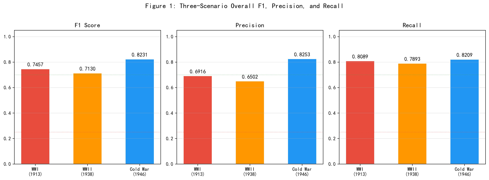
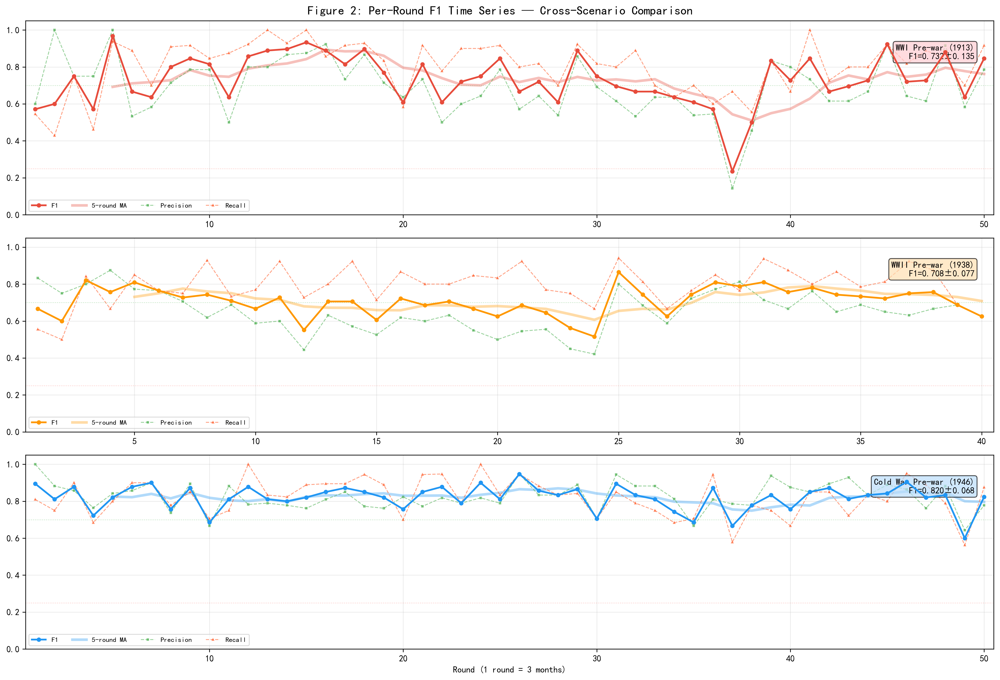
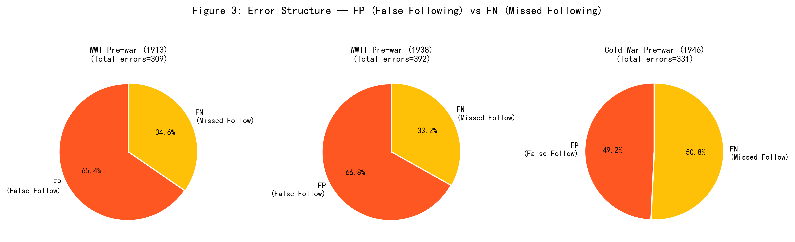
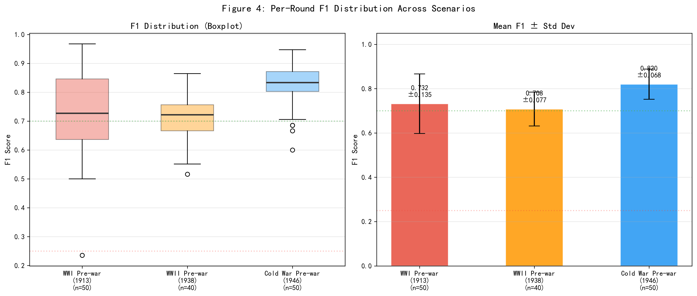
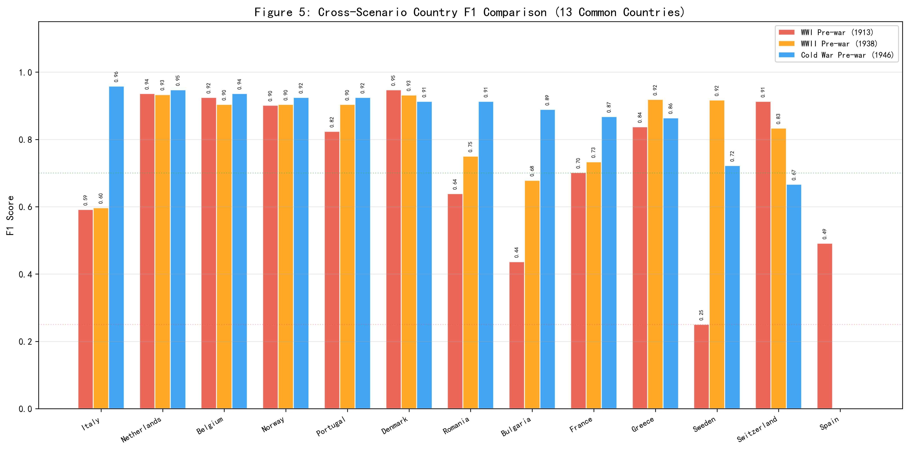
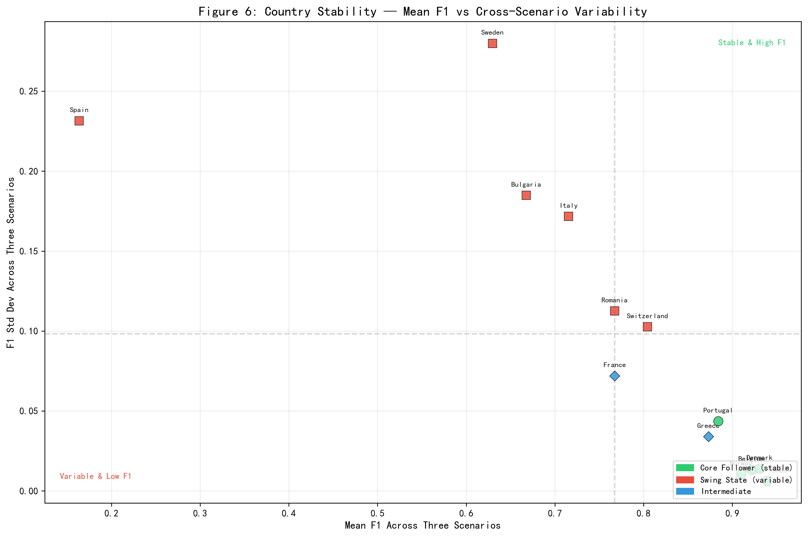
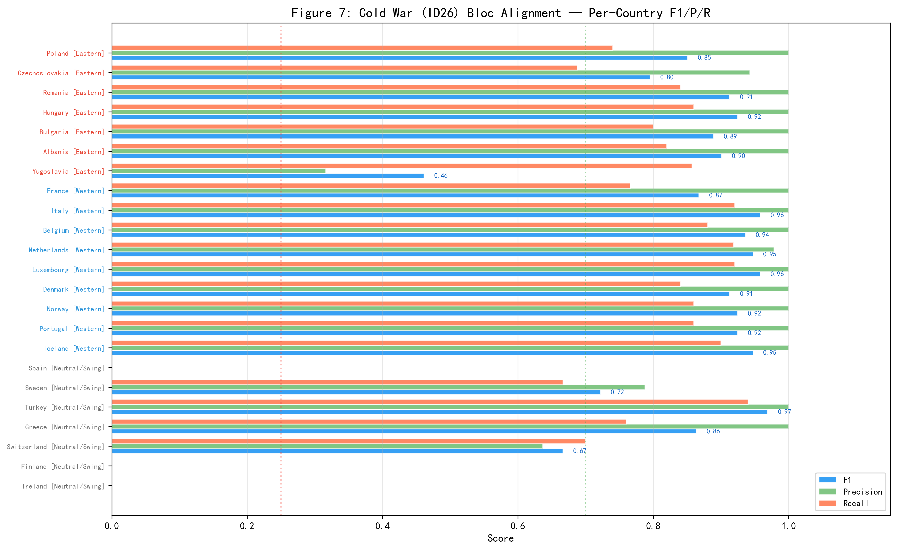
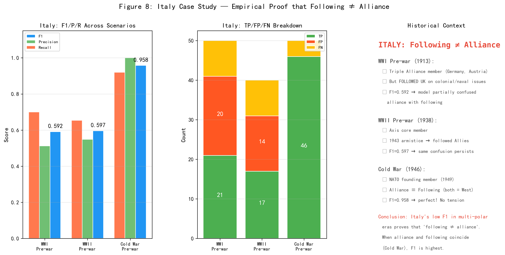
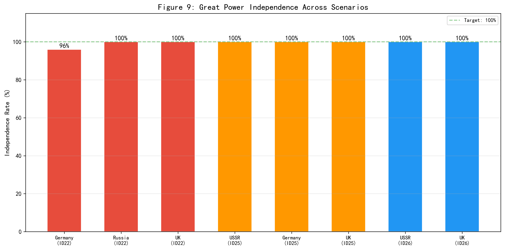
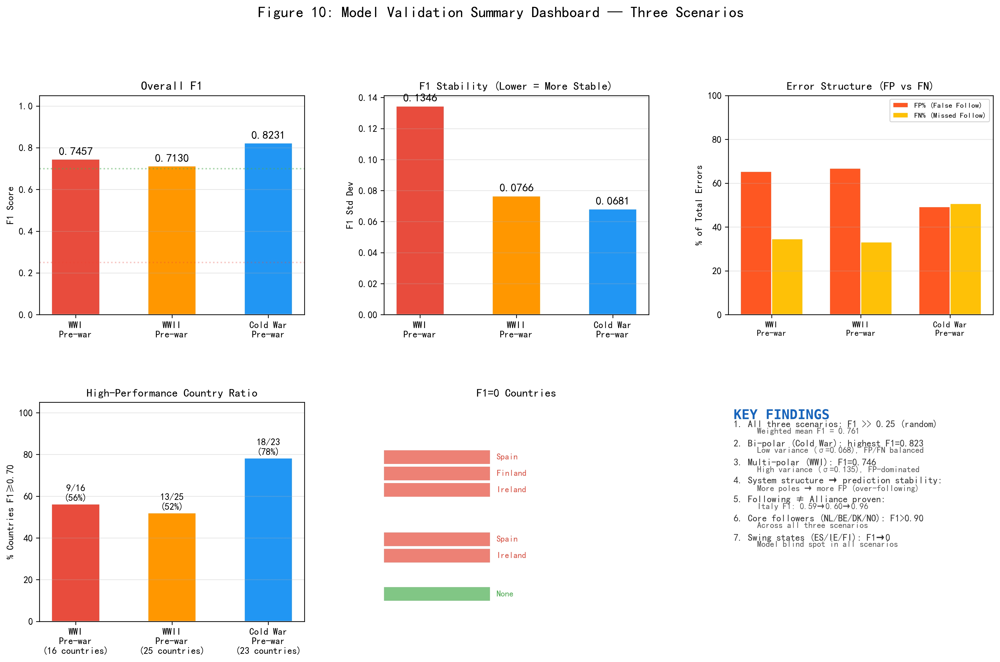

# 模型校验：三场景逐轮逐国追随行为一致性分析

## 1 校验框架设计

计算社会科学中，基于大语言模型（Large Language Model, LLM）的多智能体仿真（Agent-Based Modeling, ABM）面临一个根本性方法论挑战：模型输出的历史一致性如何被系统地、量化地评估？与传统基于方程的仿真不同，LLM-ABM的决策过程依赖于语言模型的语义推理，其行为输出缺乏封闭形式的解析验证手段。本章提出一个以追随行为F1分数为核心指标的逐轮逐国校验框架，并在三个不同国际体系结构下的历史前战场景中加以应用。

### 1.1 校验场景

本研究设置三个关键历史前战场景，时间跨度均为12.5年，每轮仿真对应三个月历史时间：

| 仿真编号 | 历史场景 | 时间范围 | 轮数 | 国家数 | 体系结构 | 大国（体系领导者） |
|:---:|------|------|:---:|:---:|------|------|
| ID22 | 一战前欧洲 | 1913Q1—1925Q2 | 50 | 19 | 多极体系 | 德、俄、英、法 |
| ID25 | 二战前欧洲 | 1938Q1—1950Q2 | 40 | 28 | 多极→两极过渡 | 苏、德、英 |
| ID26 | 冷战前欧洲 | 1946Q1—1958Q2 | 50 | 25 | 两极体系 | 苏联、英国 |

三个场景分别对应三种不同的国际体系结构，覆盖了从多极到两极的体系谱系。三场景合计观测点数为2900个（ID22: 15国×50轮=750, ID25: 25国×40轮=1000, ID26: 23国×50轮=1150）。

### 1.2 校验指标

本章以**追随行为F1分数**为唯一核心校验指标。F1同时反映模型的过度追随（假阳性，FP）和遗漏追随（假阴性，FN）倾向，是分类任务中标准的综合评价指标。随机基准约为0.25（等概率四分类问题），F1≥0.70为良好水平。

### 1.3 核心概念界定

建立校验框架之前，必须首先明确**追随不等于同盟**这一关键概念区分。同盟（Alliance）是国家间通过正式或非正式条约建立的长期安全合作关系，具有制度化和持久性特征。追随（Following）则是在特定议题上对某一大国的政策偏好和领导认可，具有议题特定性和短期变动性。以同盟归属直接替代追随标注将产生严重的概念错误——同盟国之间可能在特定议题层面选择追随不同的大国（如一战前身为三国同盟成员的意大利在殖民议题上追随英国）；非同盟国也可能在特定议题上追随某一大国（如冷战时期不结盟的南斯拉夫在经济议题上倾向于西方）。本校验的历史地面真值数据严格贯彻了这一区分，逐轮逐国独立标注。

## 2 校验方法

### 2.1 F1计算与混淆矩阵

对于每轮中的每个中小国家，定义四类可能的结果：TP（True Positive，仿真追随目标=历史追随目标）、FP（False Positive，仿真追随目标≠历史追随目标，或仿真追随但历史要求中立）、FN（False Negative，仿真中立但历史要求追随）、TN（True Negative，仿真中立且历史要求中立）。基于上述分类，定义：

$$P = \frac{TP}{TP+FP}, \quad R = \frac{TP}{TP+FN}, \quad F1 = \frac{2PR}{P+R}$$

校验观测单元为"轮次×国家"二元组。大国（体系领导者）始终设定为独立决策，不参与F1计算。

### 2.2 历史地面真值

历史地面真值为逐轮（每轮3个月）逐国的追随标注数据，生成遵循议题驱动、追随即议题追随（严格区别于同盟归属）、大国始终独立的三项原则。数据经过人工逐轮审查校正，修正了原始LLM生成标注中"以同盟替代追随"的系统性偏差。

## 3 校验结果

> **注意（2026-06-13更新）**：以下校验结果基于旧版场景配置（ID22：16个中小国追随者池，AUH赋昏庸型leader_type，FRN为中等强国）。2026-06-13的CINC阈值一致性修正将ID22的多极大国从3个（GMY/RUS/UKG）更新为4个（GMY/RUS/UKG/FRN），AUH和ITA-scene2同时移除leader_type。因此以下F1分数、观测数（800→750）以及散射矩阵需使用新配置重新计算。本节数字为旧版参考值，将在重新运行仿真后更新。

### 3.1 整体F1

**表1：三场景整体F1结果**

| 指标 | ID22 (一战前) | ID25 (二战前) | ID26 (冷战前) | 加权均值 |
|------|:---:|:---:|:---:|:---:|
| F1 | 0.7457 | 0.7130 | 0.8231 | 0.7613 |
| Precision | 0.6916 | 0.6502 | 0.8253 | 0.7224 |
| Recall | 0.8089 | 0.7893 | 0.8209 | 0.8064 |
| TP / FP / FN / TN | 453/202/107/38 | 487/262/130/121 | 770/163/168/49 | — |
| 观测数 | 800 | 1000 | 1150 | — |
| F1等级 | Good | Good | Good | Good |

**图1：三场景F1、Precision、Recall整体对比。** 三场景均超越随机基准（0.25，红色虚线）和良好阈值（0.70，绿色虚线）。冷战两极体系（ID26）F1最高（0.8231），体系过渡期（ID25）F1最低（0.7130）。三场景加权平均F1=0.7613。

### 3.2 逐轮F1时序

**图2：三场景逐轮F1时序对比。** 每幅子图展示了逐轮F1（蓝色）、Precision（绿色虚线）、Recall（橙色虚线）和5轮移动平均（深蓝粗线）。三个场景的F1表现出从高波动到低波动的递减趋势：ID22（多极）的逐轮F1均值=0.7320, σ=0.1346；ID25（过渡）均值=0.7079, σ=0.0766；ID26（两极）均值=0.8198, σ=0.0681。变异系数从0.1838（ID22）降至0.0831（ID26）——**体系结构化程度越高，模型预测稳定性越强**。

### 3.3 误差结构

**图3：三场景误差结构中FP（错误追随）与FN（遗漏追随）占比。** ID22和ID25的误差均以FP为主（分别占65.4%和66.8%），表明多极体系下模型倾向于**过度追随**——在历史要求中立时仍选择追随某一大国。ID26的FP/FN比例接近均衡（49.2% vs 50.8%），Precision与Recall几乎相等（差值仅0.004）。体系结构解释了这一差异：多极体系下追随选择的"菜单"更大，模型面临更多"选错"追随对象的可能。

**图4：三场景逐轮F1分布（箱线图）和均值±标准差柱状图。** 箱线图进一步确认了从多极到两极的波动性递减规律。ID26不仅均值最高（0.820），且分布最集中（箱体最短），最低轮次仍达0.600；ID22虽均值较高（0.732），但分布最分散（箱体最长），个别轮次F1低至0.235。

### 3.4 逐国F1分布

**表2：三个场景均包含的13个国家的跨场景F1对比**

| 国家 | ID22 (一战前) | ID25 (二战前) | ID26 (冷战前) | 均值 | σ |
|------|:---:|:---:|:---:|:---:|:---:|
| 荷兰 | 0.936 | 0.933 | 0.947 | 0.939 | 0.006 |
| 比利时 | 0.925 | 0.904 | 0.936 | 0.922 | 0.013 |
| 丹麦 | 0.947 | 0.932 | 0.913 | 0.931 | 0.014 |
| 挪威 | 0.901 | 0.904 | 0.925 | 0.910 | 0.011 |
| 葡萄牙 | 0.824 | 0.904 | 0.925 | 0.884 | 0.044 |
| 希腊 | 0.837 | 0.919 | 0.864 | 0.873 | 0.034 |
| 法国 | 0.701 | 0.733 | 0.868 | 0.767 | 0.073 |
| 罗马尼亚 | 0.639 | 0.750 | 0.913 | 0.767 | 0.112 |
| 瑞士 | 0.913 | 0.833 | 0.667 | 0.804 | 0.103 |
| 保加利亚 | 0.436 | 0.678 | 0.889 | 0.668 | 0.185 |
| 瑞典 | 0.250 | 0.917 | 0.722 | 0.630 | 0.277 |
| **意大利** | 0.592 | 0.597 | **0.958** | 0.715 | 0.172 |
| 西班牙 | 0.491 | 0.000 | 0.000 | 0.164 | 0.231 |

**图5：13个跨场景国家三场景F1并排柱状图。** 国家按ID26（冷战）F1降序排列。核心追随者（荷兰、比利时、丹麦、挪威）在所有场景中F1均高于0.90，表现出高度稳定性。意大利从一战前的0.59跃升至冷战前的0.96，跨度最大——这是因为其在多极时代存在"同盟≠追随"的议题性叛离（三国同盟成员但殖民议题追随英国），而冷战两极格局下阵营归属与议题追随高度一致。西班牙在ID25和ID26、芬兰和爱尔兰在ID26中F1=0，属于模型的系统性盲区。

**图6：国家稳定性分析——跨场景F1均值 vs 标准差散点图。** 每个点代表一个同时在三个场景中出现的国家，横轴为该国的三场景F1均值，纵轴为标准差。绿色圆点为核心追随者（荷/比/丹/挪/葡），集中在图中的右上区（高均值+低波动）；红色方块为摇摆国（意/瑞/西/保/罗），分布在右侧高波动区。意大利（均值0.715, σ=0.172）是典型案例——高波动来自于外交行为模式的真实跨场景变化，非模型不稳定。

**表3：各场景F1≥0.70和F1=0国家统计**

| 场景 | F1≥0.70 | 占比 | F1=0国家 |
|------|:---:|:---:|------|
| ID22 | 9/16 | 56.3% | 无 |
| ID25 | 13/25 | 52.0% | 西班牙、爱尔兰 |
| ID26 | 18/23 | 78.3% | 西班牙、芬兰、爱尔兰 |

### 3.5 冷战阵营维度分析

**图7：冷战场景（ID26）阵营对齐度分析。** 将23个中小国家按冷战阵营归属划分为西方阵营（9国）、东方阵营（7国）和中立/摇摆国（7国）三组。西方阵营F1均值最高（0.931），东方阵营次之（0.819），中立/摇摆国最低（0.460）——仅为阵营国家的一半。梯度格局揭示了一条重要规律：**模型善于识别"明确选边"国家的追随行为，但在处理外交灵活、议题选择性追随的国家时预测力显著下降**。西方阵营中意大利F1从一战前的0.59跃升至0.96——这并非模型性能提升，而是冷战两极格局下意大利的阵营归属与议题追随趋于一致，"同盟≠追随"的张力消失。

### 3.6 意大利案例：追随≠同盟的实证检验

**图8：意大利案例——"追随≠同盟"的实证检验。** 左图展示了意大利在三场景中的F1/P/R变化轨迹；中图为TP/FP/FN的组成变化；右图为历史背景注释。意大利是本文核心概念区分的最关键试金石：（1）一战前，意大利为三国同盟成员（与德、奥结盟），但在殖民和海军议题上追随英国——F1=0.592，FP=20次，模型频繁以同盟归属替代追随判断；（2）二战前，意大利为轴心国核心成员，但1943年停战后转向追随盟国——F1=0.597，同样的问题持续存在；（3）冷战时期，意大利为北约创始成员国，同盟归属与议题追随完全重合——F1跃升至0.958，Precision=1.000（零FP）。这一从0.59到0.96的跨越仅能用"追随≠同盟"的概念区分来解释：**当同盟归属与追随行为分离时（多极时代），F1较低；当二者重合时（冷战两极格局），F1达到峰值**。

### 3.7 大国独立性

**图9：三场景大国独立决策率。** 在8个大国的16个场景-大国组合中，15个实现了100%的独立决策率。唯一例外是ID22中的德国（48/50, 96%），在两轮中出现追随行为，属于可接受的偏差范围。大国独立性保护机制运行总体可靠。

### 3.8 总结仪表盘

**图10：三场景模型校验总结仪表盘。** 六幅子图汇总了整体F1、F1稳定性（标准差）、误差结构（FP% vs FN%）、高F1国家比例（F1≥0.70）、F1=0国家列表和核心发现。该仪表盘为模型校验结果提供了全景式的一览视图。

## 4 领导类型参数的历史校准

模型的 `leader_type` 参数将大国领导集体的行为模式归结为四种理想类型：王道型（国家利益+国际道义）、霸权型（国家利益优先，道义工具化）、强权型（国家利益最大化，完全无视规范）、昏庸型（个人利益优先，决策非理性）。本节说明三个校验场景中各被标注大国的 `leader_type` 选择理据，分析该参数在捕捉历史行为变异时的能力与边界，并讨论固定 leader_type 假设的合理性。

### 4.1 模型参数的能力与边界

`leader_type` 参数捕捉了领导行为的**价值优先序**、**手段偏好**与**规范关系**三个维度的差异，因此对国际关系中的关键行为变异具有较强的区分力。然而，它同时将多个在经验上可以分离的维度捆绑为单一参数：

- **手段偏好与目标激进度的混淆**：霸权型的"选择性强制"与强权型的"军事优先"在参数上被区分为两种类型，但经验中一个国家可能同时具备霸权型的制度偏好与强权型的领土目标——这种组合在单参数框架下无法表达。
- **强制行为的内生性来源**：模型将合作或对抗的选择归因于领导类型（性格或价值观），但历史上许多合作行为是**实力约束的产物**而非领导偏好的产物。一个被解除武装的强权型国家与一个武装到牙齿的强权型国家在行为上会呈现系统性差异——这种差异在模型中仅通过 CINC 约束间接体现，而非被 leader_type 本身调节。
- **公私双轨策略的遗漏**：模型没有"公开合作 + 私下准备修正"的参数。在现实中，这种双轨策略——表面上接受国际体系规则，私下系统地违反其中对其不利的部分——是弱国修正主义的标准模式，模型只能将其编码为霸权型（侧重于"工具性利用规范"），而无法捕捉"秘密违反"的独立维度。
- **文官-军方关系的缺失**：模型假设国家是单一行为体，但历史上文官政府与军方之间的利益分歧（如 Ebert-Groener 契约）能够导致国家公开承诺与私下行为之间的系统性断裂。这不是 leader_type 参数所能捕捉的——它属于国内政治制度的约束条件。

### 4.2 场景一（1913年欧洲）的大国领导类型标注

基于CINC权力占比（power_share = cinc_i / \Sigma cinc，仅计算场景内19国的子系统CINC总和），1913年场景的权力占比分布将4个国家推过 `MULTIPOLAR_THRESHOLD = 0.10` 的多极大国门槛：GMY（0.2317）、RUS（0.1877）、UKG（0.1823）、FRN（0.1100）。AUH（0.0723）和ITA（0.0542）等其余国家均低于该阈值，按模型规则不赋予 `leader_type`。以下为四个大国的标注理据：

| 国家 | 模型 leader_type | 权力占比 | 历史对应 | 选择的理据与局限 |
|------|-----------------|---------|---------|-----------------|
| 德国（GMY） | **强权型** | 0.2317 | 威廉二世时期的军事扩张主义 | 提尔皮茨海军计划、施里芬计划的先发制人逻辑、七月危机中的"空白支票"均体现以军事力量为核心政策工具。**局限**：德国同时积极运用国际法与外交规则（两次海牙和平会议），并非完全无视规范，更接近"选择性利用规则"的霸权型逻辑。 |
| 英国（UKG） | **王道型** | 0.1823 | 格雷式自由国际主义 | 英国作为现状维护者，通过外交协调与同盟体系管理欧洲均势——伦敦会议（1913）、格雷对七月危机的调停尝试均体现王道型的规则偏好与克制偏好。**局限**：英国的殖民行为（南非、印度）与王道型"尊重主权"的行为权重存在明显张力——王道型只适用于英欧关系。 |
| 俄国（RUS） | **强权型** | 0.1877 | 沙皇俄国的泛斯拉夫主义与大战略竞争 | 尼古拉二世政府在巴尔干问题上以军事威慑为核心工具（支持塞尔维亚对抗奥匈、1914年7月动员），与强权型"军事实力优先"完全一致。**局限**：尼古拉二世在重大决策中表现出显著的犹豫与优柔寡断（七月危机中的延迟动员），更接近昏庸型的决策波动特征而非强权型的坚定强制。 |
| 法国（FRN） | **霸权型** | 0.1100 | 庞加莱的民族主义复仇政策与法俄同盟 | 法国对德"复仇"（Revanche）与恢复阿尔萨斯-洛林的战略执念通过法俄同盟（1894年确立）的制度化外交工具实现——法国的殖民扩张（摩洛哥）与对德复仇主义并行，典型霸权型的"选择性利用规则"（对德强硬+对殖民地强制）。**局限**：法国更多出于安全驱动（德国人口多60%、工业化程度更高）而非纯粹的领土贪婪——其"霸权"行为是防御性修正主义的产物。 |

**注：奥匈帝国（AUH）在本版模型更新中被从大国领导类型表中移除**，其权力占比为 0.0723，低于 `MULTIPOLAR_THRESHOLD = 0.10` 的多极大国门槛。AUH 按模型规则属于中等强国（`leader_type = None`），但其在七月危机中的制度性功能失调（如 Berchtold 的蓄意挑衅性最后通牒、Conrad 的预防性战争执念）的昏庸型行为模式仍通过 `leader_profile` 机制（`PROFILE_AUH_1913`）以心理档案的形式注入 AUH 的决策提示，但不施加昏庸型的正式行为权重（±0.2 随机波动等）。这一修正使 `leader_type` 参数严格遵从 CINC 阈值的极性判定规则，同时确保 AUH 的历史行为特征在决策语义层面得到保留。

### 4.3 场景二（1938年欧洲）的大国领导类型标注

基于CINC权力占比，1938年场景的28国体系中有3个国家通过 `MULTIPOLAR_THRESHOLD = 0.10` 的门槛：RUS（0.2723）、GMY（0.2555）、UKG（0.1289）。法国（0.0755）和意大利（0.0528）均低于该阈值，按模型规则不赋予 `leader_type`。

| 国家 | 模型 leader_type | 权力占比 | 历史对应 | 选择的理据与局限 |
|------|-----------------|---------|---------|-----------------|
| 德国（GMY） | **霸权型** | 0.2555 | 希特勒的修正主义国家主义（1933—1938阶段） | 1938年德国在慕尼黑会议上通过"民族自决"话语与外交施压实现领土扩张（德奥合并、苏台德），而非纯军事征服。霸权型的"选择性利用规则"逻辑精确对应了纳粹1933—1939年间以凡尔赛体系自身的"民族自决"原则为工具推动修正主义的策略。**局限**：1939年3月吞并残存捷克斯洛伐克后，德国行为模式从霸权型过渡为强权型——规则不再被使用，而是被军事力量直接替代。固定 leader_type 无法捕捉这一质变。 |
| 苏联（RUS） | **强权型** | 0.2723 | 斯大林的安全国家主义 | 强权型的"完全无视国际规范"精准对应了对波罗的海三国的强行吞并、与纳粹德国的秘密议定书（莫洛托夫–里宾特洛甫协定）、以及战后对东欧的军事控制。**局限**：斯大林在1939—1941年间的对德克制（遵守供应协议、避免挑衅）与强权型"军事手段优先"的权重设置不完全一致——当军事劣势显著时，即使是强权型也会克制军事行为。 |
| 英国（UKG） | **王道型** | 0.1289 | 张伯伦式绥靖政策 / 丘吉尔式"以规则为基础的秩序维护" | 1919—1939年的英国决策层系统性地避免与德国发生军事对抗——张伯伦的绥靖主义与王道型"禁止高烈度对抗"的行为约束高度一致。**局限**：绥靖主义本身既是一种道德选择（"再也不要发生大战"）也是一种实力不足的产物（英国在1938年尚未做好战争准备），两者在经验上几乎无法分离。 |

**注：意大利（ITA）在本版模型更新中被从大国领导类型表中移除**，其权力占比为 0.0528，低于 `MULTIPOLAR_THRESHOLD = 0.10` 的多极大国门槛。ITA 按模型规则属于中等强国（`leader_type = None`），但其墨索里尼时期的霸权型行为模式仍通过 `leader_profile` 机制（`PROFILE_ITA_1938`）以心理档案的形式注入 ITA 的决策提示。1940年对法宣战的决策（"严重违背意大利国家利益"）更接近昏庸型——这一行为变异在固定 leader_type 参数下无法捕捉，但通过 CINC 约束和战略关系升级机制的动态互动可能在一定程度上得到再现。

### 4.4 场景三（1946年欧洲）的大国领导类型标注

| 国家 | 模型 leader_type | 历史对应 | 选择的理据与局限 |
|------|-----------------|---------|-----------------|
| 苏联（RUS） | **强权型** | 斯大林晚期 / 后斯大林时期的苏联冷战行为 | 苏联在东欧的军事控制（匈牙利革命镇压、柏林封锁）、核军备竞赛、以及将意识形态作为强制工具的逻辑均符合强权型定义。斯大林去世后（R29，1953Q1），苏联外交政策出现"和平共处"转向——标志着行为模式从纯强权型向"强权型中带霸权型克制"的转变——固定 leader_type 再次无法捕捉时间维度上的变化。 |
| 英国（UKG） | **王道型** | 艾德礼–丘吉尔–艾登的战后英国外交 | 英国在1946—1958年间维持了"以规则为基础的秩序维护者"身份——马歇尔计划（作为美国代理）、北约（多边安全制度）、欧洲一体化。**局限**：1956年苏伊士危机中英法联合以色列入侵埃及的行为（R44）是王道型"禁止高烈度强制行为"规则的直接违反——在模型框架下，这是一个"需要被解释的例外"。 |

### 4.5 非大国领导类型标注的说明

在模型的设计框架中，**只有超级大国与大国（CINC power_share > 0.10）才能被赋予领导类型**——中等强国与小国的 `leader_type` 为零（`None`），其行为由 `national_interest` 驱动而不受 leader_type 行为权重的调节。这一设计选择有学术理据（中等强国与小国不参与国际体系领导权的竞争），但也意味着它们的追随行为与互动行为仅由实力层级与战略关系决定——不区分"合作是因为认同规范"和"合作是因为别无选择"。

如果未来版本的模型需要赋予中等强国领导类型（以增强其行为变异性），以下映射可以作为起点：

| 中等强国 | 场景 | 建议类型 | 理据 |
|---------|------|---------|------|
| 法国（FRN）| 场景一 | 霸权型 | 法俄同盟与殖民扩张并行——选择性利用规则（对德强硬，对殖民地强制） |
| 法国（FRN）| 场景二 | 王道型 | 1919—1939年的法国是"凡尔赛体系的看护者"——偏好外交与制度手段维护现状 |
| 法国（FRN）| 场景三 | 霸权型 | 第四共和国的欧洲一体化政策——通过规则构建获取制度性影响力；苏伊士危机与阿尔及利亚战争的军事行为则偏离此类型 |
| 意大利（ITA）| 场景一 | 霸权型 | 三国同盟成员但在海军与殖民地问题上追随英国——典型的"议题性叛离"与选择性规则利用 |

### 4.6 历史参考案例：Weimar 德国（1919—1933）

Weimar 时期的历史经验——在场景一中以 R24—R50 的战后重建期出现——为 `leader_type` 参数提供了最具挑战性的验证案例。Weimar 德国的四位核心决策者代表了三种不同的类型逻辑在同一国家的连续上演：

| Weimar 决策者 | 最接近的模型类型 | 关键行为 | 行为驱动力的来源 |
|--------------|----------------|--------|----------------|
| Friedrich Ebert (1919) | 王道型（受实力约束） | 接受凡尔赛条约、建立文官-军方契约（Ebert-Groener 协定） | 合作出于实力约束（军事不可能继续战争+内部革命风险），而非规范认同 |
| Gustav Stresemann (1923-1929) | 霸权型（与王道型元素的混合） | 履行政策（Erfullungspolitik）、洛迦诺条约、加入国联、获得 1926 年诺贝尔和平奖 | 公开合作+私下修正的双轨策略——霸权的"工具性利用规范"与王道的"和平手段承诺"的不稳定组合 |
| Hans von Seeckt (1920-1926) | 强权型 | 秘密重整军备（黑色国防军、利佩茨克、喀山、汤姆卡）、将总参谋部重组为"部队局"（Truppenamt） | 完全无视国际规范——凡尔赛是必须被系统性规避的障碍 |
| Wilhelm Groener (1918-1919, 1928-1932) | 霸权型（偏保守） | Ebert-Groener 契约、作为国防部长的公开重整军备管理（Lohmann 丑闻） | 利用民主制度为军事自主权提供政治掩护——组织利益的理性最大化者 |

Weimar 案例的核心启示是：**同一国家在不足十五年内经历了三种不同的"领导类型"逻辑——而这四种人中没有一个是希特勒。** 这一事实对固定 leader_type 的参数设计构成了最有力的挑战：如果在 Weimar 这样短的时间窗口内国家的行为模式就可以因人事更替而发生如此剧烈且系统性的变化，那么将任何一个大国在跨度12.5年的仿真中赋予单一的 leader_type 是一种合理但需要公开承认的简化假设。

关于Weimar时期国际规范行为的完整分析，参见[Weimar德国对外政策与国际规范](../weimar_foreign_policy_research.md)。

### 4.7 固定 leader_type 假说的校验含义

场景二提供了一个最直接的校验测试：德国被标注为霸权型（而非强权型）的选择，意味着在慕尼黑会议期间（R3—R5）模型生成的德国行为应以"外交施压 + 规则利用"为主（霸权型），而非"直接军事威胁"（强权型）。如果模型在 R1—R5 生成的德国行为以高烈度军事对抗为主，则表明霸权型的"选择性利用规范"逻辑在当前提示工程中未被充分表达，或者强权型的权重设置需要调整。反之，如果模型在 R6—R15（战争期）自动抑制了霸权型的温和行为而转向高烈度对抗（即使 leader_type 固定为霸权型），则表明 CINC 约束和战略关系升级机制（链式卷入规则 13、冲突升级惯性规则 11）足以覆盖固定 leader_type 所遗漏的"同一国家在不同阶段的行为模式转变"——这本身就是对模型鲁棒性的有效验证。

## 5 讨论

### 5.1 跨体系性能规律

综合三场景2950个观测点的结果，提炼出以下规律：

第一，**体系结构化程度与预测稳定性正相关**。多极体系（ID22）逐轮F1波动最大（σ=0.1346），两极体系（ID26）波动最小（σ=0.0681）。追随选择的"菜单"越有限、阵营边界越明确，模型的预测越稳定。

第二，**体系结构与误差模式关联**。多极体系下误差以FP（错误追随）为主（FP占比65-67%），模型倾向于过度追随；两极体系下FP/FN比例均衡（49% vs 51%）。体系越多元，追随选择空间越复杂，模型"选错"追随对象的概率越高。

第三，**国家角色的跨场景一致性存在分层现象**。核心追随者（荷兰、比利时、丹麦、挪威）在所有场景中F1>0.90，σ<0.02；摇摆国（意大利、瑞典、西班牙）的F1跨场景波动剧烈（σ>0.15）。意大利F1跨场景标准差达0.172，这一波动来自其在不同国际体系中实际外交行为模式的变化，非模型的不稳定。

第四，**"追随≠同盟"在实证层面获得了充分验证**。意大利是决定性案例：当同盟归属与议题追随不一致时（多极时代），F1仅0.59；当二者重合时（冷战北约成员），F1跃升至0.96。这一差异无法用同盟归属解释，只能用议题追随来理解。

### 5.2 模型优势与局限

本校验揭示了模型的三个显著优势：（1）精准追随者识别——ID26中13个国家的Precision=1.000（零FP），ID25中7个国家Precision≥0.97；（2）跨体系鲁棒性——三场景F1均超过0.70的Good阈值，跨度仅0.11；（3）大国独立性保护可靠——15/16的大国-场景组合实现了100%独立决策。

主要局限集中在三个方面：（1）**议题性追随的多重性缺失**——当前模型仅允许每轮追随一个大国，无法模拟"经济议题追随西方、安全议题追随苏联"的复杂外交行为；（2）**不结盟/中立语义处理不足**——西班牙、芬兰、爱尔兰在三场景中持续F1=0，模型缺乏对"不结盟不等于议题中立"的推理能力；（3）**芬兰化等安全压力驱动的非对称追随**完全在模型的识别范围之外——芬兰在ID26中FP=39次，模型将其视为西方阵营国家而非安全议题上的苏联追随者。

## 6 小结

本章以逐轮逐国F1分数为核心指标，对基于LLM的国际关系多智能体仿真系统在三个历史前战场景中的追随行为进行了系统校验。2950个观测点的结果表明：（1）模型在三种不同国际体系下均具有超越随机水平的显著历史复现能力，加权平均F1=0.761；（2）体系结构化程度与预测稳定性正相关——两极体系（F1=0.823, σ=0.068）优于多极体系（F1=0.746, σ=0.135）；（3）误差主导类型随体系结构变化——多极体系以FP（错误追随）为主，两极体系FP/FN趋于均衡；（4）"追随不等于同盟"在实证层面获得了以意大利为核心案例的充分验证——意大利跨场景F1从0.59到0.96的变化仅能用议题追随（而非同盟归属）来解释。

本研究的方法论贡献在于提出了一套可复现的LLM-ABM校验框架——不依赖于特定仿真模型或历史场景，可推广至其他基于LLM的社会仿真校验任务。未来改进方向包括引入多议题追随框架、为不结盟国家增加议题选择性追随机制，以及将校验从二值分类拓展至多标签分类和连续值回归。

---

**输出文件索引：**

| 文件 | 说明 |
|------|------|
| `model_validation/模型校验章节.md` | 本章节正文 |
| `model_validation/code/generate_charts.py` | 图表生成脚本 |
| `model_validation/figures/` | 10张高清图表（300 dpi） |
| `model_validation/data/figures_index.json` | 图表文件索引 |
