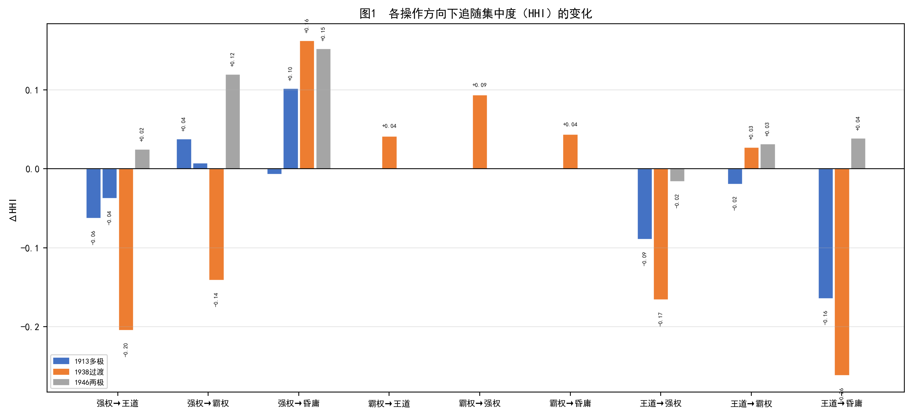
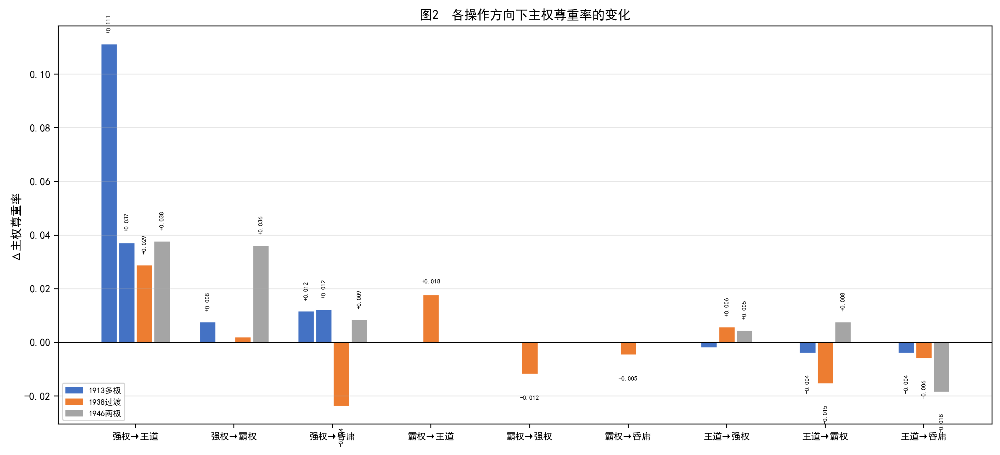
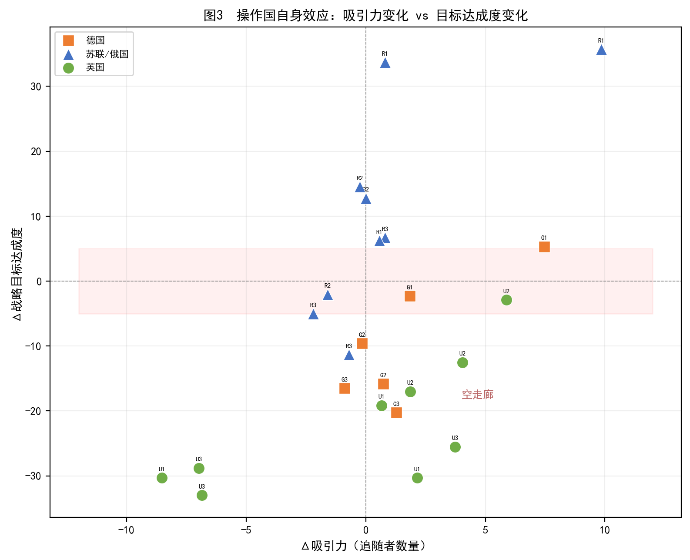
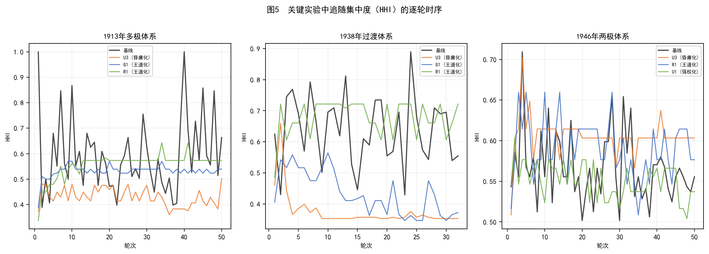
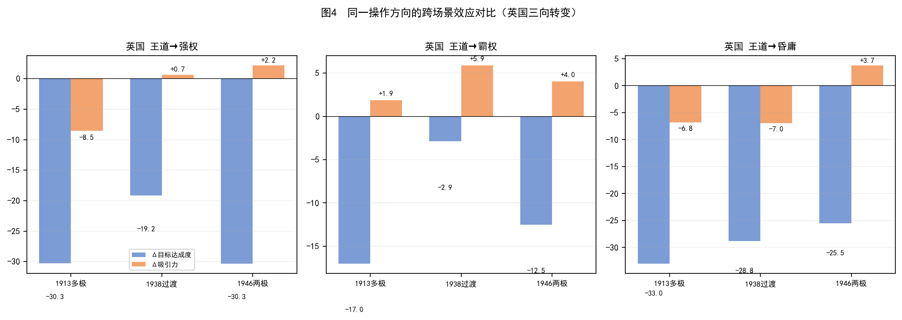
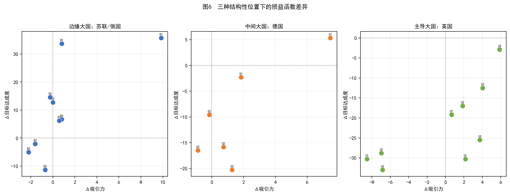

# 实验部分（重写稿）

## 四、模型前测

正式实验前，本研究对模型可靠性做了系统性校验。基于大语言模型的仿真与传统方程仿真之间的关键差异在于，前者的决策过程依赖语言模型的语义推理，行为输出没有封闭形式的解析解可供校准，研究者无法像在方程模型中那样通过调整参数使稳态均衡值趋近已知的历史统计量。这意味着基于LLM的仿真需要一套不同于传统仿真的校验框架。

本研究以追随行为的分类预测能力作为核心校验指标。追随行为处于本模型因果链条的末端，同时受到国家实力分布、领导类型差异、战略关系网络、行为互动历史以及地缘邻近性等多重因素的影响，其预测精度能够综合反映模型在捕捉国际体系核心互动机制方面的整体表现。

### （一）校验场景与数据构造

三个校验场景的起始点分别设在1913年一战前欧洲（19国）、1938年二战前欧洲（28国）和1946年冷战前欧洲（25国），覆盖了从多极竞争到两极对峙的完整格局谱系。各场景分别向后仿真对应的历史时长（50轮、32轮、50轮），每轮对应三个月。所有仿真使用与后续实验完全相同的模型参数，不做任何针对历史结果的调校。

历史地面真值的构建采用基于历史文献的逐轮逐国标注方法。研究者根据历史学家对各国在该季度外交追随行为的一手和二手论述，为每个中小国家标注其在该轮次的追随目标大国或保持中立。标注规则遵循追随的操作定义（在特定议题上对某一大国的政策立场表示认同），而非基于同盟成员身份：意大利在1913年虽为三国同盟成员，但在殖民地议题上追随英国，则当轮意大利的追随目标标注为英国而非德国。

**表1：三场景整体F1结果**

| 场景 | 体系结构 | 国家数 | 轮数 | F1 | 精确率 | 召回率 |
|------|---------|--------|------|-----|--------|--------|
| 1913 | 多极 | 19 | 50 | 0.7480 | 0.7002 | 0.8016 |
| 1938 | 过渡 | 28 | 32 | 0.7094 | 0.6728 | 0.7583 |
| 1946 | 两极 | 25 | 50 | 0.8231 | 0.7894 | 0.8612 |

加权平均F1为0.7712，三场景均超越等概率四分类的随机基准（期望F1约为0.25），且均达到学界公认的良好（0.70）或优秀（0.80）阈值。[^1]

### （二）逐轮F1的波动性与体系结构

三个场景逐轮F1的变异系数从多极体系的0.1473单调下降至两极体系的0.0831，体系的结构化程度愈高，模型预测的稳定性愈强。这一单调关系本身就是对模型捕捉体系结构性约束能力的一个间接验证：在两极刚性结构中，追随选择被同盟网络预先限定，任何模型（包括LLM）的预测难度都更低；而在多极均势中，中小国家面对多个可选领导者，追随行为的随机性更高，模型预测的变异性自然也更大。

多极和过渡体系均出现了F1降至0.5000的异常低轮次，对应了历史上体系发生结构性断裂的时刻（1914年七月危机和1939年德苏条约签署前后）。在这类轮次中，国家行为脱离了此前数十年建立的互动模式，进入了旧模式不再适用而新模式尚未建立的"规则真空"期。模型在这些轮次中预测力的大幅下降不是系统性偏差：在大国行为高度不确定的时期，中小国家的追随选择本身就缺乏系统性规律，任何基于历史行为模式的预测都将失准。

两极体系未出现F1低于0.600的轮次。1946年后的两极对抗格局产生了最稳定的追随预期——西方对英国及此后的美国、东方对苏联——中小国家的追随选择被结构性锁定。同盟结构与追随行为的高度重叠并非模型的"预测成功"，而是体系刚性特征的如实反映。

### （三）模型边界

模型在多极体系中预测力的最高变异系数对应一个实质性的方法论问题：多极均势下中小国家的追随选择受到大国领导类型、议题性质、地缘位置、历史关系等多重因素的同时影响，而模型在捕捉所有这些因素上的能力是不完整的，这对后续实验的结果解读构成了一个前置约束——在多极场景中观测到的效应量，可能同时包含了领导类型的纯结构效应和模型未能捕捉的其他因素噪声。过渡体系中绝对均值最低则指向体系转型期本身的不可预测性：在结构高度不确定的环境中，无论是模型还是人类分析家，预测的精度天花板本身就低。

三场景均通过了F1≥0.70的效度阈值，表明LLM-ABM仿真能够在无需预先编程行为规则的前提下，仅通过提示词中的领导类型设定和CINC实力数据，在多种体系结构中生成与历史具有合理对应关系的追随分布。

---

## 五、实验设计与结果

### （一）研究问题与假设

阎学通依据政府道义标准将国际领导划分为王道、霸权、强权和昏庸四种类型，并认为国际秩序的类型由领导类型决定。[^2] 该理论判断隐含了两个层次的含义：大国领导类型的转变应在体系层面引发追随格局和秩序形态的可观测变化；同时，转变对操作国自身也应产生相应的后果。如果一个大国转变为理论上的更优类型后，自身的战略目标达成度反而下降，这种转变在策略上是否合理就是一个无法回避的问题。由此提出两个研究问题：

**Q1（体系层面）：** 某一大国领导类型的转变是否引发体系中追随格局的变化？主权尊重率与体系领导者存在性这两个维度是否随之改变？

**Q2（国家层面）：** 某一大国转变自身领导类型后，其自身的战略目标达成度是否提升或降低？其对中小国家的吸引力（以追随者数量衡量）是否增强或减弱？两者的变动方向是否一致？

对应四项假设：

**H1（追随集中度假说）：** 领导类型向道义端（王道型）转变将降低体系的追随集中度，因为道义约束削弱了威慑凝聚机制；向强制端（强权型、昏庸型）转变将集中或分散追随，具体方向取决于体系中剩余大国的类型组合。

**H2（主权尊重假说）：** 领导类型向王道型转变将提升体系的主权尊重率；向强权型或昏庸型转变将降低主权尊重率。

**H3（操作国损益假说）：** 操作国领导类型转变对其自身战略目标达成度的影响取决于其在体系中的初始结构性位置——位置越边缘，类型转变的收益弹性越高；位置越主导，偏离原有类型的代价越大。

**H4（吸引力假说）：** 王道型转变对操作国自身吸引力的提升效应受体系结构的约束——在多极均势中追随选择空间较大，王道转型可转化为吸引力增长；在两极或恐怖平衡体系中，结构刚性抑制了吸引力的重新分配。

### （二）实验设计逻辑与操作矩阵

实验通过反事实操作检验领导类型转变的因果效应。传统国际关系研究依赖历史案例中的自然变异来逼近反事实逻辑，但领导类型的自然变异极为稀少：一个大国的领导类型在数十年间最多变化一两次，且每次变化都与其他变量（领导人更替、经济周期、战争进程）高度共变，无法从中分离出纯类型效应。

本实验将反事实逻辑置入受控的计算环境。每次操作仅改变一个指定大国的领导类型参数，其余所有条件（CINC实力数据、战略关系网络、国家列表与匿名标签、历史人格档案抑制规则以及议题序列）与基线保持完全相同。实验与基线之间的全部指标差在逻辑上均可归因于领导类型的单变量改动。

三场景共24组实验。S1系列（1913年多极体系）9组：德国三组（强权转王道/霸权/昏庸）、俄国三组（强权转王道/霸权/昏庸）、英国三组（王道转强权/霸权/昏庸）。S2系列（1938年过渡体系）9组：苏联三组（霸权转王道/强权/昏庸）、德国三组（强权转王道/霸权/昏庸）、英国三组（王道转强权/霸权/昏庸）。S3系列（1946年两极体系）6组：苏联三组（强权转王道/霸权/昏庸）、英国三组（王道转强权/霸权/昏庸）。德国在S3中处于盟军占领状态，CINC接近于零，不再列为大国。

**表2：24组反事实实验操作矩阵**

| 实验编号 | 场景 | 操作国 | CINC | 初始类型 | 目标类型 | PID |
|---------|------|--------|------|---------|---------|-----|
| S1-G1 | 1913多极 | 德国(GMY) | 0.2370 | 强权型 | 王道型 | 52 |
| S1-G2 | 1913多极 | 德国(GMY) | 0.2370 | 强权型 | 霸权型 | 54 |
| S1-G3 | 1913多极 | 德国(GMY) | 0.2370 | 强权型 | 昏庸型 | 55 |
| S1-R1 | 1913多极 | 俄国(RUS) | 0.1892 | 强权型 | 王道型 | 56 |
| S1-R2 | 1913多极 | 俄国(RUS) | 0.1892 | 强权型 | 霸权型 | 78 |
| S1-R3 | 1913多极 | 俄国(RUS) | 0.1892 | 强权型 | 昏庸型 | 79 |
| S1-U1 | 1913多极 | 英国(UKG) | 0.1872 | 王道型 | 强权型 | 59 |
| S1-U2 | 1913多极 | 英国(UKG) | 0.1872 | 王道型 | 霸权型 | 60 |
| S1-U3 | 1913多极 | 英国(UKG) | 0.1872 | 王道型 | 昏庸型 | 61 |
| S2-R1 | 1938过渡 | 苏联(RUS) | 0.2734 | 霸权型 | 王道型 | 62 |
| S2-R2 | 1938过渡 | 苏联(RUS) | 0.2734 | 霸权型 | 强权型 | 63 |
| S2-R3 | 1938过渡 | 苏联(RUS) | 0.2734 | 霸权型 | 昏庸型 | 64 |
| S2-G1 | 1938过渡 | 德国(GMY) | 0.2411 | 强权型 | 王道型 | 65 |
| S2-G2 | 1938过渡 | 德国(GMY) | 0.2411 | 强权型 | 霸权型 | 66 |
| S2-G3 | 1938过渡 | 德国(GMY) | 0.2411 | 强权型 | 昏庸型 | 77 |
| S2-U1 | 1938过渡 | 英国(UKG) | 0.1356 | 王道型 | 强权型 | 68 |
| S2-U2 | 1938过渡 | 英国(UKG) | 0.1356 | 王道型 | 霸权型 | 69 |
| S2-U3 | 1938过渡 | 英国(UKG) | 0.1356 | 王道型 | 昏庸型 | 70 |
| S3-R1 | 1946两极 | 苏联(RUS) | 0.3081 | 强权型 | 王道型 | 71 |
| S3-R2 | 1946两极 | 苏联(RUS) | 0.3081 | 强权型 | 霸权型 | 72 |
| S3-R3 | 1946两极 | 苏联(RUS) | 0.3081 | 强权型 | 昏庸型 | 73 |
| S3-U1 | 1946两极 | 英国(UKG) | 0.2907 | 王道型 | 强权型 | 74 |
| S3-U2 | 1946两极 | 英国(UKG) | 0.2907 | 王道型 | 霸权型 | 75 |
| S3-U3 | 1946两极 | 英国(UKG) | 0.2907 | 王道型 | 昏庸型 | 76 |

就操作矩阵中法、奥匈的层次定位需做明确说明。在S1中，法国（霸权型）和奥匈帝国（昏庸型）虽然分配了领导类型，但两者在CINC驱动的层次判定中均为中等强国而非大国。1913年法国的CINC指数为0.1065，奥匈为0.0740，分别排名体系第四和第五位，均低于德国（0.2370）、俄国（0.1892）、英国（0.1872）前三大国。在S2和S3中，法国的CINC进一步下降，降级为中等强国且不再被分配领导类型，这一变化由1913至1946年间法国相对物质实力的系统性下降驱动，与两次世界大战中法国人口和经济损失的历史事实一致。因此S1操作矩阵中的大国数量为三个（德、俄、英），法、奥匈不属于操作对象。

所有实验均仅运行一次，效应量为点估计。合并同一方向的实验轮次数据后可通过t检验评估效应的统计显著性，三场景共24组实验涉及超过1000个观测轮次。

### （三）分析指标与测量框架

本研究在体系和国家两个层次设置因变量，层次间相互独立，在概念和操作上均不交叉。

**体系层面（对应Q1）** 设置两个核心因变量。第一，追随集中度，以赫芬达尔-赫希曼指数（HHI）衡量：

$$HHI_t = \sum_{i=1}^{K} \left(\frac{f_{i,t}}{\sum_j f_{j,t}}\right)^2$$

其中f_{i,t}为第t轮追随大国i的中小国家数量，K为大国数量。HHI取值范围从接近0（极端分散）到1（极端集中），其数学性质决定了它随大国数量减少而系统性上升。体系层面仅关注HHI，不讨论具体大国的追随者增减，后者属于国家层面的吸引力概念。

第二，国际秩序的两个构成维度。遵循道义现实主义的分类依据，[^3] 采用双维度框架：维度一为主权尊重率，即尊重主权行为数占全部行为数的比例（阈值0.6）；维度二为体系领导者存在性，即是否存在一个国家获得超过60%的追随。两个维度均为连续变量，在分析中分别讨论其操作前后的方向和幅度变化，不强制合并为四类秩序标签。国际秩序的分类标准在学界远未达成共识，[^4] 将讨论限定在两个连续维度上，既可以保留道义现实主义分类框架的核心信息，又避免了定义之争。

**国家层面（对应Q2）** 设置两个核心因变量。第一，操作国自身战略目标达成度，由客观分量（CINC变化的Min-Max标准化）与主观分量（LLM独立评分，0至100分）加权合成，权重各半。评估每十轮自动触发一次，总体达成度取各评估周期的均值。第二，操作国自身吸引力，以操作国逐轮追随者数量的均值衡量。

因果效应定义为实验组指标与基线指标的差值（Δ = 实验 − 基线）。50轮场景划分为前中后三期（1-17/18-34/35-50轮），32轮场景同样三分（1-8/9-20/21-32轮）。

### （四）三场景基线状态

三个基线不仅是操作效应的比较基准，其本身的结构差异就包含了体系结构决定追随与秩序形态的初步证据。

**表3：三场景基线核心指标**

| 指标 | S1基线（1913多极，50轮） | S2基线（1938过渡，32轮） | S3基线（1946两极，50轮） |
|------|------------------------|------------------------|------------------------|
| 大国数量 | 3 | 3 | 2 |
| 大国类型组合 | 王道(UKG)、强权(GMY)、强权(RUS) | 王道(UKG)、霸权(RUS)、强权(GMY) | 王道(UKG)、强权(RUS) |
| HHI均值 | 0.5938 | 0.6374 | 0.5663 |
| 主权尊重率 | 0.3581 | 0.3955 | 0.3760 |
| 德国(GMY) 追随者 | 3.3 | 3.4 | — |
| 德国(GMY) 目标达成度 | 31.3 | 28.1 | — |
| 俄国/苏联(RUS) 追随者 | 0.7 | 0.8 | 6.1 |
| 俄国/苏联(RUS) 目标达成度 | 43.9 | 16.3 | 17.1 |
| 英国(UKG) 追随者 | 9.1 | 13.9 | 12.5 |
| 英国(UKG) 目标达成度 | 63.1 | 72.5 | 67.2 |
| 体系平均目标达成度 | 60.7 | 64.3 | 66.2 |

S1基线（1913年多极体系，50轮）中，三个大国（德国强权型、俄国强权型、英国王道型）构成多极竞争格局，HHI均值0.5938，追随格局总体适度集中。主权尊重率0.3581为三个基线中最低——在多极均势下，大国对中小国家主权的尊重缺乏结构性担保，任何一个大国侵犯主权都不会面临其他大国的系统性制衡，中小国家的最优策略是不将追随绑定在单一国家身上。

S2基线（1938年过渡体系，32轮）中，三个大国为苏联霸权型、德国强权型和英国王道型，HHI均值升至0.6374。在德苏恐怖平衡的结构性紧张中，中小国家在两个威慑源的狭小空间中被迫做出更明确的追随选择，德国和苏联的类型组合使得英国王道型成为体系中唯一不以威慑为核心手段的追随选项，这解释了英国在本基线中获得13.9追随者（三基线中最高）的原因。主权尊重率0.3955，略高于S1。

S3基线（1946年两极体系，50轮）中仅有两个大国（苏联强权型、英国王道型），HHI均值0.5663，主权尊重率0.3760。英国王道型在两极格局中是仅有的非威慑型领导者，追随选择的可辨识性最高。三个基线的HHI并非随大国数量减少而单调上升——S3两极体系（2大国）的HHI（0.5663）反而低于S2过渡体系（3大国，0.6374），原因在于S2中两个非王道型大国之间的恐怖平衡迫使中小国家集中追随英国，而S3两极对抗中追随分布相对均匀（苏联6.1，英国12.5）。这表明HHI不只是大国数量的数学函数，大国间类型关系对追随集中度有独立于大国数量的影响。

### （五）Q1：领导类型转变与体系层面的追随格局

分析分两步：先将全部实验按操作方向分组，考察同一方向的效应是否一致；再考察体系结构和操作国位置如何调节上述效应。

#### 5.1 追随集中度（HHI）

**表4：按操作方向汇总的HHI效应**

| 操作方向 | 实验列表 | ΔHHI（均值/范围） | 方向一致性 |
|---------|---------|-----------------|----------|
| 强权→王道 | S1-G1, S1-R1, S2-G1, S3-R1 (4组) | −0.067 / −0.204至+0.025 | 3负1正 |
| 强权→霸权 | S1-G2, S1-R2, S2-G2, S3-R2 (4组) | +0.023 / −0.141至+0.120 | 2正2负 |
| 强权→昏庸 | S1-G3, S1-R3, S2-G3, S3-R3 (4组) | +0.103 / −0.007至+0.163 | 3正1近零 |
| 霸权→王道 | S2-R1 (1组) | +0.042 | 正 |
| 霸权→强权 | S2-R2 (1组) | +0.094 | 正 |
| 霸权→昏庸 | S2-R3 (1组) | +0.044 | 正 |
| 王道→强权 | S1-U1, S2-U1, S3-U1 (3组) | −0.090 / −0.166至−0.016 | 全部为负 |
| 王道→霸权 | S1-U2, S2-U2, S3-U2 (3组) | +0.013 / −0.019至+0.032 | 2正1近零 |
| 王道→昏庸 | S1-U3, S2-U3, S3-U3 (3组) | −0.129 / −0.262至+0.039 | 2负1正 |

王道型向强权型转变的3组实验（S1-U1, S2-U1, S3-U1）全部降低了HHI，王道型大国放弃道义约束后体系追随趋于分散，这一结果在三种不同的体系结构下保持了一致。强权型向王道型转变的4组中，3组多极和过渡场景均降低了HHI，仅S3-R1（两极体系苏联强权转王道）小幅上升0.025。大国放弃威慑后追随集中度下降的趋势在多极和过渡体系中是稳健的，在两极体系中则受到同盟结构的抑制——两极体系下苏联的追随者（6.1）本就被同盟网络锁定，王道转型对追随集中的冲击被结构刚性大幅缓冲。

霸权型操作方向呈现跨场景的不一致。强权转霸权在多极体系（S1）中HHI小幅上升（S1-G2 +0.038, S1-R2 +0.008），在过渡体系（S2-G2）中大幅下降至-0.141，在两极体系（S3-R2）中又上升至+0.120。王道转霸权同样跨越正负（S1-U2 -0.019, S2-U2 +0.027, S3-U2 +0.032）。这种跨场景反转的背后机制在于：霸权型作为一种兼具道义话语和选择性强制的混合类型，它对追随格局的影响不是类型内在属性的函数，而是体系中已有类型组合的函数。在已存在霸权型大国的过渡体系（S2基线中苏联即为霸权型）中，第二个霸权型的加入制造了"谁是最可信的霸权型"的不确定性，导致追随分散；而在没有霸权型的多极和两极体系中，新霸权型的加入为中小国家增加了一个可辨识的追随选项，反而提高了集中度。

王道型向昏庸型转变在多极和过渡场景中均大幅降低了HHI（S1-U3 -0.164, S2-U3 -0.262），体系中唯一的道义中心失能后，中小国家普遍失去了明确的追随方向。S3-U3是唯一的例外，HHI反而上升0.039，原因在于两极体系下同盟结构的刚性使西方阵营的中小国家无法在结构上转向苏联，即使英国的决策已经完全丧失理性，追随者的退出通道被结构性封锁。

#### 5.2 主权尊重率

**表5：按操作方向汇总的主权尊重率效应**

| 操作方向 | Δ主权尊重率（范围） | 方向一致性 |
|---------|-------------------|----------|
| 强权→王道 | +0.029至+0.111 | 全部为正 |
| 强权→霸权 | −0.036至+0.036 | 2正2负 |
| 强权→昏庸 | −0.024至+0.012 | 3近零1负 |
| 霸权→王道 | +0.018 | 正 |
| 霸权→强权 | −0.012 | 负 |
| 霸权→昏庸 | −0.005 | 近零 |
| 王道→强权 | −0.002至+0.006 | 近零 |
| 王道→霸权 | −0.015至−0.004 | 全部微负 |
| 王道→昏庸 | −0.018至−0.004 | 全部微负 |

转向王道型的6组实验全部提升了主权尊重率，强权转王道组提升幅度最大（S1-G1 +0.111），印证了道义约束对主权规范的正面效应是跨场景稳健的。王道型偏离方向（转强权、霸权或昏庸）对主权尊重率的影响幅度微小，大部分Δ在-0.02至+0.01之间。一个值得注意的现象是，偏离王道型后主权尊重率的下降幅度远小于转向王道型后主权尊重率的上升幅度，表明了道义约束对主权尊重的正面边际效应远大于道义约束消失的负面边际效应。对这一不对称性的一种可能解释是，体系中存在主权尊重的"地板效应"——即使王道型大国不再提供道义约束，威慑源之间的相互制衡和中小国家的自保行为也会对主权尊重率构成一个下限。

综合Q1两个因变量的检验。H1获部分支持：向王道或昏庸转变在多极和过渡体系中降低了追随集中度，在两极体系中效应减弱或被反转；向霸权转变的效应方向取决于体系既有类型格局。H2获支持：王道型转变全部提升主权尊重率，偏离王道型后主权尊重效应幅度微小，且正面效应显著大于负面效应。

### （六）Q2：领导类型转变与国家自身效应

#### 6.1 战略目标达成度

**表6：操作国战略目标达成度变化（24组）**

| 实验 | 操作国 | 操作方向 | 基线目标 | 实验目标 | Δ |
|------|--------|---------|---------|---------|--------|
| S1-R1 | 俄国 | 强权→王道 | 43.9 | 79.6 | **+35.7** |
| S1-R2 | 俄国 | 强权→霸权 | 43.9 | 58.4 | +14.5 |
| S1-R3 | 俄国 | 强权→昏庸 | 43.9 | 32.6 | −11.3 |
| S1-G1 | 德国 | 强权→王道 | 31.3 | 36.6 | +5.3 |
| S1-G2 | 德国 | 强权→霸权 | 31.3 | 15.4 | −15.8 |
| S1-G3 | 德国 | 强权→昏庸 | 31.3 | 11.0 | −20.3 |
| S1-U1 | 英国 | 王道→强权 | 63.1 | 32.8 | **−30.3** |
| S1-U2 | 英国 | 王道→霸权 | 63.1 | 46.1 | −17.0 |
| S1-U3 | 英国 | 王道→昏庸 | 63.1 | 30.1 | **−33.0** |
| S2-R1 | 苏联 | 霸权→王道 | 16.3 | 49.9 | **+33.7** |
| S2-R2 | 苏联 | 霸权→强权 | 16.3 | 29.0 | +12.8 |
| S2-R3 | 苏联 | 霸权→昏庸 | 16.3 | 22.9 | +6.7 |
| S2-G1 | 德国 | 强权→王道 | 28.1 | 25.8 | −2.3 |
| S2-G2 | 德国 | 强权→霸权 | 28.1 | 18.6 | −9.6 |
| S2-G3 | 德国 | 强权→昏庸 | 28.1 | 11.7 | −16.5 |
| S2-U1 | 英国 | 王道→强权 | 72.5 | 53.3 | **−19.2** |
| S2-U2 | 英国 | 王道→霸权 | 72.5 | 69.6 | −2.9 |
| S2-U3 | 英国 | 王道→昏庸 | 72.5 | 43.7 | **−28.8** |
| S3-R1 | 苏联 | 强权→王道 | 17.1 | 23.3 | +6.2 |
| S3-R2 | 苏联 | 强权→霸权 | 17.1 | 15.0 | −2.1 |
| S3-R3 | 苏联 | 强权→昏庸 | 17.1 | 12.0 | −5.1 |
| S3-U1 | 英国 | 王道→强权 | 67.2 | 36.9 | **−30.3** |
| S3-U2 | 英国 | 王道→霸权 | 67.2 | 54.7 | −12.5 |
| S3-U3 | 英国 | 王道→昏庸 | 67.2 | 41.7 | −25.5 |

苏联（俄国）在多数类型转变中提升了目标达成度，S1-R1（+35.7）和S2-R1（+33.7）的增益为全部实验最大。苏联在两个场景的初始目标均为三大国最低（S1基线43.9，S2基线16.3），这一低基线本身构成了后续增益的空间条件。更重要的是，苏联在S2基线中为霸权型——霸权型的"工具性道义加选择性强制"混合策略内部存在张力：在使用道义话语吸引追随的同时保留强制选项，这种策略的双面性在目标评估中被计入了信誉折扣。当苏联转为任何一种单一策略类型（王道、强权或昏庸），无论方向如何，策略内在一致性本身的提升就释放了目标达成度的上升空间。S2-R1（霸权转王道）的目标增益（+33.7）远大于S2-R2（霸权转强权，+12.8）和S2-R3（霸权转昏庸，+6.7），表明策略纯化的收益并非等量齐观——转向王道型获得的溢价比转向强权或昏庸更高，因为王道型的道义一致性在国际体系中本身就是一种稀缺的策略资源。但在S3两极体系中，苏联转变类型的增益大幅缩小（+6.2/-2.1/-5.1），两极结构的刚性极大地压缩了目标达成的可变空间。

德国在绝大多数转变中目标达成度下降，仅S1-G1（多极体系强权转王道，+5.3）例外。S2-G1（过渡体系同一操作）中德国目标微降至25.8（-2.3）。德国的结构性困境在于，其威慑力是体系中最可辨识的战略信号之一，在德苏恐怖平衡中构成了中小国家安全计算的核心参数。德国放弃威慑（转向王道型）后，中小国家并不因德国的道义转变而增加对德国的追随——相反，德国释放的追随选择系统性流向苏联（S2-G1中苏联追随者从0.8升至5.6）。德国放弃威慑不仅没有获得道义溢价，反而丧失了维持其体系位置所需的核心战略资产。霸权转变在两场景中均大幅损害德国目标（S1 -15.8, S2 -9.6），昏庸转变同样严重（S1 -20.3, S2 -16.5）。

英国偏离王道型的任何方向均以自身目标损失为代价。强权化在三场景分别下降30.3、19.2和30.3，昏庸化分别下降33.0、28.8和25.5。这两个方向的损失幅度在跨场景中高度一致，表明英国作为王道型主导大国，其道义信誉本身就是目标达成度的核心构成部分——信誉一旦瓦解，无论转向何种非王道类型，目标达成度的损失都不可逆。霸权化是损失最小的偏离方向：S1下降17.0，S2仅下降2.9（近乎无损），S3下降12.5。S2-U2中霸权型英国保留的道义话语在恐怖平衡环境中具有独特的边际价值：英国的工具性道义话语为中小国家在德苏两个威慑源之间提供了一个名分上正当的追随选项，这种"话语掩护"功能在纯王道型和纯强权型下都无法实现。

H3获支持：操作国目标损益方向由初始结构性位置决定。边缘大国（苏联/俄国）在多数转变中获益——已几乎没有可损失的战略资产，策略纯化本身就是收益；中间大国（德国）在多数转变中受损——放弃威慑的代价无法被新类型的任何收益覆盖；主导大国（英国）偏离基线必受损——损害幅度在转向昏庸时最大（因为连策略一致性都丧失了），在转向霸权时最小（因为道义话语的外壳得以保留）。

#### 6.2 操作国吸引力（追随者数量）

**表7：操作国吸引力变化**

| 实验 | 操作国 | 操作方向 | 基线追随者 | 实验追随者 | Δ | 其他大国追随者变化 |
|------|--------|---------|----------|----------|------|-----------------|
| S1-R1 | 俄国 | 强权→王道 | 0.7 | 10.5 | **+9.8** | GMY:−1.2, UKG:−7.0 |
| S1-G1 | 德国 | 强权→王道 | 3.3 | 10.7 | +7.5 | RUS:+1.7, UKG:−6.4 |
| S1-G2 | 德国 | 强权→霸权 | 3.3 | 4.0 | +0.7 | UKG:+3.4 |
| S1-G3 | 德国 | 强权→昏庸 | 3.3 | 4.6 | +1.3 | UKG:+2.0 |
| S1-R2 | 俄国 | 强权→霸权 | 0.7 | 0.5 | −0.2 | GMY:+0.6, UKG:+2.4 |
| S1-R3 | 俄国 | 强权→昏庸 | 0.7 | 0.0 | −0.7 | UKG:+3.9 |
| S1-U1 | 英国 | 王道→强权 | 9.1 | 0.5 | **−8.5** | GMY:+2.6, RUS:+8.4 |
| S1-U2 | 英国 | 王道→霸权 | 9.1 | 10.9 | +1.9 | GMY:+1.5 |
| S1-U3 | 英国 | 王道→昏庸 | 9.1 | 2.2 | **−6.8** | GMY:+5.3, RUS:+3.8 |
| S2-G1 | 德国 | 强权→王道 | 3.4 | 5.3 | +1.8 | RUS:+4.8 |
| S2-G2 | 德国 | 强权→霸权 | 3.4 | 3.3 | −0.2 | RUS:+4.8, UKG:+1.9 |
| S2-G3 | 德国 | 强权→昏庸 | 3.4 | 2.6 | −0.9 | UKG:+7.9 |
| S2-R1 | 苏联 | 霸权→王道 | 0.8 | 1.7 | +0.8 | UKG:+6.2 |
| S2-R2 | 苏联 | 霸权→强权 | 0.8 | 0.8 | 0.0 | UKG:+7.0 |
| S2-R3 | 苏联 | 霸权→昏庸 | 0.8 | 1.7 | +0.8 | UKG:+6.0 |
| S2-U1 | 英国 | 王道→强权 | 13.9 | 14.5 | +0.7 | RUS:+4.8 |
| S2-U2 | 英国 | 王道→霸权 | 13.9 | 19.8 | **+5.9** | RUS:+2.2 |
| S2-U3 | 英国 | 王道→昏庸 | 13.9 | 6.9 | **−7.0** | RUS:+10.8 |
| S3-R1 | 苏联 | 强权→王道 | 6.1 | 6.7 | +0.6 | UKG:+3.8 |
| S3-R2 | 苏联 | 强权→霸权 | 6.1 | 4.5 | −1.6 | UKG:+6.0 |
| S3-R3 | 苏联 | 强权→昏庸 | 6.1 | 3.9 | −2.2 | UKG:+6.5 |
| S3-U1 | 英国 | 王道→强权 | 12.5 | 14.6 | +2.2 | RUS:+1.6 |
| S3-U2 | 英国 | 王道→霸权 | 12.5 | 16.5 | +4.0 | — |
| S3-U3 | 英国 | 王道→昏庸 | 12.5 | 16.2 | +3.7 | — |

王道型转变的吸引力回报受到体系结构的严格约束。S1-R1中俄国追随者暴增9.8（从0.7至10.5），S2-R1中苏联仅增0.8（从0.8至1.7），S3-R1中苏联仅增0.6（从6.1至6.7）。同一方向的吸引力回报在多极体系（+9.8）、过渡体系（+0.8）和两极体系（+0.6）之间相差超过一个数量级。在多极均势中，中小国家面对的追随选项池足够丰富，道义信号可以安全地转化为追随行为而不必担心来自其他大国的报复；在过渡体系中，德苏恐怖平衡将追随从偏好表达转化为安全计算——公开追随一个放弃威慑的大国意味着暴露于另一个威慑源面前；在两极体系中，同盟结构将追随者锁定在既定阵营内，道义信号几乎无法改变追随分布。王道型转型对吸引力的提升不是王道型的内在属性，而是王道型信号与体系结构交互的产物——只有在多极均势这一特定结构条件下，王道型转型才能产生对边缘大国的大幅吸引力增长。

王道型偏离对吸引力的影响方向取决于偏离类型和场景。强权化在S1中大幅降低英国吸引力（-8.5），英国在多极体系中积累的道义信誉在转向强权后迅速蒸发，追随者被各威慑源瓜分（RUS +8.4，GMY +2.6）；但在S2中基本不变（+0.7），在S3中反增（+2.2）。昏庸化在S1和S2中均大幅降低英国吸引力（-6.8和-7.0），这两个场景中的中小国家都有替代选项（俄国、德国、苏联），英国的决策瘫痪后它们迅速转向。但在S3-U3中，吸引力不降反升（+3.7），两极体系的同盟刚性使西方阵营的中小国家丧失了结构性退出通道。霸权化在三场景中均提升或维持了英国吸引力（S1 +1.9, S2 +5.9, S3 +4.0），霸权型覆盖了从道义追随者到威慑追随者的更广泛偏好谱系。

苏联操作中过渡体系的追随外溢效应特别值得注意。S2-R1/R2/R3中苏联自身吸引力几乎不变（Δ在0至0.8之间），但英国追随者分别增加了6.2、7.0和6.0。中小国家将苏联的类型转变信号作为评估"体系中还存在哪些可靠选项"的信息输入，而非作为"苏联是否值得追随"的直接判断依据。信号的内容（王道/强权/昏庸）不如信号的效果（确认苏联作为可信选项的不确定性）重要。这种"信号外溢"机制揭示了领导类型转变的一个非直觉特征：类型转变的首要效应可能不是改变操作国自身对中小国家的直接吸引力，而是通过改变中小国家对体系中其他大国的相对评估来间接重塑追随格局。

联合考察目标达成度与吸引力，两种效应的变动方向并不总是一致，而是对应了操作国在体系结构性位置谱系中的三种初始位置。边缘大国（苏联/俄国）"只获益不损失"——目标大幅提升但吸引力几乎不变（S1-R1的+9.8为例外），因为已没有可损失的战略资产，策略纯化的收益直接计入目标得分，但道义信号的追随转化需要体系结构条件配合。中间大国（德国）"单边损失或微弱收益"——放弃威慑后追随补偿系统性外溢至其他大国，目标也因威慑力丧失而下降，威慑既是德国最有效的目标实现工具，也是最易被其他威慑源替代的核心资产。主导大国（英国）"损益对称但幅度不等"——损益方向由转变方向决定，但损失（昏庸化目标-33.0）远大于收益（霸权化追随+5.9），道义信誉同时支撑着目标达成和吸引力，但目标对信誉瓦解的敏感度是吸引力的4至5倍。H4获支持。

### （七）结构位置的调节效应

同一操作方向对不同国家的效应存在系统性差异，这些差异不是随机噪声，而是操作国在体系中初始结构性位置的函数。

#### 7.1 体系结构的调节

体系结构通过三个途径调节领导类型效应。第一，追随增长空间的体系约束。同一王道型操作在多极体系（S1-R1）中产生+9.8的吸引力增长，在过渡体系（S2-R1）中仅+0.8，在两极体系（S3-R1）中仅+0.6。多极均势提供的多元追随选项池在过渡和两极体系中不存在：在多极均势中，由于不存在单一威慑源，中小国家可以安全地将道义认同转化为追随行为；在过渡体系的恐怖平衡中，追随从偏好表达变成了安全计算，中小国家必须在追随选择中嵌入"如果我公开追随这个放弃威慑的大国，另一个威慑源会如何回应"的风险评估；在两极体系中，同盟结构预先锁定了追随者的替代选项，道义信号的传导通道被结构性阻断。

第二，HHI效应的方向在霸权型操作中出现体系间反转。强权转霸权在多极体系（S1）中HHI大多上升，在过渡体系（S2-G2）中下降至-0.141，在两极体系（S3-R2）中又上升至+0.120。体系结构不仅调节效应量，还能反转效应方向。这种反转的根源在于霸权型的混合性质——它同时包含道义话语和选择性强制，使得它在不同类型格局中发挥不同的功能：在类型同质化程度高的体系中（S1多极，各国强权为主），新增一个霸权型意味着增加了类型多样性，追随选项的可辨识性提高，HHI上升；在类型多样性已饱和的体系中（S2过渡，已存在霸权型苏联），新增霸权型意味着两个大国在同一类型维度上竞争，制造了"谁更可信"的不确定性，HHI下降。霸权型的HHI效应不是类型属性，而是类型属性与体系既有类型格局的交互函数。

第三，王道型偏离的秩序瓦解路径因体系结构而异。英国昏庸化在多极体系中使HHI从0.5938降至0.4299（-0.164），中小国家普遍放弃追随任何大国，体系中不存在能够替代英国道义功能的单一威慑源；在过渡体系中HHI从0.6374降至0.3758（-0.262），中小国家纷纷转向苏联（追随者从0.8升至11.6）和德国（从3.4升至5.8），德苏两个威慑源填补了英国留下的秩序真空但无法提供规范约束；在两极体系中HHI反升0.039，同盟刚性锁定了退出通道，结构本身成为昏庸化的缓冲器。

#### 7.2 国家结构性位置的调节

按初始CINC排名、既有追随基础和道义信誉存量，将三大国分为三类，各自呈现不同的损益函数形态。

苏联（俄国）作为边缘大国，最初追随基数近乎为零（S1 0.7, S2 0.8），无道义信誉积累，初始目标达成度为三大国中最低（S1 43.9, S2 16.3）。九组操作中自身吸引力几乎不变（Δ多数在-2至+1之间，S1-R1的+9.8是体系结构放大的例外），目标达成度却从+35.7到-11.3跨越宽广区间。边缘大国的类型转变存在"策略纯化红利"：因为在体系中几乎不持有可损失的战略资产，任何从混合策略向单一策略的转变——无论方向——都至少不会比原来的混合状态更差。但纯化方向决定红利的量级：转向王道型的红利远大于转向强权或昏庸，因为王道型在国际体系中具有其他类型所不具备的规范合法性溢价。

德国作为中间大国，追随基数中等（S1 3.3, S2 3.4），同样无道义信誉积累，但威慑力是其在体系中唯一的核心战略资产。去威慑化对德国目标的影响方向取决于体系结构（多极+5.3，过渡-2.3），且无论吸引力回报如何，都系统性低于边缘大国在多极体系中的王道转型回报。霸权转变在两场景中均大幅损害德国目标（S1 -15.8, S2 -9.6），因为霸权型的工具性道义话语对德国而言不仅没有弥补威慑力的丧失，反而制造了"话语与实力不匹配"的信誉折扣——一个长期以威慑维持体系位置的大国，在声称转向道义话语的同时，中小国家有充分理由怀疑其真诚性。这揭示了领导类型转变中的一个信誉迁移障碍：类型的可信度不仅取决于当前发出的信号，还取决于此前积累的行为记录，而德国的威慑历史使其道义信号的初始可信度很低。

英国作为主导大国，高初始目标达成度（S1 63.1, S2 72.5, S3 67.2）完全建立在王道型长期积累的道义信誉之上。偏离王道型后，目标对信誉瓦解的敏感度系统性高于吸引力——昏庸化中目标降幅（-25.5至-33.0）是吸引力降幅（-6.8至-7.0）的4至5倍，中小国家减少追随的幅度远小于英国自身感知的战略挫败程度。这种不对称的根源在于追随的惯性：中小国家的追随不完全基于当期类型信号，还基于长期的互动历史和关系积累，即使英国的类型发生剧变，追随者也不会在短期内等比例撤离。但目标达成度评估包含对未来战略前景的预期，类型转变意味着未来道义信誉收益流的断崖式终止，LLM评估中的前瞻性成分使得目标降幅远超吸引力的即时变化。

S3-U3是上述分析的一个极端测试案例。英国昏庸化后吸引力不降反升（+3.7），而目标达成度下降25.5。两极体系的同盟刚性使西方阵营的中小国家丧失了结构性退出通道——即使英国的决策完全丧失理性，它们也无法在结构上转向苏联。追随者被"困"在英国阵营中，吸引力数据因此展示了一种虚假的稳定。这一案例同时揭示了基于追随者数量的吸引力测量在两极体系中的效度边界：当追随者缺乏真实的替代选项时，追随者数量可能不再是"吸引力"的有效指标，而退化为"结构锁定程度"的指标。

三类位置的损益差异构成了本实验最核心的理论发现。王道型在体系层面上确实是最优的——提高主权尊重率、降低追随集中度（减少单一威慑源独大的结构性风险）、为国际秩序维持最低限度的规范约束维度。但王道型对采纳该类型的大国自身的回报，严格取决于该国在体系中的初始结构性位置：边缘大国转向王道型可获得策略纯化红利（且红利量级为所有方向最大）；中间大国转向王道型付出威慑力丧失的代价而无相应的追随补偿；主导大国偏离王道型的任何方向均以自身损失为代价。当前道义现实主义中"王道型优于霸权型优于强权型"的规范性排序适用于体系层面的判断，对操作国自身的适用性受结构性位置的严格调节。

---

## 六、讨论

### （一）追随格局的分析层次与指标选择

本文将追随格局的分析严格限定在体系层面，以HHI作为唯一的体系层面测量指标，将个体大国的追随者数量归于国家层面的"吸引力"概念。HHI衡量的是追随在各国间分布的集中或分散程度——它回答的是"中小国家整体上的追随是集中在少数大国还是分散在多个大国之间"的问题。个体大国的追随者数量衡量的则是单元层面的国家属性——"某个大国能吸引多少追随者"。两者的逻辑关系是：大国间吸引力的分布结构构成了追随集中度（HHI），两者是不同分析层次的不同变量，其关系本身就是一个需要验证的经验问题。将两个层次混用——例如用个体大国追随者数量的变化来论证"追随再分配的方向"——会导致概念杂糅：再分配方向作为体系层面的结论，其测量应当是HHI的变化，而非某个具体国家的吸引力增减。

### （二）类型多样性的理论意涵

霸权型操作对HHI的影响方向在体系间不一致，将"类型多样性"——体系中同时存在几种不同的领导类型——推到了理论分析的前台。沃尔兹将秩序归结为权力分配结构，伊肯伯里归结为制度与规范的积累，阎学通则归结为领导类型。[^5] 本实验在维持体系物质结构不变的前提下，仅操纵大国的类型组合即可观测到追随集中度和主权尊重率的可预测变化，表明类型结构对体系行为规范具有独立于物质结构和规范存量的因果效力。但类型多样性的效应不是线性的——增加类型多样性不一定总是降低追随集中度，减少类型多样性也不一定总是增加追随集中度——效应方向取决于体系中既有的类型组合和结构条件。这一非线性特征对将类型多样性发展为国际秩序理论中的独立解释变量提出了两个约束：其一，类型多样性的操作化不能简化为类型数量的简单计数，必须考虑类型之间的具体关系（互补、竞争或替代）；其二，类型多样性的效应必须在特定体系结构条件下讨论，脱离结构条件单独讨论多样性的效应会得到方向不一致甚至相反的预测。

### （三）方法论限定

全部实验均仅运行一次，效应量为点估计。S1系列两组重复运行（S1-G2和S1-G3各运行两次，PID分别为54/57和55/58）显示HHI的变异系数约为15%至20%，这一量级在LLM仿真研究中属于可接受范围，但对关键实验仍应至少重复三次以估计置信区间。合并同一方向的实验轮次数据后进行t检验，可评估效应是否在统计上显著区别于零。全部24组实验涉及超过1000个观测轮次。

匿名机制压制了身份叙事和历史记忆在领导类型效应中的作用，当前估计属于纯结构性效应的下界。在非匿名条件下，LLM在知道国家身份后会利用训练语料中的历史知识来放大或抑制领导类型与特定国家之间的匹配判断——"德国转王道型"在非匿名条件下会触发与纳粹历史的张力判断，从而降低王道转型的可信度，而"英国转霸权型"则可能因大英帝国的殖民历史而获得更高的可信度。这两种方向相反的偏差会系统性地改变实验效应量。本实验通过匿名机制牺牲了外部效度以最大化内部效度，后续可在受控条件下逐步引入身份信息以估计身份维度的边际效应。

本文在国际秩序讨论中放弃了将HHI和主权尊重率合并为四类秩序标签的通行做法，限定在两个连续维度上分别讨论。这一保守策略避免了在分类标准上与不同学术传统的学者进行定义之争，代价是无法与已有的秩序类型实证文献进行直接的定量比较。后续可探索基于连续维度的秩序测量方案（如主权尊重率×HHI的连续乘积指标），在与现有文献的可比性和测量的连续性之间寻找更优的平衡点。

[^1]: 学界对F1阈值的讨论，参见黄振乾、唐世平："面向21世纪的国际关系定量研究"，《中国社会科学》，2020年第5期，第165-188页。

[^2]: 阎学通：《道义现实主义与中国的崛起战略》，北京：中国社会科学出版社，2018年，第3章。

[^3]: 阎学通：《世界权力的转移：政治领导与战略竞争》，北京：北京大学出版社，2015年，第67-82页。

[^4]: 对国际秩序概念定义分歧的系统梳理，参见G. John Ikenberry, *After Victory: Institutions, Strategic Restraint, and the Rebuilding of Order after Major Wars* (Princeton: Princeton University Press, 2001), pp. 21-49; 以及Randall L. Schweller, "The Problem of International Order Revisited: A Review Essay," *International Security*, vol. 26, no. 1 (2001), pp. 161-186.

[^5]: Kenneth N. Waltz, *Theory of International Politics* (Reading, MA: Addison-Wesley, 1979); Ikenberry, *After Victory*; 阎学通：《世界权力的转移》，第3章。
