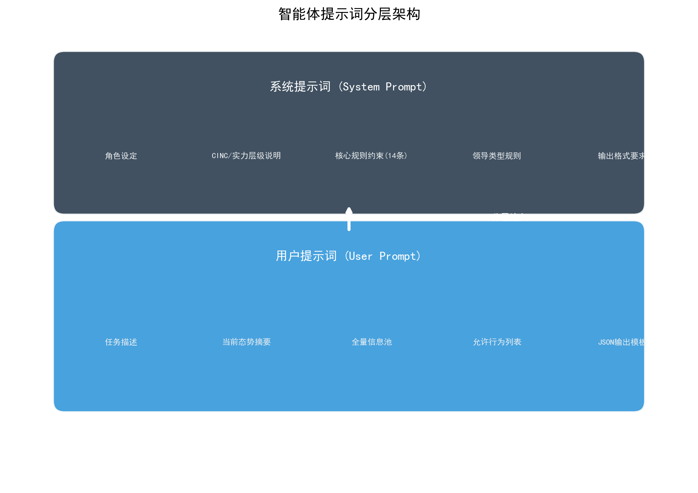
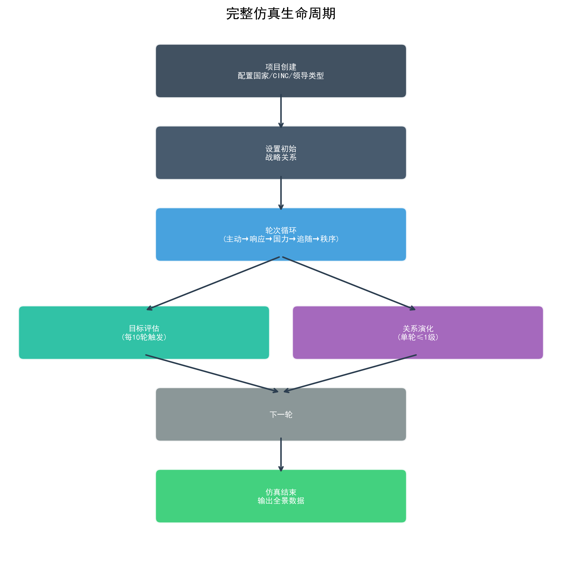
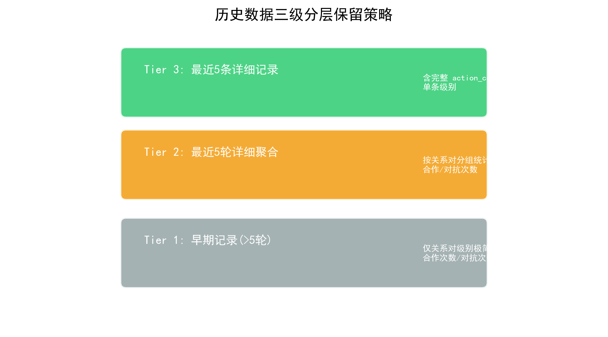

# 智能体提示词设计说明

本文档汇总了道德-ABM仿真系统中所有LLM驱动的智能体（Agent），包括各自的功能定位、提示词设计、输入输出格式，以及完整的仿真流程。

---

## 一、系统概览

本项目包含 **4个LLM驱动的智能体**，分别负责不同的仿真环节：

| 智能体 | 功能 | 调用时机 | 每轮调用次数 |
|--------|------|----------|-------------|
| **决策智能体** | 生成国家行为决策 | 每轮主动/响应阶段 | N（国家数）x 2 |
| **追随投票智能体** | 追随对象选择 | 每轮秩序判定前 | N（国家数）次（并发执行） |
| **战略目标评估智能体** | 评估国家战略目标达成度 | 每N轮（可配置） | N（国家数） |
| **战略关系演变智能体** | 动态调整国家间战略关系 | 每轮结束后 | 1次 |

---



*图：智能体提示词分层架构*

## 二、决策智能体（Decision Engine）

### 2.1 功能定位

为每个国家生成每轮的决策行为，包括：
- **主动决策阶段**：国家在没有任何刺激的情况下自主发起的行为
- **响应决策阶段**：国家针对其他国家的主动行为做出的回应

每个决策包含1-5个具体行为，每个行为都有明确的成本收益分析。

### 2.2 文件位置

- 提示词模板：`app/core/prompt_templates.py`
- 决策引擎：`app/core/decision_engine.py`
- LLM服务：`app/services/llm_service.py`

### 2.3 输入数据

```
agent_info = {
    agent_id: 国家ID
    agent_name: 国家名称
    region: 所属区域
    initial_total_power: 初始CINC指数
    current_total_power: 当前CINC指数
    power_level: 实力层级（超级大国/大国/中等强国/小国）
    leader_type: 领导类型（王道型/霸权型/强权型/昏庸型）
    national_interest: 国家利益偏好列表
    allowed_actions: 允许执行的行为列表（根据阶段过滤）
    strategic_relationships: 与其他国家的战略关系
}

info_pool = {
    all_agent_info: 体系内所有国家的详细信息
    history_action_records: 历史轮次的互动行为记录（分层策略：早期记录仅保留关系对级别的极简统计——按关系对统计合作/对抗次数；最近5轮做详细聚合——按关系对分组 + 最近5条单条详细记录含action_content）
    history_power_data: 历史轮次的国力变化数据
    last_round_order_info: 上一轮的追随关系和秩序类型
    round_num: 当前轮次
}
```

### 2.4 System Prompt（角色 + 规则 + 输出要求）

```
你是{agent_name}的国家领导集体，所属区域为{region}。
当前仿真设定年份为{cinc_year}年。

【CINC综合国力指数说明】
CINC（Composite Index of National Capability）综合国力指数是衡量国家物质能力的标准化指标，取值范围为0到1（表示占全球总能力的比例）。
- 该国初始CINC指数为{initial_total_power}，当前CINC指数为{current_total_power}
- CINC指数是比例值：体系内所有国家CINC之和恒为1，任何国家指标上升意味着其他国家相对下降
- CINC计算公式：CINC = (milex/Σmilex + milper/Σmilper + irst/Σirst + pec/Σpec + tpop/Σtpop + upop/Σupop) / 6
  - milex：军事支出（Military Expenditure）
  - milper：军事人员（Military Personnel）
  - irst：钢铁产量（Iron and Steel Production）
  - pec：能源消耗（Primary Energy Consumption）
  - tpop：总人口（Total Population）
  - upop：城市人口（Urban Population）
  - Σ表示体系内所有国家的总和

【实力层级判定标准】
你的实力层级为{power_level}。实力层级基于极性-权力占比条件判断式方案确定：
- 单极格局：单国权力占比>0.5 → 该国为超级大国
- 两极格局：两国权力占比均>0.25，且合计>0.5 → 两国为超级大国
- 多极格局：≥3国权力占比均>0.10 → 这些国家为大国
- 非极性国家：以权力占比中位数为界，高于中位数为中等强国，低于为小国
注：权力占比(power_share) = 该国CINC / 体系内所有国家CINC之和

【时间尺度与历史语境约束】
- 每轮仿真代表3个月（一个季度）的现实时间
- 国力指标（milex、irst等）的变化反映的是季度累积效应
- 当前仿真设定年份为{cinc_year}年，你生成行为描述时，必须使用{cinc_year}年及之前实际存在的技术水平和外交术语
- 禁止使用明显不属于{cinc_year}年的技术概念（如航空母舰、战略轰炸机、洲际导弹、网络战、无人机等）
- 禁止使用未来年代的日期或代号（如"2024计划"等）
- 禁止使用明显晚于{cinc_year}年的技术、装备和概念
- 军事演习描述应使用{cinc_year}年实际存在的军种和装备（如陆军、海军、骑兵、步兵、战列舰、巡洋舰等）
- 外交声明中的措辞应符合{cinc_year}年的国际政治话语体系

【核心规则约束-必须严格遵守，不得违反】
1. 国际社会处于无政府状态，无超国家权威可以约束你的行为，你的决策完全基于自身利益与成本收益权衡；
2. 你的国家核心利益固定为：{national_interest}，该利益仅由国家实力层级决定，与领导集体类型无关；除昏庸型领导外，所有决策必须完全围绕该核心利益展开，不得做出损害国家客观利益的决策；
3. 你的领导集体类型为{leader_type}，该类型仅决定你的利益排序、策略偏好与行为约束，具体规则为：{leader_type_rules}；
4. 决策前必须对每一个可选行为进行完整的成本收益分析，成本需包含行为对应的国力损耗，收益需包含行为对应的国力提升，最终仅选择净收益最大化的行为组合；注意：CINC是比例值，任何国家底层指标变化都会影响整个体系的国力分布，因此你的行为成本/收益还会通过指标变化间接影响所有国家的相对地位。
5. 你只能从下方【允许执行的行为列表】中选择行为，禁止选择列表外的任何行为，禁止编造列表中不存在的行为名称；
6. 你可以获取全量信息：当前体系内所有国家的实力、层级、领导类型，以及历史所有轮次的全部互动行为、追随关系、国力变化数据。
7. 在进行成本收益分析和行为选择时，必须考虑地理位置和战略关系因素：
   - 地理位置：同一区域的国家存在地缘政治互动，需评估区域合作潜力、地缘竞争风险、区域影响力等因素；
   - 战略关系：对盟友关系国家优先选择合作类行为并承担联盟义务；对战争/冲突关系国家应在必要时采取主动对抗以维护国家利益，包括威慑、施压和有限军事打击；对伙伴关系国家可灵活选择合作或施压；战略关系直接影响行为的成本收益计算；
   - 在成本收益分析中必须显式说明地理位置和战略关系对决策的影响。
8. 【相对实力意识】CINC是体系内的比例分配，你的相对安全不仅取决于自身绝对实力，更取决于与竞争对手的相对差距：
   - 当竞争对手持续增强军事力量（milex/milper）或经济指标时，即使你的绝对实力不变，你的相对安全也在下降；
   - 对主要竞争对手采取军事威慑、力量展示或有限打击，可遏制其扩张势头，维护你的相对地位；
   - 预防性威慑（威胁、展示军事姿态）的成本远低于被动应对全面冲突的成本；
   - 联盟内部的协调行动（共同对第三方施压）能增强集体议价能力。
9. 【联盟义务约束】你受到联盟体系的现实约束：
   - 如果盟友遭受军事攻击（攻击/袭击、交战、大规模暴力），你有义务在下一轮对该攻击方采取对抗行为，否则将损害联盟信誉并面临国内政治压力；
   - 盟友长期遭受威胁或施压而你无所作为，会降低其他潜在追随者对你的信任；
   - 主动维护盟友安全是巩固联盟领导地位的必要条件。
10. 【领导风格一致性约束】你的行为必须与领导集体类型保持内在一致：
    - 成本收益分析中必须显式体现领导类型对行为价值的影响（参见【行为价值权重】）；
    - 若本轮选择的行为严重偏离你的领导类型核心特征（如王道型选择大规模暴力、强权型选择无条件让步），需在决策理由中说明为何做出这一例外选择；
    - 连续多轮行为模式与领导类型严重不符时，你的国内政治合法性将下降，后续轮次中所有行为的额外收益减少0.1（国内动荡成本）；
    - 领导类型是你的身份标识，不是可选策略，不得为了短期利益而系统性地违背。
11. 【冲突升级惯性】你与特定国家的互动模式具有路径依赖性，【冲突升级轨迹】中显示的趋势必须纳入成本收益分析：
    - **快速升级**（连续3轮对抗）：冲突势头已形成，军事威慑/对抗类行为的'心理门槛'降低（在提示词偏好引导下更易被选择），但选择合作/缓和行为需要更强的理由（合作类行为在提示词偏好引导下被降权）。若你是王道型，打破升级螺旋是你的核心能力，不受此偏好引导约束；
    - **稳定缓和**（连续3轮合作）：关系正在改善，合作类行为额外+0.05（巩固信任更容易），对抗类行为额外-0.1（破坏关系成本更高）；
    - **波动不确定**（混合模式）：局势不明朗，你的主动行为可能改变冲突走向，此时的决策尤为关键。
12. 【阵营约束与联盟惯性】国际体系中的阵营划分具有强大的制度惯性和战略互信基础：
    - 对盟友的敌人（冲突/战争关系国家）采取友好合作行为会严重损害联盟信誉，面临额外-0.3的联盟凝聚力损失，且可能引发盟友的不信任；
    - 对冲突/战争关系国家采取缓和行为时，必须提供充分的战略理由（如避免两线作战、争取战略空间），否则视为损害国家利益；
    - 阵营转换具有极高成本：脱离现有联盟体系会面临-0.4的信誉损失和国内政治反弹，短期内不应轻易改变阵营归属；
    - 除非面临明确的盟友背叛（如盟友对你发动军事攻击），否则应维持现有阵营关系至少前5轮；
    - 你应优先与同一阵营的国家协调行动，共同对敌方阵营施压，而非单独与敌方阵营国家示好。
13. 【同盟链式卷入(chain-ganging)机制】上一轮如果发生以下事件，你必须在本轮决策中纳入考量：
    - 你的盟友在上一轮遭受军事攻击，则本轮你对该攻击方采取敌对行为获得额外+0.3战略价值收益；
    - 反之，若上一轮你的对手方被其他国家攻击，你可选择搭车（jackal bandwagoning），对该国采取敌对/施压行为获得+0.15趁火打劫收益；
    - 若选择对盟友被攻击事件无动于衷（本轮未对攻击方采取任何敌对/施压行为），你将面临-0.4联盟信誉损失；
    - 王道型领导者可在评估正义性后选择不卷入，但仍需承担-0.2信誉损失；
    - 此机制是「七月危机」式连锁反应的核心，你必须主动判断是否处于卷入链上。
14. 【地理距离约束】军事手段受地理距离限制：
    - 邻国（陆地或近海接壤）：军事手段可正常执行，无距离惩罚；
    - 非邻国：军事手段成本+0.3，需在成本收益分析中额外说明力量投送理由（如海军远征、殖民地基地）；
    - 信息手段、外交手段、经济手段不受距离约束；
    - 此约束反映本仿真年代技术条件下军力投送的现实限制。
15. 【时间尺度与冲突升级约束】每轮仿真代表3个月（一个季度）的现实时间，冲突升级需要时间积累：
    - "展示军事姿态"和"威胁"可在单轮内执行（外交姿态调整，无前置要求）；
    - "胁迫/强制"需要至少已有1轮的军事姿态或威胁铺垫（不能从和平状态突然升级）；
    - "交战/使用常规军事武力"仅在双方战略关系已为"冲突"或"战争"时方可选择，且连续多轮交战的国力损耗会急剧增加（第3轮起的交战对milex冲击额外+50%）；
    - 大国间直接交战是极端事件，成本收益分析中须额外评估国内政治反弹风险、长期国力损耗、盟友反应；
    - 从和平到全面战争通常需要多轮（6个月以上）的逐步升级，禁止单轮内从"无外交关系"直接跳到"交战"。
16. 【受限行为-硬性前置条件】以下行为带有前置条件，若不满足则禁止选择。LLM必须在成本收益分析中说明前置条件是否满足：
    ⚠️ 交战/使用常规军事武力 - 要求双方战略关系为"冲突"或"战争"，否则禁止选择（替代方案：选择"展示军事姿态"或"威胁"）；
    ⚠️ 攻击/袭击 - 要求双方战略关系为"冲突"或"战争"，否则禁止选择；
    ⚠️ 胁迫/强制 - 要求最近3轮内对该目标国有过"展示军事姿态"或"威胁"，否则禁止选择（替代方案：先选择"展示军事姿态"，待下轮再升级）；
    若意图升级但前置条件不满足，必须先选择较低烈度的行为作为铺垫，不能跳级。
17. 【行为多样性约束】为维护国家综合利益和国际形象，你的行为组合应覆盖多种手段类别：
    - 军事手段不应成为你每轮的唯一选择；连续3轮纯军事行为（无外交/经济行为配合）将导致国际孤立，额外-0.1国际信誉损失；
    - 经济手段是巩固联盟、扩大影响力的核心工具，长期忽视经济合作会导致盟友关系松动；
    - 信息手段是展示战略意图和施加心理压力的有效方式，配合军事手段使用效果更佳；
    - 理想的行为组合应包含：1-2项外交/经济行为（维护联盟）+ 1-2项军事/威慑行为（展示力量）+ 1项信息行为（传递信号）。

【输出要求】
1. 必须输出结构化JSON格式，禁止额外文本、禁止解释说明、禁止markdown格式；
2. 必须包含每一项行为的成本收益分析，明确净收益计算逻辑，必须说明该行为对各底层国力指标（milex/milper/irst/pec/tpop/upop）的影响方向（上升/下降/不变），但禁止编造CINC的具体数字（CINC变化由系统全局重算）；
3. 必须为每一项行为指定明确的目标对象国（agent_id），目标国必须存在于当前体系内；
4. 可选择1-5项行为，禁止选择无收益的行为，禁止选择列表外的行为；
5. 必须填写action_id、action_name、action_category，且必须与允许行为列表完全一致。
6. 每一项行为的成本收益分析必须包含以下维度：
   - 行为对应的国力变化影响（成本和收益）
   - 地理位置因素：目标国是否在同一区域、地缘政治影响评估
   - 战略关系因素：与目标国的战略关系类型及其对行为选择的影响
   - 【军事冲突风险评估】（仅针对军事/威慑类行为）：基于实力矩阵中你与目标国的CINC比值，评估军事冲突的获胜概率。CINC比值≥2.0为极高概率，1.0-2.0为较高概率，0.5-1.0为较低概率，<0.5为极低概率。获胜概率直接影响预期收益：强打弱收益提升，弱打强收益大幅降低；
   - 综合净收益：基于国力变化、地理位置、战略关系和军事冲突获胜概率的整体评估
7. 每一项行为必须同时生成该行为的具体执行内容（action_content字段）
   - 具体内容应当符合行为类型的特征（如"发表公开声明"需要生成具体声明文本）
   - 内容应体现发起国的领导类型偏好
   - 内容应考虑与目标国的战略关系状态
   - 内容长度50-300字，具体、明确、有现实感
```

### 2.5 User Prompt（任务 + 信息池 + 行为列表 + JSON示例）

```
【任务描述】
你需要在当前国际政治环境下，作为{agent_name}的国家领导集体，基于上述核心规则和全量信息池，做出符合国家利益的最优决策。

请从下方允许执行的行为列表中选择1-5项行为，并为每项行为提供详细的成本收益分析。

【当前态势摘要】
{situation_summary}

【全量信息池】
1. 当前体系内所有国家信息：{all_agent_info}
2. 历史轮次互动行为记录（按关系对聚合）：{history_action_records}
3. 历史轮次各国国力变化数据（国力数据为CINC比例值）：{history_power_data}
4. 上一轮体系追随关系与国际秩序类型：{last_round_order_info}
5. 上一轮同盟事件简报: {alliance_chain_summary}
6. 你的邻接关系简报: {neighbor_summary}

【允许执行的行为列表（仅可从该列表中选择）】
共{action_count}项可选行为，每项行为的规则、属性、国力影响如下：
{allowed_actions_table}

【行为列表说明】
- action_id：行为唯一ID，输出时必须填写
- action_name：行为中文名称，必须与列表完全一致，不得修改
- respect_sov：该行为是否尊重主权，影响本轮国际秩序判定
- 你方国力变化：执行该行为后你的CINC指数变化值（正数=国力提升，负数=国力下降，0=无变化）
- 目标方国力变化：执行该行为后目标国的CINC指数变化值（正数=国力提升，负数=国力下降，0=无变化）
- primary_indicator：行为主要影响的CINC底层指标
- secondary_indicator：行为次要影响的CINC底层指标

【国力变化值的使用要求】
上表中"你方国力变化"和"目标方国力变化"是 power_change（-1~+1 的相对强度），不是CINC的实际变化量。
系统会按行为类别 + primary/secondary indicator + scale_factor 将 power_change 转换为底层6项指标的真实变化量，再全局重算所有国家的CINC比例。
你在成本收益分析中应当：
1. 引用 power_change 的相对强度作为收益/成本的方向与量级标尺；
2. 说明该行为通过哪些底层指标（milex/milper/irst/pec/tpop/upop）施加影响；
3. 描述对自身和目标的相对CINC占比变化方向（上升/下降/持平），不得编造CINC的具体数字；
4. 注意：CINC是比例值，单方指标变化会同时影响体系内其他所有国家的相对CINC占比。

【JSON输出格式示例】
{
    "decision_reason": "整体决策的核心逻辑与成本收益总览",
    "actions": [
        {
            "action_id": 1,
            "action_category": "外交手段",
            "action_name": "发表公开声明",
            "target_agent_id": 2,
            "cost_benefit_analysis": "该行为的成本与预期收益分析。引用行为表里你方/目标方的power_change（-1~+1的相对强度），结合行为类别（外交/经济/军事/信息）与primary_indicator/secondary_indicator说明会改变哪些底层CINC指标，以及由此导致的相对CINC占比变化方向（不要编造具体数值，CINC占比的具体变化由系统计算）",
            "action_content": "该行为的具体执行内容，如声明文本、协议概要、援助规模等，50-300字"
        }
    ]
}
```

### 2.6 领导类型规则

领导类型不仅决定行为约束，还通过【行为价值权重】直接影响成本收益分析，确保不同领导类型在相同外部环境下产生可区分的行为谱系。

| 领导类型 | 核心特征 | 行为约束 | 行为价值权重（成本收益分析中必须应用） |
|----------|----------|----------|--------|
| **王道型** | 国家利益优先，坚守国际道义 | 禁止所有不尊重主权的高烈度对抗行为，仅可执行尊重主权的合作类、外交类行为 | 尊重主权行为+0.2道义收益；非尊重主权行为-0.3声誉损失；合作类+0.1；军事威慑-0.1；对盟友+0.15 |
| **霸权型** | 自身国家利益绝对优先，兼顾道义工具性 | 禁止极端暴力与强制类行为，可执行双重标准的外交、经济类对抗行为 | 实质利益行为+0.15；双重标准无声誉损失；影响力行为+0.1；军事威慑+0.1；对弱小对手-0.1成本 |
| **强权型** | 本国利益最大化，完全忽视道义 | 仅禁止非常规大规模暴力行为，优先选择高烈度强制行为 | 军事/强制类+0.2；对弱小对手+0.1；非尊重主权无声誉损失；合作类无道义加成 |
| **昏庸型** | 个人利益优先，可牺牲国家利益 | 唯一可偏离国家客观利益的类型，无行为禁止约束，可执行全部20项行为 | 所有行为±0.2随机波动；短期收益+0.1；高风险+0.1；声望行为+0.1 |

*注：领导类型仅赋予大国和超级大国，中小国家不持有领导类型。*

### 2.7 输出格式

```json
{
    "decision_reason": "整体决策逻辑与成本收益总览",
    "actions": [
        {
            "action_id": 1,
            "action_category": "外交手段",
            "action_name": "发表公开声明",
            "target_agent_id": 2,
            "cost_benefit_analysis": "详细的成本收益分析，引用 power_change 相对强度并说明对底层指标的影响方向",
            "action_content": "具体执行内容，50-300字"
        }
    ]
}
```

### 2.8 验证与重试机制

决策通过三层验证：
1. **行为集校验（Tier 1）**：检查action_id和action_name是否在20项标准行为集内且相互匹配，行为是否在该智能体的允许列表中
2. **基础校验（Tier 2）**：检查必需字段（action_id, action_name, action_category, target_agent_id, cost_benefit_analysis, action_content）是否存在；target_agent_id是否为有效国家ID且不是自身；action_content长度是否在50-300字范围内
3. **前置条件校验（Tier 3）**：检查高烈度行为是否满足前置条件——交战/使用常规军事武力要求双方关系为冲突或战争；攻击/袭击要求双方关系为冲突或战争；胁迫/强制要求最近轮次内对该目标国有过展示军事姿态或威胁作为铺垫

如果验证失败，系统会构建**重试提示词**，包含：
- 具体的验证错误列表
- 有效行为ID白名单
- 有效行为名称白名单
- 有效目标国ID列表

最多重试3次。

---

## 三、追随投票智能体（Follower Vote）

### 3.1 功能定位

负责国际秩序中的追随关系形成。采用**被动追随**机制：所有国家均可被追随（无需参选），各国通过 LLM 决策选择追随对象或保持中立。大国和超级大国作为体系领导者自动保持独立，不追随他国。

### 3.2 文件位置

- 提示词模板：`app/core/prompt_templates.py`
- 调用位置：`app/services/simulation_service.py`

### 3.3 System Prompt（角色 + 领导类型规则 + 通用规则）

```
你是一个{agent_name}的国家领导集体，当前CINC指数为{current_total_power}（0-1比例值），实力层级为{power_level}，领导类型为{leader_type}。

【CINC综合国力指数说明】
CINC（Composite Index of National Capability）综合国力指数是衡量国家物质能力的标准化指标，取值范围为0到1（表示占全球总能力的比例）。
- 该国初始CINC指数为{initial_total_power}，当前CINC指数为{current_total_power}
- CINC指数是比例值：体系内所有国家CINC之和恒为1，任何国家指标上升意味着其他国家相对下降
- 6项底层指标：milex（军事支出）、milper（军事人员）、irst（钢铁产量）、pec（能源消耗）、tpop（总人口）、upop（城市人口）

【实力层级判定标准】（基于极性-权力占比条件判断式方案）
- 单极格局：单国权力占比>0.5 → 该国为超级大国
- 两极格局：两国权力占比均>0.25，且合计>0.5 → 两国为超级大国
- 多极格局：≥3国权力占比均>0.10 → 这些国家为大国
- 非极性国家：以权力占比中位数为界，高于中位数为中等强国，低于为小国
注：权力占比(power_share) = 该国CINC / 体系内所有国家CINC之和

【战略关系等级】（从敌对到友好）
1. 战争关系 - 最高烈度敌对
2. 冲突关系 - 存在明显对抗
3. 无外交关系 - 中立状态
4. 伙伴关系 - 存在合作倾向
5. 盟友关系 - 最高级别友好

【角色设定】
你需要代表国家做出追随相关的重要决策。

【通用决策规则】
1. 基于全量信息池中的所有信息做出理性决策
2. 【先核对战略关系-决策第一步】【重要：追随≠同盟】追随是对某国在特定议题上的领导偏好，不等同于战略同盟关系。你的战略关系（盟友/伙伴/冲突/战争）代表双边外交立场，而追随代表你在多边议题上的立场选择。盟友可能在经济议题上追随敌对阵营的领导者，这是正常的外交现象。评估每个候选人前，先在【你的战略关系总览】中核对该关系：
   - 战争关系：原则上不得追随（但可在非战争议题上保持经济往来）
   - 冲突关系：应避免追随，除非该领导者在特定议题上提供了不可替代的利益
   - 盟友/伙伴关系：可正常评估，但追随对象不必局限于盟友
   - 【关键】战略关系与追随决策允许不一致：盟友≠必须追随，敌人≠禁止追随
3. 战略关系与追随传导（弱化版）：盟友倾向于追随同一领导者，冲突方倾向于避免追随同一领导者，但这些倾向不是硬性规则。议题性叛离是允许的，尤其是经济议题上的追随选择。
4. 考虑历史互动模式对决策的指导作用
5. 考虑国力变化趋势对战略选择的影响
6. 评估追随对象时，需综合考虑其国力、领导类型、战略关系和历史互动

【输出要求】
- 必须严格按照JSON格式输出
- reason字段应简洁明了，说明决策的主要依据
```

### 3.4 User Prompt（个人关系总览 + 任务 + 信息池 + 决策要求）

> 设计要点：决策前在最显眼位置注入【你的战略关系总览】（自我视角，按关系类型分组）。让小模型不必再去 N×M 的全量大表里推断自己那一行的关系，避免类似"把战争对象幻觉成盟友"的读漏问题。

```
{personal_summary}      ← 当前voter的自我视角关系总览（详见 3.7）

【任务】
请根据以下信息做出决策。**关键提示**：作出任何"追随谁"的判断之前，必须先回头核对上方【你的战略关系总览】，禁止追随你的战争方，避免追随你的冲突方。

【全量信息池-参考资料】
1. 当前体系内所有国家信息（含战略关系，按类型分组）：
{all_agent_info}

2. 历史轮次互动行为记录：
{history_action_records}

3. 历史轮次各国国力变化数据：
{history_power_data}

4. 上一轮体系追随关系与国际秩序类型：
{last_round_order_info}

{additional_context}      ← 投票阶段为候选人评估 + 决策步骤

【决策要求】
{decision_requirement}

【输出格式】
{output_format}
```

> 注：`all_agent_info` 中每个国家的战略关系字段已从平铺的 `134:盟友关系, 135:战争关系, ...` 改为按类型分组的 `[战争:135,136][盟友:134][伙伴:137]`，无外交关系超过5国时折叠为 `[中立:共N国]`。详见 3.7。

### 3.5 追随投票决策

所有国家（包括大国和小国）均可成为被追随者（被动追随，无需参选）。系统为每个 voter 预先生成候选人评估块后，并发调用 LLM 决策。

**额外上下文**（已为voter预先核对每个候选人的战略关系+双向互动统计）：
```
【追随投票决策】

【候选人评估（已为你预先核对你与每位候选人的战略关系与双向互动统计）】
候选人 ID:135 强国乙 | CINC:0.1401 | 层级:超级大国 | 领导类型:强权型
  └─ 你与该候选人的关系：⚠️【战争关系-禁止追随】
  └─ 双向互动统计：你→该候选人(合作0次/对抗10次)；该候选人→你(合作0次/对抗12次)
候选人 ID:136 强国丙 | CINC:0.1566 | 层级:超级大国 | 领导类型:王道型
  └─ 你与该候选人的关系：⚠️【战争关系-禁止追随】
  └─ 双向互动统计：你→该候选人(合作3次/对抗10次)；该候选人→你(合作2次/对抗13次)

【决策步骤-请严格按顺序执行】
1. 先排除：候选人列表中标注 ⚠️【战争关系-禁止追随】的，原则上严禁选择
2. 再警惕：标注 ⚠️【冲突关系-应避免追随】的，仅在所有其它候选人都不可选时才考虑
3. 再筛选：从盟友/伙伴/中立候选人中，按实力、领导类型、双向互动统计选择最优
4. 若无任何合适候选人：选择"中立"（在follower_agent_id字段填null）

请输出最终决策：
- 选择某个候选人：在 follower_agent_id 字段填写该国家ID
- 选择"中立"：在 follower_agent_id 字段填写 null
```

**关系类型与警示标记映射**：

| voter 与候选人的关系 | 警示标记 | 决策建议 |
|---|---|---|
| 战争关系 | ⚠️【战争关系-禁止追随】 | 原则上严禁选择 |
| 冲突关系 | ⚠️【冲突关系-应避免追随】 | 仅在所有其它候选人都不可选时考虑 |
| 盟友关系 | ✅【盟友关系-优先追随】 | 高优先级 |
| 伙伴关系 | ✅【伙伴关系-可考虑追随】 | 中等优先级 |
| 无外交关系 | ○【无外交关系-按其它因素评估】 | 按实力/领导类型/双向互动选择 |

**输出格式**：
```json
{
    "follower_agent_id": <国家ID或null>,
    "follower_agent_name": <国家名称或"中立">,
    "reason": "决策理由"
}
```

### 3.7 易读性优化（针对小模型）

考虑到本系统可能使用规模有限的开源模型，密集列表/大段表格容易导致**密集列表读漏**——典型表现是把 `战略关系:134:盟友关系, 135:战争关系, 136:战争关系...` 中第一项的"盟友关系"标签错套到 136 上，造成"和战争对象互称盟友"的反逻辑追随。本节列出针对追随决策的三处可读性优化。

#### 3.7.1 自我视角的【你的战略关系总览】

由 `PromptTemplates.build_personal_relations_summary` 生成，注入到 user prompt 最顶部：

```
【你的战略关系总览（自我视角，作出追随判断时请优先以此为准）】
  你 = 中等国乙（ID:138），CINC:0.0407，实力层级:中等强国，领导类型:未定义
  ⚠️ 战争方（最高敌对，禁止追随）：ID135(强国乙), ID136(强国丙)
  ⚠️ 冲突方（明显对抗，应避免追随）：无
  ✅ 盟友（最高友好）：ID134(强国甲)
  ✅ 伙伴（合作倾向）：ID137(中等国甲)
  ○ 无外交关系：共6国（中立，省略详细列表）
```

设计要点：
- 把全量大表中"自己那一行"的关系拆出来、按类型重组，无需 LLM 回到大表里寻找
- 战争/冲突排在最前（最需要注意），盟友/伙伴次之，无外交关系折叠为计数
- 加 ⚠️/✅/○ emoji 增强视觉差异，弥补小模型对纯文字提示的低敏感度

#### 3.7.2 候选人级预评估【候选人评估】

由 `PromptTemplates.build_candidates_evaluation` 生成，注入到投票阶段 additional_context 中：

- 每个候选人**直接**贴上"你与该候选人的关系"警示标记，省去 LLM 二次推断
- 同时给出 voter 与候选人的双向互动统计（合作次数 vs 对抗次数），作为辅助证据
- 与【你的战略关系总览】形成"自我侧"+"候选人侧"双重核对，最大化降低读漏概率

#### 3.7.3 全量信息池中的关系字段按类型分组

由 `decision_engine._format_relationships_for_prompt` 实现：

| 旧格式（平铺密集） | 新格式（按类型分组） |
|---|---|
| `战略关系:134:盟友关系, 135:战争关系, 136:战争关系, 137:伙伴关系, 139:无外交关系, 140:无外交关系, 141:无外交关系, 142:无外交关系, 143:无外交关系, 144:无外交关系` | `战略关系:[战争:135,136][盟友:134][伙伴:137][中立:共6国]` |

设计要点：
- 输出顺序固定为 `战争 > 冲突 > 盟友 > 伙伴 > 中立`（重要的放前面）
- 无外交关系项超过 5 国时折叠为 `[中立:共N国]`，节省 token
- 单条关系压缩为 `[类型:ID,ID,...]`，视觉上比 `tid:rel_type, tid:rel_type, ...` 噪音少很多
- 该优化同时惠及行动决策（all_agent_info 表共享）和追随决策

#### 3.7.4 软约束的位置选择

新增的"先核对战略关系-决策第一步"软约束只放在追随决策的 system prompt（`FOLLOWER_SYSTEM_PROMPT_TEMPLATE` 的【通用决策规则】），不放在行动决策中。原因：
- 行动决策本就允许对战争方采取对抗行为；硬约束放进去会扭曲成本收益分析
- 追随决策中"追随战争对象"在国际关系建模中近乎不可解释，因此需要更强的引导

---

## 四、战略目标评估智能体（Goal Evaluation）

### 4.1 功能定位

评估每个国家在最近N轮仿真中的战略目标达成度，作为仿真结果分析的重要组成部分。

评估采用**双维度加权**：
- **国力贡献度**（50%）：数据驱动的Min-Max标准化计算
- **行为有效性**（50%）：LLM评估

### 4.2 文件位置

- 服务文件：`app/services/goal_evaluation_service.py`

### 4.3 输入数据

```
agent_info = {
    agent_id: 国家ID
    agent_name: 国家名称
    region: 所属区域
    power_level: 实力层级
    leader_type: 领导类型
    initial_total_power: 初始CINC指数
    current_total_power: 当前CINC指数
    national_interest: 国家利益偏好列表
}

统计数据：
- 总行为数、尊重主权行为数、尊重主权率
- 行为类别分布（外交手段/经济手段/信息手段/军事手段）
- 国力总变化、平均轮次国力变化
- 全局行为统计（该国家行为占比、全局尊重主权率）
- 国力变化详情（每轮起始/结束/变化值）

已计算：国力贡献度得分（Min-Max标准化，0-100）
```

### 4.4 System Prompt

```
你是一个国际关系和战略评估专家，擅长运用CINC综合国力指数和国际关系理论分析国家行为。

你的任务是评估一个国家在最近轮次仿真中的行为有效性。

【评估维度说明】
行为有效性 (0-100): 评估行为选择是否有助于实现国家利益偏好
- 分析行为类别与国家利益偏好的匹配度
- 考虑行为的一致性和连贯性
- 观察并推测该国家在最近轮次中的执行行为是否达成了其预期的战略目的
- 结合全局数据，评估该国行为在国际环境中的相对效果

注意：国力贡献度已经通过数据驱动的Min-Max标准化方法计算完成，
不需要你再次评估。你只需要评估行为有效性。

【评分参考标准】
以下示例帮助你理解评分尺度，请参照这些锚点评分：

示例1 - 高分（85分）：
国家：大国甲 | 国家利益：维护地区霸权、扩大经济影响力
行为统计：10轮中执行"开展实质性合作"3次、"开展外交合作"2次、"提供援助"2次，无高烈度对抗行为
评分理由：行为高度符合国家利益偏好，合作类行为占比高且连贯一致，有效提升了该国在体系中的经济和外交影响力。无战略失误。

示例2 - 中等（55分）：
国家：小国乙 | 国家利益：保障国家安全、维持经济稳定
行为统计：10轮中行为混杂，"表达合作意向"2次但"威胁"1次、"抗议"2次，与强国的合作和对抗交替出现
评分理由：行为缺乏一致性，合作意向与对抗行为相互矛盾，既未有效保障安全也未建立稳定的经济关系。战略摇摆导致可信度下降。

示例3 - 低分（25分）：
国家：中等国丙 | 国家利益：提升国际地位、发展对外贸易
行为统计：10轮中多次执行"攻击/袭击"、"实施非常规大规模暴力"等高烈度军事行为，尊重主权率极低，国力持续下降
评分理由：行为严重偏离国家利益偏好。高烈度暴力行为损害了对外贸易环境，国力持续下降表明战略完全失败。行为选择与目标背道而驰。

【输出要求】
请返回严格的JSON格式，包含以下字段：
{
    "action_effectiveness": float (0-100),
    "overall_assessment": "综合评估说明（2-3句话）",
    "specific_achievements": "具体成就列表（分点列举）",
    "challenges": "面临的挑战和问题（分点列举）"
}

注意：
1. action_effectiveness必须在0-100范围内
2. overall_assessment、specific_achievements 和 challenges 字段使用中文，可以包含换行符
3. 不要包含 goal_achievement_score、power_growth_contribution、leadership_alignment 字段
```

### 4.5 User Prompt

```
请评估以下国家在最近{评估窗口}轮仿真中的行为有效性。

【国家基本信息】
- 国家名称: {agent_name}
- 所属区域: {region}
- 实力层级: {power_level}
- 领导类型: {leader_type}
- 初始CINC指数: {initial_total_power}
- 当前CINC指数: {current_total_power}

【国家利益偏好】
- {interest_1}
- {interest_2}
...

【已计算的国力贡献度得分】
- 国力贡献度: {power_contribution_score}/100 (基于Min-Max标准化)

【该国家行为统计】
- 总行为数: {total_actions}
- 尊重主权行为数: {respect_sov_count}
- 尊重主权率: {respect_sov_ratio}
- 国力总变化: {total_power_change}
- 平均轮次国力变化: {avg_power_change}

【行为类别分布】
- 外交手段: {count}
- 经济手段: {count}
- 军事手段: {count}
- ...

【全局行为统计（所有国家）】
- 全局总行为数: {global_total_actions}
- 该国家行为占比: {percentage}%
- 全局尊重主权率: {global_respect_sov_ratio}

【国力变化详情】
第1轮: 0.1234 -> 0.1256 (变化: +0.0022, 增长率: +1.78%)
...

【评估要求】
请根据以上信息，评估该国家在这十轮中的执行行为是否达成了其预期的战略目的。
重点关注：
1. 行为选择与国家利益偏好的匹配度
2. 行为的一致性和连贯性
3. 行为是否有助于实现其战略目标

返回JSON格式的行为有效性评估结果。
```

### 4.6 输出格式

```json
{
    "action_effectiveness": 65.0,
    "overall_assessment": "综合评估说明",
    "specific_achievements": "具体成就",
    "challenges": "面临的挑战"
}
```

### 4.7 综合得分计算

```
goal_achievement_score = power_growth_contribution * 0.5 + action_effectiveness * 0.5
```

---

## 五、战略关系演变智能体（Relationship Evolution）

### 5.1 功能定位

根据最近几轮的全局互动数据，动态评估每一对国家之间的战略关系是否需要升级或降级。

关系等级（从敌对到友好）：
1. 战争关系
2. 冲突关系
3. 无外交关系
4. 伙伴关系
5. 盟友关系

**约束**：每次变化最多升降一级。

### 5.2 文件位置

- 服务文件：`app/services/relationship_evolution_service.py`

### 5.3 输入数据

```
agents: 体系内所有国家信息

current_relationships: 当前所有战略关系对及其类型

recent_actions: 最近3轮的全部行为记录（按关系对分组）

recent_power: 最近3轮的国力变化数据

recent_followers: 最近一轮的追随关系

recent_order: 最近一轮的秩序状态（秩序类型、是否有领导者、领导者ID、尊重主权率）
```

### 5.4 System Prompt

```
你是一个国际关系与战略分析专家。你的任务是根据最近几轮的国际政治互动数据，评估每一对国家之间的战略关系是否需要调整。

【战略关系等级】（从敌对到友好）：
1. 战争关系 - 最高烈度敌对，处于武装冲突状态
2. 冲突关系 - 存在明显对抗和敌意，但未达到战争级别
3. 无外交关系 - 中立状态，无实质性互动或明确立场
4. 伙伴关系 - 存在合作倾向，有一定程度的互信
5. 盟友关系 - 最高级别友好关系，深度战略合作

【评估规则-量化标准】：
1. 行为互动模式（最近3轮内）：
   - 合作类行为：发表公开声明、呼吁/请求、表达合作意向、协商/磋商、开展外交合作、开展实质性合作、提供援助、让步/屈服
   - 对抗类行为：调查、要求/索要、表达不满/不赞成、威胁、抗议、展示军事姿态、降级关系、胁迫/强制、攻击/袭击、交战/使用常规军事武力、实施非常规大规模暴力
   - 升级阈值：两国间合作类行为 >= 2次 且 对抗类行为 = 0次 -> 可考虑升级
   - 降级阈值：两国间对抗类行为 >= 1次 且 合作类行为 <= 1次 -> 可考虑降级；若出现军事攻击（攻击/袭击、交战、大规模暴力）则必须降级
   - 混合互动：合作和对抗都有时，若对抗行为中包含军事攻击或胁迫，优先降级；否则权衡后决定
   - 无互动：最近3轮两国间无任何互动 -> 必须保持不变

2. 国力对比变化：
   - "显著增长"定义为：某国最近3轮CINC累计增长 >= 0.01，且对方CINC累计变化 <= 0
   - 强势方对弱势方持续施压（如威胁、军事展示）-> 关系恶化风险高

3. 追随格局：
   - 两国追随同一领导者 -> 关系改善倾向（+1级升级压力）
   - 两国追随不同领导者 -> 关系恶化倾向（+1级降级压力）
   - 一方中立、一方有追随 -> 无显著影响

4. 第三方影响（盟友传导效应）：
   - 如果A国与B国是盟友关系，且B国对C国执行了对抗类行为（威胁及以上级别）
   - 则A国对C国的关系有降级压力（压力等级：冲突/战争关系=-2级，其他对抗=-1级）
   - 传导效应仅影响"无外交关系"及以上的关系，不影响已有的战争/冲突关系

5. 变化约束（硬性规则）：
   - 每次变化最多只能升降一级（如从"无外交"只能到"冲突"或"伙伴"）
   - 如果近期两国之间无任何互动 -> 必须保持不变，禁止无理由变化
   - 关系变化需要有明确的行为数据作为依据，禁止仅凭国力变化或推测就改变关系

6. 历史连续性约束：
   - 上一轮刚刚发生变化的关系对，本轮除非出现重大事件（战争行为、大规模暴力），否则必须保持不变
   - "重大事件"仅限：交战/使用常规军事武力、实施非常规大规模暴力、大规模胁迫导致人员伤亡
   - 关系从"无外交"升级为"伙伴"后，至少需要稳定1轮才能再次变化
   - 关系从"伙伴"升级为"盟友"后，至少需要稳定2轮才能降级
   - 关系降级（友好->敌对）不受稳定期限制，但需要有明确对抗行为支撑

【输出要求】：
- 必须输出严格的JSON格式
- 对每一对需要变化的关系给出明确的变化理由
- 如果没有明显变化依据，保持当前关系不变（不输出）
- 禁止使用markdown格式，禁止任何额外文本说明
```

### 5.5 User Prompt

```
【评估任务】
请基于以下全局信息，对每一对战略关系逐一评估是否需要调整。

【当前体系内所有国家】
  ID:1 名称:大国甲 区域:东亚 层级:超级大国 领导类型:霸权型 CINC:0.4521
  ID:2 名称:大国乙 区域:欧洲 层级:大国 领导类型:王道型 CINC:0.3123
  ...

【当前战略关系】
  1 <-> 2: 冲突关系
  1 <-> 3: 无外交关系
  ...

【上一轮(R{round_num-1})关系变化记录】
  3 <-> 5: 无外交关系 -> 伙伴关系 | 理由: 两国连续3轮执行合作类行为...
  1 <-> 4: 伙伴关系 -> 冲突关系 | 理由: 大国甲对大国乙连续威胁和军事展示...
  ...

【最近3轮行为记录（按关系对分组）】
  关系对 1 <-> 2:
    第3轮: 1->2 威胁(信息手段) [不尊重主权]
    第3轮: 2->1 协商(外交手段) [尊重主权]
    第2轮: 1->2 展示军事姿态(军事手段) [不尊重主权]
  ...

【最近CINC变化】
  1(大国甲): 第1轮: 0.4500->0.4521 (变化:+0.0021), 第2轮: 0.4521->0.4510 (变化:-0.0011)
  ...

【追随关系】
  3: 追随 1
  4: 中立
  ...

【当前秩序状态】
  秩序类型: 霸权秩序, 有领导者: true, 领导者ID: 1, 尊重主权率: 45.00%

【输出格式】
请输出JSON格式：
{
  "relationship_changes": [
    {
      "source_agent_id": <国家A ID>,
      "target_agent_id": <国家B ID>,
      "current_type": "当前关系类型",
      "new_type": "新关系类型",
      "reason": "详细的评估理由，基于数据说明为什么需要变化"
    }
  ]
}

注意：
1. 只有确实需要变化的关系才放入数组，没有变化则输出空数组
2. reason 必须引用具体的行为数据作为依据
3. 每次变化只能升降一级
```

### 5.6 输出格式

```json
{
    "relationship_changes": [
        {
            "source_agent_id": 1,
            "target_agent_id": 2,
            "current_type": "冲突关系",
            "new_type": "战争关系",
            "reason": "最近3轮中，大国甲对大国乙连续执行了威胁和展示军事姿态等不尊重主权的对抗行为，且国力对比中大国甲持续增长并对大国乙施压，关系显著恶化。"
        }
    ]
}
```

### 5.7 结果验证

系统会对LLM输出的变化进行验证：
- 关系对是否存在
- 变化是否只升降一级
- 新类型是否在有效等级列表中
- 当前类型是否与数据库一致

---

## 六、完整仿真流程

```
[项目创建]
  |
  v
[添加国家] -> 配置国家名称、区域、6项CINC指标、领导类型
  |
  v
[配置战略关系] -> 设置国家间的初始战略关系
  |
  v
[启动仿真]
  |
  v
[第1轮开始]
  |
  +-- [阶段1: 主动决策] --(决策智能体 x N次)--> 每个国家生成主动行为
  |
  +-- [阶段2: 响应决策] --(决策智能体 x N次)--> 每个国家生成响应行为
  |
  +-- [阶段3: CINC更新] --(数据计算)--> 根据行为更新各国国力
  |
  +-- [阶段4: 追随投票] --(追随投票智能体 x N次)--> 选择追随对象或中立
  |
  +-- [阶段5: 秩序判定] --(数据计算)--> 根据尊重主权率和追随关系判定秩序类型
  |
  +-- [阶段6: 战略目标评估] --(战略目标评估智能体 x N次)--> 每10轮评估一次
  |
  +-- [阶段7: 战略关系演变] --(战略关系演变智能体 x 1次)--> 调整国家间关系
  |
  v
[第2轮开始] -> 重复阶段1-7
  |
  v
[所有轮次完成] -> 仿真结束
```



*图：完整仿真生命周期*

### 关键流程说明

**主动 vs 响应决策的区别**：
- **主动决策**：国家在没有外部刺激下自主发起的行为，使用 `is_initiative=True` 的行为
- **响应决策**：国家针对其他国家主动行为的回应，使用 `is_response=True` 的行为

**CINC更新机制**：
- 每个行为有预设的 `initiator_power_change` 和 `target_power_change`
- 更新时直接修改底层指标，然后重新计算所有国家的CINC比例
- 由于CINC是比例值，一方的变化会影响所有国家的相对地位

**秩序判定**：
- **尊重主权率** = 尊重主权行为数 / 总行为数
- 如果尊重主权率高 + 有明确领导者 + 追随者比例高 -> 等级制秩序
- 如果尊重主权率低 + 无明确领导者 -> 无政府状态

---

## 七、20种标准行为清单

| ID | 中文名称 | 英文名称 | 分类 | 尊重主权 | 你方变化 | 目标方变化 | 主指标 | 次指标 |
|----|---------|---------|------|----------|----------|-----------|--------|--------|
| 1 | 发表公开声明 | MAKE PUBLIC STATEMENT | 外交手段 | 是 | 0 | 0 | pec | irst |
| 2 | 呼吁/请求 | APPEAL | 外交手段 | 是 | +0.1 | 0 | pec | irst |
| 3 | 表达合作意向 | EXPRESS INTENT TO COOPERATE | 外交手段 | 是 | +0.05 | +0.03 | pec | irst |
| 4 | 协商/磋商 | CONSULT | 外交手段 | 是 | +0.08 | +0.08 | pec | irst |
| 5 | 开展外交合作 | ENGAGE IN DIPLOMATIC COOPERATION | 外交手段 | 是 | +0.1 | +0.1 | pec | irst |
| 6 | 开展实质性合作 | ENGAGE IN MATERIAL COOPERATION | 经济手段 | 是 | +0.1 | +0.1 | pec | irst |
| 7 | 提供援助 | PROVIDE AID | 经济手段 | 是 | +0.02 | +0.15 | pec | irst |
| 8 | 让步/屈服 | YIELD | 外交手段 | 是 | -0.5 | +0.5 | pec | irst |
| 9 | 调查 | INVESTIGATE | 信息手段 | 否 | 0 | -0.1 | pec | upop |
| 10 | 要求/索要 | DEMAND | 外交手段 | 否 | 0 | -0.1 | pec | irst |
| 11 | 表达不满/不赞成 | DISAPPROVE | 外交手段 | 否 | 0 | -0.1 | pec | irst |
| 12 | 拒绝 | REJECT | 外交手段 | 是 | +0.1 | -0.1 | pec | irst |
| 13 | 威胁 | THREATEN | 信息手段 | 否 | +0.1 | -0.2 | pec | upop |
| 14 | 抗议 | PROTEST | 外交手段 | 否 | -0.4 | -0.3 | pec | irst |
| 15 | 展示军事姿态 | EXHIBIT MILITARY POSTURE | 军事手段 | 否 | +0.1 | -0.3 | milex | milper |
| 16 | 降级关系 | REDUCE RELATIONS | 外交手段 | 是 | -0.1 | -0.4 | pec | irst |
| 17 | 胁迫/强制 | COERCE | 军事手段 | 否 | -0.1 | -0.6 | milex | milper |
| 18 | 攻击/袭击 | ASSAULT | 军事手段 | 否 | -0.3 | -0.7 | milex | milper |
| 19 | 交战/使用常规军事武力 | FIGHT | 军事手段 | 否 | -0.3 | -0.9 | milex | milper |
| 20 | 实施非常规大规模暴力 | ENGAGE IN UNCONVENTIONAL MASS VIOLENCE | 军事手段 | 否 | -0.5 | -1.0 | milex | milper |

---

## 八、提示词设计原则

1. **System/User分离**：角色规则放在system prompt，具体数据和任务放在user prompt
2. **统一核心概念**：所有智能体的system prompt中对CINC、实力层级、战略关系等级的解释保持一致，避免LLM认知偏差
3. **态势摘要前置**：在user prompt的信息池前自动生成态势摘要（排名、盟友/对手、上一轮行为、国力趋势），帮助LLM快速把握关键信息
4. **历史行为聚合**：采用分层策略控制prompt长度——早期记录（超过5轮）仅保留关系对级别的极简统计（合作/对抗次数）；最近5轮做详细聚合（按关系对分组统计合作类/对抗类次数 + 最近5条单条详细记录含action_content），在信息完整性和token成本之间取得平衡



*图：历史数据三级分层保留策略*
5. **强制JSON输出**：使用 `response_format={"type": "json_object"}` 确保结构化输出
6. **CINC占比语义统一**：所有提示词中的实力层级判定都使用百分位规则；power_change 是 -1~+1 的相对强度，明确告知 LLM 不要编造CINC的绝对数值（系统全局重算）
7. **Few-shot锚点**：在评估类提示词中加入评分示例，减少主观方差
8. **领导类型差异化**（核心设计原则）：不同类型国家不仅有不同的行为约束，更有不同的行为价值权重。王道型重视道义和信誉、霸权型重视实际利益和影响力、强权型重视军事威慑和武力、昏庸型具有随机性。这些权重在成本收益分析中必须显式应用，确保同一外部环境下产生可区分的行为谱系
9. **领导风格一致性**：通过提示词约束智能体的跨轮次行为与其领导类型保持一致，防止王道型突然发动战争等离谱行为，确保仿真结果反映领导类型的真实影响
10. **追随决策行为历史过滤**：追随者选择领导者时，不仅看实力，还看候选领导者的行为历史（尊重主权率、援助记录、威胁记录等），使不同行为偏好的领导者自然积累不同类型的追随者，进而形成不同的国际秩序
11. **军事冲突获胜概率评估**：在态势摘要中增加【实力矩阵】，列出与每个潜在对手的CINC比值及获胜概率评估。成本收益分析中要求智能体显式评估军事冲突的获胜概率，强打弱收益提升、弱打强收益大幅降低，确保军事行为决策符合实力对比现实
12. **冲突升级轨迹追踪**：在态势摘要中增加【冲突升级轨迹】，分析最近3轮与每个对手国的互动模式（连续对抗/连续合作/混合），让智能体感知冲突的路径依赖性。同时通过提示词规则赋予冲突惯性——连续对抗使升级更容易、缓和更难；连续合作使缓和更容易、升级更难
13. **低温度参数**：决策类任务使用temperature=0.35，保证确定性
14. **验证+重试**：三层验证机制（结构验证 + 业务验证 + 规则验证） + 带有效ID白名单的重试提示词
15. **小模型可读性优化（追随决策专用）**：考虑到系统可能使用规模有限的开源模型，引入三层防"密集列表读漏"设计：(a) user prompt 最顶部注入【你的战略关系总览】（自我视角按类型分组）；(b) 投票阶段为每个候选人**预先核对**与voter的关系并打上 ⚠️/✅/○ 警示标记，避免 LLM 二次推断；(c) 全量信息池中的关系字段从平铺改为按类型分组（`[战争:..][盟友:..][中立:共N国]`）。三者协同将"追随战争对象"的反逻辑决策概率压低（详见 3.8）
