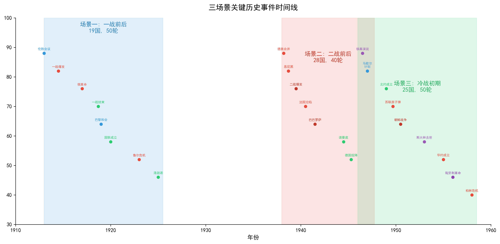
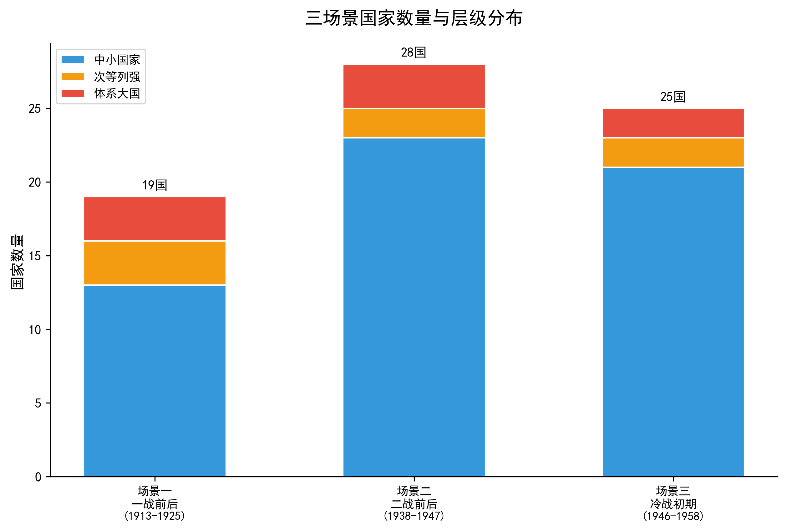
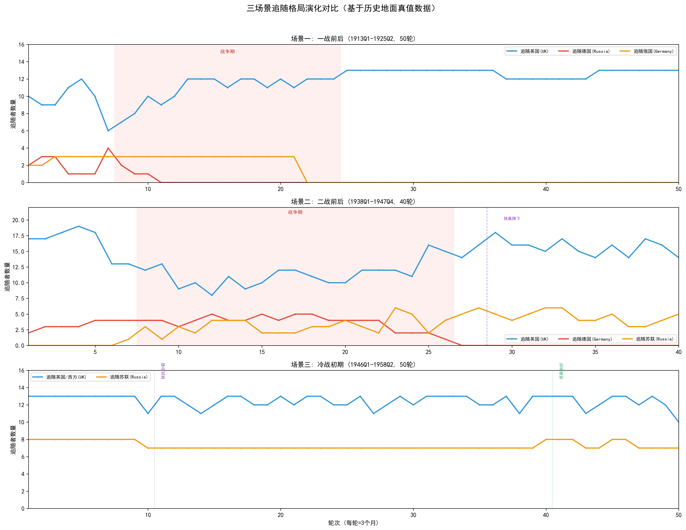
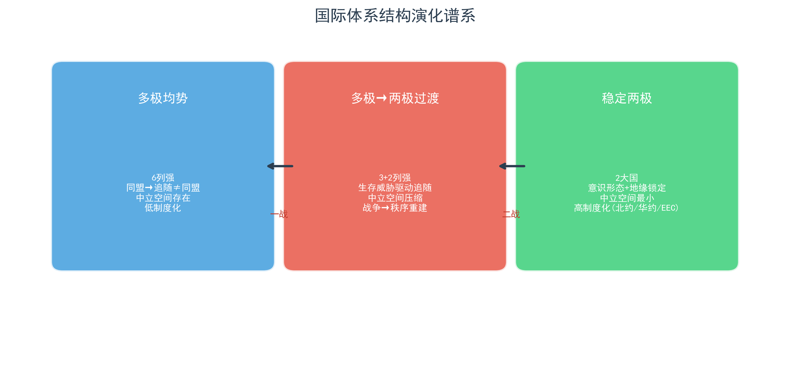

# 模型校验三场景：历史背景与国际格局

## 核心概念前置说明

在展开三个场景的历史背景之前，必须首先明确一个贯穿本研究的方法论区分：**追随不等于同盟**。

同盟（Alliance）是国家间通过正式或非正式条约建立的长期安全合作关系，具有制度化与持久性特征。同盟一旦缔结，通常延续数年甚至数十年，其存续不依赖于某一具体议题的变迁。追随（Following）则是在特定议题上对某一大国的政策立场表示认同，具有议题特定性与短期变动性。一国的追随对象随主导议题的变化而变化——在同一同盟框架内，盟国之间可能在特定议题上追随不同的大国；非同盟国也可能在某一议题上选择追随特定强国。

三个典型的跨场景案例可以说明这一区分的实质意涵：

第一，**意大利**。一战前意大利是三国同盟（德、奥、意）的正式成员，但在殖民扩张与海军议题上系统性地追随英国而非德国——在同盟义务与议题追随之间存在巨大的张力空间。冷战时期意大利作为北约创始成员国，同盟归属与议题追随完全重合——追随英国（及背后的美国）既是制度约束也是利益选择，"同盟≠追随"的张力随之消失。

第二，**法国**。一战前法国与俄国签有法俄军事同盟（1894年），但1913年主导议题为海军军备竞赛与殖民地争夺，法俄同盟对该议题没有约束力——法国在海军议题上协调英国而非俄国。直到1914年七月危机爆发后，法俄同盟的义务条款才被激活，法国转向追随俄国。

第三，**瑞士**。瑞士为永久中立国，从未加入任何军事同盟。但这并不意味着瑞士在一切议题上都保持中立——在安全均势议题上，瑞士明确倾向于英国主导的欧洲秩序；在经济议题上，瑞士与德国经济联系紧密。中立或非同盟不等于没有追随偏好。

本研究的历史地面真值数据严格贯彻了这一区分。每一个国家的逐轮追随标注，不是基于该国属于哪个同盟阵营，而是基于该国在该轮主导议题上的实际外交政策立场——该国在当时的国际环境下，更认同哪个大国在该议题上的立场和行动方向。

---

## 分析框架：领导类型与国际秩序的分类标准

在展开三个场景的具体分析之前，有必要先明确本研究用于刻画大国行为特征与国际体系性质的两套分类框架。这两套框架直接来源于仿真系统的理论设计（详见[仿真设计说明](../simulation_design/仿真设计说明.md)），在本历史背景文档中用于对历史真实情况进行同口径评述。

### 领导类型的四分类

本研究将道义现实主义理论中的国家领导类型操作化为四种，仅赋予大国与超级大国（中小国家不持有领导类型）：

| 类型 | 核心特征 | 行为约束 | 判别线索 |
|------|----------|----------|---------|
| **王道型** | 国家利益优先但坚守国际道义 | 禁止不尊重主权的高烈度对抗；尊重主权行为获道义加成；非尊重主权行为伴随声誉损失 | 是否主动遵守国际规范？是否在利益与道义冲突时接受道义成本？是否投资于国际制度建设？ |
| **霸权型** | 自身国家利益绝对优先，道义为工具性资源 | 禁止极端暴力但允许双重标准；实质利益行为优先；双重标准不触发声誉惩罚 | 是否在公开场合援引道义但私下违反？是否对不同对象采用不同标准？是否将国际制度视为可选择性约束？ |
| **强权型** | 完全忽视道义，以军事与强制为核心工具 | 仅禁止非常规大规模暴力；军事/强制类行为优先；非尊重主权无声誉损失 | 是否系统性地使用武力或武力威胁解决争端？是否公开蔑视国际规范？决策是否由实力计算主导而无道义考量？ |
| **昏庸型** | 个人利益优先，可主动偏离国家客观利益 | 唯一可偏离国家客观利益的类型；所有决策附加随机波动；无系统性策略偏好 | 决策是否服务于个人而非国家利益？是否存在明显的战略不一致或自我毁灭性行为？制度是否系统性地无法产生理性决策？ |

需要强调的是，这四种类型不是对历史人物道德品质的评判，而是对其**外交决策行为模式**的分析性归类。同一国家在不同时期可能由不同类型的领导集体执政（如英国在张伯伦与丘吉尔之间的转换），同一领导人也可能在任期内表现出类型的混合或过渡特征。分类的目的是为仿真模型的领导类型参数提供历史校准锚点，而非对历史人物做简单化的"贴标签"。

### 国际秩序的四象限分类

国际秩序的判定基于两个维度的交叉：

- **维度一：主权尊重比率** —— 尊重主权行为数占体系内总行为数的比例，阈值设定为60%。高于阈值意味着体系内大多数国家在大多数互动中承认彼此的主权权利；低于阈值意味着侵犯主权成为常态。
- **维度二：体系领导者的存在性** —— 是否存在一个国家获得超过60%的中小国家追随。存在明确领导者意味着体系具有等级制特征；不存在则意味着体系处于无政府性的竞争状态。

两个维度交叉形成四种秩序类型：

| | 有体系领导者（追随率≥60%） | 无体系领导者（追随率<60%） |
|---|---|---|
| **尊重主权（≥60%）** | **规范接纳型**：公认的领导者通过制度与规范维持秩序，追随基于议题认同而非武力强制 | **不干涉型**：无单一领导者但各国相互承认主权，秩序通过大国协调或均势机制维持 |
| **不尊重主权（<60%）** | **大棒威慑型**：领导者通过武力威胁或实际强制维持追随关系，秩序是等级制但非规范性的 | **恐怖平衡型**：无领导者且无规范约束，各方通过相互威慑和军备竞赛维持脆弱的稳定 |

这一四象限框架将国际秩序的讨论从单一维度拓展为"规范程度—集中程度"的二维空间。在本历史背景文档中，每一个场景的每一个阶段都将同时从这两个维度进行定性判定，以期为仿真模型的秩序涌现提供历史对照基准。

**方法论提醒**：上述秩序类型的判定存在**层级性**问题。同一时间点的全体系秩序类型可能与次体系（区域或阵营内部）的秩序类型不一致——例如冷战时期的全球体系处于大棒威慑或恐怖平衡之下，但西欧内部已经演进出接近规范接纳型的区域安排。下文在判定秩序类型时将明确说明判定所适用的体系边界。

---

以下三个场景构成了模型校验的前测实验基础。每个场景每轮仿真对应三个月现实时间，共同覆盖了从多极竞争到两极对峙的完整国际体系谱系。场景一（50轮，1913Q1—1925Q2）与场景二（32轮，1938Q1—1945Q4）之间为两次世界大战间歇期；场景二的终点（1945Q4，马歇尔计划提出）与场景三的起点（1946Q1）无缝衔接，构成从热战结束到冷战制度化的完整叙事链。

*图：三场景关键历史事件时间线*

---

## 一、场景一：一战前后的欧洲（1913Q1—1925Q2）

### 1.1 基本参数

| 指标 | 数值 |
|------|------|
| 场景编号 | Scene 1（校验编号ID22） |
| 时间范围 | 1913年第一季度—1925年第二季度 |
| 总轮数 | 50轮（每轮3个月） |
| 国家总数 | 19国 |
| CINC大国（power_share>0.10） | 德国（GMY，强权型）、俄国（RUS，强权型）、英国（UKG，王道型） |
| 中等强国（高于中位数） | 法国（FRN）、奥匈帝国（AUH）、意大利（ITA） |
| 小国（低于中位数） | 奥斯曼帝国（TUR）、保加利亚（BUL）、西班牙（SPN）、比利时（BEL）、希腊（GRC）、瑞典（SWD）、荷兰（NTH）、罗马尼亚（ROM）、葡萄牙（POR）、丹麦（DEN）、瑞士（SWZ）、塞尔维亚（YUG）、挪威（NOR） |

*图：三场景国家数量与层级分布*

### 1.2 初始国际格局

1913年的欧洲处于"武装和平"的暮年。体系呈现典型的**多极格局**：六国列强——英国、德国、法国、俄国、奥匈帝国、意大利——共同构成欧洲协调的主体，没有任何单一国家能够独霸体系。两大同盟阵营已经固化：一方是三国同盟（德国、奥匈帝国、意大利），另一方是三国协约（英国、法国、俄国）。两个集团之间的实力竞争是体系的核心动力学：任何一方的军备增长都被对方感知为威胁，进而触发反制性军备扩张，而扩张的结果又反过来验证了最初的威胁感知。

在这种多极均势结构之下，欧洲已经连续四十余年未发生大国间全面战争（自1871年普法战争结束以来），但这并非和平的证明而是危机的积累。巴尔干是体系最不稳定的次区域——奥斯曼帝国持续解体，新独立的巴尔干国家（塞尔维亚、保加利亚、希腊、罗马尼亚）在两次巴尔干战争（1912—1913年）中重新划定了领土与势力范围。大国在巴尔干的代理竞争构成了欧洲和平最脆弱的一环。各大国在1913年均被赋予特定的领导类型——德国与俄国的强权型、英国的王道型、法国的霸权型——这些类型的选择理据及其历史校准，详见模型校验章节。

#### 场景一各大国领导类型判定

**第一阶段：战前危机期（R1—R6，1913Q1—1914Q2）**

1913—1918年的德意志帝国在威廉二世治下呈现典型的**强权型**特征。威廉的"个人统治"（Persönliches Regiment）以军事强制为核心工具，决策以实力计算为主导，对国际规范持公开蔑视态度。其标志性特征包括：

- **决策的个人化与冲动性**：威廉在危机时刻以"空白支票"（1914年7月5—6日）的形式向奥匈帝国承诺无条件支持，甚至在未与政府协商的情况下做出这一决定。他随即前往挪威海域度假，从一份挪威报纸而非外交渠道得知奥匈最后通牒的内容——决策过程的任意性完全符合强权型领导对制度化决策程序的漠视。
- **军事手段的优先性**：德国在七月危机中将战争作为首选而非最后手段。总参谋长毛奇和军方在1914年已经事实上主导了德国的对外政策——施里芬计划的机械性执行（经中立国比利时入侵法国）表明军事理性压倒了一切政治与道义考量。
- **对国际规范的蔑视**：入侵中立国比利时（破坏1839年伦敦条约）、发动无限制潜艇战（1917年）、签署布列斯特-立托夫斯克条约以苛刻条件肢解俄国——这些行为均以赤裸裸的实力原则取代了任何对主权规范或条约义务的尊重。

值得注意的是，威廉的个人权威在1908年《每日电讯报》事件后已严重受损，到1914年他更像一个"影子皇帝"——军方和文官系统学会了绕过他的情绪波动来操控决策。然而，这种"个人统治的制度化替代"并未改变德国外交政策的强权型底色：无论决策中心在皇帝、军方还是文官系统之间如何转移，德国始终以军事优势和国家实力的最大化为核心目标，国际道义只具有工具性意义。

**俄国：尼古拉二世的强权型领导及其昏庸型决策波动**

1913—1917年的俄罗斯帝国在模型中被标注为**强权型**。这一标注的主要理据在于沙皇政府的外交政策取向——尼古拉二世政府以军事威慑为核心工具（1914年7月总动员、支持塞尔维亚对抗奥匈）、以泛斯拉夫主义为战略意识形态（俄国是"全体斯拉夫人的天然保护者"）、以大国战略竞争为基本框架（与德国和奥匈帝国在巴尔干的代理竞争）。这些行为模式在整体上符合强权型"以军事力量为核心工具、以实力计算驱动决策"的模型操作化定义。

然而，尼古拉二世个人的决策心理完全不符合强权型"坚定强制"的抽象。他在重大危机中表现出高度的**优柔寡断与决策波动**——1914年七月危机中，他在24小时内经历了"批准总动员→撤销→再批准"的反复，任何足够强硬的顾问都能改变他的立场。他的决策基础不是系统性的战略分析，而是个人宗教宿命论（生于圣约伯纪念日，"我已准备好接受命运"）、直觉信念（"我从不准备接见时要说什么，而是祈求主上帝，说出内心涌现的话"）、以及对专制制度的非理性信念（将"上帝赋予的专制权力"置于国家现代化需求之上）。1915年9月他亲赴前线担任俄军最高统帅——这是一战中最具灾难性的个人决策之一——将此后所有军事失败直接绑定在自己身上，同时在后方引发了制度性的"部长跳跃"（16个月内更替4位总理、5位内政部长、3位战争部长）。到1917年初，军队、杜马、贵族乃至皇室成员都向他发出改革警告，他全部忽略——"周围都是背叛、怯懦和欺骗"的退位日日记是对自己责任的彻底否认。

因此，模型对俄国在场景一中标注为**强权型**带有重要的限定：这是基于沙皇政府**整体外交政策行为**的类型判定，而非对尼古拉个人决策心理的还原。尼古拉的决策心理具有显著的昏庸型特征——优柔寡断、缺乏系统策略偏好、以个人信念替代国家利益计算。模型通过 `leader_profile` 机制（`PROFILE_RUS_1913`）在提示词层面注入了这些昏庸型决策波动特征（优柔寡断-被动默许波动、和平主义-好战矛盾、私人外交易受操纵），而在形式参数层面维持强权型的行为权重——这一设计选择反映了经验现实：沙皇俄国的外交政策以军事竞争与大国战略对抗为核心取向，但具体决策过程缺乏强权型所假设的"系统性实力计算"。

尼古拉二世的统治在1917年二月革命中终结——其决策的累积后果——俄国的军事崩溃与布尔什维克夺权——从根本上重塑了此后整个二十世纪的国际格局。

**英国：阿斯奎斯/劳合·乔治的王道型领导**

1913—1922年的英国是三个场景中王道型领导最为完整的实例。尽管阿斯奎斯（1908—1916年执政）与劳合·乔治（1916—1922年执政）在个人风格上差异极大——前者以从容不迫的绅士做派著称，后者以灵活务实著称——但两人在外交决策上共享了王道型的核心特征：

- **国家利益与国际规范的平衡**：英国参战的法律依据是对比利时中立的条约保证（1839年伦敦条约）。无论这一理由在多大程度上是动员国内支持的修辞策略，它确实意味着英国的决策框架要求提供国际合法性论证——这与德国和俄国的行为形成了鲜明对比。
- **战争行为中的规范约束**：尽管英国的战争手段同样造成了巨大破坏（海军封锁导致德国粮食短缺），但英国在整个战争期间遵守了基本的战争法框架（未使用化学武器首攻、保护战俘基本待遇、维持文官政府对军方的基本控制），并且其行为受到国内议会辩论和公众舆论的持续监督。
- **战后秩序的制度建设**：凡尔赛和会上，劳合·乔治反对法国对德国的过度报复（1919年3月的枫丹白露备忘录警告严苛条款将制造"一个新的阿尔萨斯-洛林"），支持建立国际联盟作为集体安全机制——这些立场体现了王道型领导用制度而非纯粹武力来构建长期秩序的偏好。虽然凡尔赛体系的最终失衡证明这些努力并未成功，但"在实力约束下追求规范化的秩序"这一取向本身定义了王道型的行为模式。
- **与美国关系的处理**：劳合·乔治在战后认识到美国的经济和金融权力的结构性上升，积极推动英美合作而非对抗。这种对实力变迁的务实接受——而非像德国或俄国那样试图以武力逆转——也符合王道型领导的特征。

英国的例外来自1919—1921年的部分时期，即格雷的"战时外交"向劳合·乔治的"战后秩序"过渡之间的短暂动荡期。在对爱尔兰独立战争（1919—1921年）的镇压中使用了"黑棕部队"进行系统性暴力——大量文献记载了这一暴力行为谱系。此外，英国在整个帝国范围内维持着一个庞大的殖民强制体系（1919年阿姆利则惨案是证明），而巴黎和会期间的某些决策（为日本的"种族平等条款"投了沉默的反对票，部分原因是为了避免与澳大利亚等白人自治领的紧张关系）也暴露了英国种族等级的世界观。这些表明：即便是王道型国家，其道义承诺也是**有边界和选择性的**——规范约束在战胜国之间、欧洲内部表现最强，而在殖民地或种族议题上则大幅削弱。这恰恰是王道型领导"国家利益优先但接受道义约束"这一操作化定义的含义：接受约束不是无条件的，而是有范围的。

**法国：普恩加莱/克列孟梭——王道型与霸权型之间的张力**

法国的领导类型在1913—1920年间处于王道与霸权之间，但总体倾向于**王道型**。普恩加莱（1913—1914年任总统，1914—1917年更以总理身份实际主导对外政策）利用法俄同盟防御条款约束法国不先发制人，指示军队在边境10公里内保持克制以"不给德国留下法国挑衅的印象"——这是王道型领导对国际规范审慎态度的体现。克列孟梭（"老虎"，1917—1920年执政）在凡尔赛和会上对德国持严苛立场（主张莱茵兰独立、要求天价赔款），但这些要求是在国际会议的制度框架内通过谈判追求，而非像德国那样以单边军事行动推行——他从侵略性现实主义立场出发，但接受制度程序的约束。法国在战时对殖民地士兵的使用和殖民统治方式方面继承了与英国相同的殖民帝国逻辑——这是作为殖民帝国而非单纯王道型国家的制度遗产。

**奥匈帝国：中等强国（无正式领导类型，以leader_profile注入决策特征）**

1913—1918年的奥匈帝国在模型框架中是中等强国（CINC权力占比0.0723，低于0.10的多极大国门槛），按模型规则不赋予正式的 `leader_type`，其行为不由领导类型行为权重调节。然而，奥匈帝国在七月危机中的制度性功能失调——二元君主制的制度架构本身（两个主权邦联国家共享同一个君主、外交政策和军队）使得任何系统性的国家战略几乎无法产生——是三个场景中最具悲剧性的决策失败案例之一。

1914年7月斐迪南大公遇刺后，帝国花了整整三周才发出对塞尔维亚的最后通牒。这种决策的极度迟缓并非审慎的产物，而是制度性僵化瘫痪和匈牙利总理蒂萨的拖延战术的结果。当最后通牒发出时，所有的外交窗口都已关闭。帝国内部，康拉德·冯·赫岑多夫（总参谋长）在明知军力不足以同时应对俄国和塞尔维亚的情况下，坚持两线作战——军事系统无法将现实评估转化为战略调整，因为没有一个统一的决策中心可以否决军方的乐观主义。康拉德仅在1913年一年内就提议对塞尔维亚发动预防性战争25次，将贝尔格莱德的每一个中立外交行为都解读为"敌对挑衅"，同时长期设定一个关键假设——俄国不会为了保护塞尔维亚而与奥匈开战——这一假设在1914年7月被证明灾难性地错误。

模型通过 `leader_profile` 机制（`PROFILE_AUH_1913`，标注为昏庸型Conrad校准）在提示词层面注入了这些决策特征——弱邻预防性战争冲动、多线作战致命诱惑、盟友意图灾难性误判、战术胜利后战略盲目、敌人能力系统性低估、向军方鹰派屈服——但不施加昏庸型的正式行为权重（如±0.2随机波动等）。这一设计选择使AUH的行为在决策语义层面保留了其历史行为特征的昏庸面向，同时在形式参数层面遵守CINC阈值的极性判定规则——不将中等强国纳入大国领导类型的竞争框架。

**意大利：议题性的类型游离**

意大利在整个场景一中的追随行为最为戏剧性地展示了"领导类型"与"追随行为"之间的非对称关系。意大利在三国同盟期内被标注为部分追随德国，但在海军与殖民议题上系统性地追随英国——这意味着"议题追随"可以独立于同盟关系而存在。意大利的决策模式中既有霸权型（对奥斯曼帝国发动战争夺取利比亚，1911—1912年）也有王道型（通过1915年伦敦密约以谈判方式合法地转换阵营）的成分。这种混合特征——议题独立的灵活性+制度工具主义+国家利益优先但不完全忽视规范——是霸权型领导对弱小对手表现为强权而对强大对手表现为实用算计的经典模式，正是霸权型中"双重标准"的体现：规范只是工具，态度因实力而变。

### 1.3 国际格局、秩序类型与追随格局的演化

**第一阶段：战前危机期（R1—R6，1913Q1—1914Q2）**

**秩序类型：不干涉型** —— 主权仍然被形式上尊重（伦敦会议的外交框架仍在运作），但不存在任何单一国家获得超过60%的追随率——德、俄、英三国均在不同议题上拥有追随者，但没有任何一国构成体系领导者。主权尊重率处于中等水平（0.5-0.6）：伦敦会议以多边外交方式处理巴尔干领土安排，布加勒斯特条约虽以强制为后盾但仍保留了条约形式；但大国已在巴尔干通过代理竞争蚕食主权规范——奥匈帝国对塞尔维亚的最后通牒即将打破这一脆弱平衡。

主导议题依次为伦敦会议（巴尔干领土安排）、第二次巴尔干战争、布加勒斯特条约、李曼·冯·桑德斯危机、英德海军竞赛，以及殖民竞争与同盟体系巩固。这一时期国际格局的基本特征是：**多极均势下的同盟两极化**。追随格局清晰但不绝对——奥匈帝国、奥斯曼帝国、保加利亚追随德国；法国、比利时、荷兰、葡萄牙、丹麦、瑞典、瑞士、挪威追随英国；塞尔维亚追随俄国。但意大利作为三国同盟成员国，却在殖民与海军议题上系统地追随英国（同盟不等于追随的经典案例），而法国作为法俄同盟成员国，在海军议题上也选择协调英国而非俄国。

**第二阶段：大战爆发与阵营锁定（R7—R8，即1914Q3—Q4）**

**秩序类型：恐怖平衡型** —— 主权尊重率骤降至最低水平（<0.3）。奥匈帝国向塞尔维亚发出最后通牒、德国经中立国比利时入侵法国、俄国全面动员——每一方都在违反此前被承认的国际规范。没有任何国家可以被认定为体系领导者：同盟两大阵营各自拥有追随者，但没有任何一国获得超过60%的跨阵营追随率。体系处于毫无规范约束的全面对抗状态。

七月危机（R7）是体系性质的转折点。斐迪南大公被刺后，奥匈帝国向塞尔维亚发出最后通牒——同盟体系的链式卷入机制被激活：俄国支持塞尔维亚，德国支持奥匈帝国，法国激活法俄同盟义务，德国经比利时入侵法国触发英国参战。值得注意的是，法国在R7从追随英国转向追随俄国——这是法俄军事同盟义务压倒议题追随的唯一时刻；R8法国又转回追随英国（英法战场协调的实际需要）。R8大战全面爆发后，欧洲各国迅速进入阵营模式：奥匈、奥斯曼、保加利亚追随德国；比利时、西班牙、葡萄牙、丹麦、挪威追随英国；塞尔维亚追随俄国。

**第三阶段：大战进程与阵营动态（R9—R23，1915Q1—1918Q3）**

**秩序类型：恐怖平衡型** —— 主权尊重率维持在极低水平（<0.2）。毒气战（1915年）、无限制潜艇战（1917年）、东线强制占领和民族清洗式的人口迁移、布列斯特-立托夫斯克条约对俄国领土的肢解——每一个事件都将体系拉离规范与制度更远一步。同盟国与协约国两大阵营内部各自拥有明确的追随层级，但不存在跨越阵营界限的体系领导者——两大阵营之间的互动完全由军事力量的逻辑支配。

这一阶段见证了阵营内部的一系列重新排列。R10（1915年4—6月）意大利根据伦敦密约从三国同盟转向协约国，追随英国——这是同盟制度在战争激励下"重写"追随关系的典型案例。R12（1915年10—12月）保加利亚加入同盟国，塞尔维亚流亡政府从追随俄国转为追随英国。R17（1917年1—3月）俄国二月革命后沙皇退位，国际格局开始动摇。R18（1917年4—6月）美国参战，协约国阵营获得决定性的人力与物质增援。R20（1917年10—12月）俄国十月革命，布尔什维克夺取政权，俄国开始退出战争。R22（1918年4—6月）奥匈帝国从追随列表中消失——帝国内部民族矛盾已不可弥合。R23（1918年7—9月）百日攻势中保加利亚和奥斯曼先后投降，同盟国体系瓦解。这一阶段的国际格局以**全面战争下的阵营极化**为特征——中立空间被压缩到接近于零，不站队几乎等于站错队。

**第四阶段：战后秩序重建（R24—R50，1918Q4—1925Q2）**

**秩序类型：从恐怖平衡逐步过渡到不干涉型，末期接近规范接纳型**。R24（1918年10—12月）停战标志着旧秩序的终结。德国与奥匈帝国崩溃，奥匈帝国从此永久消失于国家列表中。此后26轮呈现出一个从混乱走向收敛的过程：凡尔赛体系确立（R25—R28，1919年Q1—1920年Q4）——主权尊重率开始从谷底回升，但战胜国对战败国的强制条款（领土割让、军备限制、巨额赔款）使体系仍带有大棒威慑的残余色彩；国际联盟建立与集体安全尝试（R29—R31，1921年Q1—Q3）——制度化的规范框架确立，体系进入**不干涉型**（多国协调但无单一领导者）；战后经济安排与赔款争议（R33—R39，1921年Q4—1923年Q3，包括道威斯计划与鲁尔危机的解决）——法国对比利时占领鲁尔（1923年）是主权侵犯事件，但在英美的调停下通过经济安排化解，体系维持在不干涉型框架内；洛迦诺体系与法德和解（R41—R48，1923年Q4—1925年Q1）——德国被接纳为平等谈判伙伴，主权尊重率进一步回升，英国的追随率达到或接近60%，体系接近**规范接纳**；洛迦诺后的欧洲稳定期（R49—R50，1925年Q1—Q2）。

这一时期的追随格局发生了结构性变化。**几乎所有国家最终都追随英国**——包括曾经追随德国的意大利和曾经追随俄国的塞尔维亚。英国主导了凡尔赛–洛迦诺体系，国际联盟成为英国秩序的制度载体。追随英国的名单涵盖：法国、意大利、西班牙、比利时、希腊、瑞典、荷兰、罗马尼亚、葡萄牙、丹麦、瑞士、塞尔维亚、挪威——这是一个从多极对抗到**英国单极时刻**的完整过渡。

但英国的单极时刻是脆弱的。美国已重返孤立主义，苏联被排除在国际体系之外，德国被解除武装但心怀怨恨。这一短暂的权力集中格局只有不到二十年的寿命，它将被场景二所描摹的力量所撕裂。

---

## 二、场景二：二战前后的欧洲（1938Q1—1945Q4）

### 2.1 基本参数

| 指标 | 数值 |
|------|------|
| 场景编号 | Scene 2（校验编号ID25） |
| 时间范围 | 1938年第一季度—1945年第四季度 |
| 总轮数 | 32轮（每轮3个月） |
| 国家总数 | 28国 |
| CINC大国（power_share>0.10） | 苏联（RUS，霸权型）、德国（GMY，强权型）、英国（UKG，王道型） |
| 中等强国（高于中位数） | 法国（FRN）、意大利（ITA，霸权型） |
| 小国（低于中位数） | 波兰（POL）、西班牙（SPN）、捷克斯洛伐克（CZE）、比利时（BEL）、罗马尼亚（ROM）、土耳其（TUR）、南斯拉夫（YUG）、瑞典（SWD）、荷兰（NTH）、匈牙利（HUN）、希腊（GRC）、葡萄牙（POR）、卢森堡（LUX）、丹麦（DEN）、芬兰（FIN）、瑞士（SWZ）、保加利亚（BUL）、挪威（NOR）、拉脱维亚（LAT）、立陶宛（LIT）、爱尔兰（IRE）、爱沙尼亚（EST）、阿尔巴尼亚（ALB） |

### 2.2 初始国际格局

1938年初的欧洲处于凡尔赛体系的废墟之上。场景一结尾那个"英国单极时刻"已经瓦解——美国远在大西洋彼岸且未加入国联，苏联被排除在欧洲外交主流之外，英国和法国虽然是名义上的战胜国但国力已相对衰落，纳粹德国则在重整军备后迅速崛起。体系呈现**多极衰落向两极过渡**的独特结构：旧的多极均势（英法德意苏）已不再运转，但新的两极结构（美苏）尚未形成。

中小国家的数量从场景一的13个激增至场景二的23个——这是凡尔赛体系"民族自决"原则的制度遗产。奥匈帝国被肢解为奥地利、匈牙利、捷克斯洛伐克、南斯拉夫等继承国；波罗的海三国（爱沙尼亚、拉脱维亚、立陶宛）和芬兰从俄罗斯帝国独立；波兰在消失一百二十三年后重新出现于欧洲地图。但这些新国家面临的结构性生存压力是严峻的——它们夹在德国和苏联之间，自身的国力不足以独立生存，却又缺乏可信的集体安全保障。国际联盟的集体安全机制在1935年意大利入侵埃塞俄比亚和1936年德国重占莱茵兰的两次危机中已被证明形同虚设——弱国的安全选择从"加入联盟以求保护"退化为"选择追随谁以求不被吞并"，正是这一结构性退化的结果。各大国在1938年均被赋予特定的领导类型——苏联的霸权型、德国的强权型、英国的王道型——这些类型的选择理据及其历史校准，详见模型校验章节。

#### 场景二各大国领导类型判定

**德国：希特勒的强权型领导**。1938—1945年的纳粹德国是三个场景中**强权型**最极端的实例：从原则上否定国际规范对德国行为的约束力（种族竞争和生存空间争夺是唯一的国际逻辑）；军事强制作为唯一的扩张手段；种族意识形态凌驾于战略理性之上（1941年12月莫斯科战役受挫后对美国宣战是军事乐观主义压倒理性计算的经典实例）。与威廉二世的差异在于：威廉是决策的冲动和不稳定，希特勒是以极端的意识形态一致性将整个国家机器绑定向毁灭。

**苏联：斯大林的霸权型领导**。斯大林的外交行为以霸权型的"双重标准"为核心特征——1939年莫洛托夫-里宾特洛甫协定使两个意识形态死敌在一夜之间联手并秘密划分东欧；对芬兰（成本过高时计算性退让）与对波罗的海三国（通过伪造的"合法程序"吞并）的差异化操作显示了霸权型"工具性地使用制度形式"的能力。与希特勒的根本区别在于：斯大林1941年被入侵后表现出巨大的战略灵活性——解散共产国际、接受美援、将战争目标从生存升级为战后势力范围划定——这种在约束下优化利益的能力是强权型不具备的。

**英国：张伯伦（霸权型）→丘吉尔（王道型）→艾德礼（王道型）的转型**。张伯伦的绥靖政策是霸权型逻辑——以牺牲捷克斯洛伐克为代价换取"我们时代的和平"，将核心利益置于规范约束之上。丘吉尔在1940年5—6月法国沦陷后拒绝以承认德国霸权换和平——在成本极高时仍将道义与独立纳入计算——是王道型领导的决定性时刻。艾德礼的工党政府启动了去殖民化（印度1947年独立）和北约筹建。但即便是丘吉尔和艾德礼，其道义承诺也有边界——王道型不是圣徒模式，而是"国家利益优先但接受道义约束"。

**法国：从霸权型瘫痪到昏庸型维希再到戴高乐的王道型**。达拉第/雷诺与张伯伦共享绥靖逻辑。维希政权的贝当政府将个人政治生存和意识形态偏好置于国家利益之上——自愿与纳粹合作包括主动制定反犹立法——是经典昏庸型。戴高乐在沦陷后拒绝停战、从伦敦号召抗战——接受近乎无望的处境而坚持国家尊严——是王道型最纯粹的时刻之一。

**意大利：墨索里尼从霸权型走向昏庸型**。1930年代的外交行为符合霸权型（公开宣扬和平与国际联盟，私下武装干涉西班牙、用化学武器入侵埃塞俄比亚）。1940年6月在法国崩溃后参战——"我只需要几千具尸体就可以和战胜者一起坐在和平谈判桌上"——是昏庸型的经典体现：国家利益屈从于个人政治形象。1943年后的萨洛傀儡共和国代表了个人昏庸的终极形式。

### 2.3 国际格局、秩序类型与追随格局的演化

**第一阶段：绥靖时代与德国的和平扩张（R1—R5，1938Q1—1939Q1）**

**秩序类型：不干涉型** —— 主权形式上被尊重但实质上不断被侵蚀。英国"默认领导"但追随率未达60%（意大利、匈牙利、保加利亚、阿尔巴尼亚追随德国）。慕尼黑会议上以"大国协调"为名的领土交易——捷克斯洛伐克被排除在谈判之外——是对主权规范最具破坏性的打击。主权尊重率表面维持在中等水平（0.4-0.5），但这恰恰是不干涉型秩序的致命弱点：表面"高"主权尊重掩盖了危险的现实——对小国主权的最严重侵犯以"大国协调"和"领土调整"的名义实施，而不干涉型秩序缺乏阻止此类侵犯的执行力。

主导议题依次为德奥合并前奏、德奥合并实现、苏台德危机、慕尼黑会议、德国吞并残存捷克斯洛伐克。

**秩序类型：不干涉型** —— 主权形式上被尊重但实质上不断被侵蚀。英国"默认领导"但追随率未达60%（意大利、匈牙利、保加利亚、阿尔巴尼亚追随德国）。慕尼黑会议上以"大国协调"为名的领土交易——捷克斯洛伐克被排除在谈判之外——是对主权规范最具破坏性的打击。主权尊重率表面维持在中等水平（0.4-0.5），但这恰恰是不干涉型秩序的致命弱点：表面"高"主权尊重掩盖了危险的现实——对小国主权的最严重侵犯以"大国协调"和"领土调整"的名义实施，而不干涉型秩序缺乏阻止此类侵犯的执行力。

主导议题依次为德奥合并前奏、德奥合并实现、苏台德危机、慕尼黑会议、德国吞并残存捷克斯洛伐克。这是英国主导的绥靖政策的顶峰也是终点。追随格局在这一时期呈现**分散化的单极残余**：绝大多数中小国家追随英国（法国、波兰、捷克斯洛伐克、比利时、罗马尼亚、南斯拉夫、土耳其、荷兰、希腊、葡萄牙、卢森堡、丹麦、芬兰、瑞士、挪威、波罗的海三国），仅有意大利、匈牙利、保加利亚、阿尔巴尼亚追随德国。R5德国吞并残存捷克斯洛伐克后，绥靖政策彻底破产，英法匆忙向波兰和罗马尼亚提供安全保证。

**第二阶段：二战爆发与轴心扩张（R6—R15，即1939Q2—1941Q3）**

**秩序类型：恐怖平衡型** —— 主权尊重率骤降至谷底（<0.2）。

R6（1939年4—6月）纳粹–苏联条约（莫洛托夫–里宾特洛甫协定）以震撼性的方式重新排列了欧洲的权力政治：两个意识形态上的死敌在外交上突然联手，波兰被夹在中间。R7（1939年7—9月）德国入侵波兰，英法对德宣战，第二次世界大战正式爆发。苏联同时从东面入侵波兰并强行吞并波罗的海三国——爱沙尼亚（R7，1939年Q3）、拉脱维亚和立陶宛（R8，1939年Q4）相继被迫从追随英国转向追随俄国，这不是议题追随而是武力胁迫下的制度性归属变更。

芬兰在苏芬冬季战争（R8—R9，即1939年Q4—1940年Q1）中的命运构成了与波罗的海三国截然不同的对比：芬兰在军事上战败并割让领土，但未被苏联全面吞并——R8芬兰仍追随英国，R9转为中立，主权至少在形式上得以保存。然而，随着法国沦陷（R10）后欧洲力量平衡的剧变，芬兰在R10—R14期间转向追随苏联——这是一种生存驱动的外交调适，而非意识形态认同或武力吞并。直到巴巴罗萨行动（R15）后，芬兰才重新转回追随英国。这一轨迹精确地揭示了胁迫与追随之间的本质区别：波罗的海三国被消灭，追随的变更源于主权本身的消失；芬兰的主权得以保存，其追随变更反映的是生存压力下的战略计算。

R10（1940年4—6月）法国闪电沦陷——六周之内西欧最大的陆军强国崩溃。法国退出了追随体系（国家事实上的主权行为能力暂时消失）。R11—R12（1940年Q3—Q4）英国单独抵抗，意大利参战追随德国，匈牙利、罗马尼亚、保加利亚相继加入轴心国阵营。R13（1941年1—3月）南斯拉夫发生了反轴心政变——"南斯拉夫找到了自己的灵魂"（丘吉尔语）——在德国军事压力最大的时刻选择追随英国而非德国，尽管这将招致毁灭性的报复（R14，1941年4—6月德军入侵）。

R15（1941年7—9月）**巴巴罗萨行动**——德国入侵苏联，东线开辟。这是整个场景的结构性转折：苏联从德国的准盟友变成英国的盟国，欧洲战争转变为全球性的意识形态战争。芬兰在此轮从追随俄国转为追随英国——借德国之力收复冬季战争中失去的领土，但对德国保持外交距离。

**第三阶段：同盟反攻与阵营重构（R16—R27，即1941Q4—1944Q3）**

**秩序类型：从恐怖平衡向大棒威慑过渡** —— 主权尊重率从谷底开始回升但仍处于低位（0.25-0.35）。

R16（1941年10—12月）莫斯科保卫战成功和珍珠港事变后美国参战——大同盟（英、美、苏）正式形成。英国追随者数量从R15的10国增至12国。R17（1942年1—3月）法国（以自由法国/流亡政府形式）重新出现在追随列表中，追随英国。R18—R19（1942年Q2—Q3）斯大林格勒战役——德军在东线的进攻锋芒首次被钝化。R22—R23（1943年Q2—Q3）库尔斯克会战——德军在东线的进攻能力被永久耗竭。R23地面真值数据显示意大利从追随德国转向追随英国——巴多格里奥政府宣布停战，这是意大利第二次阵营转换，也是"同盟不等于追随"的经典例证：意大利与德国的同盟义务在军事溃败面前被政治生存逻辑所覆盖。

R25（1944年1—3月）雅尔塔会议——三大国划定战后势力范围，波兰边界被重新划定。地面真值数据显示**波兰和罗马尼亚在R25同步从追随英国转向追随苏联**——这是整个场景中最重要的追随格局转变之一，发生在数据中1944年Q1的轮次。R26（1944年4—6月）德国投降——希特勒死亡，德国被分区占领，联合国宪章签署。芬兰在R26转向追随苏联。R27（1944年7—9月）波茨坦会议——广岛和长崎原子弹爆炸，日本投降。捷克斯洛伐克在R27转向追随苏联。匈牙利和保加利亚在这一阶段的中后期（R25—R29）逐步完成从追随德国到追随苏联的转换。

**第四阶段：战争终结与两极雏形（R28—R32，即1944Q4—1945Q4）**

**秩序类型：大棒威慑型** —— 英苏各自在势力范围内维持超过60%的阵营内追随率，但东欧国家的追随是在苏军占领的现实下形成的。

R28（1944年10—12月）铁幕降临——苏联在东欧的势力范围巩固，英国主导西欧重建，希腊内战开始。R29（1945年1—3月）丘吉尔在富尔顿发表"铁幕演说"——冷战辞令升级。地面真值数据显示这是一个关键的结构性时刻：**匈牙利和南斯拉夫在R29同步从追随德国/英国转向追随苏联**，至此东欧各国（波兰、罗马尼亚、匈牙利、南斯拉夫、捷克斯洛伐克、保加利亚、芬兰）已全部纳入苏联追随体系。R30（1945年4—6月）巴黎和平条约最终化——对意大利、罗马尼亚、匈牙利、保加利亚、芬兰的战后安排达成，边界调整。R31（1945年7—9月）杜鲁门主义宣布——美国承诺支持希腊和土耳其，遏制政策被正式制度化。R32（1945年10—12月）马歇尔计划提出——美国大规模经济援助欧洲，苏联拒绝并禁止东欧参与。

场景在此结束。此时二战的热战阶段已经结束，战胜国之间的战后安排已基本完成，冷战的政治框架（铁幕划分、杜鲁门主义、马歇尔计划）已经成形——但冷战的制度化（北约、华约、两个德国、经互会）尚未发生。这一截断使场景二与场景三（1946Q1—1958Q2）在时间上无缝衔接：场景二的最后一轮（1945Q4）正好是场景三第一轮（1946Q1）的前一刻。

---

## 三、场景三：冷战初期的欧洲（1946Q1—1958Q2）

### 3.1 基本参数

| 指标 | 数值 |
|------|------|
| 场景编号 | Scene 3（校验编号ID26） |
| 时间范围 | 1946年第一季度—1958年第二季度 |
| 总轮数 | 50轮（每轮3个月） |
| 国家总数 | 25国 |
| CINC大国（power_share>0.10） | 苏联（RUS，强权型）、英国（UKG，王道型） |
| 中等强国（高于中位数） | 法国（FRN）、意大利（ITA，王道型） |
| 小国（低于中位数） | 波兰（POL）、西班牙（SPN）、土耳其（TUR）、捷克斯洛伐克（CZE）、比利时（BEL）、荷兰（NTH）、瑞典（SWD）、南斯拉夫（YUG）、罗马尼亚（ROM）、匈牙利（HUN）、希腊（GRC）、保加利亚（BUL）、葡萄牙（POR）、卢森堡（LUX）、丹麦（DEN）、瑞士（SWZ）、挪威（NOR）、芬兰（FIN）、爱尔兰（IRE）、阿尔巴尼亚（ALB）、冰岛（ICE） |

### 3.2 初始国际格局

1946年初的欧洲处于战时同盟解体与冷战结构成型的过渡时刻。与场景二不同，场景三的初始状态已经是**两极格局的早期形态**——苏联在东欧驻有大量军队并控制着该地区的政治进程，英国和法国在西欧努力重建，而美国虽然不在模型国家列表中，但其对西欧的战略承诺（通过马歇尔计划与北约）使英国成为西方阵营的制度代表。

场景三在时间上从场景二的终点（1945Q4）的次季度开始——场景二的最后一轮以马歇尔计划的提出和苏联对东欧的经济强制收束，场景三的第一轮（1946Q1）则从冷战进入制度化轨道开始叙述。两个场景的覆盖范围与焦点不同：场景二以战争进程与战后安排为主要叙事线索，场景三则聚焦冷战本身的制度化过程——从非正式的势力范围划分（铁幕）到正式的同盟体系（北约、华约），从经济安排的竞争（马歇尔计划vs经互会）到意识形态的两极化（杜鲁门主义、共产党情报局）。

#### 场景三各大国领导类型判定

**苏联：从斯大林（强权型）到后斯大林/赫鲁晓夫（强权型内部松动）**

1946—1953年的斯大林延续了场景二中识别的霸权型逻辑但在场景三模型中被标注为**强权型**——这一操作化决定基于以下理据：战后苏联在东欧的行为模式——通过苏军占领、安全机构渗透和傀儡政府建立实现控制——核心工具是军事强制而非制度构建；对东欧各国的非直接吞并（波罗的海三国除外）并非源于对主权规范的尊重，而是因为间接控制降低了统治成本同时避免了与西方的直接军事冲突。柏林封锁（1948—1949年）以武力威胁为核心手段——切断西方进入柏林的通道，迫使对方在地缘政治问题上让步——当空运证明封锁无效后计算性地退让，这反映了强权型"以军事力量为核心工具"的基本特征而非霸权型的"制度工具主义"。捷克政变（1948年）以大规模街头暴力威胁和警察镇压为手段完成，展示了强权型对国际规范"完全忽视"的取向。

强权型标注与历史现实之间最显著的张力在于斯大林的"双重标准"能力：1939年莫洛托夫-里宾特洛甫协定、对芬兰的战役退让与对波罗的海的强制吞并——这些在不同对象间灵活切换策略的行为，在场景二中被判定为霸权型特征。然而在场景三中，战后苏联在东欧的行为整体更接近强权型的操作化定义——军事存在和强制手段是追随关系的最终保障，经互会和华约等制度安排是对既成军事现实的制度化追认而非先行构建。模型在提示词层面通过 `leader_profile` 机制（`PROFILE_RUS_1946`）注入了斯大林的意识形态过滤、延迟冲突偏好和原子弹焦虑等决策特征，这些特征的实际效果是使强权型的军事逻辑在特定情境下表现出策略性的审慎——但审慎的底色是实力计算而非道义考量。

1953年斯大林去世后的集体领导过渡期，以及赫鲁晓夫时代（1954—1958年），标志着强权型内部的松动而非转型。赫鲁晓夫的去斯大林化——秘密报告（1956年）、释放数百万政治犯、承认"通向社会主义的不同道路"——是真诚的国内改革。对外承认资本主义国家的主权（"和平共处"路线），取消对"资本主义总危机"的教条式坚持。然而，这些改革从未触及苏联以军事力量维持势力范围的核心逻辑：1953年东德工人起义和1956年匈牙利革命均被苏联坦克镇压——当纳吉·伊姆雷宣布匈牙利退出华约时，强权型的强制工具立即压倒了对"不同道路"的修辞承诺。1957年斯普特尼克升空后苏联获得对美核威慑能力，进一步强化了以军事实力为基础的国际地位诉求。在模型的操作化框架中，赫鲁晓夫时代的苏联仍然是强权型——其决策由实力计算主导，军事力量是维护阵营统一的终极保障，而"和平共处"路线是在核对称条件下的策略调整，不构成类型的根本转变。

**英国：艾德礼（王道型） → 丘吉尔（王道型） → 艾登（霸权型） → 麦克米伦（王道型）**

英国在场景三期间经历了最为显著的领导类型波动：

- **克莱门特·艾德礼（1945—1951年任首相）——王道型**：主动去殖民化（印度1947年独立）、支持联合国创建、推动北约制度化。行为统一指向王道型——在承认帝国结构不可持续的前提下，通过制度建设和有序权力转移维护核心利益。
- **温斯顿·丘吉尔（1951—1955年任首相）——王道型**：77岁重返首相职位，帝国本能受现实约束。尽管对去殖民化远不如艾德礼热情，但真诚地通过峰会追求和平（1953年提议大国首脑会议，1954年百慕大会面）。1954年最终同意从苏伊士基地撤军是对帝国现实的结构性接受。
- **安东尼·艾登（1955—1957年任首相）——霸权型**：苏伊士危机（1956年）是外交生涯的定义性失败——公开援引国际法和道义谴责纳赛尔，私下与法国和以色列秘密勾结制造军事干预借口（1956年10月塞夫勒秘密会议），事后在议会撒谎、下令销毁协议副本。对一个安理会常任理事国而言，公然违反联合国宪章的行为对英国国际信誉造成了不可挽回的损害，且暴露了英国在未经美国同意的情况下已无法独立行使大国权力。
- **哈罗德·麦克米伦（1957—1958年任首相）——王道型**：苏伊士惨败后全面修复英美"特殊关系"，启动对帝国的"审计"并加速去殖民化，接受英国相对衰落的现实并在约束下寻求最优解。

**法国：第四共和国体制性昏庸与戴高乐的王道型归来**

法国在场景三中经历了从昏庸型体制崩溃到王道型领袖归来的戏剧性转变。**第四共和国（1946—1958年）**是昏庸型领导的系统性、体制性体现——12年内更换25届政府，总理平均任期不足6个月。宪法将权力集中于极度碎片化的国民议会，没有任何单一政党能获得多数。面对去殖民化的定义性挑战，第四共和国既不能赢得战争（1954年奠边府1.5万法军精锐被围歼），也不能达成和平（阿尔及利亚战争中既无法镇压叛乱也无法推动政治解决方案）。1958年5月阿尔及尔军事叛乱和内战威胁标志着体制的彻底崩溃——一个设计用来防止独裁的宪政体制，最终因其无力做任何决定而崩塌。

**戴高乐的归来（1958年）——王道型**：在接受权力时坚持宪法程序和全民公投的合法性（1958年9月28日新宪法获79.2%公投支持），通过合法程序终结了瘫痪的体制并建立了第五共和国。1958年6月4日在阿尔及尔对期待他支持"法国的阿尔及利亚"的狂热人群喊出著名的"Je vous ai compris！"——这一刻意模糊的表述体现了王道型领导在危机中超越零和博弈的政治智慧。

**意大利：德·加斯佩里及其后继者的王道型路线**

阿尔契德·德·加斯佩里（1945—1953年任总理）是欧洲一体化的奠基之父之一——坚定的欧洲联邦主义者，推动意大利加入北约和ECSC，签署《罗马条约》（1957年）。在承受1947年严苛和平条约的羞辱下展现政治勇气，接受领土损失、海军摧毁和赔款偿付——承认这些是为法西斯时代的侵略行为付出的必需代价。后续政府（1953—1958年）尽管频繁更迭（5年5位总理），维持了核心外交政策的连续性——亲欧洲一体化、坚定的大西洋主义者。

### 3.3 国际格局、秩序类型与追随格局的演化

**第一阶段：冷战格局确立（R1—R16，即1946Q1—1949Q4）**

**秩序类型：大棒威慑型** —— 美苏各自在势力范围内拥有超过60%的阵营内追随率，但东欧国家的追随是通过苏军占领、安全机构和傀儡政党强制维持的。主权尊重率处于低位（0.3-0.4）。

从第一轮开始，追随格局就呈现出三个场景中**最为清晰和稳定的两极分化**。追随英国的国家包括法国、意大利、土耳其、比利时、荷兰、瑞典、希腊、葡萄牙、卢森堡、丹麦、瑞士、挪威、冰岛；追随苏联的国家包括波兰、捷克斯洛伐克、南斯拉夫、罗马尼亚、匈牙利、保加利亚、芬兰、阿尔巴尼亚。没有任何国家在两大阵营之间反复摇摆——两极结构给予了中小国家比多极结构更少的可操作外交空间。

这一时期的关键制度化事件密集发生：杜鲁门主义（R5，1947年1—3月）、马歇尔计划（R6，1947年4—6月）、共产党情报局（R7，1947年7—9月）、东欧各国"人民民主共和国"化（R8，1947年10—12月）、捷克斯洛伐克政变（R9，1948年1—3月）、铁托–斯大林分裂（R10，1948年4—6月，南斯拉夫脱离苏联追随列表）、柏林封锁（R11—R12，1948年Q3—Q4）、北约成立（R13，1949年1—3月）、两个德国成立（R14，1949年4—6月）、苏联原子弹试验成功（R15，1949年7—9月）、经互会正式化（R16，1949年10—12月）。这一系列事件以约每3个月一个的速度推进——冷战不是在一夜之间降临的，而是经过约四年时间（1947—1949年）逐步制度化。

铁托–斯大林分裂（R10，1948年4—6月）是这一阶段最值得关注的事件。南斯拉夫从追随列表中消失后，直到R40（1955年10—12月）才因赫鲁晓夫访问贝尔格莱德部分修复关系后重新出现为追随俄国——但此时的"追随"仅仅是形式上的立场接近，南斯拉夫始终没有回到苏联阵营的内部。这是两极格局中少数成功的"第三条道路"案例。

**第二阶段：热战冲击与欧洲一体化起步（R17—R27，1950Q1—1952Q3）**

**秩序类型：大棒威慑型（全体系）与西欧次体系向规范接纳过渡并存** —— 朝鲜战争（R18—R21）维持了跨阵营的高对抗烈度，美国核优势继续支撑西方的威慑态势。但西欧内部的互动模式发生了重要变化：舒曼宣言（R17）、ECSC条约（R22）在曾经的世仇法德之间建立了自愿的主权共享机制，主权尊重率在阵营内部显著回升（0.4-0.5）。

R17（1950年1—3月）舒曼宣言——欧洲煤钢共同体（ECSC）的蓝图提出，法德和解正式启动。这是一个在西欧阵营内部减少安全对抗的次体系安排——它不改变两极格局的整体结构，但改变了西欧国家之间的互动模式。R18—R21（1950年Q2—1951年Q1）朝鲜战争——冷战在亚洲变为热战，对欧洲产生三个结构性影响：北约开始实际武装化（SHAPE成立）、西德重新武装问题提上议程、欧洲防务共同体（EDC）构想被提出。R22（1951年4—6月）ECSC条约签署——法德煤钢合作被纳入超国家机构。R24（1951年10—12月）英国原子弹试验成功——欧洲出现第三个核国家。R25（1952年1—3月）希腊和土耳其加入北约——北约南翼巩固，对苏联的包围圈在地中海方向闭拢。R26—R27（1952年Q2—Q3）欧洲防务共同体条约签署（后于R35，1954年Q3被法国否决），斯大林在镇压巅峰中度过最后一年。

这一阶段中追随格局保持高度稳定。所有国家的位置都与第一阶段一致——两极固化已经完成了对行为空间的锁定。

**第三阶段：斯大林之死与东西方关系解冻（R28—R40，1952Q4—1955Q4）**

**秩序类型：大棒威慑型松弛中，向恐怖平衡过渡** —— 斯大林去世（R29，1953Q1）是场景三的最大结构性转折。苏联领导层继承斗争期间对外行为出现收敛（和平共处路线R32、奥地利国家条约R39、日内瓦峰会R39）。主权尊重率在匈牙利和东德以外有所回升（0.4-0.5）。但美苏均已拥有氢弹（R28），核毁灭的对称性开始改变战略逻辑——1957年斯普特尼克升空后，美国本土的不可侵犯性终结，体系的秩序基础从"我做你服从"转向"我若越界我们同归于尽"，即从大棒威慑型向恐怖平衡型过渡。

R28氢弹试验成功标志着军备竞赛进入热核时代，但体系的物质基础改变并未立即转化为追随格局的改变。真正的震荡来自于R29（1953Q1）——**斯大林去世**。这是整个场景三的**最大结构性转折**。斯大林之死开启了苏联领导层的继承斗争与政策调整窗口，冷战出现了融冰的可能性。

R30（1953年4—6月）东德工人起义被苏联坦克镇压——苏联控制的脆弱性首次暴露，但这种暴露并未导致东欧国家追随格局的改变。东德仍然在苏联阵营之中。R31（1953年7—9月）朝鲜战争停战，R32（1953年10—12月）赫鲁晓夫崛起并开始推行"和平共处"路线，R33（1954年1—3月）柏林四大国会议（德国统一尝试失败），R34（1954年4—6月）日内瓦会议（法国印度支那战争结束），R35（1954年7—9月）法国否决EDC（欧洲军计划崩溃），R36（1954年10—12月）巴黎协定（西德加入北约），R38（1955年4—6月）**华沙条约组织成立**——两极格局的军事制度化在苏联一方终于完成。

R39（1955年7—9月）奥地利国家条约与日内瓦峰会——"日内瓦精神"下的第一次真正缓和对话。R40（1955年10—12月）赫鲁晓夫访问贝尔格莱德——**南斯拉夫重新出现在追随列表中**（追随俄国），铁托–斯大林分裂部分修复。但南斯拉夫追随俄国的"深度"与匈牙利的强制追随本质上是不同的——前者是两厢情愿的外交缓和，后者是武力威胁下的政治服从。

**第四阶段：危机与裂痕（R41—R50，即1956Q1—1958Q2）**

**秩序类型：恐怖平衡型（全体系）与西欧次体系的规范接纳型并存** —— 匈牙利革命（R43）中苏联的武力镇压使体系主权尊重率承受下行压力；苏伊士危机（R44）中英法自身违反规范——1956年的两场几乎同时发生的危机证明了两极格局下双方的行为对称性。但西欧六国的EEC（R45）在次体系层面实现了规范接纳型秩序——这是体系层面秩序类型与次体系秩序类型严重不一致的典型案例。到场景结束时（R50，1958Q2），赫鲁晓夫的第二次柏林最后通牒在相互确保摧毁的新型核博弈背景下将体系推至战争边缘。

这一阶段同时上演了两个方向上的运动：一方面是东欧内部的去斯大林化震荡，另一方面是西欧内部对英国/美国领导的质疑。

R41（1956年1—3月）**赫鲁晓夫秘密报告**——在苏共二十大上公开谴责斯大林罪行。这是苏联集团历史上最具颠覆性的政治事件——执政党自己否定了自己的奠基人，东欧各国共产党的合法性根基被动摇。R42（1956年4—6月）波兰十月——哥穆尔卡在群众抗议中上台，波兰在留在华约的同时获得了有限的自主权。R43（1956年7—9月）**匈牙利革命**——布达佩斯宣布退出华约并宣布中立，苏联出兵血腥镇压，二十万人逃往西方。这是整个三个场景中最具悲剧性的时刻之一：一个小国试图行使"选择不追随"的权利，被武力剥夺了这种权利。匈牙利继续被标注为追随俄国——但这是用坦克强制的追随，与议题认同性质的追随有本质区别。

R44（1956年10—12月）**苏伊士危机**——英国和法国联合以色列进攻埃及，但在美苏联合压力下被迫撤军。这一事件对场景三的追随格局产生了直接冲击：**法国从R44起不再追随英国**——这是戴高乐主义的先声，法国开始质疑英国（及美国）对西方阵营的领导是否真正服务于法国的国家利益。法国缺席的状态持续贯穿了后续多个轮次（仅在R45，1957年1—3月短暂恢复又再次消失），直到R49（1958年1—3月）戴高乐重返权力建立法兰西第五共和国后，法国彻底从追随英国列表中消失。

R45（1957年1—3月）罗马条约——欧洲经济共同体（EEC）和欧洲原子能共同体（EURATOM）成立。西欧六国的"小多边主义"是对英国领导的西方阵营内部的重新组织。R46（1957年4—6月）苏联发射斯普特尼克卫星——太空竞赛开始，西方技术自信被动摇。R50（1958年4—6月）**赫鲁晓夫第二次柏林最后通牒**——场景在战争边缘结束，与场景一（一战爆发）和场景二（二战爆发）的开端形成呼应：每一次秩序重构之后，都有新的危机在等待。

---

## 四、三场景的国际格局比较

### 4.1 体系结构的演化

三个场景构成了一条完整的体系结构演化谱系：

| 维度 | 场景一（一战前后） | 场景二（二战前后） | 场景三（冷战初期） |
|------|------|------|------|
| 体系结构 | 多极体系 | 多极→两极过渡 | 稳定两极体系 |
| CINC大国数量（power_share>0.10） | 3（德、俄、英） | 3（苏、德、英） | 2（苏、英） |
| 阵营边界 | 模糊，同盟≠追随 | 战争期清晰，和平期模糊 | 清晰且刚性 |
| 中立空间 | 存在（瑞、挪、丹、西） | 战时不存，和平期恢复 | 大幅压缩 |
| 追随波动性 | 高（σ≈0.13） | 中（σ≈0.08） | 低（σ≈0.07） |

*图：三场景追随格局演化对比*

### 4.2 各大国领导类型的跨场景比较

下表汇总三个场景中主要大国的领导类型判定及其随时间的变化，构成仿真参数的历史校准基准：

| 国家 | 场景一（1913—1925） | 场景二（1938—1945） | 场景三（1946—1958） | 跨场景演变特征 |
|------|-------------------|-------------------|-------------------|-------------|
| **德国** | 强权型（威廉二世） | 强权型（希特勒） | — | 强权型在两代德国政权间延续，但希特勒的强权比威廉二世更极端 |
| **俄国/苏联** | 强权型（尼古拉二世，含昏庸型决策波动）→ 1917年后政权更替 | 霸权型（斯大林） | 强权型→局部松动（斯大林→赫鲁晓夫） | 从强权型（含昏庸个人特质）到霸权型再到强权型回归——沙俄的扩张取向与决策失能的混合体，战后以军事强制为核心工具 |
| **英国** | 王道型（阿斯奎斯/劳合·乔治） | 霸权型（张伯伦）→ 王道型（丘吉尔）→ 王道型（艾德礼） | 王道型（艾德礼）→ 王道型（丘吉尔）→ 霸权型（艾登）→ 王道型（麦克米伦） | 最频繁的类型波动——唯一经历了三次王道→霸权→王道循环的大国 |
| **法国** | 王道型/霸权型张力 | 霸权型残余→昏庸型（维希）→王道型（戴高乐） | 体制性昏庸（第四共和国）→王道型（戴高乐） | 唯一的体制性昏庸案例，以及唯一的王道—昏庸—王道循环 |
| **奥匈帝国** | 昏庸型（体制性） | — | — | 制度性昏庸——与尼古拉二世的个人昏庸构成两种不同来源的昏庸型 |
| **意大利** | 霸权型（议题游离式） | 霸权型→昏庸型（墨索里尼） | 王道型（德·加斯佩里及后继者） | 完整弧线：霸权→昏庸→王道，唯一跨越三种类型的大国 |

几点跨场景模式值得特别指出：
- **王道型的韧性与边界**：英国的王道型在历经霸权型偏离（张伯伦、艾登）后能通过民主制度回归，但其道义承诺在殖民地表现显著弱于在欧洲的表现。
- **强权型与昏庸型的内在联系**：德国的威廉二世和希特勒均为强权型，俄国的尼古拉二世为强权型但个人决策具有显著昏庸型波动——两国均以军事扩张导向的领导类型进入危机，但结局截然不同：德国的强权型被军事击败，俄国的强权型/昏庸混合体被革命推翻后重建为霸权型。这说明强权型领导在面临军事失败时没有"自动调整"的体制能力——德俄两国都无法在战争损耗过大时通过政治妥协止损。
- **昏庸型的两种来源**：个人型昏庸波动（尼古拉二世——叠加在强权型之上的个人决策失能）与体制性昏庸（奥匈帝国、第四共和国——制度架构无法产生理性决策）。两者后果相似（战略瘫痪或崩溃），但解决方式不同：前者通过个人被推翻，后者通过宪政重建。
- **霸权型转型的两种路径**：意大利从霸权→昏庸→王道（在民主框架内完成），苏联从强权/昏庸→霸权→强权型回归（战后以军事强制为核心工具，未脱离强权型的制度继承）——决定转型路径的是国内制度是否允许政治更替。

| 秩序制度化程度 | 低→中（国联） | 低（国联崩溃） | 高（北约、华约、EEC） |
| 预期秩序类型（四象限） | 多极均衡期倾向恐怖平衡；英国单极期为规范接纳雏形 | 战争期倾向大棒威慑；战后向规范接纳过渡 | 以大棒威慑为主，制度化完成后倾向于规范接纳 |

*图：国际体系结构演化谱系*

### 4.3 追随格局的决定因素转换

在三个场景中，决定中小国家追随对象的因素发生了系统性转换：

- **场景一**：追随主要由**议题偏好与大国之间的权力平衡**决定。同一国家可以在不同议题上追随不同的大国（意大利的"议题性叛离"、法国的海军议题追随英国）。**同盟不等于追随**在这一场景中具有最大的解释力。
- **场景二**：追随越来越受**生存威胁与领土安全**驱动。战争期间，不被消灭就是最高的国家利益，追随对象的选择窗口被压缩到接近于零（波、捷、波罗的海三国）；和平时期，中小国家的追随偏好恢复了一定的议题特定性，但已被战争记忆和地缘现实所约束。
- **场景三**：追随主要由**意识形态阵营归属与地缘政治位置**共同决定。议题追随的空间被压缩到最低限度——东欧国家几乎不可能在任何议题上追随英国，西欧国家同样不可能在安全议题上追随苏联。唯一的偏离发生在阵营边缘或内部（南斯拉夫的不结盟、法国因苏伊士危机质疑英国领导）。

### 4.4 追随的历史语义演变

"追随"一词在三个场景中承载着不同的意味：

- 在场景一中，追随是一种**外交选择**——保加利亚追随德国和塞尔维亚追随俄国都是自主做出的战略判断（尽管选择空间受实力约束）。
- 在场景二中，对东欧国家而言，追随逐渐从**外交选择**退化为**生存策略**——当德国坦克和苏联红军分别从西面和东面压过来时，"追随谁"已经不是一个外交问题而是一个军事现实问题。
- 在场景三中，对匈牙利而言，追随俄国是**武力强制的政治服从**——1956年苏联坦克进入布达佩斯之后，匈牙利继续被标注为追随俄国，但这种标注背后没有任何"议题认同"的成分。而对法国而言，不再追随英国则是一种**制度内部的反叛**——在同盟框架之内重新审视追随关系的合理性和必要性。

三个场景共同揭示了一条规律：**追随的"自愿性"随体系结构化程度上升而递减**。在多极体系下，中小国家在多国之间周旋，追随是一种有调整空间的策略选择；在两极体系下，追随被锁定为制度性归属，调整空间急剧收窄；而在从多极向两极过渡的战争时期，追随本身不再是选择而是被迫接受的现实。

### 4.5 国际秩序的演化（四象限分类）与模型校验锚点

本研究以四象限模型（规范接纳/不干涉/大棒威慑/恐怖平衡）作为国际秩序的判定框架。上述三个场景的格局演化背后，对应着不同的秩序类型预期：

- **场景一（多极体系）**：多极均势下的同盟两大集团对抗，意味着体系的主权尊重率难以维持高位——两大同盟的核心国家之间频繁使用军事威慑与胁迫手段，中立空间受挤压但未完全消失。预期秩序类型在**恐怖平衡**（战争期）与**不干涉**（和平期）之间摆动。场景末尾的"英国单极时刻"（凡尔赛–洛迦诺体系）接近**规范接纳**——英国作为公认领导者主导国际联盟制度，主权尊重率在和平环境下有所回升——但这种规范接纳是脆弱且短暂的。

- **场景二（过渡体系）**：战争期间行为空间被军事对抗主导，主权尊重率降至最低，恐怖平衡是最准确的秩序描述。战后两极雏形出现后，追随关系的军事强制色彩（苏联在东欧的驻军与政治控制）意味着秩序向**大棒威慑**倾斜——存在明确的领导者（英国与苏联各自在其势力范围内），但追随行为背后是武力胁迫而非规范认同。

- **场景三（两极体系）**：两极格局下两个超级大国各自拥有稳定的追随者阵营。两大阵营之间的互动以军事威慑与对抗为主。秩序类型在**大棒威慑**（两大阵营通过武力威胁维持各自势力范围的稳定）与**规范接纳**（制度化安排如欧洲一体化在阵营内部降低对抗烈度）之间演进。

#### 各场景分阶段秩序类型与预期锚点

下表给出了三个场景各阶段的预期秩序类型映射，以及可供模型校验使用的具体验证锚点。**校验逻辑**：如果模型在给定阶段内生成了与预期不符的秩序类型，则该阶段的逐轮行为数据需要被检查——秩序类型的偏差可能是模型参数失准或地面真值标注不合理的信号。

**场景一（1913—1925）秩序锚点：**

| 阶段 | 轮次 | 时间段 | 预期秩序类型 | 关键验证锚点 | 主权尊重率预期 |
|------|------|--------|------------|-------------|--------------|
| 战前多极均衡 | R1—R6 | 1913Q1—1914Q2 | **不干涉型** | 两大同盟对峙但无体系领导者（德俄英三国均无 >60% 追随率）；伦敦会议/布加勒斯特条约等外交机制仍维持最低限度的主权规范 | 中等（0.5-0.6） |
| 七月危机与大战爆发 | R7—R8 | 1914Q3—Q4 | 不干涉 → **恐怖平衡** | R8同盟链式卷入完成——主权尊重率骤降至最低（对塞最后通牒、对比入侵、对俄宣战） | 骤降至 <0.3 |
| 全面战争 | R9—R23 | 1915Q1—1918Q3 | **恐怖平衡** | 主权尊重率持续低位（毒气战、无限制潜艇战、东线强制占领）；追随格局阵营极化但不存在跨阵营的唯一领导者 | <0.2 |
| 战后秩序重建 | R24—R50 | 1918Q4—1925Q2 | 恐怖平衡 → **不干涉** → 末期接近**规范接纳** | R29（国联建立）后秩序开始制度化；R41—R48（洛迦诺体系）主权尊重率回升；R49—R50 英国追随率接近或超过 60%，接近规范接纳 | 从 <0.2 逐步回升至 0.5+ |

**场景二（1938—1945）秩序锚点：**

| 阶段 | 轮次 | 时间段 | 预期秩序类型 | 关键验证锚点 | 主权尊重率预期 |
|------|------|--------|------------|-------------|--------------|
| 绥靖时代 | R1—R5 | 1938Q1—1939Q1 | **不干涉型** | 英国 "默认领导" 但追随率未达 60%（意大利、匈牙利、保加利亞、阿爾巴尼亞 追随德国）；慕尼黑会议上主权交易（捷克斯洛伐克被排除在谈判之外） | 中等（0.4-0.5） |
| 二战爆发与轴心扩张 | R6—R15 | 1939Q2—1941Q3 | **恐怖平衡** | 主权尊重率骤降至最低（对波入侵、对比/荷/法入侵、对苏突袭）；追随完全按战线分割但无跨阵营的体系领导者 | <0.2 |
| 同盟反攻与阵营重构 | R16—R27 | 1941Q4—1944Q3 | 恐怖平衡 → **大棒威慑** | 大同盟形成后英苏各自在势力范围内拥有 >60% 追随率（R16）；雅尔塔（R25）、德国投降（R26）、波茨坦与阵营固化（R27） | 从 <0.2 回升至 0.25-0.35 |
| 战争终结与两极雏形 | R28—R32 | 1944Q4—1945Q4 | **大棒威慑** | R29东欧全面纳入苏联体系（匈牙利/南斯拉夫转SU）；马歇尔计划（R32）——场景在冷战制度化前夕结束，与场景三（1946Q1）无缝衔接 | 0.3-0.4 |

**场景三（1946—1958）秩序锚点：**

| 阶段 | 轮次 | 时间段 | 预期秩序类型 | 关键验证锚点 | 主权尊重率预期 |
|------|------|--------|------------|-------------|--------------|
| 冷战格局确立 | R1—R16 | 1946Q1—1949Q4 | **大棒威慑** | 从R1起追随格局已两极分化；英苏各拥 >60% 阵营内追随率；关键强制事件：捷克政变（R9）、柏林封锁（R11—R12） | 0.3-0.4 |
| 热战冲击与一体化起步 | R17—R27 | 1950Q1—1952Q3 | 大棒威慑 → 阵营内部**规范接纳**化 | 朝鲜战争（R18—R21）维持跨阵营对抗烈度；但西欧内部（舒曼宣言 R17、ECSC 条约 R22、北约制度化 R25）主权尊重率 *在阵营内部* 显著回升 | 0.4-0.5 |
| 斯大林之死与解冻 | R28—R40 | 1952Q4—1955Q4 | **大棒威慑**（松弛中） | 斯大林去世（R29）后苏联行为收敛（和平共处路线 R32）；日内瓦峰会（R39）标志缓和对话开启；但华约成立（R38）表明制度对抗逻辑尚未解除 | 0.4-0.5 |
| 危机与裂痕 | R41—R50 | 1956Q1—1958Q2 | 大棒威慑 / 西欧向**规范接纳**过渡 | 匈牙利革命（R43）——苏联的强制行为压制了主权尊重率；苏伊士危机（R44）——英法自身违反规范导致体系内主权尊重率下降；但西欧六国的 EEC（R45）在 *次体系层面* 实现了规范接纳型秩序 | 0.35-0.5（波动显著） |

#### 秩序的层级性：一个重要的方法论提醒

上述秩序类型分析中反复出现一个模式：**同一时间点的体系层面秩序类型可能与次体系（区域）层面的秩序类型不一致**。场景三最清晰地展示了这一点——当体系整体处于大棒威慑型秩序（美苏核对峙、代理战争）时，西欧内部已经演进了接近规范接纳型秩序的次体系安排（舒曼宣言→ECSC→EEC）。任何使用四象限模型的国际秩序分析都必须明确说明其所判定的 "体系" 边界——是全体系（global），还是某一区域（regional），还是某一制度框架内部（institutional）。

对于模型校验而言，这意味着：仿真输出的秩序类型是全体系的判定结果——它可能掩盖了次体系的秩序变异。如果西欧国家之间的行为高度合作且尊重主权，而跨阵营行为仍以强制为主，那么全体系的秩序类型将由跨阵营行为的强制特征所主导——即使体系内半数国家的互动模式是规范接纳型的。

---

## 五、对模型校验的意义

三个场景在模型校验中承担的功能是统一的：**以逐轮逐国追随行为F1分数为指标，检验模型在多极、过渡与两极三种不同国际体系结构下复现历史追随格局的可靠性**。三场景合计2596个观测点（ID22：800点；ID25：896点；ID26：900点），覆盖了从多极竞争到两极对峙的完整体系谱系。只有当模型在三种不同结构条件下均能生成与历史具有合理对应关系的行为分布时，模型才有资格进入下一阶段的反事实理论检验实验。

三场景的校验逻辑是一致的——每一个中小国家在每一轮中是否选择了与历史记录一致的追随对象——这一逻辑不因场景的国际体系结构不同而改变。三场景之间的F1差异（ID22：0.746，ID25：0.713，ID26：0.823）反映的并非校验标准的松紧变化，而是**国际体系结构本身对追随行为可预测性的客观影响**：体系结构化程度越高，追随格局越刚性，模型的预测难度越低，F1相应越高。这一系统性差异本身就是校验框架有效性的佐证——它表明F1所衡量的不是模型的"聪明程度"，而是追随行为在不同体系结构下的客观确定性程度。

关于各场景大国领导类型（`leader_type`）的标注理据、历史对应的校准分析，以及 Weimer 德国等跨场景参考案例，详见模型校验章节中的[领导类型参数的历史校准](../model_validation/模型校验章节.md#4-领导类型参数的历史校准)一节。

---

*本文档是"基于大语言模型的国际关系多智能体仿真系统"论文的组成部分，用于说明模型校验阶段的三个历史预设场景的背景、格局与核心逻辑。*
