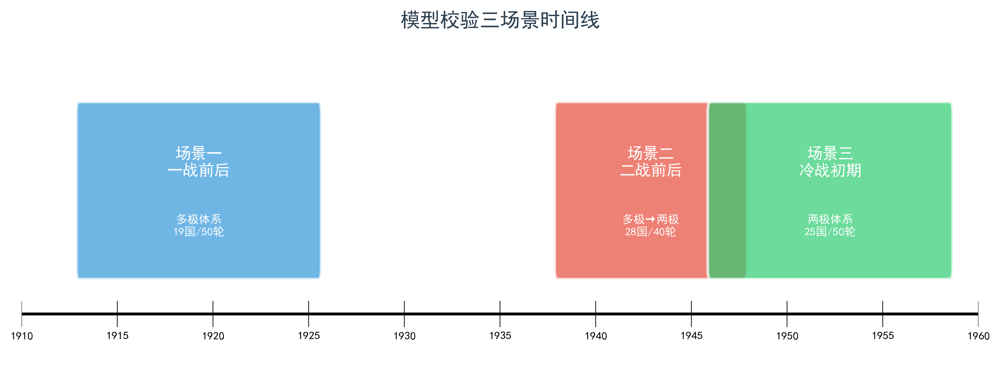
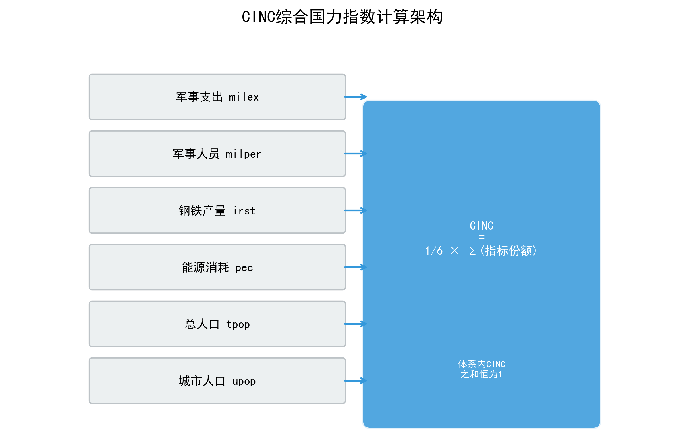
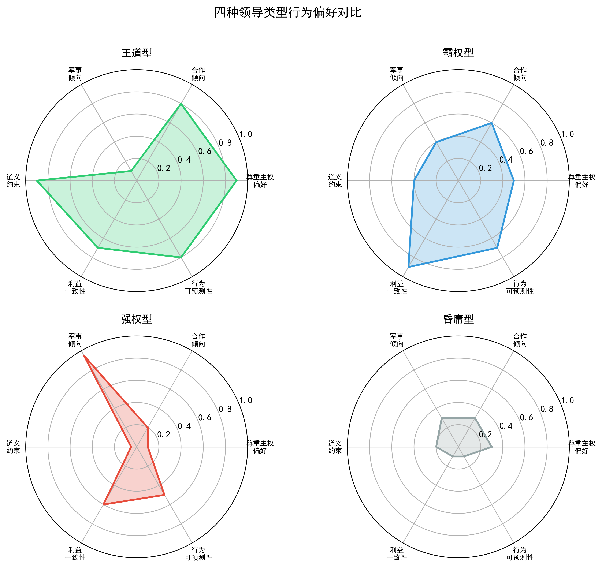
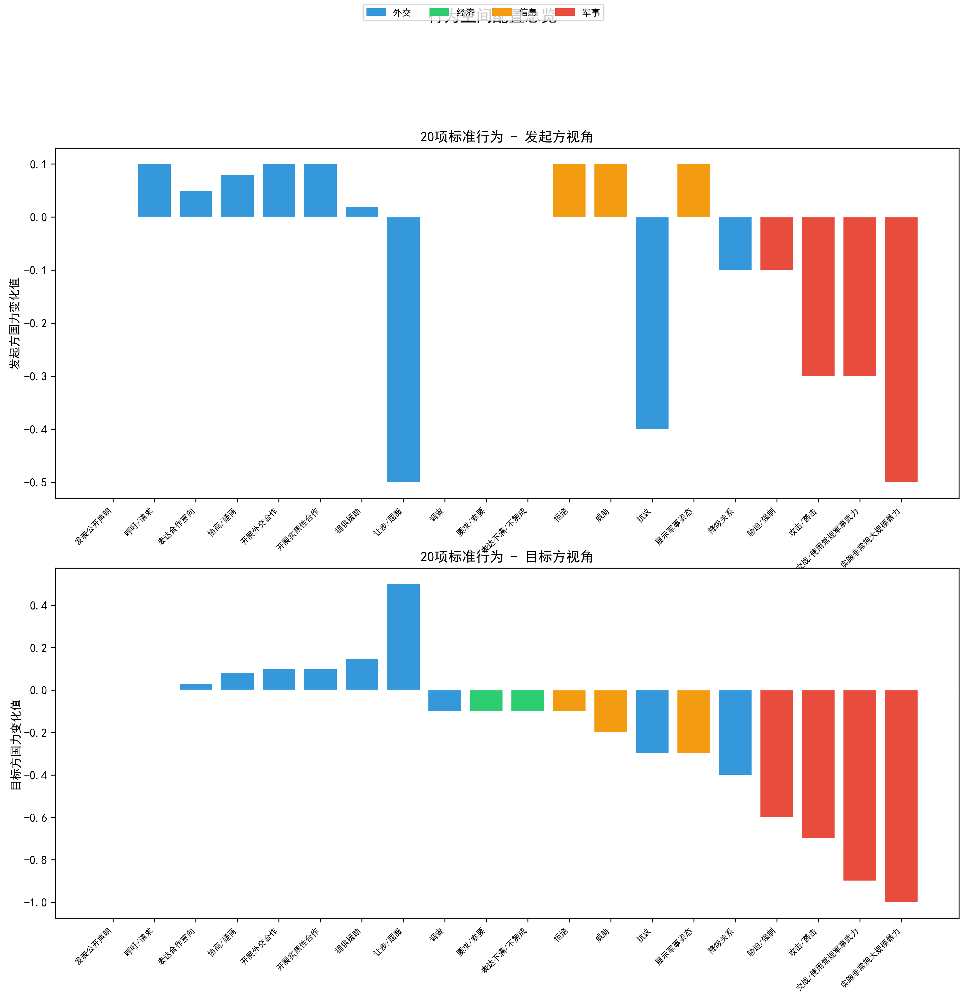
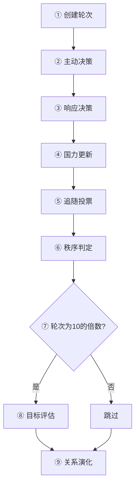
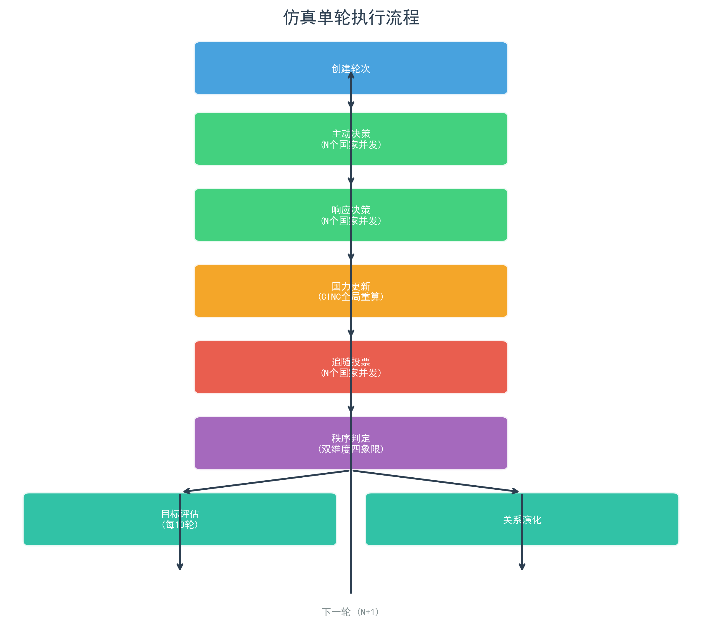
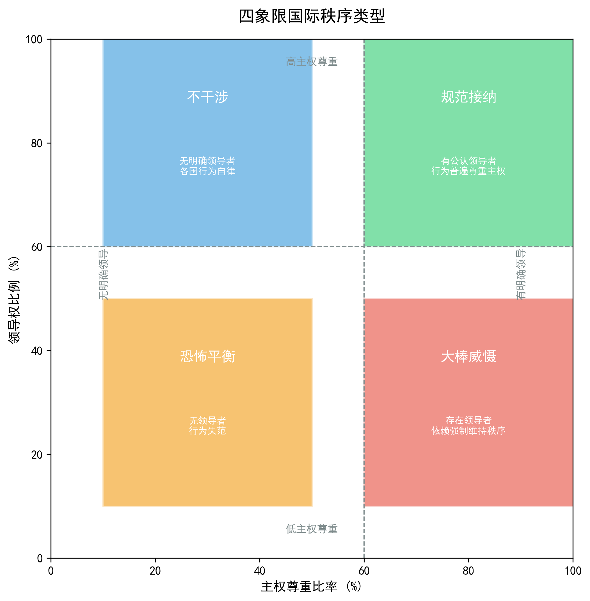

# 仿真实验设计

## 一、总体架构

仿真体系中的每一个智能体均代表一个主权国家，其决策行为由大语言模型驱动生成。传统基于规则的多智能体仿真难以捕捉国家行为中的价值判断与情境推理，而纯规则驱动的行为预设又会在仿真启动前就将结论嵌入参数之中。大语言模型作为具有涌现推理能力的认知引擎，能够在给定的规则框架内进行自主的成本收益分析与战略判断。仿真以"轮"为基本时间单位，每一轮代表三个月的现实时间。在单轮内部，智能体依次经历主动行为决策、响应行为决策、国力更新、追随投票、秩序判定与战略关系演化六个核心相位，战略目标评估每十轮执行一次，形成从个体行为选择到系统秩序涌现的完整因果链条。

本研究包含两个相互衔接的阶段。第一阶段为模型验证（Model Validation），使用三个基于真实历史数据构建的预设场景检验仿真的外部效度——分别为1913年一战前欧洲十九国体系、1938年二战前欧洲二十八国体系以及1946年冷战前欧洲二十五国体系。这三个场景覆盖了从多极竞争到两极对峙的多种经典国际格局，研究者将仿真输出与已知历史走向进行系统性对照，以确认模型在多种历史条件下均能生成与史实具有合理对应关系的行为分布。只有在模型验证通过后，第二阶段理论假说检验实验方可展开。在反事实实验中，研究者保持CINC分布、邻接矩阵、初始战略关系等结构约束不变，系统性地改变领导类型的配置，观察相同实力格局下不同领导类型分布如何改变国家行为谱系与国际秩序演化路径。三个历史场景在此阶段从"验证工具"转变为"实验平台"，为理论假说提供了经过效度检验的初始条件。

## 二、场景设定与初始条件

仿真的初始条件全部来源于经过学界验证的历史数据集，而非由研究者主观设定。国家实力数据取自Correlates of War项目发布的National Material Capabilities第六版数据集，该数据集提供了自1816年以来两百余个主权国家在六项物质能力指标上的年度观测值。以历史数据锚定初始条件的必要性源于方法论的内在要求：倘若国力初值由研究者主观设定，那么"哪些国家是大国"这一判断将取决于研究者的权重预设与先验偏好，仿真结果在启动前就已经被答案所绑架。采用COW项目公认的标准数据集，不仅使本研究的初始条件具备跨研究的可比性，也使得仿真的演化轨迹可以直接与历史记录进行对照。

三个预设场景——1913年一战前欧洲十九国体系、1938年二战前欧洲二十八国体系以及1946年冷战前欧洲二十五国体系——在模型验证阶段承担外部效度检验的功能。每个场景提取对应年代欧洲主要国家的指标观测值作为国力初值，并依据该年代的历史阵营结构设定初始战略关系矩阵：1913年场景呈现英、德、法、俄、奥等多强并立的多极格局；1938年场景反映德意扩张推动下多极体系向两极过渡的态势；1946年场景则映射西方与苏联两大阵营两极对峙的初步形成。三个场景的校验采用统一标准：以逐轮逐国追随行为F1分数为指标，将仿真输出与人工标注的历史地面真值进行系统性对照，确认模型在多极、过渡与两极三种不同国际体系结构下均能生成与历史具有合理对应关系的行为分布。如果仿真在三种格局下均达到预设的F1阈值，则表明模型具备可信的外部效度，可以进入下一阶段的反事实实验。

*图：模型校验三场景时间线*

在实验阶段，三个经过验证的场景从"效度检验工具"转变为"实验平台"。研究者保持结构约束不变——包括CINC分布、邻接矩阵与初始战略关系——仅系统性地改变领导类型的行为偏好配置，观察相同实力格局下不同行为偏好分布如何改变国家行为谱系与国际秩序演化路径。这一设计遵循了"初始条件即实验协议"的方法论原则：场景数据在系统初始化后冻结，仿真重置时仅清除运行期产生的动态数据，初始国力与战略关系矩阵作为实验协议被严格保留，从而确保同一实验条件的多次重复运行从完全一致的初始条件出发。

## 三、国家实力测度与层级判定

国家实力是本仿真中结构约束维度的操作化载体。本研究采用CINC（Composite Index of National Capability）作为综合国力衡量指标，其定义为体系内六项底层指标份额的算术平均值。具体而言，对于仿真体系中的任意国家i，其CINC值由下式给出：

$$CINC_i = \frac{1}{6} \sum_{k \in K} \frac{X_{i,k}}{\sum_{j} X_{j,k}}$$

其中K为六项指标的集合，包括军事支出、军事人员、钢铁产量、一次能源消耗、总人口与城市人口；分母中的求和遍历仿真体系内所有国家的对应指标。由于每一项份额的分母均为全局总和，对固定指标k恒有所有国家份额之和等于1，进而有体系内全部国家CINC值之和恒等于1。这一守恒性质意味着CINC始终是一个相对比例值而非绝对量——当某一国家的底层指标发生变化时，全局总和随之变化，所有国家的CINC都将被动重算。正是这一比例结构使智能体对相对实力的变化高度敏感：任何一国的实力增长都自动降低其他国家的相对份额，"他国崛起即我之相对衰落"的感知无需通过额外规则强加即可自动成立。

在CINC的基础上，实力层级的判定采用极性-权力占比方案。首先检测体系极性——单极格局（单国权力占比>0.5）、两极格局（两国权力占比均>0.25且合计>0.5）、多极格局（≥3国权力占比均>0.10）或非极性。极性国家（单极与两极中的超级大国、多极中的大国）直接按极性结果赋予层级；非极性国家以权力占比中位数为界，高于中位数为中等强国，低于为小国。在智能体提示词中，为使大语言模型更直观地理解实力格局，采用相同的极性-权力占比条件判断式的语义描述。层级判定在每轮国力重算之后立刻重做，层级标签随之动态调整。

*图：CINC综合国力指数计算架构*

## 四、领导类型的行为偏好与约束边界

本研究将道义现实主义理论中的领导类型王道型、霸权型、强权型与昏庸型四种各自通过系统提示词中的行为偏好与约束边界条款注入智能体的决策上下文，并通过差异化的偏好权重影响成本收益分析的走向。

王道型领导被设定为国家利益优先但坚守国际道义的价值立场，其约束禁止执行所有不尊重主权的高烈度对抗行为，在成本收益分析中，尊重主权行为被提示为优先选择，非尊重主权行为则提示伴随声誉损失。霸权型领导以自身国家利益为绝对优先，将道义视为工具性资源而非内在约束，其禁止极端暴力行为但允许双重标准的外交与经济对抗，在成本收益分析中，实质利益行为被提示为优先选择，双重标准行为不触发声誉惩罚。强权型领导完全忽视道义，以军事与强制手段为核心工具，仅禁止非常规大规模暴力行为，在成本收益分析中，军事与强制类行为被提示为优先选择。昏庸型领导是唯一可主动偏离国家客观利益的类型，其决策以个人利益为核心，所有行为的净收益计算均附加随机波动，不遵循任何系统性的策略偏好。

行为偏好与约束边界的差异仅通过提示词层面的软性引导实现，所有决策最终由大语言模型在提示词框架下自由生成，研究者不硬编码任何行为概率或强制规则。这意味着反例不仅不会被屏蔽，反而成为检验"行为偏好与约束边界的差异是否构成独立维度"这一核心假说的潜在证据。例如，一个王道型智能体可能偶尔选择非尊重主权的行为，一个昏庸型智能体可能做出明显非效用最大化的决策——这种"偏差"不是系统故障，而是研究设计的一部分，它允许研究者观测到大语言模型在多大程度上遵循给定的行为偏好与约束边界框架，从而为后续分析提供实证素材。

*图：四种领导类型行为偏好对比*

## 五、行为空间

仿真为每个智能体提供了由二十项标准互动行为构成的行为空间，这些行为来源于GDELT事件编码体系，按照互动手段分为外交手段、经济手段、军事手段与信息手段四类。外交手段包括发表公开声明、呼吁与请求、表达合作意向、协商与磋商、开展外交合作、让步与屈服、拒绝、抗议以及降级关系，共九项；经济手段包括开展实质性合作与提供援助，共两项；军事手段包括展示军事姿态、胁迫与强制、攻击与袭击、交战与使用常规军事武力以及实施非常规大规模暴力，共五项；信息手段包括调查与威胁，共两项。每一项行为均配置有是否尊重主权的二元属性，以及发起方与目标方的国力变化值和主要/次要影响的底层指标。行为空间在仿真运行期间保持固定，智能体仅可从该列表中选择行为，禁止编造列表之外的任何行为，这一约束既保证了行为数据的标准化与可比较性，也避免了开放生成可能带来的概念漂移。

行为空间的设计兼顾了国际政治互动的完整性与操作的可行性。二十项行为覆盖了从言语表态到军事暴力的全部烈度谱系，使得研究者能够追踪从合作到对抗的完整行为转换路径。同时，每一项行为配备的国力变化值为后续的国力更新提供了量化基础，而尊重主权属性则直接参与国际秩序类型的判定，从而在微观行为选择与宏观秩序涌现之间建立了可追踪的因果链条。二十项行为的完整配置如下表所示，其中"发起方变化值"与"目标方变化值"为负一至正一之间的相对强度值，表征行为对发起国与目标国国力的影响方向与幅度。
从发起方视角看，外交与经济合作类行为大多伴随正向或零值变化，表征这些行为对国力有积累效应；军事对抗类行为则普遍伴随负值变化，表征军事冲突对双方均造成损耗，但目标方的损耗幅度通常大于发起方，体现了军事行为的非对称性影响。从尊重主权属性看，外交手段与经济手段中的大部分行为尊重主权，军事手段与部分信息手段则不尊重主权，这一分布为国际秩序判定中的主权尊重比率提供了计算基础。

| 行为名称 | 类别 | 尊重主权 | 发起方变化值 | 目标方变化值 |
|---|---|:---:|:---:|:---:|
| 发表公开声明 | 外交手段 | 是 | 0 | 0 |
| 呼吁/请求 | 外交手段 | 是 | +0.1 | 0 |
| 表达合作意向 | 外交手段 | 是 | +0.05 | +0.03 |
| 协商/磋商 | 外交手段 | 是 | +0.08 | +0.08 |
| 开展外交合作 | 外交手段 | 是 | +0.1 | +0.1 |
| 开展实质性合作 | 经济手段 | 是 | +0.1 | +0.1 |
| 提供援助 | 经济手段 | 是 | +0.02 | +0.15 |
| 让步/屈服 | 外交手段 | 是 | -0.5 | +0.5 |
| 调查 | 信息手段 | 否 | 0 | -0.1 |
| 要求/索要 | 外交手段 | 否 | 0 | -0.1 |
| 表达不满/不赞成 | 外交手段 | 否 | 0 | -0.1 |
| 拒绝 | 外交手段 | 是 | +0.1 | -0.1 |
| 威胁 | 信息手段 | 否 | +0.1 | -0.2 |
| 抗议 | 外交手段 | 否 | -0.4 | -0.3 |
| 展示军事姿态 | 军事手段 | 否 | +0.1 | -0.3 |
| 降级关系 | 外交手段 | 是 | -0.1 | -0.4 |
| 胁迫/强制 | 军事手段 | 否 | -0.1 | -0.6 |
| 攻击/袭击 | 军事手段 | 否 | -0.3 | -0.7 |
| 交战/使用常规军事武力 | 军事手段 | 否 | -0.3 | -0.9 |
| 实施非常规大规模暴力 | 军事手段 | 否 | -0.5 | -1.0 |

*图：20项标准行为空间配置总览*

## 六、智能体决策机制

智能体的决策由大语言模型驱动，采用系统提示词与用户提示词分离的分层架构。系统提示词承载角色设定、核心规则约束与输出格式要求，在仿真运行期间基本保持不变；用户提示词则承载每轮的动态数据与任务描述，随仿真推进持续更新。

系统提示词向每个智能体注入以下核心规则约束：国际社会处于无政府状态，决策完全基于自身利益与成本收益权衡；国家核心利益由实力层级决定，除昏庸型外所有决策必须围绕该核心利益展开；行为选择受相对实力敏感性与相对收益意识的约束，CINC的比例结构意味着任何国家的指标变化都会影响整个体系的国力分布；决策必须考虑地理位置与战略关系因素，对盟友承担联盟义务，对战争或冲突关系国家在必要时采取对抗行为；行为模式与领导类型必须保持内在一致，严重偏离领导类型核心特征的行为将触发国内政治合法性下降的惩罚；互动模式具有路径依赖性，连续三轮对抗会形成冲突升级惯性，连续三轮合作则会巩固缓和趋势；阵营归属具有制度惯性，脱离现有联盟体系面临信誉损失与国内政治反弹；同时，同盟链式卷入机制要求智能体在盟友遭受军事攻击时履行联盟义务，否则面临信誉损失。此外，军事手段受地理距离约束，非邻国执行军事手段时须额外说明力量投送理由。

用户提示词按以下结构组织：任务描述要求智能体从允许行为列表中选择一至五项行为并为每项提供详细的成本收益分析；当前态势摘要动态生成，包含智能体自身的CINC与排名、实力前三国家列表、与各国的CINC比值及军事冲突获胜概率评估、战略关系分组、上一轮自身行为、最近国力趋势与冲突升级轨迹判定；全量信息池包含当前体系内所有国家的详细信息、历史轮次的互动行为记录、历史轮次的国力变化数据、上一轮的追随关系与国际秩序类型、上一轮同盟事件简报以及邻接关系简报；允许执行的行为列表以表格形式列出当前相位可用的全部行为及其属性；JSON输出格式示例则提供标准的结构化输出模板。在历史数据的处理上，系统采用三级分层保留策略：超过五轮的早期记录仅保留关系对级别的极简统计（合作与对抗次数），最近五轮做详细聚合（按关系对分组的行为频率 + 近五条含完整行为内容描述的详细记录）。这种分层机制在控制提示词长度的同时，确保智能体能够获取足够的历史上下文以做出连贯的决策。

决策分为两个相位：主动决策阶段，智能体在没有外部刺激的情况下自主发起行为；响应决策阶段，智能体针对其他国家的主动行为做出回应。两个相位均调用相同的决策引擎，区别仅在于可用行为的过滤——主动相位仅可使用标记为发起类的行为，响应相位仅可使用标记为响应类的行为。单轮内部的完整决策流程如下：

*图：仿真单轮执行流程*

## 七、地理约束

仿真的初始版本完全不考虑空间因素，任意国家均可对任意国家施加任意行为，唯一的成本来自行为类型本身与施动方的实力。这种"扁平化"的设定在数学上简洁，但在政治意义上失真——1913年的塞尔维亚与日本之间几乎不存在直接军事干预的可能性，将两国置于同一互动平面上会产生大量在历史上不可能发生的事件。为补回这一维度，本研究引入了地理约束机制。

地理约束的具体实现分为两个层次。首先是邻接矩阵的构建：系统依据欧洲历史地理事实，为每一对国家的陆路接壤与海路邻接状态建立二元判定，形成完整的邻接关系网络。例如，德国与法国为陆邻接，英国与爱尔兰为海邻接，而德国与意大利在陆路不直接接壤的情况下被判定为非邻国。三套历史预设场景在初始化时分别入库了对应年代的邻接矩阵——1913年场景反映一战前欧洲的领土格局，1938年场景反映德奥合并与领土变更后的边界状态，1946年场景反映战后新的欧洲版图。邻接矩阵在场景加载后即冻结不变，仿真运行期间不再修改，这确保了地理约束始终锚定于特定历史时刻的空间结构，而非随仿真推演漂移。

其次是距离惩罚的实施。军事手段类行为——包括展示军事姿态、胁迫与强制、攻击与袭击、交战与使用常规军事武力以及实施非常规大规模暴力——对非邻国附加+0.3的成本惩罚。这一惩罚并非通过代码层面的硬性拦截实现，而是嵌入系统提示词的规则描述之中——智能体在成本收益分析中被明确要求：若目标国为非邻国，执行军事手段时须额外说明力量投送理由（如海军远征、殖民地基地），并将+0.3的距离成本纳入净收益计算。换言之，地理约束的效力取决于大语言模型对提示词规则的遵循程度，而非程序层面的强制阻断。这种"软性约束"的设计具有明确的方法论意图：它允许研究者观测地理距离在智能体决策中的实际权重——如果大语言模型系统性地忽略距离惩罚而频繁对非邻国采取军事行为，则表明在仿真的认知结构中地理因素的作用弱于理论预期；反之，若距离惩罚显著抑制了跨距离军事互动，则支持现实主义理论关于地理邻近性与冲突概率正相关的经典命题。

这一最小化设计有意识地避免了引入精确距离、地形修正等额外参数，原因是后者会带来与CINC框架不一致的参数膨胀，使得"力量投送约束的影响"无法从其他参数干扰中干净地分离出来。引入地理约束后，仿真生成的行为分布显著向历史可能性收敛——非邻国之间的直接军事行为大幅减少，而邻国对的紧张演化轨迹与历史记录的对照变得有意义。这一改动以"使用最少参数表达最多结构"的原则保护了模型的可解释性。

## 八、战略关系系统

两国之间的双边战略关系被定义为显式的状态变量，分为战争关系、冲突关系、无外交关系、伙伴关系与盟友关系五个等级。战略关系采用对称存储，每对无序国家仅存储一条记录。在仿真运行期间，关系状态不是固定不变的——每轮结束后，系统根据该轮的行为数据对每一对国家评估关系是否需要升级或降级。

关系演化由大语言模型驱动评估，但受到两项硬约束的规范：其一，单轮关系变化最多升降一级，禁止跳变，确保关系演变呈现渐进性而非突变性；其二，战争关系向友好方向改善时，要求理由中必须包含明确的和平信号。此外，系统提示词中还规定了历史连续性约束——上一轮刚刚发生变化的关系，本轮除非出现重大事件否则应保持不变，而关系从较低等级升级为较高等级后须经历一定的稳定期方可再次变动。这些约束的目的在于防止关系状态的剧烈震荡，使关系演变更接近真实国际政治中渐进调整的模式。

战略关系作为显式状态变量的设计具有关键的方法论意义。在仿真的初版中，国家之间是友是敌只能由大语言模型在每次决策时从历史行为中隐式推断，这导致同一对国家的关系在不同轮次被推断为不同状态的情况屡有发生，仿真的整体演化轨迹因此变得不稳定。将关系定义为持久化的状态变量，一方面使路径依赖得以建立——关系是一个有记忆的状态变量而非由当前决策即兴推断出的标签；另一方面，研究者获得了对初始联盟格局的操纵权，而"1913年英、德、法、俄、奥等多强并立的多极格局"这一类历史快照恰恰必须以显式关系作为初始条件。更重要的是，相对实力敏感性与联盟链式卷入这两个本研究的核心机制，其形式化定义都依赖于"关系是一个有记忆的状态变量"。

## 九、国力更新

每一轮的行为决策完成后，系统执行国力更新，其核心是将智能体选择的行为转化为底层国力指标的变化，进而引发全局CINC比例的重算。这一转化过程遵循一条明确的逻辑链条：行为记录中的国力变化值经指标映射与缩放后写入发起方与目标方的底层指标，随后以更新后的指标为基础全局重算CINC。

### 三层防护机制

为防止大国CINC在数轮内暴跌、小国被动膨胀等极端现象，国力更新引擎引入三层防护：

**第一层：降低缩放因子**
军事指标缩放因子已降低（milex: 2000→800, milper: 200→80），单次军事行为的冲击量级显著减小，军事手段仍具破坏性但不再数轮削光大国。

**第二层：指标软下限**
引入初始值15%的软下限保护。当指标接近下限时，负向变化量非线性衰减（距离下限越近衰减越大），硬保底线为软下限的50%。这模拟了"国家即使战败也不会把所有军队和装备全部损失殆尽"的现实。

**第三层：CINC变化率上限**
每轮CINC变化上限为±30%。即使比例结构产生极端变化，单轮变化也被截断，防止小国一轮暴涨数十倍或大国一轮腰斩。

### 核心计算公式

具体而言，二十项行为中的每一项均预设了一对国力变化值，分别对应发起方与目标方，取值范围为负一到正一，表征行为对国力的相对影响强度而非绝对变化量。正值表示国力提升，负值表示国力损耗，零值表示无直接影响。在国力更新阶段，系统需要将这一相对强度值转化为底层六项指标的真实变化量。转化的核心公式为：

$$\Delta X_{i,k} = \Delta P \times S_k \times W_k \times A_k$$

其中，$\Delta X_{i,k}$为国家i的指标k的变化量，$\Delta P$为该行为记录的国力变化值（负一至正一），$S_k$为指标k的缩放因子，$W_k$为指标k在该行为下的权重，$A_k$为软下限衰减系数（当指标接近下限时自动衰减）。缩放因子的作用是将抽象的相对强度映射到与原始数据量级相匹配的绝对变化量——例如军事支出的缩放因子为八百，意味着国力变化值为负零点五的军事行为将使军事支出减少四百。权重则决定了行为对六项指标的分配比例：每一项行为均标注有主要影响指标与次要影响指标，主要指标获得零点七的权重，次要指标获得零点三的权重，其余四项指标权重为零。以"攻击/袭击"为例，该行为对发起方预设的国力变化值为负零点三、对目标方为负零点七，主要影响指标为军事支出，次要影响指标为军事人员；代入公式后，发起方的军事支出变化量为负零点三乘以军事支出缩放因子八百再乘以零点七，即负一百六十八；军事人员变化量为负零点三乘以军事人员缩放因子八十再乘以零点三，即负七点二。目标方则按负零点七的国力变化值以相同规则计算，承受更大幅度的指标损耗。若同一国家在同轮内执行了多项行为或受到多项行为的影响，则其各项指标的变动按代数和累积叠加，累积后的指标值受软下限保护（不低于初始值的7.5%）。

底层指标更新完成后，系统进入全局CINC重算阶段。所有国家——无论其指标是否在本轮发生了变化——的CINC值均按照份额-均值公式重新计算。这一全局重算的必要性源于CINC的比例定义：由于分母为体系内所有国家的对应指标之和，任何单一国家任一指标的变化都会改变该指标的全局总和，从而改变所有国家在该指标上的份额。因此，即便某国在本轮未参与任何互动，其CINC值仍可能因他国指标变化而被动波动。实力层级判定紧随CINC重算之后执行，所有国家按照新的CINC百分位排名重新标定层级——超级大国、大国、中等强国或小国。层级跃迁在此成为一个纯粹的计算结果，无需任何外部触发或人工干预。

国力更新的核心特征在于其联动性。由于CINC是体系内的比例值，任一国的指标变化都会被动地、自动地改变其他所有国家的相对位置。这种联动性本身就是建模相对实力敏感性与权力转移的内生机制——当一国通过军事手段增强自身实力时，其CINC份额上升的同时必然伴随他国份额的相对下降，即便他国的绝对指标并未发生变化。这一结构使得"相对实力敏感性"不再是事后通过规则强加的概念，而是CINC比例定义的数学必然。此外，行为对底层指标的差异化影响——军事行为作用于军事支出与人员、外交经济行为作用于能源消耗与钢铁产量——意味着不同类别的行为对国力结构的塑造具有不同的指向性：频繁使用军事手段的国家将在军事维度上积累相对优势，而侧重外交经济合作的国家则将在经济维度上获得增长，这种差异化的国力结构演化轨迹为后续分析领导类型与行为偏好之间的关联提供了丰富的数据基础。

上述公式中的缩放因子与权重配置如下表所示。缩放因子的设定考虑了原始数据的量级差异——总人口与城市人口以万级为单位，军事支出与能源消耗以千级为单位，军事人员以百级为单位，钢铁产量以千吨为单位。

| CINC底层指标 | 缩放因子 | 单位 |
|---|---|---|
| 军事支出 | 800 | 千美元 |
| 军事人员 | 80 | 千人 |
| 钢铁产量 | 800 | 千吨 |
| 能源消耗 | 1600 | 千吨煤当量 |
| 总人口 | 20000 | 千人 |
| 城市人口 | 10000 | 千人 |

> 注：上述缩放因子可根据需要调整，系统支持通过前端系统配置页面（`cinc_scale_factors`）动态设置，表中的值为默认配置。

| 行为类别 | 主要影响指标 | 次要影响指标 | 主要指标权重 | 次要指标权重 |
|---|---|---|---|---|
| 外交手段 | 能源消耗 | 钢铁产量 | 0.7 | 0.3 |
| 经济手段 | 能源消耗 | 钢铁产量 | 0.7 | 0.3 |
| 军事手段 | 军事支出 | 军事人员 | 0.7 | 0.3 |
| 信息手段 | 能源消耗 | 城市人口 | 0.7 | 0.3 |

结合缩放因子与权重配置可知，军事行为对军事维度的冲击强度最大——军事支出缩放因子八百乘以权重零点七，单轮最大变化可达五百六十；而外交行为对经济维度的冲击相对温和——能源消耗缩放因子一千六百乘以权重零点七，但外交行为的发起方变化值通常为正或较小负值。这种量级校准确保了不同类别的行为对国力结构产生差异化的影响，为后续分析不同领导类型的行为偏好如何改变国家实力构成提供了数据基础。

## 十、追随决策与国际秩序判定

在每轮的行为决策与国力更新之后，系统进入追随投票阶段，采用被动追随机制：所有国家均可被追随（无需参选），各国通过大语言模型在所有候选国家中选择追随对象或保持中立。需要特别说明的是，大国与超级大国被设定为不参与追随——任何实力层级为大国或超级大国的智能体直接输出保持独立自主的决策，这符合"极"的定义：大国是被追随者而非追随者。系统为每个追随者预先生成了候选人评估块——该块包含追随者与每位候选人的战略关系警示标记（⚠️战争关系禁止追随、⚠️冲突关系应避免追随、✅盟友关系优先追随等）以及双向互动统计（合作次数与对抗次数），使追随投票在充分的战略关系信息下进行，避免"追随战争对象"等反逻辑决策。追随投票完成后，系统执行两项后处理硬约束：检测并解除互相追随的闭环，以及禁止已被追随的领导者再追随他人。

追随决策的结果直接参与国际秩序类型的判定。秩序判定采用双维度四象限模型：第一个维度是主权尊重比率，即尊重主权行为数占总行为数的比例，阈值设定为60%；第二个维度是体系领导者的存在性，即是否存在一个国家获得超过60%的智能体追随。两个维度交叉形成四种秩序类型：当主权尊重比率达到阈值且存在明确领导者时，判定为规范接纳型秩序；当主权尊重比率达到阈值但不存在明确领导者时，判定为不干涉型秩序；当主权尊重比率未达阈值但存在明确领导者时，判定为大棒威慑型秩序；当主权尊重比率未达阈值且不存在明确领导者时，判定为恐怖平衡型秩序。这一四象限分类将国际秩序的讨论从单一维度拓展为"规范程度—集中程度"的二维空间，使研究者能够追踪秩序类型在仿真过程中的动态转换路径。

*图：四象限国际秩序类型*

## 十一、战略目标评估

战略目标评估旨在为"国家利益是否达成"提供量化指标，使仿真结果分析摆脱纯定性叙述的局限。评估并非仅在仿真终止时执行，而是每十轮自动触发一次，评估窗口为最近十轮的行为与国力变化数据，形成时间序列数据以追踪战略目标达成度的动态演变。

每个智能体的战略目标达成度由客观分量与主观分量加权合成，权重各占一半：

$$G_i = 0.5 \times objective_i + 0.5 \times \frac{subjective_i}{100}$$

客观分量基于CINC变化的Min-Max标准化计算。在评估窗口内，首先计算每个国家的平均轮次CINC变化值，然后对所有国家的平均变化值执行Min-Max标准化，CINC增益最大的国家得100分，减损最大的国家得0分。该标准化在同一次评估的所有国家之间进行相对比较，由于CINC是比例值，客观分量对实力轴高度敏感——大国的小幅绝对变化可能对应较大的份额变化。

主观分量由大语言模型独立评分，范围0至100分，评估该国家在最近轮次中的行为选择是否有助于实现其国家利益偏好。为抑制评分的主观漂移，系统提示词中嵌入了三档Few-shot锚点：85分对应行为高度符合国家利益偏好、合作类行为占比高且连贯一致的情形；55分对应行为缺乏一致性、合作与对抗交替出现、战略摇摆的情形；25分对应行为严重偏离国家利益偏好、高烈度暴力行为导致国力持续下降的情形。纯客观评估会忽视王道型与霸权型在同一国力增长下含义的差异——前者可能通过合作行为赢得国际声誉，后者则可能因双重标准而丧失道义合法性；纯主观评估又会受大语言模型自身漂移影响而难以横向比较。双维度加权与Few-shot锚点的结合在两端之间找到了一个对研究问题敏感且对评估方差可控的折中。

## 十二、决策校验与证据保护

决策结果在生效前须经过三层校验。第一层校验（行为集校验）检查输出数据中的行为ID与名称是否存在于二十项标准行为集内且相互匹配，行为是否位于该智能体的允许列表中。第二层校验（基础校验）检查JSON结构完整性、必需字段是否存在、目标国ID是否有效、action_content长度是否符合50至300字范围。第三层校验（前置条件校验）检查特定高烈度行为是否满足前置条件——包括交战与攻击/袭击要求双边战略关系已为冲突或战争、胁迫/强制要求近期对该目标国有过展示军事姿态或威胁作为铺垫——若不满足则拒绝该行为选择。

在早期版本中，系统还包含第三层语义合规校验，要求所有损害国力的行为必须在成本收益分析中显式说明理由。然而，这一校验很快被发现存在严重的方法论缺陷：它实质上是用程序化规则预先判断决策的合理性，而本研究最关心的现象之一正是不同领导类型的国家是否会做出不同的、有时甚至与短期国力计算相悖的选择。一个昏庸型领导可能因情绪做出明显不合算的对抗行为，一个王道型领导可能为价值原则承受短期国力代价。语义合规校验把这些反例统统认定为"违规"而丢弃，结果是仿真中保留下来的全部决策都是"合乎短期功利计算"的——而这恰恰把本研究要观测的因变量在数据生成阶段就消灭掉了。因此，最终方案删除了语义合规校验，仅保留三层结构校验（行为集校验、基础校验、前置条件校验）。这一改动在表面上让校验变弱，在方法论上却把"什么样的决策算合理"的判断权交还给大语言模型与领导类型的先验，而不是由仿真程序代为决定。如果"行为偏好与约束边界不影响行为"这一零假设为真，那么反例本应在统计层面被淘汰；如果它不为真，则反例本身就是研究证据。

## 十三、历史行为校准档案与匿名化

在通用领导类型规则（第四节的四类行为权重）之上，系统为具有鲜明历史行为特征的决策者提供了**历史行为校准档案**。档案以200-350字的浓缩心理学描述形式，通过每轮决策的用户提示词注入对应智能体的决策上下文。与通用领导类型规则不同，档案参数反映了基于学术文献提取的特定历史决策者的心理惯性和认知偏误——例如习惯性低估对手意志、偏好一次性最后通牒而非渐进谈判、军事动员不可逆导致局势失控等。

档案的设计遵循两项关键约束。第一，**完全匿名化**——所有档案文本已彻底脱敏，不包含任何真实国名、人名、地名、条约名或历史事件名称。LLM仅能感知到"你的领导集体具有以下决策心理特征"的行为模式抽象。匿名化是仿真糊名机制的关键组成部分——国家名称已经以"强国甲""中等国乙"等形式糊名，但仅糊名国家名称是不够的：如果同时加载一份包含"德意志帝国""威廉二世""施里芬计划"等信息的档案，LLM仍可能从上下文中推断出所代表的具体国家，从而使糊名失效。因此，档案必须与国名同时匿名化。

第二，**与通用类型的叠加关系**——档案中的行为权重是对通用领导类型规则的校准补充，而非替代。智能体在决策时同时受到通用类型规则（如王道型的"尊重主权+0.2"）和档案特定规则（如某档案的"预防性战争时间窗口"）的双重约束，两者叠加构成该智能体的完整行为谱系。

当前系统共维护19份档案，覆盖三个历史场景中的全部大国与若干具有显著行为特征的决策主体。档案内容参见系统实现文件 `app/core/leader_profiles.py`。

## 十四、糊名机制

仿真运行期间，所有国家以非特定化名称（如"强国甲""中等国乙""小国寅"）呈现。大语言模型在决策、追随投票和领导竞争的全部三个阶段中均不知晓所代表的是哪个具体国家——它只能获取国力数据（CINC六项指标）、战略关系标签（盟友/伙伴/冲突/战争）和历史互动记录。

糊名机制的方法论意义在于排除了大语言模型对"历史正确答案"的事后知识：如果没有糊名，LLM可能基于训练数据中对"德国在1914年发动战争""英国在1938年选择绥靖"的概率分布而生成"正确"答案，研究者无法判断模型的预测能力来源于领导类型的参数设定还是LLM对历史结果的记忆。糊名将行为生成的驱动力还原为三个纯结构维度——当前的实力分布、给定的领导类型规则、以及动态演化中的互动历史——从而使得模型校验阶段的行为分布成为对仿真机制本身的有效检验。

## 十五、正式实验：单变量领导类型反事实设计

模型校验（前测实验）确认了三个基线场景的F1分数后，进入正式实验阶段。实验采用单变量控制设计：每次仅改变一个大国的领导类型参数，保持其余所有条件不变。共计24组实验：

- **场景一变体（9组）**：分别将德国（强权→王道/霸权/昏庸）、俄国（强权→王道/霸权/昏庸）、英国（王道→强权/霸权/昏庸）各改变一次
- **场景二变体（9组）**：分别将苏联（霸权→王道/强权/昏庸）、德国（强权→王道/霸权/昏庸）、英国（王道→强权/霸权/昏庸）各改变一次
- **场景三变体（6组）**：分别将苏联（强权→王道/霸权/昏庸）、英国（王道→强权/霸权/昏庸）各改变一次

当实验改变了某大国的领导类型时，系统自动抑制该国的历史行为校准档案——因为档案的预期类型与当前实验类型不匹配——确保改变的是纯粹的类型规则参数而非类型规则与历史人格的混合效应。完整的实验矩阵、分析指标与实施建议参见实验设计文档。
