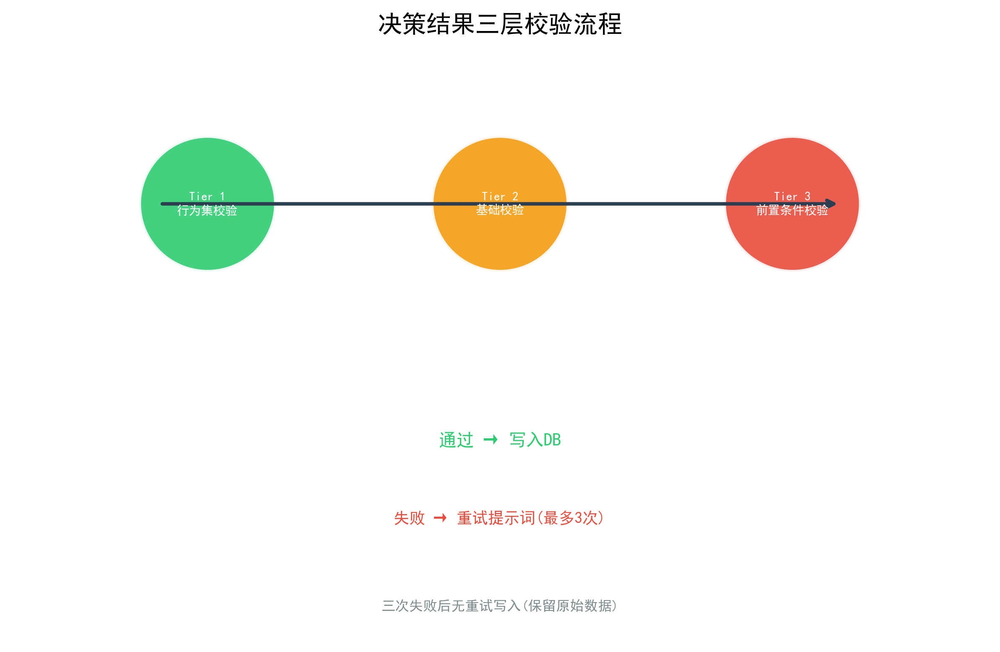
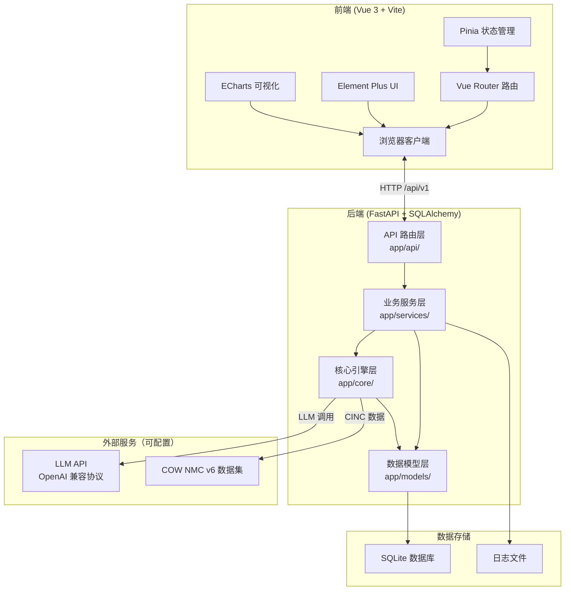
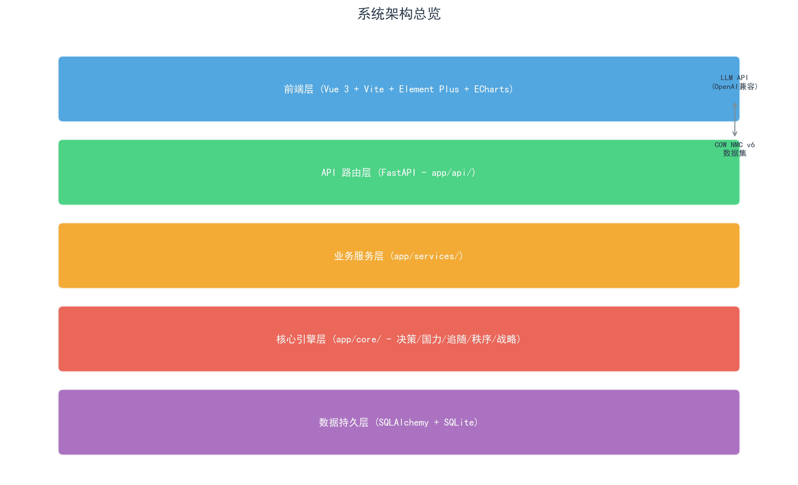
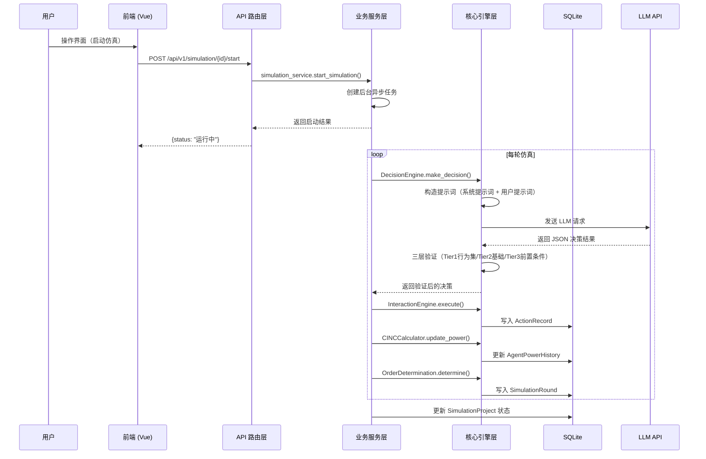
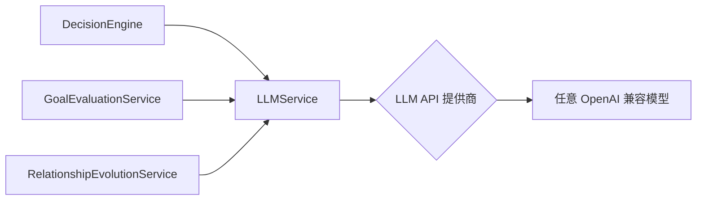
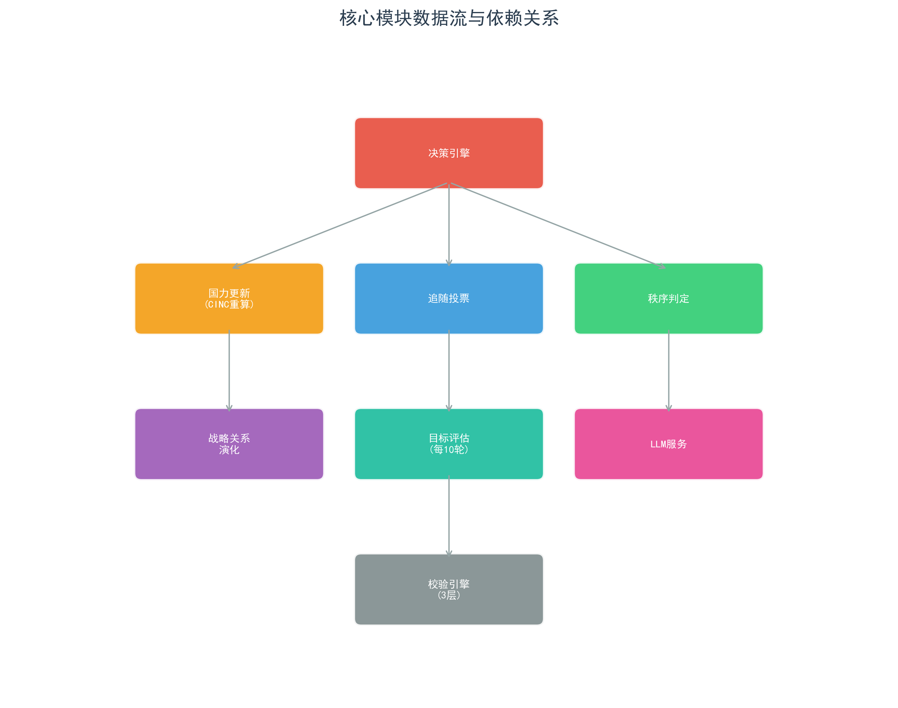
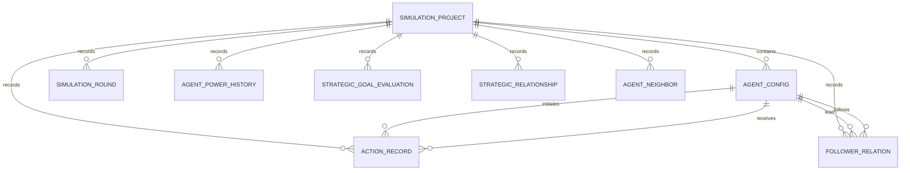
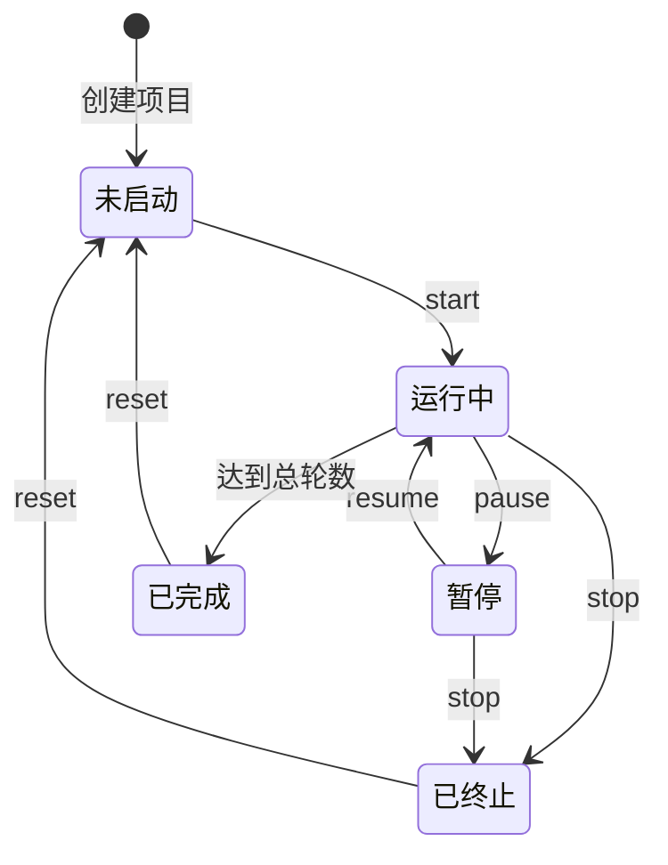
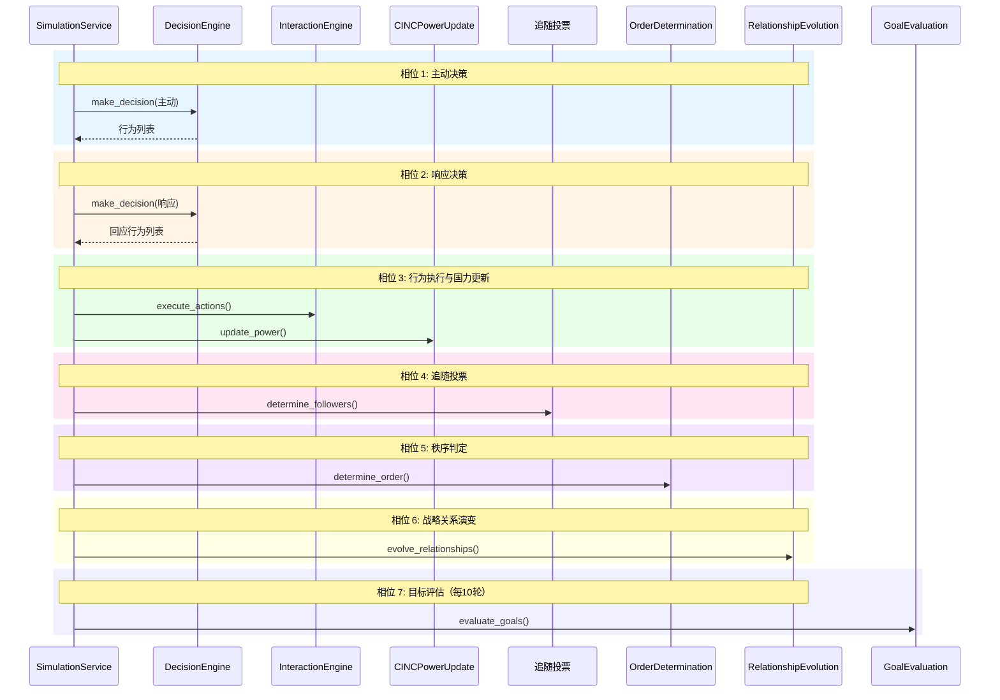
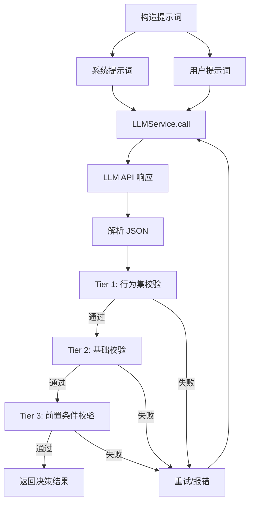

# 国际秩序 ABM 仿真系统 —— 技术文档

> **版本**: v1.6.0  
> **最后更新**: 2026-06-15  
> **文档类型**: 面向开发者的技术参考文档

---

## 目录

- [1. 项目概述](#1-项目概述)
- [2. 系统架构](#2-系统架构)
- [3. 技术栈](#3-技术栈)
- [4. 项目目录结构](#4-项目目录结构)
- [5. 后端架构详解](#5-后端架构详解)
  - [5.1 核心引擎层](#51-核心引擎层)
  - [5.2 服务层](#52-服务层)
  - [5.3 API 层](#53-api-层)
  - [5.4 数据模型](#54-数据模型)
  - [5.5 配置层](#55-配置层)
- [6. 前端架构详解](#6-前端架构详解)
  - [6.1 页面结构](#61-页面结构)
  - [6.2 组件体系](#62-组件体系)
  - [6.3 状态管理](#63-状态管理)
  - [6.4 API 客户端](#64-api-客户端)
  - [6.5 样式系统](#65-样式系统)
- [7. 核心业务流程](#7-核心业务流程)
- [8. 开发指南](#8-开发指南)
- [9. 部署与运维](#9-部署与运维)
- [10. 测试指南](#10-测试指南)

---

## 1. 项目概述

### 1.1 项目背景

本项目是一个**基于大语言模型（LLM）的 Agent-Based Modeling（ABM）国际秩序仿真系统**，用于研究**道义现实主义（Moral Realism）**理论中领导类型对国家行为和国际秩序的影响。

传统基于规则的多智能体仿真难以捕捉国家行为中的价值判断与情境推理。本项目将大语言模型作为具有涌现推理能力的认知引擎，使其在给定的规则框架内进行自主的成本收益分析与战略判断，从而生成更贴近真实国际政治的行为模式。

### 1.2 核心概念

| 概念 | 说明 |
|------|------|
| **Agent-Based Modeling (ABM)** | 基于智能体的建模方法，每个智能体代表一个主权国家，通过微观行为规则驱动宏观秩序涌现 |
| **CINC 综合国力指数** | Composite Index of National Capability，Correlates of War 项目的六项物质能力指标加权均值，用于量化国家实力 |
| **道义现实主义** | 国际关系理论流派，认为领导类型的行为偏好与约束边界（王道/霸权/强权/昏庸）对国家行为有决定性影响 |
| **GDELT 行为编码** | 全球事件、语言与语调数据库的事件分类体系，本项目从中提取 20 项标准互动行为 |
| **四象限秩序类型** | 规范接纳 / 不干涉 / 大棒威慑 / 恐怖平衡，基于主权尊重比例与领导权比例判定 |

### 1.3 版本信息

- **系统版本**: v1.6.0
- **后端框架**: FastAPI 0.110+
- **前端框架**: Vue 3.4+
- **LLM 接口**: OpenAI 兼容 API（支持任意提供商，如火山引擎、OpenAI、Anthropic 等）
- **数据版本**: COW NMC v6（1816-2016）

### 1.4 技术亮点

1. **LLM 驱动决策**: 智能体的所有行为决策由大语言模型生成，非硬编码规则
2. **三层验证机制**: Tier 1 行为集校验（ID/名称在标准行为集中且匹配）→ Tier 2 基础校验（JSON结构、必需字段、action_content长度50-300字）→ Tier 3 前置条件校验（高烈度行为的关系与历史互动前置条件检查），确保决策结果合规



*图：决策结果三层校验流程*
3. **动态 CINC 计算**: 每轮仿真后自动重算全部智能体的国力指数与层级
4. **四象限秩序判定**: 基于主权尊重比例与领导权比例实时判定国际秩序类型
5. **三级历史分层**: 超过 5 轮的早期记录仅保留关系对级别的极简统计（合作/对抗次数），近 5 轮做详细聚合（按关系对分组的行为频率 + 近 5 条单条含完整描述的记录）
6. **预置历史场景**: 内置 1913 年（一战前）、1938 年（二战前）、1946 年（冷战前）三个历史场景

---

## 2. 系统架构

### 2.1 整体架构





*图：系统架构总览*

### 2.2 前后端分离架构

- **前端**: 独立 Vue 3 SPA，通过 Vite 开发服务器运行（端口 3000），生产构建输出到 `frontend/dist/`
- **后端**: FastAPI ASGI 应用，通过 Uvicorn 运行（端口 8000）
- **通信**: RESTful API（`/api/v1/*`），JSON 格式，开发模式下 Vite 代理 `/api` 到后端
- **静态资源**: 后端挂载 `frontend/dist/assets/` 为静态文件服务，根路径 `/` 返回 `index.html`

### 2.3 数据流



### 2.4 LLM 集成架构



系统支持通过前端系统配置页面（`/system`）动态配置 LLM 参数：模型名、API Key、Base URL、超时时间、最大重试次数。配置持久化到数据库 `SystemConfig` 表中，应用启动时自动从数据库加载并同步到 `LLMService`。

**配置优先级**: 数据库配置 > `.env` 环境变量 > 代码硬编码默认值。用户在系统配置页面填写的 URL 和 API Key 即为实际使用的 LLM 服务。

---

## 3. 技术栈

### 3.1 后端技术栈

| 技术 | 版本 | 用途 |
|------|------|------|
| **Python** | 3.11+ | 编程语言 |
| **FastAPI** | >=0.110.0 | Web 框架，异步 API |
| **Uvicorn** | >=0.28.0 | ASGI 服务器 |
| **SQLAlchemy** | >=2.0.0 | ORM，异步数据库操作 |
| **aiosqlite** | >=0.19.0 | SQLite 异步驱动 |
| **Pydantic** | >=2.0.0 | 数据验证与序列化 |
| **OpenAI SDK** | >=1.0.0 | LLM API 调用（兼容 OpenAI 协议） |
| **LangChain** | >=0.1.0 | LLM 应用框架辅助 |
| **Loguru** | >=0.7.0 | 结构化日志 |
| **NumPy** | >=1.24.0 | 数值计算 |
| **Pandas** | >=2.0.0 | 数据处理 |
| **pytest** | >=8.0.0 | 测试框架 |
| **python-dotenv** | >=1.0.0 | 环境变量管理 |

### 3.2 前端技术栈

| 技术 | 版本 | 用途 |
|------|------|------|
| **Vue** | ^3.4.0 | 前端框架，Composition API |
| **Vue Router** | ^4.2.0 | 客户端路由 |
| **Pinia** | ^2.1.0 | 状态管理 |
| **Element Plus** | ^2.5.0 | UI 组件库 |
| **Vite** | ^5.0.0 | 构建工具与开发服务器 |
| **ECharts** | ^5.5.0 | 数据可视化图表 |
| **Axios** | ^1.6.0 | HTTP 客户端 |
| **Socket.IO Client** | ^4.6.0 | 实时通信（预留） |
| **Tailwind CSS** | ^3.4.0 | 原子化 CSS 工具 |
| **ESLint** | ^8.55.0 | 代码检查 |
| **Prettier** | ^3.1.0 | 代码格式化 |

### 3.3 外部服务

| 服务 | 用途 | 接入方式 |
|------|------|---------|
| **LLM 服务** | LLM 推理服务 | 任意 OpenAI 兼容 API（用户配置） |
| **COW NMC v6** | CINC 历史数据集 | 本地 CSV 文件 |

---

## 4. 项目目录结构

### 4.1 根目录

```
moral-ABM/python/
|-- app/                          # 后端主应用（~18.3K 行 Python）
|-- frontend/                     # 前端应用（~8.4K 行 JS/Vue）
|-- data/                         # 数据目录
|   |-- abm_simulation.db         # SQLite 主数据库
|   |-- cinc.csv                  # CINC 数据集
|-- cinc/                         # CINC 原始数据集（NMC v6）
|-- docs/                         # 文档目录
|-- test/                         # 测试套件
|-- logs/                         # 日志目录
|-- .venv/                        # Python 虚拟环境
|-- start.py                      # 一键启动脚本
|-- requirements.txt              # Python 依赖
|-- .env                          # 环境变量配置
|-- openapi.json                  # OpenAPI 规范导出
|-- GIT_HISTORY.md                # Git 提交历史
```

### 4.2 后端目录结构（app/）

```
app/
|-- main.py                       # FastAPI 应用入口
|-- api/                          # API 路由层（12 个模块，~2K 行）
|   |-- router.py                 # 路由聚合器
|   |-- simulation.py             # 仿真管理（项目/智能体/控制）
|   |-- preset_scene.py           # 预置场景
|   |-- action_config.py          # 行为配置
|   |-- statistics.py             # 统计数据
|   |-- analysis.py               # 后验分析
|   |-- system.py                 # 系统配置
|   |-- cinc.py                   # CINC 数据查询
|   |-- strategic_relationship.py # 战略关系
|   |-- agent_neighbor.py         # 邻接关系
|   |-- llm_calls.py              # LLM 调用日志
|-- services/                     # 业务服务层（14 个模块，~8.3K 行）
|   |-- simulation_service.py     # 仿真生命周期（1,891 行）
|   |-- scene_service.py          # 预置场景管理（~2,100 行）
|   |-- goal_evaluation_service.py# 目标评估（749 行）
|   |-- relationship_evolution_service.py # 关系演变（656 行）
|   |-- agent_service.py          # 智能体管理（536 行）
|   |-- llm_service.py            # LLM 调用服务（503 行）
|   |-- statistics_service.py     # 统计分析（527 行）
|   |-- analysis_service.py       # 后验分析（496 行）
|   |-- strategic_relationship_service.py # 关系管理（314 行）
|   |-- project_service.py        # 项目管理（339 行）
|   |-- agent_neighbor_service.py # 邻接管理（235 行）
|   |-- simulation_log_manager.py # 日志管理（232 行）
|   |-- system_service.py         # 系统配置（188 行）
|-- core/                         # 核心仿真引擎（13 个模块，~7K 行）
|   |-- decision_engine.py        # LLM 决策引擎（1,294 行）
|   |-- prompt_templates.py       # 提示词模板（983 行）
|   |-- interaction_engine.py     # 互动执行引擎（662 行）
|   |-- environment.py            # 仿真环境（678 行）
|   |-- cinc_power_update.py      # 国力更新（553 行）
|   |-- order_determination.py    # 秩序判定（498 行）
|   |-- action_manager.py         # 行为管理（532 行）
|   |-- cinc_data_loader.py       # CINC 数据加载（348 行）
|   |-- agent_base.py             # 智能体基类（294 行）
|   |-- leader_profiles.py        # 历史行为校准档案（19份，~540行）
|   |-- decision_validation.py    # 决策验证（358 行）
|   |-- cinc_calculator.py        # CINC 计算（407 行）
|   |-- geography_data.py         # 地理数据（355 行）
|-- models/                       # 数据模型层（14 个实体，~960 行）
|   |-- __init__.py               # 模型导出
|   |-- simulation_project.py     # 仿真项目
|   |-- agent_config.py           # 智能体配置
|   |-- action_config.py          # 行为配置
|   |-- simulation_round.py       # 仿真轮次
|   |-- action_record.py          # 行为记录
|   |-- follower_relation.py      # 追随关系
|   |-- agent_power_history.py    # 国力历史
|   |-- strategic_goal_evaluation.py # 目标评估
|   |-- strategic_relationship.py # 战略关系
|   |-- agent_neighbor.py         # 邻接关系
|   |-- preset_scene.py           # 预置场景
|   |-- system_config.py          # 系统配置
|   |-- llm_call_log.py           # LLM 调用日志
|-- config/                       # 配置模块（~750 行）
|   |-- database.py               # 数据库配置
|   |-- logging_config.py         # 日志配置
|-- utils/                        # 工具模块
```

### 4.3 前端目录结构（frontend/src/）

```
frontend/src/
|-- main.js                       # 应用入口
|-- App.vue                       # 根组件
|-- router/
|   |-- index.js                  # 路由配置（9 条路由）
|-- store/
|   |-- index.js                  # App Store（全局状态）
|   |-- project.js                # Project Store
|   |-- chart.js                  # Chart Store（图表联动）
|-- api/
|   |-- index.js                  # Axios 实例配置
|   |-- simulation.js             # 仿真 API（18 个端点）
|   |-- statistics.js             # 统计 API（8 个端点）
|   |-- presetScene.js            # 场景 API
|   |-- cinc.js                   # CINC API
|   |-- actionConfig.js           # 行为 API
|   |-- strategicRelationship.js  # 关系 API
|   |-- agentNeighbor.js          # 邻接 API
|   |-- llmCalls.js               # LLM 日志 API
|   |-- system.js                 # 系统 API
|-- views/                        # 页面视图（9 个主页面）
|   |-- Home.vue                  # 首页（预置场景）
|   |-- SimulationHistory.vue     # 历史任务
|   |-- SimulationConfig.vue      # 仿真配置
|   |-- SimulationConsole.vue     # 仿真控制台
|   |-- Analysis.vue              # 研究分析（容器）
|   |-- BehaviorSet.vue           # 互动行为集
|   |-- SystemConfig.vue          # 系统配置
|   |-- LLMCallLog.vue            # LLM 调用记录
|   |-- analysis/                 # 分析子标签页（6 个）
|       |-- OverviewTab.vue       # 总览
|       |-- CincTab.vue           # CINC 分析
|       |-- BehaviorTab.vue       # 行为分析
|       |-- GrowthRateTab.vue     # 增长率
|       |-- GoalEvalTab.vue       # 目标评估
|       |-- ExportTab.vue         # 数据导出
|-- components/
|   |-- layout/                   # 布局组件
|   |   |-- AppShell.vue          # 主布局壳
|   |   |-- Sidebar.vue           # 侧边导航
|   |   |-- PageHeader.vue        # 页面头部
|   |-- charts/                   # 图表组件（基于 ECharts）
|   |   |-- BaseChart.vue         # 基础图表包装
|   |   |-- LineChart.vue         # 折线图
|   |   |-- BarChart.vue          # 柱状图
|   |   |-- PieChart.vue          # 饼图
|   |   |-- NetworkChart.vue      # 关系网络图
|   |   |-- StackedAreaChart.vue  # 堆叠面积图
|   |-- primitives/               # 基础 UI 组件
|       |-- Card.vue              # 卡片容器
|       |-- DataTable.vue         # 数据表格
|       |-- Metric.vue            # 指标展示
|       |-- Section.vue           # 区块容器
|       |-- Tag.vue               # 状态标签
|-- composables/                  # Vue 组合式函数
|-- styles/                       # 样式系统
|   |-- tokens.css                # CSS Design Tokens
|   |-- global.css                # 全局样式
|   |-- element-overrides.css     # Element Plus 主题覆盖
```

---

## 5. 后端架构详解

### 5.1 核心引擎层（app/core/）

核心引擎层是仿真的"大脑"，包含 13 个模块，总计约 7,000 行代码。每个模块职责单一，通过服务层编排协作。

#### 5.1.1 决策引擎（decision_engine.py）

**文件**: `app/core/decision_engine.py`（1,294 行）

系统的核心模块，负责驱动 LLM 生成智能体行为决策。

**核心类与方法**:

| 类/方法 | 职责 |
|---------|------|
| `DecisionEngine` | 决策引擎主类 |
| `make_decision()` | 主决策入口，构造提示词并调用 LLM |
| `InfoPool` | 信息池类，封装当前态势、历史记录、邻接关系等动态数据 |
| `_build_system_prompt()` | 构建系统提示词（角色设定、核心规则、输出格式） |
| `_build_user_prompt()` | 构建用户提示词（当前态势、允许行为列表、JSON 模板） |
| `_parse_decision()` | 解析 LLM 返回的 JSON 决策结果 |

**决策流程**:

1. **系统提示词**注入角色设定与核心规则约束（无政府状态、相对实力敏感性、路径依赖、阵营惯性、同盟链式卷入等）
2. **用户提示词**包含：当前态势摘要、全量信息池、允许行为列表、JSON 输出格式示例
3. **LLM 调用**通过 `LLMService` 异步并发执行
4. **结果解析**提取 JSON 中的行为列表与成本收益分析
5. **三层验证**确保结果合规：Tier 1 行为集校验 → Tier 2 基础校验 → Tier 3 前置条件校验

**提示词分层策略**:

- 系统提示词：仿真期间基本保持不变，承载角色设定与核心规则
- 用户提示词：每轮动态更新，承载实时数据与任务描述

**历史数据三级分层**（控制提示词长度）:

| 层级 | 时间范围 | 保留内容 |
|------|---------|---------|
| 极简统计 | > 5 轮前 | 关系对级别的聚合统计（合作/对抗次数） |
| 详细聚合 | 近 5 轮 | 按关系对分组的行为频率统计 + 近 5 条含完整描述的记录 |

#### 5.1.2 提示词模板（prompt_templates.py）

**文件**: `app/core/prompt_templates.py`（983 行）

集中管理所有 LLM 提示词模板，包括：

- 系统提示词模板（4 种领导类型各一个变体）
- 用户提示词模板（主动决策、响应决策、追随决策、目标评估、关系演变）
- JSON 输出格式模板
- 成本收益分析模板

#### 5.1.3 互动执行引擎（interaction_engine.py）

**文件**: `app/core/interaction_engine.py`（662 行）

负责仿真中两阶段互动的执行：

1. **主动决策阶段**: 智能体在没有外部刺激的情况下自主发起行为
2. **响应决策阶段**: 智能体针对其他国家的主动行为做出回应

每个阶段均调用相同的 `DecisionEngine`，区别仅在于可用行为过滤（主动行为 vs 响应行为）。

#### 5.1.4 秩序判定引擎（order_determination.py）

**文件**: `app/core/order_determination.py`（496 行）

基于两个核心指标判定国际秩序类型：

| 指标 | 阈值 | 含义 |
|------|------|------|
| **主权尊重比例** | 60% | 尊重主权行为数 / 总行为数 |
| **领导权比例** | 60% | 追随者数 / 总智能体数 |

**四象限秩序类型**:

| 主权尊重 | 领导权 | 秩序类型 | 特征 |
|---------|--------|---------|------|
| >= 60% | >= 60% | **规范接纳** | 体系内存在公认领导者，且行为普遍尊重主权 |
| >= 60% | < 60% | **不干涉** | 无明确领导者，但各国行为自律 |
| < 60% | >= 60% | **大棒威慑** | 存在领导者，但依赖强制手段维持秩序 |
| < 60% | < 60% | **恐怖平衡** | 无领导者，行为失范，相对实力敏感性激化 |

#### 5.1.5 CINC 国力计算体系

**cinc_calculator.py**（407 行）:

计算 CINC 综合国力指数的公式：

```
CINC_i = (1/6) * Σ(X_i,k / Σ_j X_j,k)
```

其中 k ∈ {milex, milper, irst, pec, tpop, upop}，分母为体系内所有国家的对应指标之和。

**实力层级判定**（基于极性-权力占比方案）:

系统首先检测体系极性（单极/两极/多极/非极性），然后依据权力占比（该国CINC/体系内所有国家CINC之和）判定层级：

| 极性类型 | 判定条件 | 层级结果 |
|---------|---------|---------|
| 单极格局 | 单国权力占比 > 0.5 | 该国为超级大国 |
| 两极格局 | 两国权力占比均 > 0.25，且合计 > 0.5 | 两国均为超级大国 |
| 多极格局 | ≥3 国权力占比均 > 0.10 | 这些国家为大国 |
| 非极性国家 | 以权力占比中位数为界 | 高于中位数为中等强国，低于为小国 |

**cinc_power_update.py**（553 行）:

每轮仿真结束后批量重算所有智能体的 CINC 值和实力层级。采用比例结构，任何一国的指标变化都会自动影响全局分布，内生实现"相对实力敏感性"逻辑。

**cinc_data_loader.py**（348 行）:

从 COW NMC v6 数据集加载 1816-2016 年间 200+ 国家的六项物质能力指标历史数据。

#### 5.1.6 其他核心模块

| 模块 | 文件 | 职责 |
|------|------|------|
| 仿真环境 | `environment.py`（678 行） | 环境初始化、信息池管理、轮次上下文构建 |
| 行为管理 | `action_manager.py`（532 行） | 20 项标准行为集的定义与属性管理 |
| 历史档案 | `leader_profiles.py`（~540 行） | 19份匿名化历史行为校准档案，含单变量控制类型匹配机制 |
| 决策验证 | `decision_validation.py`（358 行） | Tier 1 行为集校验 → Tier 2 基础校验 → Tier 3 前置条件校验 |



*图：核心模块数据流与依赖关系*
| 智能体基类 | `agent_base.py`（294 行） | Agent 核心属性、国家利益偏好、领导类型规则 |
| 地理数据 | `geography_data.py`（355 行） | 国家地理信息与邻接关系数据 |

### 5.2 服务层（app/services/）

服务层负责业务逻辑编排，是 API 层与核心引擎层之间的桥梁。共 14 个服务模块，总计约 6,800 行代码。

#### 5.2.1 仿真服务（simulation_service.py）

**文件**: `app/services/simulation_service.py`（1,891 行）

最核心的业务服务，管理仿真的完整生命周期。

**核心方法**:

| 方法 | 职责 |
|------|------|
| `start_simulation()` | 启动仿真，创建后台异步循环任务 |
| `_run_simulation_loop()` | 仿真主循环，逐轮执行七个相位 |
| `pause_simulation()` | 暂停运行中的仿真 |
| `resume_simulation()` | 继续暂停的仿真 |
| `stop_simulation()` | 终止仿真 |
| `reset_simulation()` | 重置仿真到初始状态 |
| `step_simulation()` | 单步执行一轮（调试用） |

**单轮执行七相位**:

1. 主动决策（每个智能体发起行为）
2. 响应决策（每个智能体回应他人行为）
3. 行为执行与国力更新（CINC 批量重算）
4. 追随投票（各国选择追随对象或中立）
5. 秩序判定（四象限分类）
6. 战略关系演变（关系类型调整）
7. 战略目标评估（每 10 轮执行一次）

**并发控制**:

- 默认并发数：5（可通过系统配置调整，范围 1-20）
- 每轮智能体决策采用 `asyncio.gather` 并发执行
- 启动 reconcile：应用启动时自动将上次意外退出残留的"运行中"项目改为"暂停"

#### 5.2.2 场景服务（scene_service.py）

**文件**: `app/services/scene_service.py`（~2,100 行）

管理 33 个预设场景（含实验变体）：

**基线历史场景（3个）**：

| 场景 | 年代 | 国家数 | 轮数 | 历史格局 |
|------|------|--------|------|---------|
| 一战前欧洲（Scene 1） | 1913 | 19 | 50 | 多强并立的多极格局 |
| 二战前欧洲（Scene 2） | 1938 | 28 | 32 | 多极向两极过渡 |
| 冷战前欧洲（Scene 3） | 1946 | 25 | 50 | 两极对峙 |

**单变量领导类型实验变体（24个，Scene 10–33）**：每个实验仅改变一个大国的领导类型（其余条件与对应基线完全一致），共覆盖三种体系结构下王道/霸权/强权/昏庸四种类型的反事实组合。完整实验矩阵参见仿真设计说明第十五节与正式实验设计文档。

**2012全球体系变体（5个，Scene 4–9）**：基于2012年CINC数据的全球体系及美国领导类型变体实验。

支持一键从场景创建项目，自动配置智能体初始数据与战略关系矩阵。

#### 5.2.3 LLM 服务（llm_service.py）

**文件**: `app/services/llm_service.py`（503 行）

统一管理所有 LLM 调用，提供：

- 异步调用与超时控制
- 自动重试机制（指数退避）
- 批量并发请求管理
- 调用日志记录（持久化到 `LLMCallLog` 表）
- 支持从数据库配置动态切换模型参数

**调用类型**:

| 类型 | 说明 | 频率 |
|------|------|------|
| `interaction` | 互动决策（主动/响应） | 每轮 N×2 次 |
| `following` | 追随投票 | 每轮 N 次并发 |
| `goal_evaluation` | 战略目标评估 | 每 10 轮 N 次 |
| `relationship_evolution` | 关系演变 | 每轮 1 次 |

#### 5.2.4 其他服务模块

| 服务 | 文件 | 职责 |
|------|------|------|
| 目标评估 | `goal_evaluation_service.py`（749 行） | 战略目标达成度评估 |
| 关系演变 | `relationship_evolution_service.py`（656 行） | 战略关系动态调整 |
| 统计分析 | `statistics_service.py`（527 行） | 多维度统计计算 |
| 分析服务 | `analysis_service.py`（496 行） | 后验分析报告生成 |
| 智能体服务 | `agent_service.py`（536 行） | 智能体 CRUD、CINC 计算 |
| 项目管理 | `project_service.py`（339 行） | 项目 CRUD、导出 ZIP |
| 战略关系 | `strategic_relationship_service.py`（314 行） | 关系矩阵管理 |
| 邻接关系 | `agent_neighbor_service.py`（235 行） | 地理邻接管理 |
| 日志管理 | `simulation_log_manager.py`（232 行） | 仿真过程日志 |
| 系统配置 | `system_service.py`（188 行） | 配置持久化与同步 |

### 5.3 API 层（app/api/）

API 层采用 FastAPI 框架，所有端点统一前缀 `/api/v1`，通过 `app/api/router.py` 聚合注册。

#### 5.3.1 路由模块对照

| 模块 | 文件 | 端点前缀 | 核心功能 |
|------|------|---------|---------|
| 仿真管理 | `simulation.py` | `/simulation` | 项目 CRUD、智能体配置、仿真控制、轮次详情 |
| 预置场景 | `preset_scene.py` | `/preset-scene` | 场景列表、详情、一键创建项目 |
| 行为配置 | `action_config.py` | `/action-config` | 20 项标准行为查询 |
| 统计数据 | `statistics.py` | `/simulation/{id}/stats` | 国力历史、增长率、行为偏好、秩序演变、目标评估、关系图谱 |
| 后验分析 | `analysis.py` | `/analysis` | 行为模式、国力动态、秩序演变、领导类型分析、完整报告 |
| 系统配置 | `system.py` | `/system` | LLM 配置、仿真并发数、日志级别 |
| CINC 数据 | `cinc.py` | `/cinc` | 国家列表、年份查询、CINC 数据查询 |
| 战略关系 | `strategic_relationship.py` | `/strategic-relationships` | 关系查询/设置/初始化、变化历史 |
| 邻接关系 | `agent_neighbor.py` | `/agent-neighbors` | 邻接关系查询/设置/批量更新 |
| LLM 调用记录 | `llm_calls.py` | `/llm-calls` | 多维度筛选查询、详情查看 |

#### 5.3.2 完整 API 端点列表

**仿真管理端点**（`/api/v1/simulation`）:

| 方法 | 端点 | 说明 |
|------|------|------|
| GET | `/project/list` | 获取所有项目列表 |
| POST | `/project` | 创建自定义项目 |
| GET | `/project/{project_id}` | 获取项目详情 |
| PUT | `/project/{project_id}` | 更新项目信息 |
| DELETE | `/project/{project_id}` | 删除项目 |
| POST | `/project/{project_id}/agent` | 添加智能体 |
| GET | `/project/{project_id}/agent/list` | 获取智能体列表 |
| GET | `/project/{project_id}/agent/{agent_id}` | 获取智能体详情 |
| PUT | `/project/{project_id}/agent/{agent_id}` | 更新智能体 |
| DELETE | `/project/{project_id}/agent/{agent_id}` | 删除智能体 |
| POST | `/{project_id}/start` | 启动仿真 |
| POST | `/{project_id}/step` | 单步执行 |
| POST | `/{project_id}/pause` | 暂停仿真 |
| POST | `/{project_id}/resume` | 继续仿真 |
| POST | `/{project_id}/stop` | 终止仿真 |
| POST | `/{project_id}/reset` | 重置仿真 |
| GET | `/{project_id}/round/{round_num}` | 获取轮次详情 |
| GET | `/{project_id}/export` | 导出项目数据 |

**统计数据端点**（`/api/v1/simulation/{project_id}/stats`）:

| 方法 | 端点 | 说明 |
|------|------|------|
| GET | `/power-history` | 国力历史数据（支持按智能体/轮次筛选） |
| GET | `/power-growth-rate` | 实力增长率（支持按领导类型/实力等级分组） |
| GET | `/action-preference` | 行为偏好统计（支持多维度筛选） |
| GET | `/order-evolution` | 国际秩序演变时序数据 |
| GET | `/round-detail` | 单轮仿真完整详情 |
| GET | `/goal-evaluations` | 战略目标评估数据 |
| GET | `/goal-evaluation-trend/{agent_id}` | 单个国家目标达成度趋势 |
| GET | `/agent-relations` | 智能体关系图谱数据 |

**其他端点**:

| 模块 | 方法 | 端点 | 说明 |
|------|------|------|------|
| 预置场景 | GET | `/api/v1/preset-scene/list` | 场景列表 |
| 预置场景 | GET | `/api/v1/preset-scene/{scene_id}` | 场景详情 |
| 预置场景 | POST | `/api/v1/preset-scene/{scene_id}/create-project` | 从场景创建项目 |
| 行为配置 | GET | `/api/v1/action-config/list` | 行为列表 |
| 行为配置 | GET | `/api/v1/action-config/{action_id}` | 行为详情 |
| 系统配置 | GET | `/api/v1/system/config` | 获取系统配置 |
| 系统配置 | PUT | `/api/v1/system/config` | 更新系统配置 |
| 战略关系 | GET | `/api/v1/strategic-relationships/project/{project_id}` | 查询关系 |
| 战略关系 | POST | `/api/v1/strategic-relationships/project/{project_id}` | 设置关系 |
| 战略关系 | POST | `/api/v1/strategic-relationships/project/{project_id}/initialize` | 初始化关系 |
| 邻接关系 | GET | `/api/v1/agent-neighbors/project/{project_id}` | 查询邻接 |
| 邻接关系 | POST | `/api/v1/agent-neighbors/project/{project_id}` | 设置邻接 |
| 邻接关系 | PUT | `/api/v1/agent-neighbors/project/{project_id}/batch` | 批量更新 |
| CINC | GET | `/api/v1/cinc/countries` | 国家列表 |
| CINC | GET | `/api/v1/cinc/years` | 年份列表 |
| CINC | GET | `/api/v1/cinc/data` | CINC 数据查询 |
| LLM 日志 | GET | `/api/v1/llm-calls` | 查询调用日志 |
| LLM 日志 | GET | `/api/v1/llm-calls/{call_id}` | 日志详情 |
| 后验分析 | GET | `/api/v1/analysis/{project_id}/behavior-pattern` | 行为模式分析 |
| 后验分析 | GET | `/api/v1/analysis/{project_id}/power-dynamics` | 国力动态分析 |
| 后验分析 | GET | `/api/v1/analysis/{project_id}/order-evolution` | 秩序演变分析 |
| 后验分析 | GET | `/api/v1/analysis/{project_id}/leadership-type` | 领导类型分析 |
| 后验分析 | GET | `/api/v1/analysis/{project_id}/full-report` | 完整分析报告 |

**系统端点**:

| 方法 | 端点 | 说明 |
|------|------|------|
| GET | `/` | 根路径，返回前端页面或系统信息 |
| GET | `/health` | 健康检查 |
| GET | `/docs` | Swagger UI API 文档 |
| GET | `/redoc` | ReDoc API 文档 |
| GET | `/openapi.json` | OpenAPI 规范 JSON |

### 5.4 数据模型（app/models/）

采用 SQLAlchemy 2.0 Declarative Base 风格，使用 `Mapped` 类型注解声明字段。数据库为 SQLite，通过 `aiosqlite` 驱动支持异步操作。

#### 5.4.1 实体关系图



#### 5.4.2 核心模型说明

**SimulationProject**（`app/models/simulation_project.py`）:

仿真项目主表，代表一次完整的仿真实验。

| 字段 | 类型 | 说明 |
|------|------|------|
| `project_id` | Integer (PK) | 项目 ID |
| `project_name` | String(255) | 项目名称 |
| `project_desc` | Text | 项目描述 |
| `scene_source` | String(100) | 场景来源（自定义/预置场景名） |
| `total_rounds` | Integer | 总轮数 |
| `current_round` | Integer | 当前轮次 |
| `status` | String(50) | 状态：未启动/运行中/暂停/已完成/已终止 |
| `respect_sov_threshold` | Float | 尊重主权阈值（固定 0.6） |
| `leader_threshold` | Float | 领导权阈值（固定 0.6） |
| `started_at` | DateTime | 首次启动时间 |
| `completed_at` | DateTime | 完成/终止时间 |
| `duration_seconds` | Integer | 实际累计运行秒数 |
| `created_at` / `updated_at` | DateTime | 创建/更新时间 |

**AgentConfig**（`app/models/agent_config.py`）:

智能体配置表，每个智能体代表一个主权国家。

| 字段 | 类型 | 说明 |
|------|------|------|
| `agent_id` | Integer (PK) | 智能体 ID |
| `agent_name` | String(100) | 国家名称 |
| `region` | String(100) | 地区 |
| `milex` | Float | 军事支出（千级） |
| `milper` | Float | 军事人员（百级） |
| `irst` | Float | 钢铁产量（千吨级） |
| `pec` | Float | 能源消耗（千吨煤当量） |
| `tpop` | Float | 总人口（万级） |
| `upop` | Float | 城市人口（万级） |
| `cinc_year` | Integer | CINC数据来源年份 |
| `initial_total_power` | Float | 初始总国力（CINC值） |
| `current_total_power` | Float | 当前总国力（CINC值） |
| `power_level` | String(50) | 实力层级（超级大国/大国/中等强国/小国） |
| `leader_type` | String(50) | 领导类型（王道/霸权/强权/昏庸） |

**ActionRecord**（`app/models/action_record.py`）:

行为记录表，记录每轮所有智能体的互动行为。

| 字段 | 类型 | 说明 |
|------|------|------|
| `record_id` | Integer (PK) | 记录 ID |
| `round_num` | Integer | 轮次号 |
| `action_stage` | String(20) | 行为阶段（主动/响应） |
| `source_agent_id` | Integer | 发起方 ID |
| `target_agent_id` | Integer | 目标方 ID |
| `action_id` | Integer | 行为类型 ID |
| `respect_sov` | Boolean | 是否尊重主权 |
| `initiator_power_change` | Float | 发起方国力变化 |
| `target_power_change` | Float | 目标方国力变化 |
| `decision_detail` | Text | 决策详情（JSON） |

**SimulationRound**（`app/models/simulation_round.py`）:

轮次记录表，记录每轮结束后的秩序状态。

| 字段 | 类型 | 说明 |
|------|------|------|
| `round_id` | Integer (PK) | 轮次记录 ID |
| `round_num` | Integer | 轮次号 |
| `order_type` | String(50) | 秩序类型 |
| `respect_sov_ratio` | Float | 主权尊重比例 |
| `has_leader` | Boolean | 是否存在领导者 |
| `leader_agent_id` | Integer | 领导者 ID |
| `leader_follower_ratio` | Float | 领导权比例 |

**其他模型**:

| 模型 | 文件 | 说明 |
|------|------|------|
| `ActionConfig` | `action_config.py` | 20 项标准行为配置（预置数据） |
| `FollowerRelation` | `follower_relation.py` | 追随者关系（追随者 → 领导者） |
| `AgentPowerHistory` | `agent_power_history.py` | 每轮国力历史快照 |
| `StrategicGoalEvaluation` | `strategic_goal_evaluation.py` | 战略目标评估记录 |
| `StrategicRelationship` | `strategic_relationship.py` | 战略关系矩阵（战争/冲突/无外交/伙伴/盟友） |
| `AgentNeighbor` | `agent_neighbor.py` | 地理邻接关系矩阵 |
| `PresetScene` | `preset_scene.py` | 预置场景配置 |
| `SystemConfig` | `system_config.py` | 系统配置键值对（LLM 参数等） |
| `LLMCallLog` | `llm_call_log.py` | LLM 调用日志（提示词/响应/耗时/Token） |

### 5.5 配置层（app/config/）

#### 5.5.1 数据库配置（database.py）

**文件**: `app/config/database.py`

- **数据库**: SQLite（`data/abm_simulation.db`）
- **驱动**: `aiosqlite`（异步）
- **ORM**: SQLAlchemy 2.0 异步模式
- **连接参数**: `check_same_thread=False`（允许多线程访问）
- **会话管理**: `async_sessionmaker`，`expire_on_commit=False`
- **自动迁移**: 启动时检查并补齐缺失的表和列

**关键类**:

```python
class DatabaseConfig:
    engine: AsyncEngine           # 懒加载创建
    async_session_factory: async_sessionmaker  # 会话工厂
    get_session(): AsyncGenerator[AsyncSession]  # 异步上下文生成器
```

#### 5.5.2 日志配置（logging_config.py）

**文件**: `app/config/logging_config.py`

使用 Loguru 提供结构化日志：

- **控制台输出**: 彩色格式化，包含时间/级别/文件名/函数名/行号
- **文件输出**: 按日期分割，10MB 轮转，7 天保留，zip 压缩
- **日志级别**: DEBUG/INFO/WARNING/ERROR（可通过系统配置动态调整）
- **日志目录**: `logs/abm_YYYY-MM-DD.log`

#### 5.5.3 环境变量（.env）—— 初始默认值

```bash
# LLM 初始配置（首次启动时使用，后续可在系统配置页面修改）
# 支持任意 OpenAI 兼容 API（OpenAI、Anthropic、Azure、火山引擎等）
LLM_PROVIDER=openai
LLM_MODEL=
OPENAI_API_KEY=
OPENAI_API_BASE=
LLM_MAX_TOKENS=20000
LLM_TEMPERATURE=0.7
LLM_TIMEOUT=60
LLM_MAX_RETRIES=3
LLM_RETRY_DELAY=1.0
```

> **重要**：`.env` 文件中的配置仅作为**系统首次启动时的初始默认值**。应用启动后会自动将这些值写入数据库 `SystemConfig` 表，此后所有 LLM 调用均使用数据库中的配置。
>
> **配置优先级**：数据库配置（系统配置页面） > `.env` 环境变量 > 代码硬编码默认值。
>
> 实际使用的 LLM 服务完全取决于用户在**前端系统配置页面**（`/system`）或 **API**（`PUT /api/v1/system/config`）中填写的 URL 和 API Key。系统支持任意 OpenAI 兼容 API（火山引擎、OpenAI、Anthropic、Azure OpenAI 等）。

---

## 6. 前端架构详解

### 6.1 页面结构

#### 6.1.1 路由页面对照

| 路由 | 名称 | 组件 | 加载方式 | 说明 |
|------|------|------|---------|------|
| `/` | Home | `Home.vue` | Eager | 首页，预置场景列表与项目创建入口 |
| `/history` | SimulationHistory | `SimulationHistory.vue` | Lazy | 历史任务管理，支持状态筛选与搜索 |
| `/config` | SimulationConfig | `SimulationConfig.vue` | Eager | 仿真配置，智能体增删改查与项目参数 |
| `/console` | SimulationConsole | `SimulationConsole.vue` | Eager | 仿真控制台，实时控制与日志监控 |
| `/analysis` | Analysis | `Analysis.vue` | Lazy | 研究分析仪表板（含 6 个子标签） |
| `/behavior` | BehaviorSet | `BehaviorSet.vue` | Eager | 20 项标准互动行为配置查看 |
| `/system` | SystemConfig | `SystemConfig.vue` | Eager | LLM 参数与系统设置 |
| `/llm-calls` | LLMCallLog | `LLMCallLog.vue` | Lazy | LLM 调用日志筛选与详情 |
| `/results` | - | Redirect | - | 兼容旧路径，重定向到 `/analysis` |
| `/statistics` | - | Redirect | - | 兼容旧路径，重定向到 `/analysis` |

#### 6.1.2 分析子标签页

| 标签 | 组件 | 说明 |
|------|------|------|
| 总览 | `OverviewTab.vue` | 国际秩序演变时序图、主权尊重比例、关系网络图 |
| CINC 分析 | `CincTab.vue` | 堆叠面积图 + CINC 数据查询表格 |
| 行为分析 | `BehaviorTab.vue` | 饼图 + 行为频率表格 |
| 增长率 | `GrowthRateTab.vue` | 按领导类型/实力等级分组统计 |
| 目标评估 | `GoalEvalTab.vue` | 战略目标 KPI + 趋势图 |
| 数据导出 | `ExportTab.vue` | JSON 数据导出 |

### 6.2 组件体系

#### 6.2.1 布局组件

| 组件 | 文件 | 说明 |
|------|------|------|
| `AppShell` | `components/layout/AppShell.vue` | 主布局壳（Sidebar + Topbar + Main Content） |
| `Sidebar` | `components/layout/Sidebar.vue` | 侧边导航栏，支持菜单分组 |
| `PageHeader` | `components/layout/PageHeader.vue` | 页面头部，含面包屑导航 |
| `ProjectPicker` | `components/ProjectPicker.vue` | 项目选择下拉框 |
| `EmptyState` | `components/EmptyState.vue` | 空状态占位 |

#### 6.2.2 图表组件（基于 ECharts）

| 组件 | 文件 | 说明 |
|------|------|------|
| `BaseChart` | `components/charts/BaseChart.vue` | ECharts 基础包装器，支持主题切换 |
| `LineChart` | `components/charts/LineChart.vue` | 折线图（用于国力趋势、秩序演变） |
| `BarChart` | `components/charts/BarChart.vue` | 柱状图（用于行为频率对比） |
| `PieChart` | `components/charts/PieChart.vue` | 饼图/环形图（用于行为占比） |
| `NetworkChart` | `components/charts/NetworkChart.vue` | 力导向关系图（支持时间轴播放） |
| `StackedAreaChart` | `components/charts/StackedAreaChart.vue` | 堆叠面积图（支持百分比模式） |

#### 6.2.3 基础 UI 组件

| 组件 | 文件 | 说明 |
|------|------|------|
| `Card` | `components/primitives/Card.vue` | 样式化卡片容器 |
| `DataTable` | `components/primitives/DataTable.vue` | 数据表格（Element Plus 样式封装） |
| `Metric` | `components/primitives/Metric.vue` | 指标展示（支持趋势指示器） |
| `Section` | `components/primitives/Section.vue` | 区块容器（含标题） |
| `Tag` | `components/primitives/Tag.vue` | 状态标签 |

### 6.3 状态管理

使用 Pinia 进行状态管理，定义了 3 个 Store：

#### 6.3.1 App Store（`store/index.js`）

全局应用状态，使用 Composition API 风格定义。

| 状态 | 类型 | 说明 |
|------|------|------|
| `currentProject` | Object | 当前项目数据 |
| `projectId` | Number | 当前项目 ID（持久化到 localStorage） |
| `simulationConfig` | Object | 仿真配置（含项目名称/描述/总轮数/智能体列表） |
| `systemConfig` | Object | 系统配置（LLM 模型/Key/Base/超时/并发数/日志级别） |

#### 6.3.2 Project Store（`store/project.js`）

项目相关状态管理。

| 状态 | 类型 | 说明 |
|------|------|------|
| `currentProjectId` | Number | 当前项目 ID（localStorage 持久化） |
| `projectList` | Array | 可用项目列表 |
| `currentProjectMeta` | Object | 项目元数据 |

#### 6.3.3 Chart Store（`store/chart.js`）

图表联动状态管理。

| 状态 | 类型 | 说明 |
|------|------|------|
| `sharedDataZoomRange` | Object | 跨图表同步的缩放范围 |
| `hoverRound` | Number | 当前悬停的轮次 |
| `filters` | Object | 图表筛选条件（agentIds/leaderTypes/powerTiers） |

### 6.4 API 客户端

#### 6.4.1 Axios 配置（`api/index.js`）

```javascript
const request = axios.create({
  baseURL: '/api/v1',
  timeout: 30000,
  headers: { 'Content-Type': 'application/json' }
})
```

- 请求拦截器：预留认证 Token 注入点
- 响应拦截器：自动提取 `response.data`，打印调试日志

#### 6.4.2 API 模块对照

| 模块 | 文件 | 端点数量 | 说明 |
|------|------|---------|------|
| 仿真 | `api/simulation.js` | 18 | 项目 CRUD、智能体管理、仿真控制 |
| 统计 | `api/statistics.js` | 8 | 国力历史、增长率、行为偏好、秩序演变 |
| 战略关系 | `api/strategicRelationship.js` | 5 | 关系查询/设置/初始化 |
| 邻接关系 | `api/agentNeighbor.js` | 4 | 邻接矩阵管理 |
| 场景 | `api/presetScene.js` | 3 | 预置场景查询 |
| CINC | `api/cinc.js` | 4 | CINC 数据查询 |
| 行为 | `api/actionConfig.js` | 2 | 行为配置查询 |
| LLM 日志 | `api/llmCalls.js` | 2 | 调用日志查询 |
| 系统 | `api/system.js` | 2 | 系统配置读写 |

### 6.5 样式系统

#### 6.5.1 技术方案

- **Element Plus**: 主 UI 组件库，提供按钮、表单、表格、弹窗等基础组件
- **Tailwind CSS**: 原子化工具类，用于快速布局与微调（已禁用 preflight 避免与 Element Plus 冲突）
- **CSS Design Tokens**: 自定义 CSS 变量（`styles/tokens.css`），统一定义颜色、字体、间距、阴影、圆角

#### 6.5.2 文件组织

| 文件 | 说明 |
|------|------|
| `styles/tokens.css` | CSS 自定义属性（Design Tokens） |
| `styles/global.css` | 全局样式与重置 |
| `styles/element-overrides.css` | Element Plus 主题覆盖 |

---

## 7. 核心业务流程

### 7.1 仿真生命周期



### 7.2 单轮执行流程



### 7.3 LLM 决策流程



**三层验证说明**:

| 验证层 | 检查内容 | 失败处理 |
|--------|---------|---------|
| Tier 1 行为集校验 | 行为 ID/名称是否在 20 项标准行为集内且相互匹配，行为是否在允许列表中 | 直接重试 |
| Tier 2 基础校验 | JSON 结构合法性、必需字段存在、目标智能体有效、action_content 长度 50-300 字 | 返回错误信息后重试 |
| Tier 3 前置条件校验 | 交战/攻击需冲突或战争关系，胁迫需已有军事姿态或威胁铺垫 | 拒绝该行为选择 |

### 7.4 数据持久化流程

每轮仿真执行完成后，以下数据被持久化到数据库：

1. **ActionRecord**: 本轮所有行为记录（主动 + 响应）
2. **AgentPowerHistory**: 每个智能体的本轮国力快照
3. **SimulationRound**: 本轮秩序类型与关键指标
4. **FollowerRelation**: 本轮追随关系（如发生变化）
5. **StrategicRelationship**: 战略关系变化（如发生）
6. **SimulationProject**: 更新当前轮次与状态

**LLM 调用日志**（独立流程）:

每次 LLM 调用都会记录到 `LLMCallLog` 表，包含：调用类型、提示词（截断）、响应（截断）、耗时、Token 用量、是否成功、错误信息。前端提供 `/llm-calls` 页面供调试分析。

---

## 8. 开发指南

### 8.1 环境搭建

#### 8.1.1 前置要求

- Python 3.11+
- Node.js 18+（含 npm）
- Git

#### 8.1.2 Python 环境

```bash
# 1. 创建虚拟环境
python -m venv .venv

# 2. 激活虚拟环境（Windows）
.venv\Scripts\activate

# 3. 安装依赖
pip install -r requirements.txt
```

#### 8.1.3 前端环境

```bash
cd frontend
npm install
```

#### 8.1.4 LLM 配置（可选）

如需在首次启动时预设 LLM 参数，可编辑 `.env` 文件：

```bash
OPENAI_API_KEY=your-api-key
OPENAI_API_BASE=https://your-llm-provider.com/api
```

> 更推荐的方式：启动应用后，直接访问前端**系统配置页面**（`/system`）填写 LLM 参数，配置会即时生效并持久化到数据库。

### 8.2 启动方式

#### 8.2.1 一键启动（推荐）

```bash
python start.py
```

自动启动前后端服务，5 秒后自动打开浏览器访问前端页面。

访问地址：
- 前端: http://localhost:3000
- 后端 API: http://localhost:8000
- API 文档: http://localhost:8000/docs

#### 8.2.2 分别启动

**后端**:
```bash
.venv\Scripts\python -m uvicorn app.main:app --host 0.0.0.0 --port 8000 --reload
```

**前端**:
```bash
cd frontend
npm run dev
```

#### 8.2.3 生产构建

```bash
cd frontend
npm run build
```

构建输出到 `frontend/dist/`，后端会自动挂载该目录为静态资源服务。

### 8.3 代码规范

#### 8.3.1 Python

- 遵循 PEP 8 规范
- 使用类型注解（Type Hints）
- 异步函数使用 `async/await`
- 数据库操作使用 SQLAlchemy 2.0 风格（`Mapped`, `mapped_column`）
- 日志使用 `loguru` 而非标准库 `logging`

#### 8.3.2 Vue / JavaScript

- 使用 Composition API（`<script setup>`）
- ESLint 检查: `npm run lint`
- Prettier 格式化
- API 调用使用 `async/await`

### 8.4 调试方法

#### 8.4.1 后端调试

1. **日志查看**: 检查 `logs/abm_YYYY-MM-DD.log`
2. **日志级别调整**: 通过前端系统配置页面或修改 `setup_logging()` 参数
3. **LLM 调用调试**: 访问前端 `/llm-calls` 页面，查看每次调用的提示词和响应
4. **API 调试**: 访问 http://localhost:8000/docs 使用 Swagger UI 直接调用 API

#### 8.4.2 前端调试

1. **Vue DevTools**: 安装浏览器扩展查看组件状态
2. **网络请求**: Chrome DevTools Network 面板查看 API 请求
3. **控制台日志**: Axios 拦截器已配置自动打印请求/响应日志

### 8.5 新增模块指南

#### 8.5.1 新增 API 路由

1. 在 `app/api/` 下创建新的路由文件（参考现有模块结构）
2. 使用 `APIRouter` 定义路由，添加标签、摘要、描述
3. 在 `app/api/router.py` 中 `include_router`
4. 如有新增请求/响应模型，使用 Pydantic 定义

#### 8.5.2 新增数据库模型

1. 在 `app/models/` 下创建模型文件
2. 继承 `Base`，使用 `Mapped` + `mapped_column` 声明字段
3. 在 `app/models/__init__.py` 中导入
4. 在 `app/config/database.py` 的 `init_database()` 中确保表创建

#### 8.5.3 新增前端页面

1. 在 `frontend/src/views/` 下创建页面组件
2. 在 `frontend/src/router/index.js` 中添加路由配置
3. 在 `frontend/src/api/` 下创建对应的 API 模块（如需新接口）
4. 如需添加到侧边栏导航，更新 `Sidebar.vue`

---

## 9. 部署与运维

### 9.1 环境变量配置（初始默认值）

| 变量名 | 示例值 | 说明 |
|--------|--------|------|
| `LLM_PROVIDER` | `openai` | LLM 提供商标识（固定 `openai`，表示 OpenAI 兼容协议） |
| `LLM_MODEL` | - | LLM 模型名称（任意 OpenAI 兼容模型，由用户填写） |
| `OPENAI_API_KEY` | - | API 密钥（由用户填写） |
| `OPENAI_API_BASE` | - | API 基础地址（由用户填写，如 `https://api.openai.com/v1`） |
| `LLM_MAX_TOKENS` | `20000` | 最大 Token 数 |
| `LLM_TEMPERATURE` | `0.7` | 采样温度 |
| `LLM_TIMEOUT` | `60` | 请求超时（秒） |
| `LLM_MAX_RETRIES` | `3` | 最大重试次数 |
| `LLM_RETRY_DELAY` | `1.0` | 重试间隔（秒） |

> **重要**：以上 `.env` 变量仅作为**系统首次启动时的初始默认值**。应用启动后（`app/main.py` lifespan），这些值会被写入数据库 `SystemConfig` 表，此后：
>
> 1. **前端系统配置页面**（`/system`）是修改 LLM 参数的主要入口
> 2. **API** `PUT /api/v1/system/config` 也可动态修改
> 3. 配置变更**即时生效**，无需重启服务
>
> **配置优先级**：数据库配置 > `.env` 环境变量 > 代码硬编码默认值。

### 9.2 数据库管理

- **数据库文件**: `data/abm_simulation.db`
- **自动迁移**: 应用启动时自动检查并补齐缺失的表和列（在线补全，不删除已有数据）
- **备份建议**: 定期备份 `data/abm_simulation.db` 文件
- **CINC 数据**: 初始化时从 `data/cinc.csv` 加载到数据库

### 9.3 日志系统

| 类型 | 位置 | 说明 |
|------|------|------|
| 应用日志 | `logs/abm_YYYY-MM-DD.log` | 系统运行日志，10MB 轮转，7 天保留 |
| LLM 调用日志 | `LLMCallLog` 数据表 | 每次 LLM 调用的详细记录 |
| 仿真过程日志 | `SimulationLogManager` | 每轮仿真的结构化日志 |

### 9.4 健康检查

- **健康检查端点**: `GET /health`
- **启动 reconcile**: 应用启动时自动将上次意外退出残留的"运行中"项目状态改为"暂停"

### 9.5 常见问题与故障排查

| 问题 | 可能原因 | 解决方案 |
|------|---------|---------|
| 后端启动失败 | 虚拟环境未创建 | 运行 `python -m venv .venv && pip install -r requirements.txt` |
| 前端启动失败 | Node 模块缺失 | 运行 `cd frontend && npm install` |
| LLM 调用超时 | 网络或 API 限流 | 检查网络连接，增大 `LLM_TIMEOUT`，减少并发数 |
| 数据库锁定 | SQLite 并发写入 | SQLite 本身限制，避免多进程同时写入 |
| 仿真卡顿 | LLM 响应慢 | 减少智能体数量，使用更快的模型，增大并发数 |

---

## 10. 测试指南

### 10.1 测试框架

- **后端**: pytest + pytest-asyncio + httpx（异步 HTTP 客户端）
- **前端**: Playwright（端到端浏览器自动化）

### 10.2 冒烟测试

#### 10.2.1 后端冒烟测试（`test/test_backend_smoke.py`）

65 条用例，覆盖 11 个 API 路由模块 + 根路径：

| 测试类 | 端点前缀 | 用例数 |
|--------|---------|--------|
| TestRoot | `/`, `/health`, `/docs`, `/openapi.json` | 4 |
| TestPresetScene | `/api/v1/preset-scene/...` | 4 |
| TestActionConfig | `/api/v1/action-config/...` | 3 |
| TestCinc | `/api/v1/cinc/...` | 7 |
| TestSystemConfig | `/api/v1/system/config` | 2 |
| TestProject | `/api/v1/simulation/project*` | 6 |
| TestAgent | `/api/v1/simulation/project/{id}/agent*` | 5 |
| TestStrategicRelationship | `/api/v1/strategic-relationships/...` | 5 |
| TestSimulationControl | `/api/v1/simulation/{id}/start...` | 3 |
| TestRoundDetail | `/api/v1/simulation/{id}/round/...` | 2 |
| TestStatistics | `/api/v1/simulation/{id}/stats/...` | 8 |
| TestAnalysis | `/api/v1/analysis/{id}/...` | 5 |
| TestLLMCalls | `/api/v1/llm-calls/...` | 4 |
| TestAgentNeighbor | `/api/v1/agent-neighbors/...` | 5 |
| TestExport | `/api/v1/simulation/{id}/export` | 2 |

#### 10.2.2 前端冒烟测试（`test/test_frontend_smoke.py`）

31 条用例，覆盖 9 个页面：

| 测试类 | 路由 | 验证内容 |
|--------|------|---------|
| TestHome | `/` | 欢迎卡 + 预置场景列表 + 详情对话框 + 跳转 |
| TestSimulationHistory | `/history` | 列表 + 7 个状态 Tab + 排序/搜索/动作 |
| TestBehaviorSet | `/behavior` | 20 项行为渲染 + 刷新按钮 |
| TestSystemConfig | `/system` | 表单加载 + 保存 + 重置按钮 |
| TestSimulationConfig | `/config` | 表单 + 添加/重置智能体 + 创建校验 |
| TestSimulationConsole | `/console` | 控制按钮 + 清空日志 |
| TestAnalysis | `/analysis` | 6 个 Tab + URL 同步 + 导出按钮 |
| TestRedirectAliases | `/results`, `/statistics` | 旧路由重定向 |
| TestLLMCallLog | `/llm-calls` | 5 个类型 Tab + 刷新按钮 |

### 10.3 端到端测试

`test/test_e2e_integration.py` 提供集成测试，覆盖完整的仿真流程（创建项目 → 添加智能体 → 启动 → 暂停 → 查看统计 → 分析）。

### 10.4 运行测试

**前置条件**: 后端运行在 `127.0.0.1:8000`，前端 dev 服务运行在 `127.0.0.1:3000`

```bash
# 一键运行全部测试
.venv\Scripts\python -m pytest test/ -v

# 仅后端
.venv\Scripts\python -m pytest test/test_backend_smoke.py -v

# 仅前端
.venv\Scripts\python -m pytest test/test_frontend_smoke.py -v

# 仅某个测试类
.venv\Scripts\python -m pytest test/test_backend_smoke.py::TestSimulationControl -v
```

### 10.5 测试数据策略

- `conftest.py` 提供 `smoke_project` fixture，自动创建临时测试项目
- Session 结束时自动清理测试数据
- 测试不污染现有项目数据

---

## 附录

### A. 项目规模统计

| 指标 | 数值 |
|------|------|
| Python 源码文件 | 55 个 |
| Python 代码总行数 | ~18,300 行 |
| Vue/JS 源码文件 | 31 个 |
| Vue/JS 代码总行数 | ~8,400 行 |
| 数据库模型 | 14 个实体 |
| API 端点 | 50+ 个 RESTful 端点 |
| 前端页面 | 9 个主页面 + 6 个分析标签 |
| 核心引擎模块 | 13 个 |
| 服务层模块 | 14 个 |
| API 路由模块 | 12 个 |
| 冒烟测试用例 | 96 条（后端 65 + 前端 31） |
| Git 提交数 | 35 次 |

### B. 相关文档

| 文档 | 路径 | 说明 |
|------|------|------|
| 仿真设计说明 | `docs/仿真设计说明.md` | 学术设计文档（理论模型、方法论） |
| 智能体提示词设计 | `docs/智能体提示词设计说明.md` | LLM 提示词详细设计 |
| 程序设计说明 | `docs/程序设计说明.md` | 系统架构与工程实现说明 |
| 前端 README | `frontend/README.md` | 前端快速入门 |
| 测试 README | `test/README.md` | 测试套件说明 |
| Git 历史 | `GIT_HISTORY.md` | 完整提交历史 |

### C. 联系方式

如有技术问题，请通过 GitHub Issues 提交：
- 项目仓库: `moral-ABM/python`
- Issue 追踪: 请联系项目维护者
