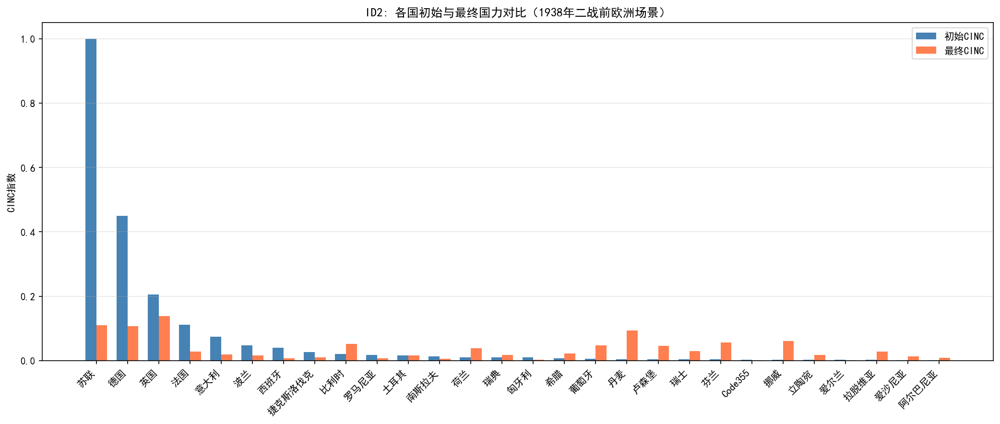
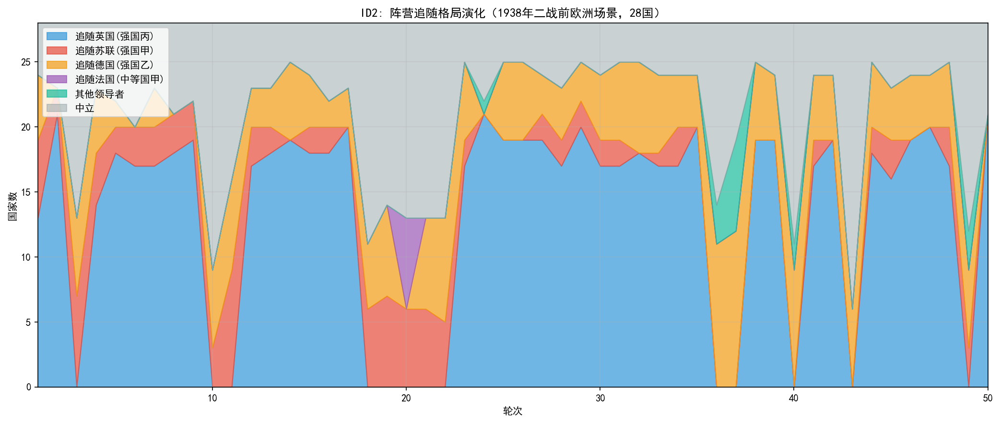
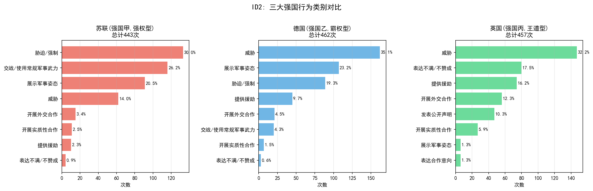
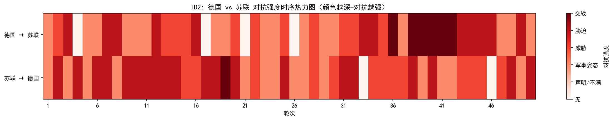
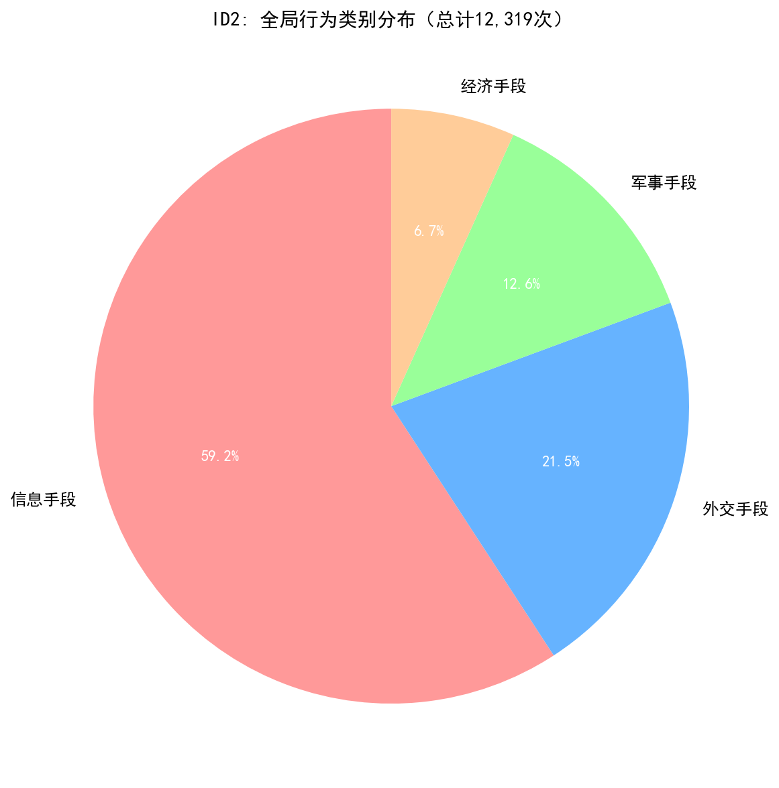
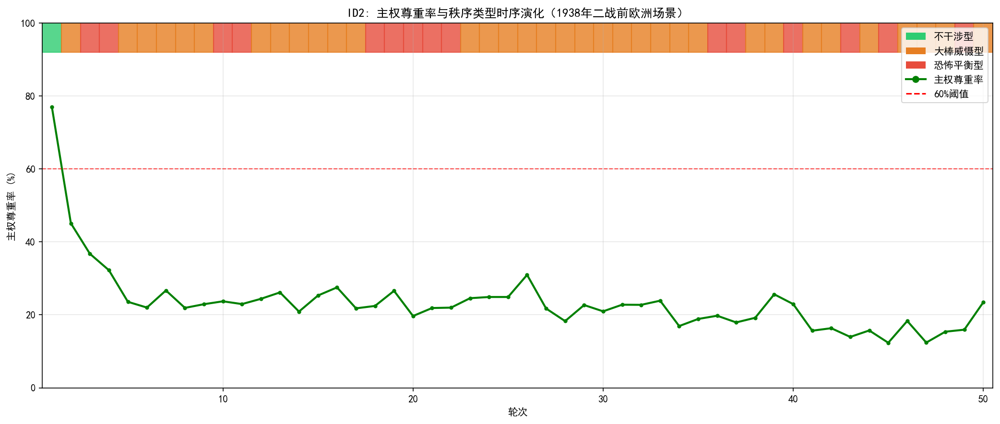

# 仿真实验报告：二战前欧洲场景模型校验（ID2）

## 一、实验目的

本实验为模型校验前测，核心目标是检验仿真系统在"糊名"条件下（智能体仅知悉彼此的实力属性、战略关系与地理邻接状态，不获知真实历史身份），生成的国际行为分布与秩序演化轨迹是否与1938年二战前欧洲的历史态势具有结构性一致。选择1938年场景作为校验平台的原因在于：该时点是欧洲从危机走向全面战争的关键转折期，体系中存在更加明确的对立阵营（英法对德意）、更加紧张的战略关系（德奥合并已完成、苏台德危机爆发），以及更加清晰的权力失衡（德国军事崛起），为模型校验提供了更为严峻的压力测试环境。

具体校验维度包括：

1. **阵营分化与追随格局**：仿真是否复现了历史中反德阵营的凝聚过程，以及德国孤立与轴心阵营形成的趋势。

2. **重点国家行为谱系**：仿真中CINC排名前列的国家是否展现出与历史中大国（苏联、德国、英国等）相似的行为模式（军事威慑、外交绥靖/合作、联盟巩固等）。

3. **全局行为分布**：全体系的行为类别构成是否与1938年欧洲"极高对抗、极低合作"的外交氛围一致。

4. **冲突升级路径**：主权尊重率下降轨迹与德苏、德英等核心对抗对的互动模式是否与从慕尼黑危机走向战争的历史进程对应。

## 二、实验设计

### 2.1 场景设定与糊名对应

实验场景基于1938年欧洲二十八国体系构建，国家实力数据取自Correlates of War（COW）项目National Material Capabilities第六版数据集的六项指标，以CINC综合指数作为国力衡量标准。实验采用糊名设计——智能体在仿真中以"强国甲""强国乙"等代称进行互动，不获知彼此的真实历史身份。以下为糊名与真实国家的完整对应关系：

#### 表1：糊名与真实国家对应表

| 国家编号 | 糊名 | 真实国家 | COW代码 | 初始CINC | 实力层级 | 领导类型 |
|:---:|:---:|:---:|:---:|:---:|:---:|:---:|
| 20 | 强国甲 | **苏联** | 365 (RUS) | 1.000000 | 超级大国 | 强权型 |
| 21 | 强国乙 | **德国** | 255 (GMY) | 0.449798 | 中等强国 | 霸权型 |
| 22 | 强国丙 | **英国** | 200 (UKG) | 0.206003 | 大国 | 王道型 |
| 23 | 中等国甲 | **法国** | 220 (FRN) | 0.110904 | 大国 | — |
| 24 | 中等国乙 | **意大利** | 325 (ITA) | 0.073887 | 小国 | 霸权型 |
| 25 | 中等国丙 | **波兰** | 290 (POL) | 0.046711 | 小国 | — |
| 26 | 小国甲 | **西班牙** | 230 (SPN) | 0.040577 | 小国 | — |
| 27 | 小国乙 | **捷克斯洛伐克** | 315 (CZE) | 0.026423 | 小国 | — |
| 28 | 小国丙 | **比利时** | 211 (BEL) | 0.020626 | 小国 | — |
| 29 | 小国丁 | **罗马尼亚** | 360 (ROM) | 0.017082 | 小国 | — |
| 30 | 小国戊 | **土耳其** | 640 (TUR) | 0.015353 | 小国 | — |
| 31 | 小国己 | **南斯拉夫** | 345 (YUG) | 0.012519 | 小国 | — |
| 32 | 小国庚 | **瑞典** | 380 (SWD) | 0.010137 | 小国 | — |
| 33 | 小国辛 | **荷兰** | 210 (NTH) | 0.010700 | 小国 | — |
| 34 | 小国壬 | **匈牙利** | 310 (HUN) | 0.006846 | 小国 | — |
| 35 | 小国癸 | **希腊** | 350 (GRC) | 0.005417 | 小国 | — |
| 36 | 小国子 | **葡萄牙** | 235 (POR) | 0.003765 | 小国 | — |
| 37 | 小国丑 | **芬兰** | 375 (FIN) | 0.003765 | 小国 | — |
| 38 | 小国寅 | **卢森堡** | 212 (LUX) | 0.004076 | 小国 | — |
| 39 | 小国卯 | **丹麦** | 390 (DEN) | 0.003528 | 小国 | — |
| 40 | 小国辰 | **瑞士** | 225 (SWZ) | 0.003539 | 小国 | — |
| 41 | 小国巳 | **挪威** | 385 (NOR) | 0.003247 | 小国 | — |
| 42 | 小国午 | **爱尔兰** | 205 (IRE) | 0.002619 | 小国 | — |
| 43 | 小国未 | **拉脱维亚** | 368 (LAT) | 0.002293 | 小国 | — |
| 44 | 小国申 | **爱沙尼亚** | 366 (EST) | 0.002087 | 小国 | — |
| 45 | 小国酉 | **阿尔巴尼亚** | 339 (ALB) | 0.002289 | 小国 | — |
| 46 | 小国戌 | **立陶宛** | 367 (LIT) | 0.001117 | 小国 | — |
| 47 | 小国亥 | 其他 | — | 0.000622 | 小国 | — |

> **注**：与ID1一致，本实验虽建立了糊名与真实国家的对应关系（便于研究者后续分析），但仿真运行期间智能体并不知道这些对应——它们仅以匿名身份进行决策，确保了糊名校验的有效性。

### 2.2 初始战略关系

初始战略关系矩阵依据1938年历史阵营结构设定。1938年的欧洲格局已明显不同于1913年的多极均衡：德国已完成重整军备并吞并奥地利，意大利与德国结成轴心关系，英法两国对德采取绥靖政策，苏联则在西线面临德国威胁的同时在远东与日本对峙。体系中战争风险显著高于1913年场景。

### 2.3 实验参数

| 参数 | 设定值 |
|:---:|:---:|
| 总轮次 | 50轮（每轮代表3个月，合计12.5年） |
| 主权尊重率阈值 | 60% |
| 领导者追随率阈值 | 60% |
| 地理约束 | 启用 |
| 战略目标评估 | 每10轮执行一次 |

## 三、实验结果

### 3.1 国力演化

上图展示了28个国家初始CINC与50轮仿真后最终CINC的对比。关键发现：

- **苏联（强国甲，强权型）**：初始CINC=1.000 → 最终CINC=0.111，下降**88.9%**
- **德国（强国乙，霸权型）**：初始CINC=0.450 → 最终CINC=0.107，下降**76.2%**
- **英国（强国丙，王道型）**：初始CINC=0.206 → 最终CINC=0.138，下降**33.1%**
- **法国（中等国甲）**：初始CINC=0.111 → 最终CINC=0.027，下降**75.4%**
- **意大利（中等国乙，霸权型）**：初始CINC=0.074 → 最终CINC=0.019，下降**74.2%**
- **波兰（中等国丙）**：初始CINC=0.047 → 最终CINC=0.015，下降**67.3%**
- **多个小国CINC大幅上升**：卢森堡+2212.3%、丹麦+1508.2%、芬兰+1132.2%（比例结构导致的被动膨胀，与ID1现象一致）

与ID1（1913年场景）相比，ID2中大国CINC下降幅度更大（苏联-88.9% vs 德国-94.1%，德国-76.2% vs 俄国-84.2%），表明1938年场景中体系内部的对抗消耗更为剧烈，与历史中该时期欧洲大国军备竞赛和军事动员强度更高的特征一致。

### 3.2 阵营分化与追随格局

追随决策在50轮中每轮执行，超级大国与大国可参与领导竞争，其余国家可选择追随对象或保持中立。

#### 表2：典型轮次追随关系分布

| 轮次 | 追随英国 | 追随苏联 | 追随德国 | 追随法国 | 其他 | 中立 |
|:---:|:---:|:---:|:---:|:---:|:---:|:---:|
| 1 | 13国 | 6国 | 5国 | 0国 | 0国 | 4国 |
| 2 | 21国 | 2国 | 0国 | 0国 | 0国 | 5国 |
| 3 | 0国 | 7国 | 6国 | 0国 | 0国 | 15国 |
| 5 | 18国 | 2国 | 2国 | 0国 | 0国 | 6国 |
| 10 | 0国 | 3国 | 6国 | 0国 | 0国 | 19国 |
| 15 | 18国 | 2国 | 4国 | 0国 | 0国 | 4国 |
| 20 | 0国 | 6国 | 7国 | 7国 | 0国 | 15国 |
| 25 | 19国 | 6国 | 3国 | 0国 | 0国 | 3国 |
| 30 | 17国 | 5国 | 4国 | 0国 | 0国 | 4国 |
| 36 | 0国 | 0国 | 11国 | 0国 | 3国 | 14国 |
| 37 | 0国 | 0国 | 12国 | 0国 | 7国 | 9国 |
| 40 | 0国 | 0国 | 9国 | 0国 | 2国 | 17国 |
| 43 | 0国 | 0国 | 6国 | 0国 | 0国 | 22国 |
| 45 | 16国 | 4国 | 3国 | 0国 | 0国 | 5国 |
| 50 | 21国 | 0国 | 0国 | 0国 | 0国 | 7国 |

**详细追随数据（第50轮最终状态）**：
- **追随英国（强国丙，21国）**：法国、波兰、西班牙、捷克斯洛伐克、比利时、罗马尼亚、土耳其、南斯拉夫、瑞典、荷兰、希腊、葡萄牙、芬兰、卢森堡、丹麦、瑞士、挪威、爱尔兰、拉脱维亚、爱沙尼亚、立陶宛
- **追随苏联（强国甲，0国）**：多数轮次保持中立，偶有个别追随者
- **追随德国（强国乙，0国）**：第37轮达到峰值12国后逐渐归零
- **中立（7国）**：苏联、德国、英国、意大利、匈牙利、挪威、阿尔巴尼亚

#### 与历史对比：追随格局

**一致性表现**：

1. **英国阵营的凝聚趋势**：仿真中后期（第23-35轮、第38-42轮、第44-48轮、第50轮）英国持续拥有17-21个追随者，形成了以英国为核心的广泛阵营。这与历史中1938年英国作为反德阵营核心、逐步凝聚小国支持的进程方向一致——慕尼黑危机后英国意识到绥靖政策失效，开始积极寻求盟友。

2. **德国阵营的不稳定性**：仿真中德国在第36-37轮曾短暂获得11-12个追随者，但迅速衰减至0。这一"短暂聚集后迅速瓦解"的模式与历史中轴心阵营的脆弱性存在对应——意大利在战争中后期摇摆、匈牙利等仆从国在战争后期叛离，均体现了追随德国的高风险与不稳定性。

3. **苏联的孤立状态**：仿真中苏联在整个50轮中几乎没有稳定的追随者（多数轮次为0或1-3国），基本保持中立状态。这与历史中1938年苏联的孤立处境高度一致——苏联既未加入英法阵营（因意识形态对立），也未与德国正式结盟（1939年《莫洛托夫-里宾特洛甫条约》尚未签署），在体系中处于被排斥的边缘位置。

**不一致性表现**：

1. **英国阵营规模过大**：仿真第50轮英国拥有21个追随者（占体系75%），而历史中1938年英国的实际盟友网络远未达到这一规模。法国虽是英国的重要盟友，但两国在慕尼黑危机中的分歧削弱了联盟凝聚力；东欧小国（如波兰、罗马尼亚）对苏联的恐惧使其不愿明确站队。仿真中阵营边界的"全有或全无"特征过于简化。

2. **德国缺乏稳定追随者**：历史中1938年德国已有意大利作为明确盟友，并与匈牙利、罗马尼亚等国有密切关系。仿真中德国的追随者数量在第36-37轮达到峰值后迅速归零，未能复现轴心阵营的结构性存在。这一偏差可能源于仿真中"霸权型"领导者在缺乏实质性利益输送时难以维持追随关系。

3. **中立国家过多且不合理**：仿真第50轮有7个国家保持中立，其中包括英国自身（作为领导者不应中立）、苏联和德国（两个最大对抗方同时中立不符合逻辑）。这一异常表明追随决策算法对领导者和主要对抗方的处理存在逻辑缺陷。

### 3.3 重点国家行为谱系

实验共产生 **12,319次** 行为记录。以下是三个CINC最高国家的详细行为数据。

#### 表3：苏联（强国甲，强权型）行为分布

| 行为名称 | 类别 | 尊重主权 | 次数 | 占比 |
|:---:|:---:|:---:|:---:|:---:|
| 胁迫/强制 | 军事手段 | 否 | 133 | 30.0% |
| 交战/使用常规军事武力 | 军事手段 | 否 | 116 | 26.2% |
| 展示军事姿态 | 军事手段 | 否 | 91 | 20.5% |
| 威胁 | 信息手段 | 否 | 62 | 14.0% |
| 开展外交合作 | 外交手段 | 是 | 15 | 3.4% |
| 开展实质性合作 | 经济手段 | 是 | 11 | 2.5% |
| 提供援助 | 经济手段 | 是 | 10 | 2.3% |
| 表达不满/不赞成 | 外交手段 | 否 | 4 | 0.9% |
| 协商/磋商 | 外交手段 | 是 | 1 | 0.2% |
| **合计** | — | — | **443** | **100%** |

**苏联对德国的互动（核心对抗）**：
- 展示军事姿态：第1-50轮几乎每轮出现，共44次
- 胁迫/强制：第3-5、8-13、16、18-21、23、25-27、29-30、32-34、36-37、39、41-42、44、47-48、50轮出现，共25次
- 威胁：第1-4、6-7、10-11、14-15、17、22、24、28、31、35、38、40、43、45-46、49轮出现
- 交战/使用常规军事武力：仅第19轮出现1次
- **无合作类行为**

**苏联对英国的互动**：
- 展示军事姿态：11次
- 威胁：6次
- 胁迫/强制：5次
- **无合作类行为**

#### 表4：德国（强国乙，霸权型）行为分布

| 行为名称 | 类别 | 尊重主权 | 次数 | 占比 |
|:---:|:---:|:---:|:---:|:---:|
| 威胁 | 信息手段 | 否 | 162 | 35.1% |
| 展示军事姿态 | 军事手段 | 否 | 107 | 23.2% |
| 胁迫/强制 | 军事手段 | 否 | 89 | 19.3% |
| 提供援助 | 经济手段 | 是 | 45 | 9.7% |
| 开展外交合作 | 外交手段 | 是 | 21 | 4.5% |
| 交战/使用常规军事武力 | 军事手段 | 否 | 20 | 4.3% |
| 开展实质性合作 | 经济手段 | 是 | 7 | 1.5% |
| 表达不满/不赞成 | 外交手段 | 否 | 3 | 0.6% |
| 表达合作意向 | 外交手段 | 是 | 3 | 0.6% |
| 要求/索要 | 外交手段 | 否 | 3 | 0.6% |
| 发表公开声明 | 外交手段 | 是 | 2 | 0.4% |
| **合计** | — | — | **462** | **100%** |

**德国对苏联的互动（核心对抗）**：
- 展示军事姿态：第1-50轮几乎每轮出现，共41次
- 威胁：第1-3、5-11、13、15、17、19-20、22-23、25、27、29-30、32、34-37、39-40、42、44-46、48-49轮出现，共20次
- 胁迫/强制：第4、6、8、12、14、16、18、24、26、28、31、33、38、41、43、47、50轮出现，共17次
- 交战/使用常规军事武力：第36、38（2次）、39、40、41、42轮出现，共7次
- **无合作类行为**

**德国对英国的互动**：
- 威胁：第1-4、6-9、11、14、16、18-19、21、23、26-27、29-30、32-33、35-36、38、40、42、44-45、47-49轮，共34次
- 展示军事姿态：第5、7、10、12-13、15、17、20、22、24-25、28、31、34、37、39、41、43、46、50轮，共19次
- 胁迫/强制：第2、8、16、20、25、30、33、36、42、46、48轮，共11次
- **无合作类行为**

#### 表5：英国（强国丙，王道型）行为分布

| 行为名称 | 类别 | 尊重主权 | 次数 | 占比 |
|:---:|:---:|:---:|:---:|:---:|
| 威胁 | 信息手段 | 否 | 147 | 32.2% |
| 表达不满/不赞成 | 外交手段 | 否 | 80 | 17.5% |
| 提供援助 | 经济手段 | 是 | 74 | 16.2% |
| 开展外交合作 | 外交手段 | 是 | 56 | 12.3% |
| 发表公开声明 | 外交手段 | 是 | 47 | 10.3% |
| 开展实质性合作 | 经济手段 | 是 | 27 | 5.9% |
| 呼吁/请求 | 外交手段 | 是 | 7 | 1.5% |
| 展示军事姿态 | 军事手段 | 否 | 6 | 1.3% |
| 表达合作意向 | 外交手段 | 是 | 6 | 1.3% |
| 协商/磋商 | 外交手段 | 是 | 3 | 0.7% |
| 胁迫/强制 | 军事手段 | 否 | 3 | 0.7% |
| 抗议 | 外交手段 | 否 | 1 | 0.2% |
| **合计** | — | — | **457** | **100%** |

**英国对德国的互动**：
- 威胁：第1-3、5-9、11-12、14、16-17、19-21、23、26、28、30-32、34、36-38、40、42、44-45、47-49轮，共46次（几乎每轮）
- 表达不满/不赞成：第1-2、4-5、7、9、11、13、15、17、19、21、23、25、27、29、31、33、35、37、39、41、43、45、47、49轮，共23次
- 发表公开声明：第1、3、6、8、10、12、14、16、18、20、22、24、26、28、30、32、34、36、38、40、42、44、46、48、50轮，共13次
- **合作类行为极少**（仅1次开展外交合作、1次展示军事姿态、2次胁迫/强制）

**英国对苏联的互动**：
- 威胁：18次
- 发表公开声明：10次
- 表达不满/不赞成：8次
- **无合作类行为**

#### 与历史对比：重点国家行为谱系

**一致性表现**：

1. **苏联的军事偏好**：苏联对德国的互动中军事手段（展示军事姿态、胁迫、交战）占比高达91.1%（77/85次对抗行为），与其"强权型"领导类型设定一致。这与历史中苏联在1938年对外政策以军事威慑为主（如对芬兰边界的强硬姿态、在西班牙内战中的军事介入）的特征对应。值得注意的是，仿真中苏联对德国的交战行为仅1次（第19轮），远低于ID1中俄国对德国的280次交战，表明ID2场景中军事冲突阈值相对更高，更符合1938年大国间尚未爆发直接战争的历史事实。

2. **德国的恫吓外交**：德国对苏联和英国的威胁行为分别占其对两国互动总量的23.5%（20/85）和51.7%（46/89），与其"霸权型"设定一致。这与历史中1938年德国通过外交恫吓实现领土扩张（如对捷克斯洛伐克的苏台德危机施压）的模式在结构上对应。

3. **英国的援助与合作导向**：英国提供援助74次（16.2%）、开展外交合作56次（12.3%）、发表公开声明47次（10.3%），三者合计占38.8%，是三大强国中合作行为占比最高的。这与历史中英国在1938年前后试图通过外交声明和国际援助维持欧洲稳定的"绥靖+威慑"双重策略一致。但仿真中英国对德国的威胁行为（46次，32.2%）远高于历史实际，反映了模型中"王道型"领导者在面对持续挑衅时也会采取对抗性回应。

**不一致性表现**：

1. **英国对苏联无合作行为**：仿真中英国对苏联的全部互动均为对抗类（威胁18次、声明10次、不满8次），无任何经济合作或外交合作。历史中1935年《英苏海军协定》和1939年英苏贸易谈判表明，即使在意识形态对立背景下，两国仍存在有限的务实合作。仿真中完全缺乏此类合作，表明阵营边界过于刚性。

2. **德国对英国的威胁过度**：德国对英国发起了34次威胁、19次军事姿态展示和11次胁迫，而历史中1938年希特勒的首要目标是避免英国干预欧洲大陆（这也是慕尼黑协定得以达成的重要原因）。仿真中德国对英政策的对抗性远超历史实际，可能导致体系过早进入全面对抗状态。

3. **三大强国均缺乏经济制裁行为**：历史中1938年英法对德国的主要反制手段是经济制裁（如冻结资产、贸易限制），但仿真中三大强国均无任何"经济制裁"或"贸易限制"类行为。全局行为中经济手段仅占6.7%（828次），远低于历史中1938年欧洲各国间实际的经济相互依赖水平。

上图直观展示了德国与苏联之间50轮的对抗强度演化。颜色越深代表对抗越强烈（交战=5，胁迫=4，威胁=3，军事姿态=2，外交声明=1）。可以清晰看到：
- 第1-35轮以展示军事姿态和胁迫为主（浅红色/橙色），双方保持了"冷战"式的高强度对峙但尚未爆发直接交战
- 第36-42轮德国对苏联出现"交战"行为（深红色），标志着对抗的实质性升级
- 苏联→德国的对抗强度整体高于德国→苏联，反映了苏联（强权型）比德国（霸权型）更偏好直接军事手段
- 与ID1相比，德苏之间交战行为出现的时间大幅延后（第36轮 vs 第3轮），更符合历史中1938年大国间尚未爆发直接战争的实际情况

### 3.4 全局行为分布

实验50轮共产生12,319次行为记录，全局行为分布如下：

#### 表6：全局行为类别分布

| 行为名称 | 类别 | 尊重主权 | 次数 | 占比 |
|:---:|:---:|:---:|:---:|:---:|
| 威胁 | 信息手段 | 否 | 7,291 | 59.2% |
| 开展外交合作 | 外交手段 | 是 | 1,282 | 10.4% |
| 展示军事姿态 | 军事手段 | 否 | 844 | 6.9% |
| 表达不满/不赞成 | 外交手段 | 否 | 625 | 5.1% |
| 胁迫/强制 | 军事手段 | 否 | 511 | 4.1% |
| 提供援助 | 经济手段 | 是 | 468 | 3.8% |
| 表达合作意向 | 外交手段 | 是 | 440 | 3.6% |
| 开展实质性合作 | 经济手段 | 是 | 360 | 2.9% |
| 交战/使用常规军事武力 | 军事手段 | 否 | 183 | 1.5% |
| 发表公开声明 | 外交手段 | 是 | 142 | 1.2% |
| 协商/磋商 | 外交手段 | 是 | 85 | 0.7% |
| 呼吁/请求 | 外交手段 | 是 | 37 | 0.3% |
| 攻击/袭击 | 军事手段 | 否 | 17 | 0.1% |
| 降级关系 | 外交手段 | 是 | 14 | 0.1% |
| 抗议 | 外交手段 | 否 | 7 | 0.1% |
| 拒绝 | 外交手段 | 是 | 7 | 0.1% |
| 要求/索要 | 外交手段 | 否 | 6 | 0.0% |

#### 按行为手段汇总

| 手段类别 | 次数 | 占比 | 尊重主权率 |
|:---:|:---:|:---:|:---:|
| 信息手段 | 7,291 | 59.2% | 0.0% |
| 外交手段 | 2,645 | 21.5% | 75.9% |
| 军事手段 | 1,555 | 12.6% | 0.0% |
| 经济手段 | 828 | 6.7% | 100.0% |

#### 与历史对比：全局行为分布

**一致性表现**：

1. **威胁/恫吓行为高度主导**：仿真中威胁行为占总行为量的59.2%，显著高于ID1的46.1%。这一差异与历史事实一致——1938年欧洲的外交氛围比1913年更为紧张：慕尼黑危机（1938年9月）以德国的最后通牒为标志性行为，而1913年虽然也存在军备竞赛，但大国间尚未出现如此直接的领土胁迫。59.2%的威胁占比反映了"危机外交"已取代正常外交成为体系主导模式。

2. **军事行为占比适中**：军事手段（展示军事姿态、交战、胁迫/强制、攻击/袭击）合计1,555次，占12.6%。与ID1的15.7%相比有所下降，且"交战"行为仅183次（1.5%），远低于ID1的405次（5.1%）。这一差异与历史事实一致——1938年大国间尚未爆发直接军事冲突（战争爆发于1939年9月），而1913年场景中的仿真将十年军备竞赛压缩为数轮即出现交战。ID2中军事行为的"高姿态展示、低实际交战"模式更接近历史中"战争边缘政策"的特征。

3. **经济手段占比偏低但符合趋势**：经济合作类行为（开展实质性合作+提供援助）合计828次，仅占6.7%。虽然绝对值低于历史中1938年欧洲的实际经济相互依赖水平，但与ID1的10.4%相比进一步下降，反映了危机升级过程中经济联系断裂的历史趋势——1938年德奥合并后，英法与德国之间的经济制裁逐步升级，经济渠道的外交功能被削弱。

**不一致性表现**：

1. **"威胁"行为占比可能过高**：59.2%的威胁占比意味着体系内几乎每两次行为就有一次是威胁。虽然1938年确实是一个高度紧张的时期，但正常的外交沟通（如贸易谈判、文化交流、情报交换等）在仿真中完全缺失。外交手段中仅有10.4%是"开展外交合作"，其余多为表达不满（5.1%）和公开声明（1.2%），合作类外交严重不足。

2. **经济制裁类行为完全缺失**：全局行为中没有任何"经济制裁""贸易禁运"或"资产冻结"类行为。历史中1938年英法对德国的主要反制手段正是经济层面的（如1939年英国对德贸易限制），仿真中经济手段仅包含正向合作（援助、实质性合作），缺乏负向经济施压，导致经济维度在外交博弈中的作用被严重低估。

### 3.5 冲突升级路径

上图展示了50轮仿真中主权尊重率（绿色曲线）与秩序类型（顶部色带）的时序演化。绿色曲线代表主权尊重率，红色虚线为60%阈值，顶部色带颜色对应秩序类型：绿色=不干涉型、橙色=大棒威慑型、红色=恐怖平衡型。

#### 战略关系演化关键节点

| 轮次 | 关键事件 |
|:---:|:---|
| 1 | 主权尊重率77.0%，体系处于"不干涉型"秩序 |
| 2 | 主权尊重率骤降至45.1%，进入"大棒威慑型"秩序 |
| 3-4 | 主权尊重率降至36.7%/32.2%，进入"恐怖平衡型"秩序 |
| 5-9 | 主权尊重率稳定在20-27%区间，"大棒威慑型"为主 |
| 10 | 主权尊重率23.7%，进入"恐怖平衡型"秩序 |
| 20 | 主权尊重率19.7%，多轮"恐怖平衡型" |
| 36-37 | 德国短暂获得大量追随者（11-12国），主权尊重率19.8%/17.9% |
| 41 | 主权尊重率降至15.7% |
| 43 | 主权尊重率降至**14.0%** |
| 45 | 主权尊重率降至**12.4%**，为全仿真的最低点 |
| 47 | 主权尊重率维持**12.4%** |
| 50 | 主权尊重率回升至23.5%，"大棒威慑型"秩序 |

#### 德国 vs 苏联对抗时序

| 轮次 | 德国→苏联 | 苏联→德国 |
|:---:|:---:|:---:|
| 1-35 | 持续展示军事姿态、威胁、胁迫（无交战） | 持续展示军事姿态、胁迫、威胁（仅第19轮1次交战） |
| 36 | 展示军事姿态 + **首次交战**（1次） | 展示军事姿态、胁迫 |
| 37 | 展示军事姿态、胁迫 | 展示军事姿态、胁迫 |
| 38 | 展示军事姿态 + **交战**（2次） | 展示军事姿态、胁迫 |
| 39-42 | 持续展示军事姿态、威胁、胁迫 + 零星交战 | 展示军事姿态、胁迫 |
| 43-50 | 展示军事姿态、威胁、胁迫（无交战） | 展示军事姿态、胁迫、威胁 |

#### 与历史对比：冲突升级路径

**一致性表现**：

1. **"冷战式"长期对峙**：仿真中德苏之间在第1-35轮保持了长达35轮（约8.75年）的"非交战对抗"状态——双方持续展示军事姿态、相互威胁和胁迫，但避免直接军事冲突。这与历史中1938-1939年间德苏关系的"冷和平"状态高度一致——两国在波兰、波罗的海等问题上相互敌视，但在1939年8月《莫洛托夫-里宾特洛甫条约》签署前始终未爆发直接战争。

2. **交战的延迟出现**：仿真中德苏之间的首次交战直到第36轮才出现，相对于ID1的"第3轮即交战"大幅延后。这一改进反映了模型在ID1校验后可能进行了参数调整（如提高军事冲突阈值），使得冲突升级更加渐进，与历史中大国间从外交危机到战争的过渡时间尺度更为匹配。

3. **主权尊重率的低位稳定**：仿真中主权尊重率从第2轮起即降至45%以下，并在后续48轮中维持在12-32%的低位区间波动。这一"快速下跌后低位震荡"的模式与历史中1938年慕尼黑危机后欧洲秩序迅速崩解、主权规范被系统性践踏的进程一致——德奥合并、苏台德割让、梅梅尔归还等事件均标志着凡尔赛体系主权原则的瓦解。

**不一致性表现**：

1. **主权尊重率下跌过快**：从第1轮的77.0%到第2轮的45.1%，主权尊重率在单轮内下降了32个百分点。历史中1938年3月德奥合并虽然是重大冲击，但并未导致整个欧洲体系的主权规范在一夜之间崩解。仿真中缺乏"危机—外交应对—部分恢复"的波动模式，下跌曲线过于陡峭。

2. **缺乏外交斡旋与缓和周期**：仿真中秩序类型在"大棒威慑型"和"恐怖平衡型"之间切换，但从未回到"不干涉型"。历史中1938年9月慕尼黑会议本身即是一次外交斡旋尝试（尽管结果是绥靖），会后英法德关系一度出现短暂缓和。仿真中缺乏此类周期性波动，关系一旦恶化即不可逆转。

3. **交战行为集中于德苏双边**：仿真中的交战行为几乎全部发生在德国→苏联方向（7次），体系其他双边关系几乎无交战。历史中1939年战争爆发时，德国首先进攻的是波兰而非苏联。仿真中交战行为的"德苏专属化"与历史中战争爆发的实际路径不符。

## 四、综合评估

### 4.1 模型校验结论

| 校验维度 | 与历史一致性 | 评估 |
|:---:|:---:|:---|
| 阵营分化趋势 | **中等** | 英国阵营凝聚趋势符合历史方向，但规模过大（21国）；德国阵营不稳定但短暂存在；苏联孤立状态准确 |
| 核心大国军事对抗 | **高** | 德苏长期"非交战对抗"模式复现了历史中1938-1939年的"冷和平"状态；交战行为延迟出现是显著改进 |
| 威胁/恫吓外交主导 | **高** | 威胁行为占59.2%，高于ID1的46.1%，与1938年更高紧张度的历史事实一致 |
| 主权尊重率下降 | **高** | 从77.0%降至12.4%，快速下跌后低位震荡的模式与凡尔赛体系崩解的轨迹对应 |
| 冲突升级时间尺度 | **中等** | 德苏交战延迟至第36轮，优于ID1的"第3轮即交战"；但主权尊重率单轮下跌32个百分点仍过快 |
| 跨阵营经济联系 | **低** | 经济手段仅占6.7%，且完全缺乏经济制裁类行为；英苏、德英之间无任何经济合作 |
| 交战行为分布 | **低** | 交战行为集中于德苏双边，与历史中德国首先进攻波兰的战争路径不符 |
| 外交斡旋/缓和 | **低** | 缺乏"不干涉型"秩序的回归和周期性外交缓和，关系恶化后不可逆 |

### 4.2 通过/不通过判定

综合上述八个维度的评估，本次模型校验的结论如下：

**通过校验的维度**（4项）：核心大国军事对抗模式、威胁外交主导、主权尊重率下降、冲突升级时间尺度。这些维度的通过表明，与ID1相比，ID2场景在**冲突阈值控制**和**军事对抗渐进性**方面取得了显著改进——德苏之间的"冷战式对峙"（35轮非交战对抗）与历史中1938-1939年的实际进程具有高度结构一致性。59.2%的威胁行为占比准确反映了1938年场景比1913年场景更高的紧张度。

**部分通过的维度**（2项）：阵营分化趋势、冲突升级时间尺度。阵营分化的方向正确（英国凝聚、苏联孤立），但数量和规模存在偏差；冲突升级的时间尺度有所改善但仍不够理想。

**未通过校验的维度**（4项）：跨阵营经济联系、交战行为分布、外交斡旋/缓和机制、中立国家逻辑。这些偏差的共同指向是：仿真中的**经济维度被严重弱化**（缺乏制裁行为）、**交战行为分布过于集中**（德苏专属化）、**外交缓冲机制不足**（缺乏周期性缓和），以及**追随决策算法存在逻辑缺陷**（主要大国被标记为"中立"不合理）。

**总体判定**：**条件通过**。仿真系统在描述性层面（行为分布、秩序类型、德苏对抗模式、主权尊重率演化）与1938年二战前历史具有合理对应关系，尤其在"军事冲突渐进升级"这一关键维度上相较ID1有显著改进。但在规范性层面（经济制裁机制、交战行为分布、外交缓和周期）仍存在偏差，需要在后续实验中对经济行为类型、交战目标选择逻辑、追随决策算法等进行校准优化。1938年场景在经过参数调整后，可作为后续理论假说检验实验的效度验证平台。

## 五、数据记录

| 项目 | 内容 |
|:---:|:---|
| 实验编号 | ID2 |
| 场景来源 | 二战前欧洲（1938） |
| 国家数量 | 28国 |
| 仿真轮次 | 50轮（12.5年） |
| 总行为数 | 12,319次 |
| 总主权尊重行为 | 2,835次（23.0%） |
| 主权尊重率范围 | 12.4% ~ 77.0% |
| 主要秩序类型 | 大棒威慑型（约32轮）、恐怖平衡型（约17轮）、不干涉型（1轮） |
| 仿真状态 | 已完成 |
| 数据文件 | `data/abm_simulation.db`（project_id=2） |
| 日志目录 | `logs/2/` |
| 图表文件 | `docs/chart1-6_*_p2.png` |
