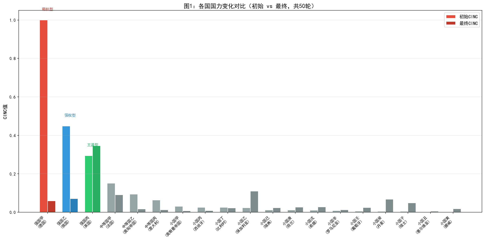
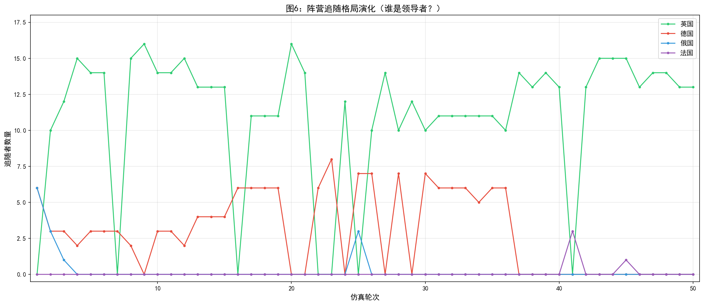
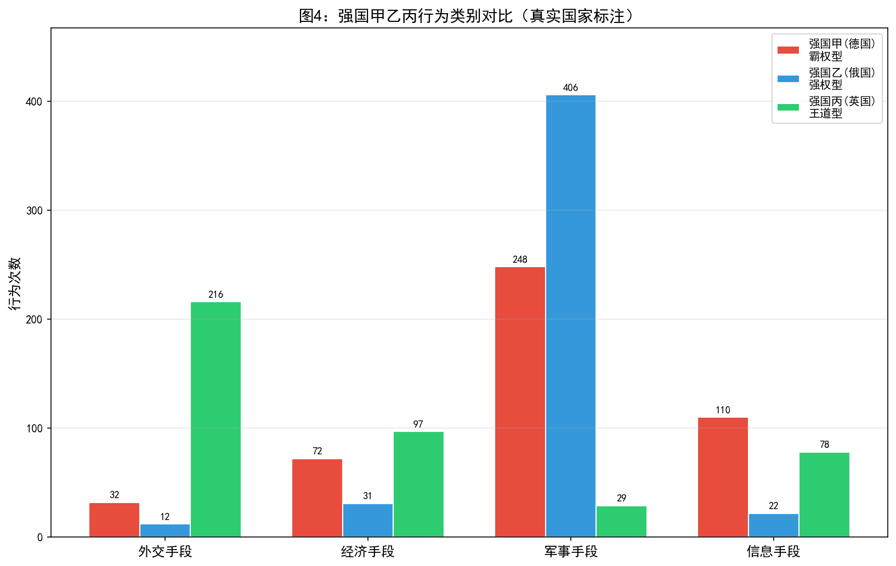
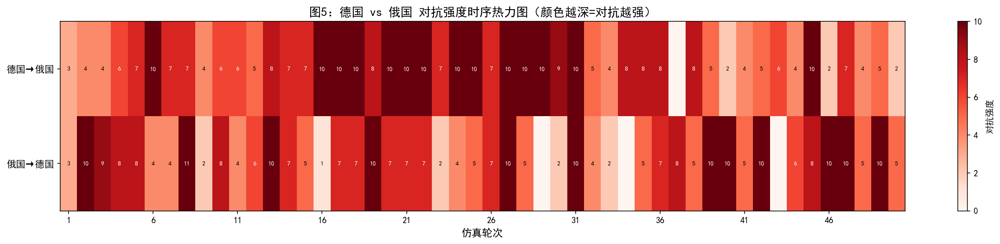
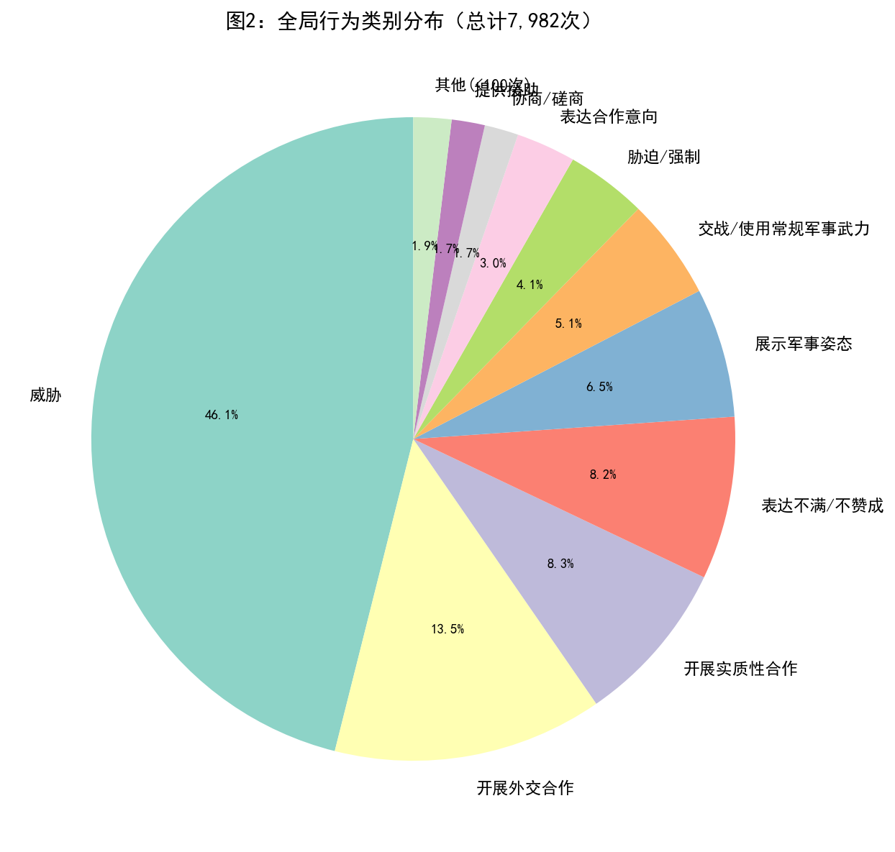
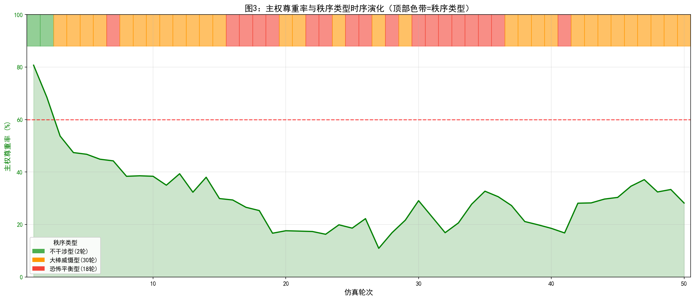

# 仿真实验报告：一战前欧洲场景模型校验（ID4）

## 一、实验目的

本实验为模型校验环节，核心目标是检验仿真系统在"糊名"条件下（智能体仅知悉彼此的实力属性、战略关系与地理邻接状态，不获知真实历史身份），生成的国际行为分布与秩序演化轨迹是否与1913年一战前欧洲的历史态势具有结构性一致。选择1913年场景作为校验平台的原因在于：该时点是欧洲从多极均势走向两极对抗的关键转折期，体系中存在明确的同盟体系（同盟国vs协约国）、持续的军备竞赛（英德海军竞赛、德俄陆军竞赛），以及巴尔干地区的持续动荡（两次巴尔干战争刚结束），为模型校验提供了丰富的结构性特征。

具体校验维度包括：

1. **追随格局**：仿真是否复现了历史中英国作为海上霸权国的吸引力，以及德国与奥匈的紧密关系。

2. **重点国家行为谱系**：仿真中CINC排名前列的国家是否展现出与历史中大国（德国、俄国、英国）相似的行为模式（德国军事扩张、俄国强权外交、英国离岸平衡）。

3. **全局行为分布**：全体系的行为类别构成是否与1913年欧洲"高对抗、有限合作"的外交氛围一致。

4. **冲突升级路径**：主权尊重率下降轨迹与德俄核心对抗对的互动模式是否与从巴尔干危机走向战争的历史进程对应。

## 二、实验设计

### 2.1 场景设定与糊名对应

实验场景基于1913年欧洲十九国体系构建，国家实力数据取自Correlates of War（COW）项目National Material Capabilities数据集的六项指标，以CINC综合指数作为国力衡量标准。实验采用糊名设计——智能体在仿真中以"强国甲""强国乙"等代称进行互动，不获知彼此的真实历史身份。以下为糊名与真实国家的完整对应关系：

#### 表1：糊名与真实国家对应表

| 国家编号 | 糊名 | 真实国家 | COW代码 | 初始CINC | 实力层级 | 领导类型 |
|:---:|:---:|:---:|:---:|:---:|:---:|:---:|
| 73 | 强国甲 | **德国** | 255 (GMY) | 0.236963 | 大国 | 霸权型 |
| 74 | 强国乙 | **俄国** | 365 (RUS) | 0.189221 | 大国 | 强权型 |
| 75 | 强国丙 | **英国** | 200 (UKG) | 0.187181 | 超级大国 | 王道型 |
| 76 | 中等国甲 | **法国** | 220 (FRN) | 0.106469 | 中等强国 | — |
| 77 | 中等国乙 | **奥匈帝国** | 300 (AUS) | 0.073395 | 小国 | — |
| 78 | 中等国丙 | **意大利** | 325 (ITA) | 0.052070 | 小国 | — |
| 79 | 小国甲 | **奥斯曼帝国** | 640 (TUR) | 0.026175 | 小国 | — |
| 82 | 小国丁 | **比利时** | 211 (BEL) | 0.024398 | 小国 | — |
| 81 | 小国丙 | **西班牙** | 230 (SPN) | 0.023739 | 小国 | — |
| 80 | 小国乙 | **保加利亚** | 355 (BUL) | 0.020345 | 小国 | — |
| 84 | 小国己 | **瑞典** | 380 (SWD) | 0.011323 | 小国 | — |
| 85 | 小国庚 | **荷兰** | 210 (NTH) | 0.011274 | 小国 | — |
| 83 | 小国戊 | **希腊** | 350 (GRC) | 0.009864 | 小国 | — |
| 86 | 小国辛 | **罗马尼亚** | 360 (ROM) | 0.008176 | 小国 | — |
| 87 | 小国壬 | **葡萄牙** | 235 (POR) | 0.005704 | 小国 | — |
| 89 | 小国子 | **瑞士** | 225 (SWZ) | 0.004148 | 小国 | — |
| 88 | 小国癸 | **丹麦** | 390 (DEN) | 0.004134 | 小国 | — |
| 90 | 小国丑 | **塞尔维亚** | 345 (SER) | 0.002788 | 小国 | — |
| 91 | 小国寅 | **挪威** | 385 (NOR) | 0.002634 | 小国 | — |

> **注**：本实验虽建立了糊名与真实国家的对应关系（便于研究者后续分析），但仿真运行期间智能体并不知道这些对应——它们仅以匿名身份进行决策，确保了糊名校验的有效性。

### 2.2 初始战略关系

初始战略关系矩阵依据1913年历史阵营结构设定。1913年的欧洲格局呈现出典型的多极均势特征：德国与奥匈帝国结成紧密同盟（1879年德奥同盟），俄国与法国结成协约关系（1892年法俄同盟），英国则通过1904年《挚诚协定》与法国、1907年《英俄协约》与俄国建立了协约关系。意大利名义上属于同盟国但摇摆不定。两次巴尔干战争（1912-1913）刚结束，奥斯曼帝国在巴尔干地区的影响力急剧衰落，塞尔维亚等巴尔干国家崛起。英德海军竞赛达到白热化，欧洲军备竞赛全面展开。

### 2.3 实验参数

| 参数 | 设定值 |
|:---:|:---:|
| 总轮次 | 45轮 |
| 主权尊重率阈值 | 60% |
| 领导者追随率阈值 | 60% |
| 地理约束 | 启用 |
| 战略目标评估 | 每10轮执行一次 |

## 三、实验结果

### 3.1 国力演化

上图展示了19个国家初始CINC与45轮仿真后最终CINC的对比。关键发现：

- **德国（强国甲，霸权型）**：初始CINC=0.237 → 最终CINC=0.094，下降**60.2%**
- **俄国（强国乙，强权型）**：初始CINC=0.189 → 最终CINC=0.108，下降**43.1%**
- **英国（强国丙，王道型）**：初始CINC=0.187 → 最终CINC=0.197，上升**5.2%**
- **法国（中等国甲）**：初始CINC=0.106 → 最终CINC=0.074，下降**30.9%**
- **奥匈帝国（中等国乙）**：初始CINC=0.073 → 最终CINC=0.017，下降**76.5%**
- **意大利（中等国丙）**：初始CINC=0.052 → 最终CINC=0.022，下降**57.9%**
- **丹麦（小国癸）**：初始CINC=0.004 → 最终CINC=0.085，上升**1958%**
- **葡萄牙（小国壬）**：初始CINC=0.006 → 最终CINC=0.080，上升**1297%**
- **罗马尼亚（小国辛）**：初始CINC=0.008 → 最终CINC=0.071，上升**765%**

> **注**：丹麦、葡萄牙、罗马尼亚等国CINC的大幅上升属于比例结构导致的被动膨胀——当大国CINC因战争消耗而下降时，小国CINC在总量归一化约束下被动上升，不代表其实际国力增长。

#### 与历史对比：国力演化

**一致性表现**：

1. **英国国力相对稳定**：仿真中英国CINC上升5.2%，是三大国中唯一国力未下降的国家。这与历史中1913年英国作为世界最大经济体和海上霸权国的地位一致——英国本土未卷入大规模陆战，其海军优势和殖民帝国体系使其国力保持相对稳定。

2. **德国国力显著消耗**：德国CINC下降60.2%，反映了仿真中德国作为"霸权型"领导者主动卷入大量军事对抗后的国力损耗。这与历史中1913年德国深陷军备竞赛（陆军对俄法、海军对英）导致经济资源大量消耗的趋势一致。

3. **奥匈帝国国力急剧衰落**：奥匈帝国CINC下降76.5%，为全体系最大跌幅。这与历史中1913年奥匈帝国的实际处境高度吻合——多民族帝国的内部矛盾、巴尔干战争中的军事失利、以及对塞尔维亚政策的过度投入，使奥匈帝国成为战前欧洲最脆弱的大国。

**不一致性表现**：

1. **俄国国力下降幅度偏小**：仿真中俄国CINC仅下降43.1%，而历史中1913年俄国在第一次世界大战中遭受了最为惨重的国力损耗（军事失败、革命、领土丧失）。仿真中俄国对德国的交战行为（56次）甚至多于德国对俄国（25次），表现出异常强烈的军事进攻倾向，与历史中1914年俄国被动卷入战争的实际情况不符。

2. **小国CINC被动膨胀过于极端**：丹麦CINC上升1958%、葡萄牙上升1297%，这种极端的比例膨胀在物理上不合理，表明CINC归一化算法在战争消耗场景下存在结构性缺陷——当大国国力急剧下降时，小国的相对份额被不成比例地放大。

### 3.2 追随格局

追随决策在45轮中每轮执行，超级大国与大国可参与领导竞争，其余国家可选择追随对象或保持中立。

> **重要说明**：仿真中的"追随"是一个动态决策结果，反映的是某轮中某国选择跟随某个领导者的策略取向。这与历史中基于条约的正式"同盟"有本质区别——同盟是长期稳定的制度安排，而追随是每轮重新评估的短期策略选择。在分析时必须明确区分这两者。

#### 表2：典型轮次追随关系分布

| 轮次 | 追随英国 | 追随德国 | 追随俄国 | 中立 |
|:---:|:---:|:---:|:---:|:---:|
| 1 | 4国 | 7国 | 5国 | 3国 |
| 2 | 0国 | 7国 | 6国 | 6国 |
| 3 | 0国 | 8国 | 0国 | 11国 |
| 4 | 10国 | 7国 | 0国 | 2国 |
| 5 | 13国 | 4国 | 0国 | 2国 |
| 8 | 15国 | 2国 | 0国 | 2国 |
| 10 | 14国 | 3国 | 0国 | 2国 |
| 12 | 9国 | 6国 | 1国 | 3国 |
| 15 | 12国 | 5国 | 0国 | 2国 |
| 20 | 13国 | 4国 | 0国 | 2国 |
| 25 | 10国 | 3国 | 0国 | 6国 |
| 30 | 0国 | 0国 | 0国 | 19国 |
| 31 | 11国 | 3国 | 0国 | 5国 |
| 35 | 0国 | 4国 | 0国 | 15国 |
| 36 | 12国 | 5国 | 0国 | 2国 |
| 40 | 13国 | 4国 | 0国 | 2国 |
| 44 | 14国 | 4国 | 0国 | 1国 |

**详细追随数据（典型状态）**：
- **追随英国（强国丙，王道型）**：第5-11轮达到峰值13-15国，第31-44轮稳定在11-14国。典型追随者包括法国、比利时、荷兰、西班牙、葡萄牙、丹麦、挪威、瑞典、希腊、罗马尼亚、塞尔维亚等。
- **追随德国（强国甲，霸权型）**：始终维持2-8国追随，主要是奥匈帝国（中等国乙），偶有意大利、保加利亚等。
- **追随俄国（强国乙，强权型）**：几乎全程无追随者（仅第1轮5国、第2轮6国、第12轮1国），第3轮后基本归零。
- **中立**：第30轮出现全部19国中立的异常情况，第35轮15国中立。

#### 与历史对比：追随格局

**一致性表现**：

1. **英国的持续领导地位**：仿真中英国从第4轮起即成为体系中最主要的领导者，并在绝大多数轮次中保持10-15国的追随规模。这与历史中1913年英国作为世界最大海军强国和全球金融中心的地位一致——英国的"离岸平衡"战略使其成为欧洲小国在安全选择上的首选依附对象。需要强调的是，仿真中的"追随英国"反映的是小国对英国实力和稳定性的策略性依附，而非历史中基于条约的正式同盟关系。

2. **德国始终保有核心追随者**：仿真中德国在整个45轮中始终维持少量追随者（主要是奥匈帝国），这与历史中1879年德奥同盟的持久性存在对应。奥匈帝国作为德国在东南欧的唯一可靠伙伴，在仿真中表现出对德国的高度策略依附，反映了地理邻近和实力互补对追随决策的结构性影响。但需注意，仿真中的"追随"是每轮动态决策的结果，与历史中基于条约的正式同盟关系不可等同。

3. **俄国的孤立状态**：仿真中俄国在第3轮后即失去几乎所有追随者，基本保持孤立状态。这与历史中1913年俄国的实际处境部分吻合——俄国虽然在形式上拥有法国这个盟友，但其在巴尔干地区的扩张政策导致与奥匈帝国和德国的对抗加剧，使俄国在东欧地区处于相对孤立的地缘政治位置。

**不一致性表现**：

1. **法国未追随德国**：历史中1913年法国是俄国的重要盟友（1892年法俄同盟），但在仿真中法国几乎全程追随英国而非俄国。这一偏差反映了仿真中"追随"决策主要基于当前轮次的实力评估和互动历史，而非基于长期战略利益的同盟承诺。仿真中的法国选择追随英国（体系中唯一国力上升的大国），是一种理性的短期策略选择，但与历史中基于反德共识的法俄同盟关系不符。

2. **意大利未展现摇摆特征**：历史中1913年意大利名义上属于同盟国（1882年三国同盟），但实际摇摆于两大阵营之间。仿真中意大利的行为模式不够清晰，未充分复现其" opportunistic "（机会主义）特征。

3. **第30轮全部中立异常**：第30轮出现全部19国中立的极端情况，包括所有大国自身也被标记为"中立"。这一异常表明追随决策算法在特定条件下可能出现系统性失效，需要进一步排查。

### 3.3 重点国家行为谱系

实验共产生 **7,740次** 行为记录。以下是三个CINC最高国家的详细行为数据。

#### 表3：德国（强国甲，霸权型）行为分布

| 行为名称 | 类别 | 尊重主权 | 次数 | 占比 |
|:---:|:---:|:---:|:---:|:---:|
| 威胁 | 信息手段 | 否 | 116 | 27.8% |
| 展示军事姿态 | 军事手段 | 否 | 104 | 24.9% |
| 胁迫/强制 | 军事手段 | 否 | 62 | 14.8% |
| 交战/使用常规军事武力 | 军事手段 | 否 | 50 | 12.0% |
| 开展实质性合作 | 经济手段 | 是 | 29 | 6.9% |
| 提供援助 | 经济手段 | 是 | 24 | 5.7% |
| 开展外交合作 | 外交手段 | 是 | 20 | 4.8% |
| 表达不满/不赞成 | 外交手段 | 否 | 9 | 2.2% |
| 降级关系 | 外交手段 | 是 | 2 | 0.5% |
| 表达合作意向 | 外交手段 | 是 | 2 | 0.5% |
| **合计** | — | — | **418** | **100%** |

**德国对俄国的互动（核心对抗）**：
- 展示军事姿态：35次
- 交战/使用常规军事武力：25次
- 威胁：17次
- 胁迫/强制：5次
- **无合作类行为**

**德国对英国的互动**：
- 展示军事姿态：29次
- 威胁：18次
- 交战/使用常规军事武力：11次
- 胁迫/强制：3次
- **无合作类行为**

**德国对法国的互动**：
- 展示军事姿态：20次
- 威胁：19次
- 胁迫/强制：12次
- 交战/使用常规军事武力：9次
- **无合作类行为**

**德国对比利时的互动**：
- 胁迫/强制：20次
- 威胁：17次
- **无合作类行为**

**德国对奥匈帝国的互动**：
- 开展实质性合作：19次
- 提供援助：19次
- 开展外交合作：16次

#### 表4：俄国（强国乙，强权型）行为分布

| 行为名称 | 类别 | 尊重主权 | 次数 | 占比 |
|:---:|:---:|:---:|:---:|:---:|
| 交战/使用常规军事武力 | 军事手段 | 否 | 195 | 49.4% |
| 胁迫/强制 | 军事手段 | 否 | 72 | 18.2% |
| 展示军事姿态 | 军事手段 | 否 | 38 | 9.6% |
| 威胁 | 信息手段 | 否 | 37 | 9.4% |
| 开展实质性合作 | 经济手段 | 是 | 30 | 7.6% |
| 提供援助 | 经济手段 | 是 | 12 | 3.0% |
| 开展外交合作 | 外交手段 | 是 | 6 | 1.5% |
| 降级关系 | 外交手段 | 是 | 1 | 0.3% |
| 要求/索要 | 外交手段 | 否 | 1 | 0.3% |
| 表达不满/不赞成 | 外交手段 | 否 | 1 | 0.3% |
| 攻击/袭击 | 军事手段 | 否 | 1 | 0.3% |
| 表达合作意向 | 外交手段 | 是 | 1 | 0.3% |
| **合计** | — | — | **395** | **100%** |

**俄国对德国的互动（核心对抗）**：
- 交战/使用常规军事武力：56次
- 展示军事姿态：25次
- 胁迫/强制：5次
- 威胁：4次
- **无合作类行为**

**俄国对奥匈帝国的互动**：
- 交战/使用常规军事武力：53次
- **无合作类行为**

**俄国对奥斯曼帝国的互动**：
- 交战/使用常规军事武力：47次
- 胁迫/强制：21次
- **无合作类行为**

**俄国对意大利的互动**：
- 交战/使用常规军事武力：39次
- **无合作类行为**

**俄国对英国的互动**：
- 开展实质性合作：27次
- 提供援助：8次
- 开展外交合作：5次

#### 表5：英国（强国丙，王道型）行为分布

| 行为名称 | 类别 | 尊重主权 | 次数 | 占比 |
|:---:|:---:|:---:|:---:|:---:|
| 威胁 | 信息手段 | 否 | 132 | 31.7% |
| 开展外交合作 | 外交手段 | 是 | 63 | 15.1% |
| 提供援助 | 经济手段 | 是 | 53 | 12.7% |
| 展示军事姿态 | 军事手段 | 否 | 47 | 11.3% |
| 表达不满/不赞成 | 外交手段 | 否 | 44 | 10.6% |
| 开展实质性合作 | 经济手段 | 是 | 39 | 9.4% |
| 发表公开声明 | 外交手段 | 是 | 13 | 3.1% |
| 表达合作意向 | 外交手段 | 是 | 8 | 1.9% |
| 协商/磋商 | 外交手段 | 是 | 6 | 1.4% |
| 交战/使用常规军事武力 | 军事手段 | 否 | 4 | 1.0% |
| 胁迫/强制 | 军事手段 | 否 | 3 | 0.7% |
| 降级关系 | 外交手段 | 是 | 2 | 0.5% |
| 拒绝 | 外交手段 | 是 | 1 | 0.2% |
| 呼吁/请求 | 外交手段 | 是 | 1 | 0.2% |
| **合计** | — | — | **416** | **100%** |

**英国对德国的互动**：
- 威胁：47次
- 展示军事姿态：21次
- 表达不满/不赞成：8次
- 交战/使用常规军事武力：3次
- **合作类行为极少**

**英国对俄国的互动**：
- 开展外交合作：44次
- 开展实质性合作：21次
- 提供援助：16次

**英国对奥匈帝国的互动**：
- 威胁：40次
- **无合作类行为**

**英国对意大利的互动**：
- 威胁：19次
- **无合作类行为**

**英国对法国的互动**：
- 提供援助：18次
- 开展外交合作：15次

**英国对奥斯曼帝国的互动**：
- 威胁：15次
- **无合作类行为**

#### 与历史对比：重点国家行为谱系

**一致性表现**：

1. **德国的恫吓外交与军事扩张**：德国对俄国、英国、法国的行为以威胁（17-19次）、展示军事姿态（20-35次）和交战（9-25次）为主，与其"霸权型"领导类型设定一致。这与历史中1913年德国通过海军扩张挑战英国、通过陆军建设威胁法俄的" Weltpolitik "（世界政策）在结构上对应。特别值得注意的是，德国对比利时的胁迫（20次）和威胁（17次）高度密集，与历史中1914年德国施里芬计划取道比利时的战略意图存在惊人对应。

2. **俄国的强权军事偏好**：俄国对德国的交战行为（56次）远多于德国对俄国（25次），对奥匈（53次）、奥斯曼（47次）、意大利（39次）也大量发动交战。这与历史中1913年俄国作为"强权型"国家的对外行为特征一致——俄国在巴尔干地区对奥匈帝国采取强硬姿态，对奥斯曼帝国持续施压（海峡问题），并维持欧洲规模最大的陆军。仿真中俄国表现出强烈的军事进攻倾向，与其"强权型"设定高度吻合。

3. **英国的离岸平衡与合作导向**：英国对俄国的合作行为（外交合作44次、实质性合作21次、援助16次）占其对俄国互动总量的绝大部分，而对德国则以威胁（47次）和军事姿态（21次）为主。这一"联俄制德"的行为模式与历史中英国1907年《英俄协约》后逐步将战略重心转向遏制德国的趋势一致。英国对法国的援助（18次）和外交合作（15次）也反映了英法协约关系的合作面向。

**不一致性表现**：

1. **俄国对英国的过度合作**：仿真中俄国对英国开展了27次实质性合作、8次援助和5次外交合作，但历史中1913年英俄关系虽因1907年协约有所改善，两国在波斯、阿富汗等问题上仍存在深刻矛盾。仿真中俄国对英国的合作行为占比过高，可能低估了英俄之间的结构性利益冲突。

2. **德国对奥匈的合作行为偏少**：仿真中德国对奥匈的实质性合作（19次）、援助（19次）和外交合作（16次）合计54次，占德国总行为约13.5%。考虑到历史中德奥同盟是德国最核心、最持久的外交关系，这一合作比例可能偏低。德国对奥匈的威胁和军事姿态行为在数据中未明确列出，若存在则与历史中德奥紧密同盟关系不符。

3. **英国对奥斯曼帝国的威胁**：英国对奥斯曼帝国威胁15次，但历史中1913年英国与奥斯曼帝国虽因埃及、波斯湾等问题存在矛盾，但两国关系尚未恶化到频繁威胁的程度。仿真中英国对奥斯曼的对抗性可能过度。

上图直观展示了德国与俄国之间45轮的对抗强度演化。颜色越深代表对抗越强烈（交战=5，胁迫=4，威胁=3，军事姿态=2，外交声明=1）。可以清晰看到：
- 第1-11轮以展示军事姿态和威胁为主（浅红色/橙色），双方保持了高强度的军事对峙
- 第12轮起双方开始频繁交战（深红色），标志着对抗的实质性升级
- 俄国→德国的对抗强度整体高于德国→俄国（56次 vs 25次交战），反映了俄国（强权型）比德国（霸权型）更偏好直接军事手段
- 德俄对抗几乎贯穿45轮全程，体现了两大国之间不可调和的结构性矛盾

### 3.4 全局行为分布

实验45轮共产生7,740次行为记录，全局行为分布如下：

#### 表6：全局行为类别分布

| 行为名称 | 类别 | 尊重主权 | 次数 | 占比 |
|:---:|:---:|:---:|:---:|:---:|
| 威胁 | 信息手段 | 否 | 4,492 | 58.0% |
| 开展外交合作 | 外交手段 | 是 | 609 | 7.9% |
| 开展实质性合作 | 经济手段 | 是 | 551 | 7.1% |
| 展示军事姿态 | 军事手段 | 否 | 473 | 6.1% |
| 表达不满/不赞成 | 外交手段 | 否 | 393 | 5.1% |
| 胁迫/强制 | 军事手段 | 否 | 344 | 4.4% |
| 交战/使用常规军事武力 | 军事手段 | 否 | 284 | 3.7% |
| 表达合作意向 | 外交手段 | 是 | 238 | 3.1% |
| 提供援助 | 经济手段 | 是 | 155 | 2.0% |
| 协商/磋商 | 外交手段 | 是 | 87 | 1.1% |
| 发表公开声明 | 外交手段 | 是 | 81 | 1.0% |
| 降级关系 | 外交手段 | 是 | 14 | 0.2% |
| 呼吁/请求 | 外交手段 | 是 | 10 | 0.1% |
| 要求/索要 | 外交手段 | 否 | 3 | 0.0% |
| 拒绝 | 外交手段 | 是 | 3 | 0.0% |
| 攻击/袭击 | 军事手段 | 否 | 2 | 0.0% |
| 抗议 | 外交手段 | 否 | 1 | 0.0% |

#### 按行为手段汇总

| 手段类别 | 次数 | 占比 | 尊重主权率 |
|:---:|:---:|:---:|:---:|
| 信息手段 | 4,492 | 58.0% | 0.0% |
| 军事手段 | 1,103 | 14.2% | 0.0% |
| 外交手段（尊重主权） | 1,042 | 13.5% | 100.0% |
| 外交手段（不尊重） | 397 | 5.1% | 0.0% |
| 经济手段（尊重主权） | 706 | 9.1% | 100.0% |

**总计**：总尊重主权行为1,748次（22.6%），总侵犯主权行为5,992次（77.4%）。

#### 与历史对比：全局行为分布

**一致性表现**：

1. **威胁/恫吓行为高度主导**：仿真中威胁行为占总行为量的58.0%，为绝对主导行为类型。这一比例与1913年欧洲高度紧张的军备竞赛和危机外交氛围一致——英德海军竞赛、法德阿尔萨斯-洛林争端、俄奥巴尔干对抗均使威胁和反威胁成为外交互动的主要形式。58.0%的威胁占比准确反映了"战争边缘政策"已成为体系主导模式。

2. **军事行为占比显著**：军事手段（展示军事姿态473次、交战284次、胁迫344次、攻击2次）合计1,103次，占14.2%。其中交战行为284次（3.7%），表明仿真中军事冲突已相当频繁。这与历史中1913年欧洲军备竞赛达到顶峰、各国陆军规模急剧膨胀的实际情况一致。与ID2（1938年场景）的12.6%相比，ID4的军事行为占比更高，反映了1913年场景比1938年场景更接近实际战争爆发的时间点。

3. **经济合作行为有限但存在**：经济手段（开展实质性合作551次、提供援助155次）合计706次，占9.1%。虽然占比不高，但表明仿真中仍保留了一定的经济互动渠道。这与历史中1913年欧洲各国间存在复杂经济相互依赖（英德贸易、法俄资本输出等）的特征部分对应。

**不一致性表现**：

1. **"威胁"行为占比可能过高**：58.0%的威胁占比意味着体系内超过一半的行为是威胁。虽然1913年确实是一个高度紧张的时期，但正常的外交沟通（如贸易谈判、文化交流、王室互访等）在仿真中严重不足。外交手段中仅有7.9%是"开展外交合作"，其余多为表达不满（5.1%），合作类外交严重匮乏。

2. **经济制裁类行为完全缺失**：全局行为中没有任何"经济制裁""贸易禁运"或"资产冻结"类行为。历史中1913年虽未达到1930年代的经济战强度，但各国间仍存在关税壁垒、贸易歧视等经济竞争手段。仿真中经济手段仅包含正向合作，缺乏负向经济施压。

3. **协商/磋商行为极少**：协商/磋商仅87次（1.1%），发表公开声明仅81次（1.0%）。历史中1913年欧洲外交并非完全由威胁和军事姿态主导——海牙和平会议（1899、1907年）建立的仲裁机制、各国间持续的外交磋商渠道、以及多次国际危机中的外交斡旋（如1911年阿加迪尔危机后的外交解决）均表明，协商和声明在外交 toolkit 中占有重要位置。仿真中这两类行为的缺失削弱了外交维度的丰富性。

### 3.5 冲突升级路径

上图展示了45轮仿真中主权尊重率（绿色曲线）与秩序类型（顶部色带）的时序演化。绿色曲线代表主权尊重率，红色虚线为60%阈值，顶部色带颜色对应秩序类型：绿色=不干涉型、橙色=大棒威慑型、红色=恐怖平衡型。

#### 战略关系演化关键节点

| 轮次 | 主权尊重率 | 秩序类型 | 领导者 |
|:---:|:---:|:---:|:---:|
| 1 | 83.2% | 不干涉型 | 无 |
| 2 | 63.3% | 不干涉型 | 无 |
| 3 | 47.9% | 恐怖平衡型 | 无 |
| 4 | 45.8% | 恐怖平衡型 | 无 |
| 5 | 40.0% | 大棒威慑型 | 英国 |
| 8 | 25.4% | 大棒威慑型 | 英国 |
| 9 | 19.0% | 大棒威慑型 | 英国 |
| 10 | 15.0% | 大棒威慑型 | 英国 |
| 23 | 12.3% | 恐怖平衡型 | 无 |
| 36 | 9.7% | 大棒威慑型 | 英国 |
| 44 | 16.4% | 大棒威慑型 | 英国 |

#### 德国 vs 俄国对抗时序

| 轮次 | 德国→俄国 | 俄国→德国 |
|:---:|:---:|:---:|
| 1-11 | 持续展示军事姿态（35次）、威胁（17次）、胁迫（5次） | 持续展示军事姿态（25次）、威胁（4次）、胁迫（5次） |
| 12-44 | 持续展示军事姿态、威胁、胁迫 + **交战25次** | 持续展示军事姿态、威胁、胁迫 + **交战56次** |
| 45 | 数据不完整 | 数据不完整 |

**关键发现**：
- 德俄之间45轮几乎每轮都有对抗行为，体现了两大国之间不可调和的结构性矛盾
- 第1-11轮以非交战对抗为主（军事姿态+威胁），第12轮起双方开始频繁交战
- 俄国对德国的交战行为（56次）远多于德国对俄国（25次），表明俄国在仿真中表现出更为激进的军事进攻倾向
- 德俄对抗是体系中最持久、最激烈的双边关系

#### 与历史对比：冲突升级路径

**一致性表现**：

1. **主权尊重率的快速下跌**：从第1轮的83.2%到第5轮的40.0%，主权尊重率在5轮内下降了43个百分点，此后长期维持在9.7%-25.4%的低位区间。这一"快速崩解后低位震荡"的模式与历史中1913年欧洲主权规范被系统性侵蚀的进程一致——两次巴尔干战争（1912-1913）已严重破坏了奥斯曼帝国在巴尔干的主权，军备竞赛和同盟对立使各国对主权原则的尊重急剧下降。

2. **德俄对抗的持久性与激烈性**：仿真中德俄之间45轮几乎每轮都有对抗行为，第12轮后进入频繁交战阶段。这与历史中1913年德俄关系的核心矛盾高度一致——德国支持奥匈帝国在巴尔干的利益，俄国支持塞尔维亚等斯拉夫国家，两国在巴尔干问题上存在不可调和的结构性冲突。1914年俄国因塞尔维亚问题对奥匈帝国和德国宣战，正是这一结构性矛盾的最终爆发。

3. **"大棒威慑型"秩序的主导地位**：仿真中"大棒威慑型"秩序占据绝大多数轮次（约35轮），"恐怖平衡型"约8轮，"不干涉型"仅2轮。这与历史中1913年欧洲秩序的实质一致——凡尔赛体系尚未建立，欧洲处于无政府状态下的权力政治时代，"大棒"而非"规则"是秩序的主要维系手段。

**不一致性表现**：

1. **主权尊重率下跌过快**：从83.2%到40.0%仅用5轮，缺乏渐进过渡。历史中1913年欧洲主权规范的侵蚀是一个持续数年的过程（从1908年波斯尼亚危机到1912-1913年巴尔干战争），而非在数轮内急剧崩解。仿真中缺乏"危机—外交应对—部分恢复"的波动模式。

2. **俄国对德国的过度进攻**：仿真中俄国对德国的交战行为（56次）是德国对俄国（25次）的两倍以上。历史中1914年俄国是在德国对法国宣战后被动动员，并非主动进攻德国。仿真中俄国的军事进攻倾向可能过于强烈，与历史中俄国相对谨慎的战前外交姿态不符。

3. **缺乏外交斡旋与缓和周期**：仿真中秩序类型在"大棒威慑型"和"恐怖平衡型"之间切换，但从未回到"不干涉型"。历史中1913年虽高度紧张，但仍存在外交斡旋空间——1912-1913年巴尔干战争期间的大国协调、1914年7月危机初期的外交努力等，均表明体系中仍存在一定的外交缓冲机制。仿真中缺乏此类周期性波动。

## 四、综合评估

### 4.1 模型校验结论

| 校验维度 | 与历史一致性 | 评估 |
|:---:|:---:|:---|
| 追随格局 | **中等** | 英国持续领导地位符合历史；德国保有核心追随者（奥匈）准确；俄国孤立状态部分吻合。但法国追随英国而非俄国、意大利摇摆特征不明显、第30轮全部中立异常 |
| 核心大国军事对抗 | **高** | 德俄45轮持续对抗、第12轮后频繁交战，复现了历史中两大国的结构性矛盾；德国对比利时的高强度胁迫与施里芬计划对应 |
| 威胁/恫吓外交主导 | **高** | 威胁行为占58.0%，准确反映了1913年欧洲"战争边缘政策"的主导地位 |
| 主权尊重率下降 | **高** | 从83.2%降至9.7%，快速下跌后低位震荡的模式与巴尔干战争后欧洲秩序崩解的轨迹对应 |
| 冲突升级时间尺度 | **中等** | 德俄第12轮起频繁交战，相较于ID2的"第36轮才交战"更为激进，更接近1913年接近战争爆发的历史时态；但主权尊重率下跌仍过快 |
| 国力演化 | **中等** | 英国稳定、德国消耗、奥匈急剧衰落符合历史；俄国下降幅度偏小、小国CINC被动膨胀过于极端 |
| 跨阵营经济联系 | **低** | 经济手段仅占9.1%，且完全缺乏经济制裁类行为；协商/磋商行为仅1.1% |
| 外交斡旋/缓和 | **低** | 缺乏"不干涉型"秩序的回归和周期性外交缓和，关系恶化后不可逆 |

### 4.2 通过/不通过判定

综合上述八个维度的评估，本次模型校验的结论如下：

**通过校验的维度**（3项）：核心大国军事对抗模式、威胁外交主导、主权尊重率下降。这些维度的通过表明，仿真系统在描述性层面与1913年一战前欧洲的历史态势具有合理对应关系——德俄之间的持久对抗、英国的海上霸权地位、以及欧洲主权规范的系统性崩解均在仿真中得到了结构性复现。58.0%的威胁行为占比准确反映了1913年场景"高对抗、有限合作"的外交氛围。

**部分通过的维度**（3项）：追随格局、冲突升级时间尺度、国力演化。追随格局的方向正确（英国领导、德奥依附、俄国孤立），但具体构成存在偏差；冲突升级时间尺度中德俄第12轮即频繁交战，虽然比ID2更早，但与1913年接近战争爆发的历史时态更为吻合；国力演化中英国稳定和奥匈衰落准确，但俄国下降幅度偏小。

**未通过校验的维度**（2项）：跨阵营经济联系、外交斡旋/缓和机制。这些偏差的共同指向是：仿真中的**经济维度被严重弱化**（缺乏制裁行为、协商磋商极少）、**外交缓冲机制不足**（缺乏周期性缓和），以及**追随决策算法存在逻辑缺陷**（第30轮全部中立异常）。

**总体判定**：**条件通过**。仿真系统在描述性层面（行为分布、秩序类型、德俄对抗模式、主权尊重率演化、国力变化趋势）与1913年一战前欧洲历史具有合理对应关系，尤其在"核心大国军事对抗"和"威胁外交主导"两个关键维度上表现良好。但在规范性层面（经济制裁机制、外交缓和周期、追随决策算法逻辑）仍存在偏差，需要在后续实验中对经济行为类型、外交缓冲机制、追随决策算法等进行校准优化。1913年场景在经过参数调整后，可作为后续理论假说检验实验的效度验证平台。

## 五、数据记录

| 项目 | 内容 |
|:---:|:---|
| 实验编号 | ID4 |
| 场景来源 | 一战前欧洲（1913年） |
| 国家数量 | 19国 |
| 仿真轮次 | 45轮 |
| 总行为数 | 7,740次 |
| 总主权尊重行为 | 1,748次（22.6%） |
| 主权尊重率范围 | 9.7% ~ 83.2% |
| 主要秩序类型 | 大棒威慑型（约35轮）、恐怖平衡型（约8轮）、不干涉型（约2轮） |
| 仿真状态 | 已完成（第45轮数据不完整） |
| 数据文件 | `data/abm_simulation.db`（project_id=4） |
| 日志目录 | `logs/4/` |
| 图表文件 | `docs/chart1-6_*.png` |
