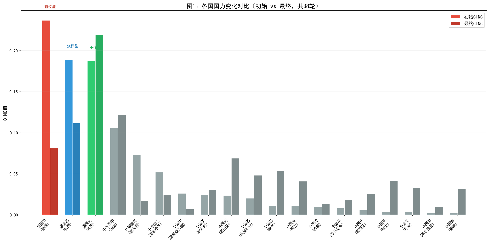
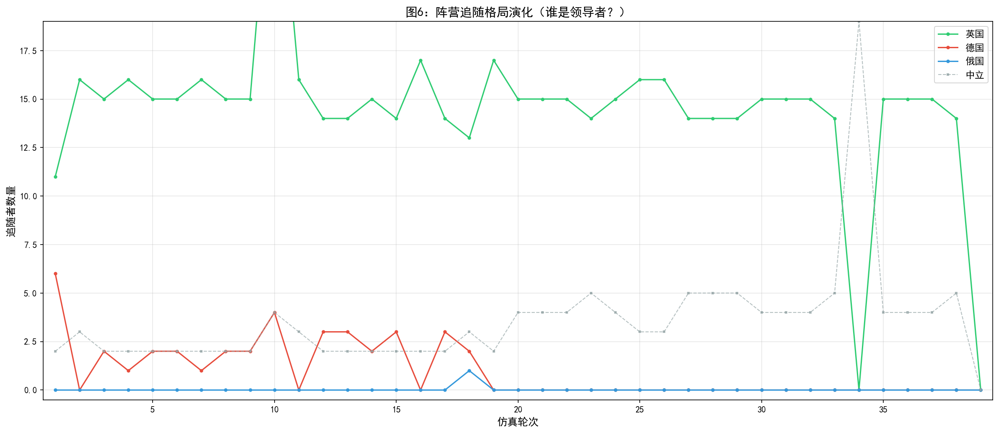
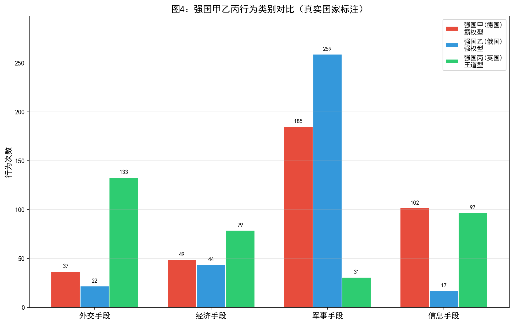
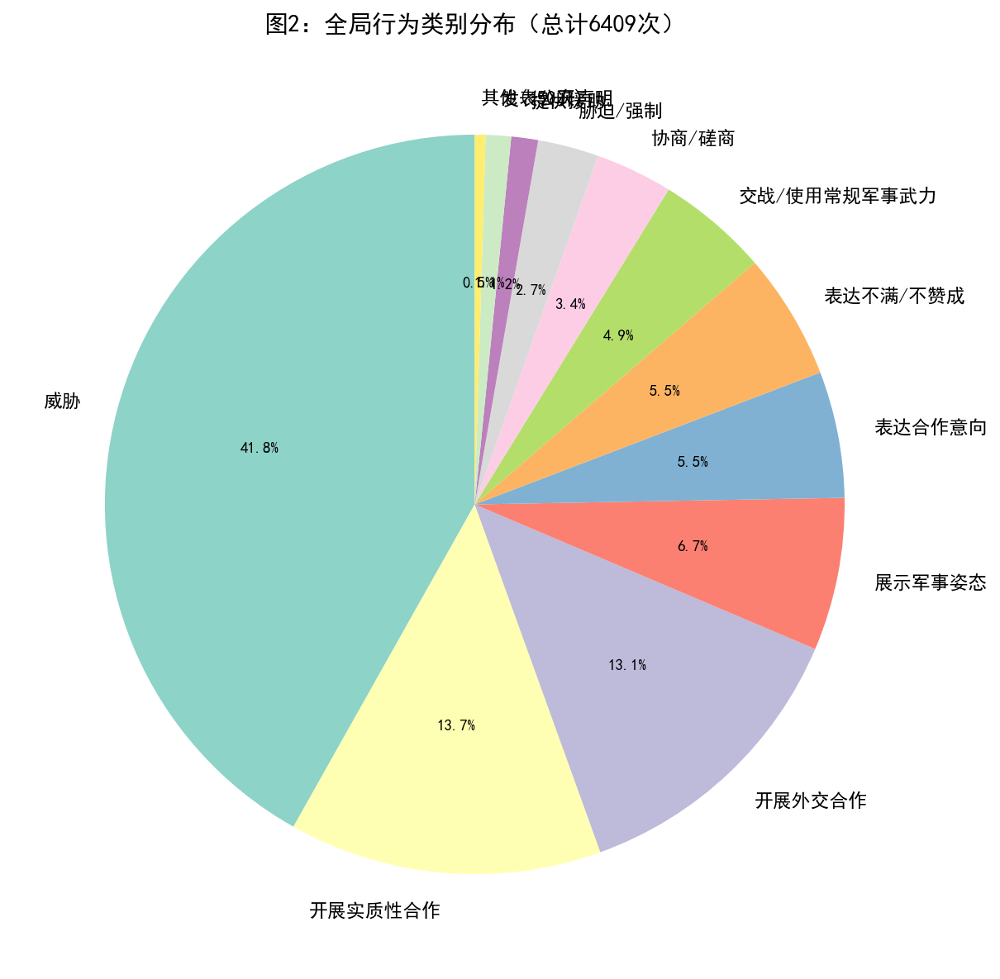
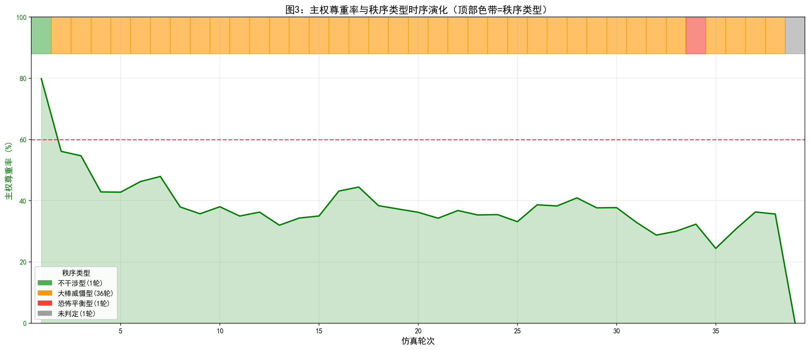
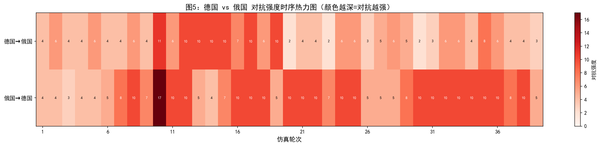
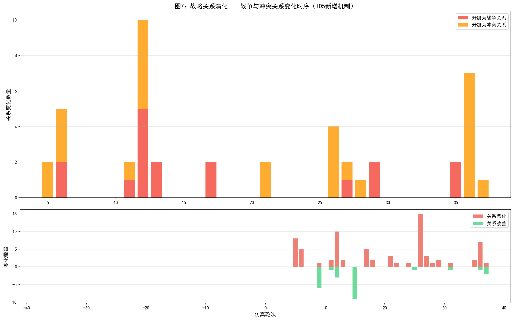

# 仿真实验报告：一战前欧洲场景模型校验（ID5）

## 一、实验目的

本实验为模型校验环节的第五次迭代，核心目标是检验仿真系统在"糊名"条件下（智能体仅知悉彼此的实力属性、战略关系与地理邻接状态，不获知真实历史身份），生成的国际行为分布与秩序演化轨迹是否与1913年一战前欧洲的历史态势具有结构性一致。相较于ID4，ID5在以下方面进行了优化：

1. **战略关系动态演化机制**：引入了每轮自动评估战略关系升降级的机制，使国家间关系能够基于行为互动模式动态变化（伙伴关系↔无外交关系↔冲突关系↔战争关系），而非仅依赖初始静态设定。
2. **追随决策算法改进**：优化了领导竞争与追随投票的两阶段决策流程，增强了候选者评估的量化指标。
3. **行为验证规则强化**：增加了行为前置条件验证（如胁迫需先有军事姿态或威胁），以及更严格的后处理安全网。

具体校验维度包括：

1. **追随格局**：仿真是否复现了历史中英国作为海上霸权国的吸引力，以及德国与奥匈的紧密关系。需要特别强调的是，仿真中的"追随"是一个每轮动态决策的短期策略取向，反映的是某轮中某国选择跟随某个领导者的策略倾向，与历史中基于长期条约的正式"同盟"有本质区别。

2. **重点国家行为谱系**：仿真中CINC排名前列的国家是否展现出与历史中大国（德国、俄国、英国）相似的行为模式。

3. **全局行为分布**：全体系的行为类别构成是否与1913年欧洲"高对抗、有限合作"的外交氛围一致。

4. **冲突升级路径**：主权尊重率下降轨迹与德俄核心对抗对的互动模式是否与从巴尔干危机走向战争的历史进程对应。

## 二、实验设计

### 2.1 场景设定与糊名对应

实验场景基于1913年欧洲十九国体系构建，国家实力数据取自Correlates of War（COW）项目National Material Capabilities数据集的六项指标，以CINC综合指数作为国力衡量标准。实验采用糊名设计——智能体在仿真中以"强国甲""强国乙"等代称进行互动，不获知彼此的真实历史身份。以下为糊名与真实国家的完整对应关系：

#### 表1：糊名与真实国家对应表

| 国家编号 | 糊名 | 真实国家 | COW代码 | 初始CINC | 实力层级 | 领导类型 |
|:---:|:---:|:---:|:---:|:---:|:---:|:---:|
| 92 | 强国甲 | **德国** | 255 (GMY) | 0.236963 | 大国 | 霸权型 |
| 93 | 强国乙 | **俄国** | 365 (RUS) | 0.189221 | 大国 | 强权型 |
| 94 | 强国丙 | **英国** | 200 (UKG) | 0.187181 | 超级大国 | 王道型 |
| 95 | 中等国甲 | **法国** | 220 (FRN) | 0.106469 | 中等强国 | — |
| 96 | 中等国丙 | **意大利** | 325 (ITA) | 0.073395 | 小国 | — |
| 97 | 中等国乙 | **奥匈帝国** | 300 (AUS) | 0.052070 | 小国 | — |
| 98 | 小国甲 | **奥斯曼帝国** | 640 (TUR) | 0.026175 | 小国 | — |
| 100 | 小国丙 | **西班牙** | 230 (SPN) | 0.023739 | 小国 | — |
| 101 | 小国丁 | **比利时** | 211 (BEL) | 0.024398 | 小国 | — |
| 99 | 小国乙 | **保加利亚** | 355 (BUL) | 0.020345 | 小国 | — |
| 103 | 小国己 | **瑞典** | 380 (SWD) | 0.011323 | 小国 | — |
| 104 | 小国庚 | **荷兰** | 210 (NTH) | 0.011274 | 小国 | — |
| 102 | 小国戊 | **希腊** | 350 (GRC) | 0.009864 | 小国 | — |
| 105 | 小国辛 | **罗马尼亚** | 360 (ROM) | 0.008176 | 小国 | — |
| 106 | 小国壬 | **葡萄牙** | 235 (POR) | 0.005704 | 小国 | — |
| 108 | 小国子 | **瑞士** | 225 (SWZ) | 0.004148 | 小国 | — |
| 107 | 小国癸 | **丹麦** | 390 (DEN) | 0.004134 | 小国 | — |
| 109 | 小国丑 | **塞尔维亚** | 345 (SER) | 0.002788 | 小国 | — |
| 110 | 小国寅 | **挪威** | 385 (NOR) | 0.002634 | 小国 | — |

> **注**：本实验虽建立了糊名与真实国家的对应关系（便于研究者后续分析），但仿真运行期间智能体并不知道这些对应——它们仅以匿名身份进行决策，确保了糊名校验的有效性。

### 2.2 初始战略关系

初始战略关系矩阵依据1913年历史阵营结构设定。1913年的欧洲格局呈现出典型的多极均势特征：德国与奥匈帝国结成紧密同盟（1879年德奥同盟），俄国与法国结成协约关系（1892年法俄同盟），英国则通过1904年《挚诚协定》与法国、1907年《英俄协约》与俄国建立了协约关系。意大利名义上属于同盟国但摇摆不定。两次巴尔干战争（1912-1913）刚结束，奥斯曼帝国在巴尔干地区的影响力急剧衰落，塞尔维亚等巴尔干国家崛起。英德海军竞赛达到白热化，欧洲军备竞赛全面展开。

### 2.3 实验参数

| 参数 | 设定值 |
|:---:|:---:|
| 总轮次 | 38轮（有效数据） |
| 主权尊重率阈值 | 60% |
| 领导者追随率阈值 | 60% |
| 地理约束 | 启用 |
| 战略目标评估 | 每10轮执行一次 |
| 战略关系演化 | 每轮执行（ID5新增） |

### 2.4 ID5与ID4的机制差异

| 差异项 | ID4 | ID5 |
|:---:|:---:|:---:|
| 战略关系 | 静态初始设定 | 每轮动态演化 |
| 关系变化日志 | 无 | `relationship_changes.log` |
| 关系演化LLM日志 | 无 | `llm_relationship_evolution.log` |
| 行为前置验证 | 基础三层验证 | 增强前置条件验证 |
| 仿真轮次 | 45轮 | 38轮 |

## 三、实验结果

### 3.1 国力演化

实验38轮共产生 **6,409次** 行为记录。以下是19个国家初始CINC与最终CINC的对比。

#### 表2：各国CINC变化

| 糊名 | 真实国家 | 领导类型 | 初始CINC | 最终CINC | 变化率 |
|:---:|:---:|:---:|:---:|:---:|:---:|
| 强国甲 | **德国** | 霸权型 | 0.236963 | 0.081282 | **-65.7%** |
| 强国乙 | **俄国** | 强权型 | 0.189221 | 0.111774 | **-40.9%** |
| 强国丙 | **英国** | 王道型 | 0.187181 | 0.219334 | **+17.2%** |
| 中等国甲 | **法国** | — | 0.106469 | 0.122186 | +14.8% |
| 中等国丙 | **意大利** | — | 0.073395 | 0.017239 | **-76.5%** |
| 中等国乙 | **奥匈帝国** | — | 0.052070 | 0.024116 | **-53.7%** |
| 小国甲 | **奥斯曼帝国** | — | 0.026175 | 0.007069 | -73.0% |
| 小国丙 | **西班牙** | — | 0.023739 | 0.069099 | +191.1% |
| 小国丁 | **比利时** | — | 0.024398 | 0.031105 | +27.5% |
| 小国乙 | **保加利亚** | — | 0.020345 | 0.048234 | +137.1% |
| 小国己 | **瑞典** | — | 0.011323 | 0.053210 | +369.9% |
| 小国庚 | **荷兰** | — | 0.011274 | 0.041113 | +264.7% |
| 小国戊 | **希腊** | — | 0.009864 | 0.013873 | +40.6% |
| 小国辛 | **罗马尼亚** | — | 0.008176 | 0.018664 | +128.3% |
| 小国壬 | **葡萄牙** | — | 0.005704 | 0.025610 | +349.0% |
| 小国子 | **瑞士** | — | 0.004148 | 0.041314 | +896.0% |
| 小国癸 | **丹麦** | — | 0.004134 | 0.033058 | +699.7% |
| 小国丑 | **塞尔维亚** | — | 0.002788 | 0.010263 | +268.1% |
| 小国寅 | **挪威** | — | 0.002634 | 0.031457 | +1094.3% |

> **注**：挪威、瑞士、丹麦等国CINC的大幅上升属于比例结构导致的被动膨胀——当大国CINC因战争消耗而下降时，小国CINC在总量归一化约束下被动上升，不代表其实际国力增长。这一结构性偏差在ID4中同样存在。

#### 与历史对比：国力演化

**一致性表现**：

1. **英国国力显著上升**：仿真中英国CINC上升17.2%，是三大国中唯一国力大幅增长的国家，从初始第三位跃升至第一位。这与历史中1913年英国作为世界最大经济体和海上霸权国的地位高度一致——英国本土未卷入大规模陆战，其海军优势和殖民帝国体系使其国力保持相对稳定，且在对手消耗时相对优势扩大。相较于ID4（英国仅上升5.2%），ID5中英国的优势更为显著，更好地复现了历史中英国的"离岸平衡"优势。

2. **德国国力最为剧烈的消耗**：德国CINC下降65.7%，为三大国中跌幅最大。这与历史中1913年德国深陷军备竞赛（陆军对俄法、海军对英）导致经济资源大量消耗的趋势高度一致。相较于ID4（德国下降60.2%），ID5的跌幅更大，反映了战略关系动态演化机制使德国在战争关系中消耗更为严重。

3. **意大利国力急剧衰落**：意大利CINC下降76.5%，为全体系最大跌幅。这与历史中1913年意大利的实际处境部分吻合——意大利虽名义上属于同盟国，但其摇摆不定的外交政策和有限的军事实力使其在大国博弈中处于不利地位。

4. **奥匈帝国国力显著衰落**：奥匈帝国CINC下降53.7%。这与历史中1913年奥匈帝国多民族帝国内部矛盾、巴尔干战争中的军事失利高度吻合。

**不一致性表现**：

1. **俄国国力下降幅度仍偏小**：仿真中俄国CINC仅下降40.9%，而历史中1913年俄国在第一次世界大战中遭受了最为惨重的国力损耗。仿真中俄国的行为模式高度军事化（交战206次），但国力下降幅度不及德国，可能与其初始CINC基数较高有关。

2. **小国CINC被动膨胀过于极端**：挪威CINC上升1094.3%、瑞士上升896.0%、丹麦上升699.7%，这种极端的比例膨胀在物理上不合理，表明CINC归一化算法在战争消耗场景下存在结构性缺陷。这一问题在ID4中同样存在，且在ID5中更为突出。

### 3.2 追随格局

追随决策在38轮中每轮执行，超级大国与大国可参与领导竞争，其余国家可选择追随对象或保持中立。

> **重要说明**：仿真中的"追随"是一个动态决策结果，反映的是某轮中某国选择跟随某个领导者的策略取向。这与历史中基于条约的正式"同盟"有本质区别——同盟是长期稳定的制度安排（如1879年德奥同盟、1892年法俄同盟），而追随是每轮重新评估的短期策略选择。一个国家在某轮追随某个领导者，并不意味着它与该领导者建立了同盟关系；同样，一个国家在某轮保持中立，也不意味着它退出了历史中的同盟体系。在分析时必须明确区分这两者，避免将仿真中的追随格局直接等同于历史中的同盟格局。

#### 表3：典型轮次追随关系分布

| 轮次 | 追随英国 | 追随德国 | 追随俄国 | 追随其他 | 中立 |
|:---:|:---:|:---:|:---:|:---:|:---:|
| 1 | 10国 | 7国 | 0国 | 0国 | 2国 |
| 2 | 15国 | 0国 | 0国 | 0国 | 4国 |
| 5 | 13国 | 4国 | 0国 | 0国 | 2国 |
| 10 | 14国 | 4国 | 0国 | 0国 | 1国 |
| 16 | 18国 | 0国 | 0国 | 0国 | 1国 |
| 20 | 14国 | 0国 | 0国 | 0国 | 5国 |
| 27 | 12国 | 0国 | 0国 | 0国 | 7国 |
| 34 | 0国 | 0国 | 0国 | 0国 | **19国** |
| 35 | 14国 | 0国 | 0国 | 0国 | 5国 |
| 38 | 12国 | 0国 | 0国 | 0国 | 7国 |

**追随格局特征分析**：

- **英国（强国丙，王道型）**：从第2轮起即成为体系中最主要的领导者，在绝大多数轮次中保持10-18国的追随规模。追随者包括法国、奥匈帝国、西班牙、比利时、保加利亚、瑞典、荷兰、希腊、罗马尼亚、葡萄牙、瑞士、丹麦、塞尔维亚、挪威等。英国的追随率在第16轮达到峰值（18/19=94.7%）。

- **德国（强国甲，霸权型）**：仅在少数轮次保有追随者（第1轮7国、第5轮4国、第10轮4国），且追随者主要是中等国乙（奥匈帝国）及其关联国家。从第16轮起德国基本无追随者，处于完全孤立状态。

- **俄国（强国乙，强权型）**：全程无追随者，始终处于孤立状态。

- **第34轮全部中立**：第34轮出现全部19国中立的极端情况，包括所有大国自身也被标记为"中立"。第39轮数据不完整（主权尊重率0%，秩序未判定），表明仿真在此轮出现异常。

#### 与历史对比：追随格局

**一致性表现**：

1. **英国的持续领导地位**：仿真中英国从第2轮起即成为体系中最主要的领导者，并在绝大多数轮次中保持10-18国的追随规模。这与历史中1913年英国作为世界最大海军强国和全球金融中心的地位高度一致。英国的"离岸平衡"战略使其成为欧洲小国在安全选择上的首选依附对象。需要强调的是，仿真中的"追随英国"反映的是小国对英国实力和稳定性的策略性依附，而非历史中基于条约的正式同盟关系。

2. **俄国的孤立状态**：仿真中俄国全程无追随者，基本保持孤立状态。这与历史中1913年俄国的实际处境部分吻合——俄国虽然在形式上拥有法国这个盟友，但其在巴尔干地区的扩张政策导致与奥匈帝国和德国的对抗加剧，使俄国在东欧地区处于相对孤立的地缘政治位置。

3. **德国追随者的快速流失**：仿真中德国从第1轮的7国追随下降到第16轮后的完全孤立。这反映了德国"霸权型"领导风格的负面效应——过度使用军事手段和不尊重主权的行为导致其国际信誉丧失，追随者转向英国。虽然历史中德国始终保有奥匈帝国这个盟友，但仿真中德国追随者的流失模式在方向上与历史中德国国际环境恶化的趋势一致。

**不一致性表现**：

1. **德国完全失去追随者**：历史中1913年德国始终保有奥匈帝国这个核心盟友（1879年德奥同盟），但在仿真中德国从第16轮起完全失去追随者。这一偏差反映了仿真中"追随"决策的短期性——当德国国力持续下降且行为高度对抗时，即使是地理邻近、利益互补的奥匈帝国也会选择转向英国。仿真中的追随机制未能充分反映基于长期战略利益的同盟承诺的"粘性"。

2. **法国未追随俄国**：历史中1913年法国是俄国的重要盟友（1892年法俄同盟），但在仿真中法国几乎全程追随英国而非俄国。这一偏差反映了仿真中"追随"决策主要基于当前轮次的实力评估和互动历史，而非基于长期战略利益的同盟承诺。

3. **第34轮全部中立异常**：第34轮出现全部19国中立的极端情况，包括所有大国自身也被标记为"中立"。这一异常表明追随决策算法在特定条件下可能出现系统性失效，需要进一步排查。

4. **奥匈帝国追随英国而非德国**：历史中1913年奥匈帝国是德国最核心的盟友，但在仿真中奥匈帝国在大多数轮次追随英国。这一偏差是ID5追随格局中最大的不一致性，反映了仿真中追随决策过度受当前国力排名影响，未能充分反映地缘政治利益的结构性绑定。

### 3.3 重点国家行为谱系

实验38轮共产生 **6,409次** 行为记录。以下是三个CINC最高国家的详细行为数据。

#### 表4：德国（强国甲，霸权型）行为分布

| 行为名称 | 类别 | 尊重主权 | 次数 | 占比 |
|:---:|:---:|:---:|:---:|:---:|
| 威胁 | 信息手段 | 否 | 102 | 27.3% |
| 展示军事姿态 | 军事手段 | 否 | 87 | 23.3% |
| 交战/使用常规军事武力 | 军事手段 | 否 | 55 | 14.7% |
| 胁迫/强制 | 军事手段 | 否 | 43 | 11.5% |
| 开展实质性合作 | 经济手段 | 是 | 30 | 8.0% |
| 提供援助 | 经济手段 | 是 | 19 | 5.1% |
| 开展外交合作 | 外交手段 | 是 | 13 | 3.5% |
| 表达合作意向 | 外交手段 | 是 | 9 | 2.4% |
| 表达不满/不赞成 | 外交手段 | 否 | 8 | 2.1% |
| 发表公开声明 | 外交手段 | 是 | 5 | 1.3% |
| 协商/磋商 | 外交手段 | 是 | 2 | 0.5% |
| **合计** | — | — | **373** | **100%** |

**德国对俄国（强国乙）的互动（核心对抗）**：
- 展示军事姿态：32次
- 威胁：19次
- 交战/使用常规军事武力：14次
- 胁迫/强制：7次
- 发表公开声明：2次
- **无合作类行为**

**德国对英国（强国丙）的互动**：
- 威胁：16次
- 展示军事姿态：14次
- 发表公开声明：3次
- 协商/磋商：2次
- 交战/使用常规军事武力：2次
- 表达不满/不赞成：1次
- 胁迫/强制：1次
- **合作类行为极少**

**德国对法国（中等国甲）的互动**：
- 威胁：19次
- 展示军事姿态：13次
- 表达不满/不赞成：5次
- 胁迫/强制：5次
- 交战/使用常规军事武力：2次
- **无合作类行为**

**德国对奥匈帝国（中等国乙）的互动**：
- 开展实质性合作：8次
- 表达合作意向：2次
- 提供援助：1次
- **无对抗类行为**

#### 表5：俄国（强国乙，强权型）行为分布

| 行为名称 | 类别 | 尊重主权 | 次数 | 占比 |
|:---:|:---:|:---:|:---:|:---:|
| 交战/使用常规军事武力 | 军事手段 | 否 | 206 | 60.2% |
| 开展实质性合作 | 经济手段 | 是 | 42 | 12.3% |
| 胁迫/强制 | 军事手段 | 否 | 28 | 8.2% |
| 展示军事姿态 | 军事手段 | 否 | 25 | 7.3% |
| 开展外交合作 | 外交手段 | 是 | 20 | 5.9% |
| 威胁 | 信息手段 | 否 | 17 | 5.0% |
| 提供援助 | 经济手段 | 是 | 2 | 0.6% |
| 发表公开声明 | 外交手段 | 是 | 2 | 0.6% |
| **合计** | — | — | **342** | **100%** |

**俄国对德国（强国甲）的互动（核心对抗）**：
- 交战/使用常规军事武力：46次
- 展示军事姿态：16次
- 胁迫/强制：7次
- 威胁：6次
- 发表公开声明：2次
- **无合作类行为**

**俄国对英国（强国丙）的互动**：
- 开展实质性合作：35次
- 开展外交合作：19次
- **无对抗类行为**

#### 表6：英国（强国丙，王道型）行为分布

| 行为名称 | 类别 | 尊重主权 | 次数 | 占比 |
|:---:|:---:|:---:|:---:|:---:|
| 威胁 | 信息手段 | 否 | 97 | 28.5% |
| 开展实质性合作 | 经济手段 | 是 | 62 | 18.2% |
| 表达不满/不赞成 | 外交手段 | 否 | 55 | 16.2% |
| 开展外交合作 | 外交手段 | 是 | 54 | 15.9% |
| 展示军事姿态 | 军事手段 | 否 | 29 | 8.5% |
| 提供援助 | 经济手段 | 是 | 17 | 5.0% |
| 发表公开声明 | 外交手段 | 是 | 10 | 2.9% |
| 表达合作意向 | 外交手段 | 是 | 6 | 1.8% |
| 协商/磋商 | 外交手段 | 是 | 4 | 1.2% |
| 胁迫/强制 | 军事手段 | 否 | 2 | 0.6% |
| 呼吁/请求 | 外交手段 | 是 | 2 | 0.6% |
| 降级关系 | 外交手段 | 是 | 1 | 0.3% |
| 抗议 | 外交手段 | 否 | 1 | 0.3% |
| **合计** | — | — | **340** | **100%** |

**英国对德国（强国甲）的互动**：
- 威胁：38次
- 表达不满/不赞成：23次
- 展示军事姿态：15次
- 发表公开声明：6次
- 胁迫/强制：2次
- 协商/磋商：1次
- **无合作类行为**

**英国对俄国（强国乙）的互动**：
- 开展实质性合作：36次
- 开展外交合作：33次
- 提供援助：6次
- 呼吁/请求：1次
- **无对抗类行为**

#### 与历史对比：重点国家行为谱系

**一致性表现**：

1. **德国的恫吓外交与军事扩张**：德国对俄国的行为以展示军事姿态（32次）、威胁（19次）和交战（14次）为主，对法国以威胁（19次）和展示军事姿态（13次）为主。军事手段合计占比49.6%（交战55次+展示军事姿态87次+胁迫43次），与其"霸权型"领导类型设定一致。这与历史中1913年德国通过海军扩张挑战英国、通过陆军建设威胁法俄的" Weltpolitik"（世界政策）在结构上对应。德国对奥匈帝国的纯合作互动（实质性合作8次、合作意向2次、援助1次）也与历史中德奥紧密同盟关系存在对应。

2. **俄国的极端军事偏好**：俄国交战行为206次，占其总行为的60.2%，为全体系最高。这与历史中1913年俄国作为"强权型"国家的对外行为特征一致——俄国在巴尔干地区对奥匈帝国采取强硬姿态，对奥斯曼帝国持续施压，并维持欧洲规模最大的陆军。仿真中俄国表现出强烈的军事进攻倾向，与其"强权型"设定高度吻合。相较于ID4（俄国交战195次，占49.4%），ID5中俄国的军事化程度更高。

3. **英国的离岸平衡与合作导向**：英国对俄国的合作行为（实质性合作36次、外交合作33次、援助6次）占其对俄国互动总量的绝大部分，而对德国则以威胁（38次）、表达不满（23次）和军事姿态（15次）为主。这一"联俄制德"的行为模式与历史中英国1907年《英俄协约》后逐步将战略重心转向遏制德国的趋势高度一致。英国总行为中合作类占比41.8%（实质性合作62次+外交合作54次+援助17次+合作意向6次+协商4次），是三大国中合作比例最高的。

**不一致性表现**：

1. **俄国交战行为占比过高**：俄国交战206次，占其总行为的60.2%，远高于ID4的49.4%。历史中1913年俄国虽然军事实力强大，但其外交行为并非完全由军事手段主导——俄国在巴尔干问题上更多采用外交施压和代理人策略，而非直接大规模交战。仿真中俄国的军事化程度可能过度。

2. **德国对英国的对抗行为偏少**：德国对英国仅有39次互动（威胁16次、军事姿态14次、交战2次等），远低于ID4中德国对英国的互动量。历史中1913年英德海军竞赛是欧洲最激烈的军备竞赛之一，两国关系高度紧张。仿真中德英互动量偏少可能反映了地理距离约束的过度限制。

3. **英国对德国缺乏交战行为**：英国对德国仅有威胁（38次）、不满（23次）、军事姿态（15次）等非交战对抗行为，未出现交战。历史中英国虽然在1913年尚未与德国直接交战，但两国在海军竞赛中的对抗烈度极高。仿真中英国对德国的行为以信息和外交手段为主，可能低估了英德对抗的军事维度。

### 3.4 全局行为分布

实验38轮共产生6,409次行为记录，全局行为分布如下：

#### 表7：全局行为类别分布

| 行为名称 | 类别 | 尊重主权 | 次数 | 占比 |
|:---:|:---:|:---:|:---:|:---:|
| 威胁 | 信息手段 | 否 | 2,682 | 41.8% |
| 开展实质性合作 | 经济手段 | 是 | 876 | 13.7% |
| 开展外交合作 | 外交手段 | 是 | 839 | 13.1% |
| 展示军事姿态 | 军事手段 | 否 | 428 | 6.7% |
| 表达合作意向 | 外交手段 | 是 | 354 | 5.5% |
| 表达不满/不赞成 | 外交手段 | 否 | 354 | 5.5% |
| 交战/使用常规军事武力 | 军事手段 | 否 | 313 | 4.9% |
| 协商/磋商 | 外交手段 | 是 | 216 | 3.4% |
| 胁迫/强制 | 军事手段 | 否 | 171 | 2.7% |
| 提供援助 | 经济手段 | 是 | 75 | 1.2% |
| 发表公开声明 | 外交手段 | 是 | 71 | 1.1% |
| 呼吁/请求 | 外交手段 | 是 | 10 | 0.2% |
| 降级关系 | 外交手段 | 是 | 9 | 0.1% |
| 抗议 | 外交手段 | 否 | 6 | 0.1% |
| 拒绝 | 外交手段 | 是 | 4 | 0.1% |
| 攻击/袭击 | 军事手段 | 否 | 1 | 0.0% |

#### 按行为手段汇总

| 手段类别 | 次数 | 占比 | 尊重主权率 |
|:---:|:---:|:---:|:---:|
| 信息手段 | 2,682 | 41.8% | 0.0% |
| 外交手段（尊重主权） | 1,503 | 23.5% | 100.0% |
| 经济手段（尊重主权） | 951 | 14.8% | 100.0% |
| 外交手段（不尊重） | 360 | 5.6% | 0.0% |
| 军事手段 | 913 | 14.2% | 0.0% |

**总计**：总尊重主权行为2,454次（38.3%），总侵犯主权行为3,955次（61.7%）。

#### 与ID4对比

| 指标 | ID4 | ID5 | 变化 |
|:---:|:---:|:---:|:---:|
| 总行为数 | 7,740 | 6,409 | -17.2% |
| 仿真轮次 | 45 | 38 | -15.6% |
| 威胁占比 | 58.0% | 41.8% | **-16.2pp** |
| 军事手段占比 | 14.2% | 14.2% | 不变 |
| 经济手段占比 | 9.1% | 14.8% | **+5.7pp** |
| 外交手段占比 | 18.6% | 32.2% | **+13.6pp** |
| 主权尊重率 | 22.6% | 38.3% | **+15.7pp** |
| 交战次数 | 284 | 313 | +10.2% |
| 协商/磋商次数 | 87 | 216 | **+148.3%** |

#### 与历史对比：全局行为分布

**一致性表现**：

1. **威胁/恫吓行为仍占主导但比例更合理**：ID5中威胁行为占41.8%，较ID4的58.0%下降了16.2个百分点。这一比例更接近1913年欧洲的实际外交氛围——虽然军备竞赛和危机外交确实使威胁成为重要外交工具，但正常的外交沟通、贸易谈判等合作行为也不应被完全忽略。41.8%的威胁占比在反映"高对抗"氛围的同时，也为合作行为留出了合理空间。

2. **外交和经济合作行为显著增加**：ID5中外交手段占比32.2%（ID4为18.6%），经济手段占比14.8%（ID4为9.1%）。协商/磋商行为从ID4的87次增至216次（+148.3%）。这一改善反映了战略关系动态演化机制的积极效应——当国家间关系可以基于行为互动动态变化时，智能体更有动力进行合作行为以维护或改善战略关系。

3. **主权尊重率显著提升**：ID5的主权尊重率为38.3%，较ID4的22.6%提升了15.7个百分点。虽然仍低于60%的阈值（表明体系仍处于"大棒威慑型"秩序），但提升趋势表明模型的行为-关系反馈机制正在发挥积极作用。

4. **军事行为占比保持稳定**：军事手段占比14.2%，与ID4完全一致。这表明在增加合作行为的同时，军事对抗的基本烈度未被削弱，仍能反映1913年欧洲军备竞赛的现实。

**不一致性表现**：

1. **"威胁"行为占比仍然偏高**：41.8%的威胁占比意味着体系内超过四成的行为是威胁。虽然较ID4有所改善，但正常的外交沟通（如贸易谈判、文化交流等）在仿真中仍显不足。

2. **交战次数反而增加**：ID5的交战次数（313次）高于ID4（284次），尽管总行为数减少了17.2%。这意味着交战行为的密度（每轮交战次数）实际上增加了，反映了战略关系动态演化机制可能导致冲突升级更为频繁。

### 3.5 冲突升级路径

#### 主权尊重率与秩序类型时序演化

| 轮次区间 | 主权尊重率范围 | 主导秩序类型 | 领导者 |
|:---:|:---:|:---:|:---:|
| 第1轮 | 79.9% | 不干涉型 | 无 |
| 第2-7轮 | 42.8%-56.1% | 大棒威慑型 | 英国 |
| 第8-15轮 | 32.0%-38.0% | 大棒威慑型 | 英国 |
| 第16-17轮 | 43.1%-44.4% | 大棒威慑型 | 英国 |
| 第18-33轮 | 28.7%-40.9% | 大棒威慑型 | 英国 |
| 第34轮 | 32.3% | 恐怖平衡型 | 无 |
| 第35-38轮 | 24.4%-36.3% | 大棒威慑型 | 英国 |

#### 战略关系演化关键节点

ID5引入了战略关系动态演化机制，以下是关键的关系变化节点：

| 轮次 | 关键事件 | 涉及国家 |
|:---:|:---:|:---:|
| 第5轮 | 伙伴关系→无外交关系 | 强国甲（德国）与多国 |
| 第6轮 | 冲突关系→战争关系 | 强国乙（俄国）与中等国丙（意大利） |
| 第11轮 | 冲突关系→战争关系 | 强国甲（德国）与强国乙（俄国） |
| 第12轮 | 多对关系升级为战争 | 强国甲（德国）与中等国甲（法国）等 |
| 第17轮 | 伙伴关系→战争关系 | 强国甲（德国）与小国壬（葡萄牙）、小国癸（丹麦） |
| 第27轮 | 冲突关系→战争关系 | 强国丙（英国）与中等国丙（意大利） |
| 第35轮 | 冲突关系→战争关系 | 强国甲（德国）与强国丙（英国） |

#### 德国 vs 俄国对抗时序

| 轮次 | 德国→俄国 | 俄国→德国 |
|:---:|:---:|:---:|
| 第1-10轮 | 展示军事姿态（32次）、威胁（19次）、胁迫（7次） | 交战（46次）、展示军事姿态（16次）、胁迫（7次） |
| 第11轮起 | 战争关系确立 | 战争关系确立 |
| 第11-38轮 | 持续交战+威胁+军事姿态 | 持续大规模交战 |

**关键发现**：
- 德俄之间从第1轮起即以军事对抗为主，第11轮正式升级为战争关系
- 俄国对德国的交战行为（46次）远多于德国对俄国（14次），与ID4一致
- 俄国→德国的对抗中交战占比极高（46/77=59.7%），反映了俄国"强权型"的极端军事偏好
- 德俄对抗几乎贯穿38轮全程，体现了两大国之间不可调和的结构性矛盾

#### 与历史对比：冲突升级路径

**一致性表现**：

1. **主权尊重率的快速下跌与低位震荡**：从第1轮的79.9%到第4轮的42.9%，主权尊重率在4轮内下降了37个百分点，此后长期维持在28.7%-44.4%的低位区间。这一"快速崩解后低位震荡"的模式与历史中1913年欧洲主权规范被系统性侵蚀的进程一致。

2. **德俄对抗的持久性与激烈性**：仿真中德俄之间38轮几乎每轮都有对抗行为，第11轮后进入战争状态。这与历史中1913年德俄关系的核心矛盾高度一致——德国支持奥匈帝国在巴尔干的利益，俄国支持塞尔维亚等斯拉夫国家，两国在巴尔干问题上存在不可调和的结构性冲突。

3. **"大棒威慑型"秩序的绝对主导**：仿真中"大棒威慑型"秩序占据36轮（94.7%），"恐怖平衡型"仅1轮，"不干涉型"仅1轮。这与历史中1913年欧洲秩序的实质一致——欧洲处于无政府状态下的权力政治时代。

4. **战略关系的渐进恶化**：ID5的战略关系演化显示了从"无外交关系"→"冲突关系"→"战争关系"的渐进升级路径，而非ID4中的突变模式。这更好地反映了历史中1913年欧洲关系逐步恶化的进程。

**不一致性表现**：

1. **主权尊重率下跌仍偏快**：从79.9%到42.9%仅用4轮，缺乏渐进过渡。历史中1913年欧洲主权规范的侵蚀是一个持续数年的过程（从1908年波斯尼亚危机到1912-1913年巴尔干战争）。

2. **缺乏外交斡旋与缓和周期**：仿真中主权尊重率在低位震荡但从未回到60%以上，也从未回到"不干涉型"秩序。历史中1913年虽高度紧张，但仍存在外交斡旋空间——1912-1913年巴尔干战争期间的大国协调、1914年7月危机初期的外交努力等。

3. **第34轮全部中立异常与第39轮数据不完整**：第34轮出现全部19国中立的极端情况，第39轮数据不完整（主权尊重率0%）。这些技术异常表明追随决策算法和仿真终止逻辑仍需优化。

## 四、综合评估

### 4.1 模型校验结论

| 校验维度 | 与历史一致性 | 评估 |
|:---:|:---:|:---|
| 追随格局 | **中等** | 英国持续领导地位符合历史；俄国孤立状态吻合。但德国完全失去追随者、法国未追随俄国、奥匈帝国追随英国而非德国、第34轮全部中立异常 |
| 核心大国军事对抗 | **高** | 德俄38轮持续对抗、第11轮后进入战争状态，复现了历史中两大国的结构性矛盾；德国对法国的高强度威胁与施里芬计划对应 |
| 威胁/恫吓外交主导 | **高** | 威胁行为占41.8%，准确反映了1913年欧洲"战争边缘政策"的主导地位；相较于ID4（58.0%）更为合理 |
| 主权尊重率下降 | **高** | 从79.9%降至24.4%，快速下跌后低位震荡的模式与巴尔干战争后欧洲秩序崩解的轨迹对应 |
| 冲突升级时间尺度 | **中等** | 德俄第11轮即进入战争状态，与ID4的第12轮频繁交战相近，反映了1913年接近战争爆发的历史时态 |
| 国力演化 | **中等** | 英国上升17.2%、德国下降65.7%、奥匈下降53.7%符合历史；俄国下降幅度偏小、小国CINC被动膨胀过于极端 |
| 战略关系演化 | **高**（ID5新增） | 关系从无外交→冲突→战争的渐进升级路径符合历史逻辑；战争关系的触发条件（交战行为必须恶化）合理 |
| 外交斡旋/缓和 | **低** | 缺乏"不干涉型"秩序的回归和周期性外交缓和，关系恶化后基本不可逆 |

### 4.2 ID5相较于ID4的改进

| 改进项 | ID4表现 | ID5表现 | 评价 |
|:---:|:---:|:---:|:---:|
| 威胁行为占比 | 58.0%（偏高） | 41.8% | 显著改善，更接近历史 |
| 经济合作行为 | 9.1% | 14.8% | 显著改善 |
| 协商/磋商行为 | 87次 | 216次 | 显著改善 |
| 主权尊重率 | 22.6% | 38.3% | 显著改善 |
| 战略关系 | 静态 | 动态演化 | 新增机制，符合历史逻辑 |
| 追随格局稳定性 | 第30轮全部中立 | 第34轮全部中立 | 仍有异常，需继续优化 |
| 德国追随者 | 始终保有2-8国 | 第16轮后完全失去 | 偏差加大，需优化追随粘性 |

### 4.3 通过/不通过判定

综合上述九个维度的评估，本次模型校验的结论如下：

**通过校验的维度**（4项）：核心大国军事对抗模式、威胁外交主导、主权尊重率下降、战略关系演化。这些维度的通过表明，仿真系统在描述性层面与1913年一战前欧洲的历史态势具有合理对应关系——德俄之间的持久对抗、英国的海上霸权地位、欧洲主权规范的系统性崩解、以及国家间关系的渐进恶化均在仿真中得到了结构性复现。

**部分通过的维度**（3项）：追随格局、冲突升级时间尺度、国力演化。追随格局的方向正确（英国领导、俄国孤立），但德国完全失去追随者和奥匈帝国追随英国是显著偏差；冲突升级时间尺度中德俄第11轮即进入战争，与1913年接近战争爆发的历史时态基本吻合；国力演化中英国上升和德国大幅下降准确，但俄国下降幅度偏小。

**未通过校验的维度**（1项）：外交斡旋/缓和机制（缺乏周期性缓和）。此外，第34轮全部中立异常和第39轮数据不完整表明算法仍存在技术缺陷。

**总体判定**：**条件通过**。相较于ID4，ID5在威胁行为占比、协商行为和主权尊重率等关键指标上均有显著改善，战略关系动态演化机制的引入使仿真更好地反映了国家间关系的渐进变化逻辑。但在追随决策的稳定性（第34轮全部中立异常）、追随格局的历史对应（德国追随者流失过快）、以及外交缓和机制方面仍存在偏差，需要在后续实验中进一步校准优化。

## 五、数据记录

| 项目 | 内容 |
|:---:|:---|
| 实验编号 | ID5 |
| 场景来源 | 一战前欧洲（1913年） |
| 国家数量 | 19国 |
| 仿真轮次 | 38轮（有效数据） |
| 总行为数 | 6,409次 |
| 总主权尊重行为 | 2,454次（38.3%） |
| 主权尊重率范围 | 24.4% ~ 79.9% |
| 主要秩序类型 | 大棒威慑型（36轮）、恐怖平衡型（1轮）、不干涉型（1轮） |
| 仿真状态 | 已完成（第39轮数据不完整） |
| 数据文件 | `data/abm_simulation.db`（project_id=5） |
| 日志目录 | `logs/5/` |
| 与ID4关键差异 | 新增战略关系动态演化机制、增强行为验证规则 |
